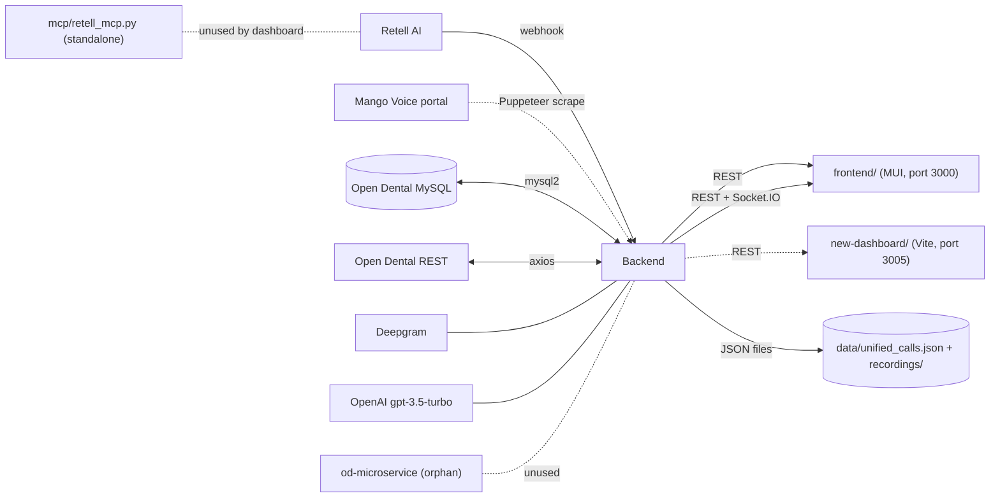

# 01 — Architecture

## Repo topology

The repo is an **un-managed monorepo** (no workspaces / nx / turborepo). Four runtime surfaces coexist with overlapping concerns:

| Surface | Path | Tech | Purpose | Status |
|---|---|---|---|---|
| Backend API | `backend/` | Express 4, Socket.IO 4, Node 18 (CommonJS) | Sole REST + realtime API; all integrations live here | Active, the load-bearing tier |
| Legacy frontend | `frontend/` | CRA, React 18, MUI 5, FullCalendar | The currently-deployed UI | Active, ~95% of feature surface |
| New dashboard | `new-dashboard/` | Vite 7, React 19, shadcn/ui, Tailwind 4, wouter | A partial rewrite | Local-dev only; not actually deployed (see §3 and `audit/09-deploy-ops.md`) |
| OD microservice | `od-microservice/` | TS Express, ts-node-dev | Two endpoints (`/od/slots`, `/od/book`) calling Open Dental REST | **Orphan — no caller anywhere in the repo** |
| MCP | `mcp/retell_mcp.py` | Python FastMCP | Retell AI MCP server for Claude Desktop | Standalone; not part of the dashboard runtime |

## Two parallel React frontends

The most consequential architectural fact: **two production-shaped React apps target the same backend**, with overlapping pages and divergent stacks.

| Concern | `frontend/` (legacy) | `new-dashboard/` |
|---|---|---|
| Bundler | CRA / `react-scripts 5` | Vite 7 |
| React | 18.2 | 19.2 |
| UI kit | MUI 5 + MUI X DataGrid + MUI X DatePickers | shadcn/ui (Radix) + Tailwind 4 |
| Calendar | FullCalendar (`@fullcalendar/*`) | Custom operatory grid |
| Routing | `react-router-dom 6` | `wouter 3` (with a pnpm patch) |
| State | Local hooks | Local hooks + `useReducer`/Context for calendar |
| Realtime | `socket.io-client` actively used | `socket.io-client` in deps but **not imported** anywhere in `client/src` |
| Pages built | Dashboard, LiveMonitor, Calendar, Callbacks, CallDetails, Agents, Analytics (mock), Admin | Dashboard, Calls, CallDetail, AgentBuilder, Scheduling, Analytics, Admin (no LiveMonitor, no Callbacks page) |
| Auth | None | None |
| Live in production | Yes (per `README.md` and `cloudflared-config.yml`) | No (PM2 entry is broken — see §3) |

Both apps independently call the same `/api/*` surface; there is no shared types package, no shared API client, and the two calendars are entirely different implementations.

The legacy `frontend/` is the **only** UI in production today. The new dashboard is partly built and not deployed.

## Top-level directories — what is real

| Path | Verdict |
|---|---|
| `backend/` | Real, primary |
| `frontend/` | Real, primary UI |
| `new-dashboard/` | Real, in-progress |
| `od-microservice/` | **Dead code** — backend has no reference to it; both `.ts` and committed `.js` (apparently emitted) live next to each other; package.json declares `"build": "tsc"` but there is no `tsconfig.json` in the folder |
| `mcp/` | Standalone Python helper for Claude Desktop; not wired to anything in this repo |
| `src/` | **Empty** at the repo root (only `mango_debug/` and `unified_calls.json` under `data/`); the empty `src/` is misleading and probably leftover scaffolding |
| `data/` | Runtime persistence directory (gitignored) — `unified_calls.json` and `mango_debug/` |
| `docs/` | Open Dental REST docs and calendar spec (good); index file [`docs/open-dental-calendar-source-of-truth.md`](../docs/open-dental-calendar-source-of-truth.md) points to a `docs/opendental/` subdir that does not exist (path drift) |
| `.clone/` | Unknown — present at root, not referenced by any tooling. Likely leftover. |
| `notes` (no extension) | Real text file at repo root with the production server IP, an example nginx config, and git push commands. Should be moved into `docs/` or removed. |
| `test_name_extraction.js` | Local one-off test harness with mock OD service ([`test_name_extraction.js:1-29`](../test_name_extraction.js)); not wired into any test runner. Move under `backend/tests/` or delete. |
| `calls_data.json` (root, **889 KB**) | Old (gitignored) snapshot of calls from before `data/unified_calls.json` was the persistence file. Should be deleted to avoid confusion. |
| `cloudflared-config.yml` (root) | Active tunnel config |

## Module / package management

| File | Purpose | Notable |
|---|---|---|
| Root [`package.json`](../package.json) | Convenience scripts (`dev`, `dashboard:dev`, `frontend:dev`) and `concurrently` | Top-level `dev` script runs `backend:dev` + `dashboard:dev`; `dev:old` runs the legacy frontend instead. Mismatch with what's actually deployed. |
| [`backend/package.json`](../backend/package.json) | Backend deps | Uses `puppeteer 24`, `mysql2 3.6`, `openai 6.16`, `@deepgram/sdk 4`, `socket.io 4.8` |
| [`frontend/package.json`](../frontend/package.json) | Legacy UI | `react-scripts 5`, `@mui/material 5`, `react 18.2`. Pulls `moment` transitively via `@mui/x-date-pickers` while also depending on `date-fns 2.29` — **two date libs in the bundle** |
| [`new-dashboard/package.json`](../new-dashboard/package.json) | New UI | `react 19.2`, `vite 7`, `tailwindcss 4`, `wouter` (patched), `pnpm 10` declared as `packageManager` |
| [`od-microservice/package.json`](../od-microservice/package.json) | Orphan service | Only devDeps; no runtime deps listed; no `tsconfig.json` next to it |

There is **no** root lockfile manager strategy: root has `package-lock.json`, backend and legacy frontend each have their own, new-dashboard has both `package-lock.json` and `pnpm-lock.yaml`, and `package.json` declares `"packageManager": "pnpm@10..."`. The dual lockfiles in new-dashboard are a footgun — installs that mix npm and pnpm will silently drift dependency trees.

## Hidden / drift folders inside subprojects

- `new-dashboard/.claude/`, `.claire/`, `.manus-logs/` — agent-tool scratch folders. Should be added to `.gitignore` if they are not.
- `frontend/BONUS_FEATURES.md`, `frontend/GLOBAL_IMPROVEMENTS.md` — design intent prose; many items only partly implemented.
- `new-dashboard/plan.md`, `ideas.md`, `activity.md` — operator log; the [`plan.md`](../new-dashboard/plan.md) is actually a clear, current operational backlog and is the most useful document about the new dashboard's intended next steps.

## Build & dev surface

| Command | What it actually runs |
|---|---|
| `npm run dev` (root) | Backend (`nodemon server.js`) + new-dashboard (`vite --host`) |
| `npm run dev:old` | Backend + legacy frontend (`react-scripts start`) |
| `npm run dashboard:build` | `vite build && esbuild server/index.ts --bundle --format=esm --outdir=dist` |
| Backend Dockerfile | `node:18-alpine`, `npm ci --only=production`, healthcheck via `curl` (alpine has no `curl` by default — healthcheck likely fails) |
| Frontend Dockerfile | Multi-stage CRA build → `nginx:alpine` on port 3000 |
| New-dashboard Docker | **None** |

## Tests

There is no test suite. No `*.test.*`, no `__tests__/`, no `vitest.config`, no Jest config at any level (despite `vitest 2.1` being a devDependency in `new-dashboard/`). The `frontend/` `package.json` still has CRA's default `"test": "react-scripts test"`. The lone test-flavored file is the orphaned root [`test_name_extraction.js`](../test_name_extraction.js).

## Architectural risks (ranked)

1. **PM2 production config for `new-dashboard` is broken** — `script: 'node_modules/.bin/next'` in [`ecosystem.config.js:24`](../ecosystem.config.js) but `new-dashboard` is a **Vite** app (no `next` binary). The new dashboard cannot start under the current PM2 config; nobody noticed because it's not behind any nginx route either. (Detail in `audit/09-deploy-ops.md`.)
2. **Two parallel frontends with duplicate features** — calendar, dashboard, calls, agents, analytics, admin all exist in both `frontend/` and `new-dashboard/`. There is no migration plan in the docs about how the legacy app gets retired or which one wins.
3. **Dead `od-microservice/`** competes with `backend/services/openDentalSync.js` for "owns Open Dental booking" — at minimum it confuses anyone reading the repo and at worst someone will revive it and create two booking paths.
4. **No tests anywhere** for a system that holds PHI, scrapes a vendor portal with stored credentials, and writes to a live PMS.
5. **Lockfile / package-manager drift** in `new-dashboard/` (npm and pnpm lockfiles coexist) and across the monorepo (no workspace tooling to keep dep ranges in sync).
6. **Documentation sprawl** — 15 root `.md` files + 6 in `docs/` + 4 in subprojects, mostly aspirational. `audit/11-docs-vs-reality.md` reconciles them.
7. **Cross-cutting type drift** — `Appointment` is defined in [`new-dashboard/client/src/features/calendar/types.ts`](../new-dashboard/client/src/features/calendar/types.ts), again implicitly in [`backend/routes/openDental.js`](../backend/routes/openDental.js) responses, and again in [`frontend/src/components/OpenDentalCalendar.js`](../frontend/src/components/OpenDentalCalendar.js). No shared schema.

## Recommended structural changes (proposals only)

- Decide one of: **(a)** finish the new-dashboard migration and delete `frontend/`, or **(b)** archive `new-dashboard/` until you can fund the migration. Two production-shaped frontends is unsustainable.
- Delete `od-microservice/`, `test_name_extraction.js`, root `notes`, root empty `src/`, root `calls_data.json` (snapshot), and `.clone/` after confirming none are still referenced.
- Add a real test runner for the backend (Vitest + supertest) — even a single set of route smoke tests would catch the [`backend/routes/calls.js:450`](../backend/routes/calls.js) `extractCallerName` ReferenceError flagged in `audit/02-backend.md`.
- Pick one package manager (the `packageManager` field already says pnpm — delete `new-dashboard/package-lock.json` accordingly) and consider a workspace tool if the repo continues to host multiple apps.
- Add `.cursor/`, `.claude/`, `.manus-logs/`, `.claire/` to `.gitignore` if any are tracked.
