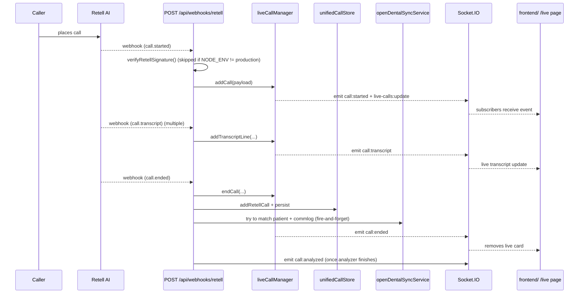
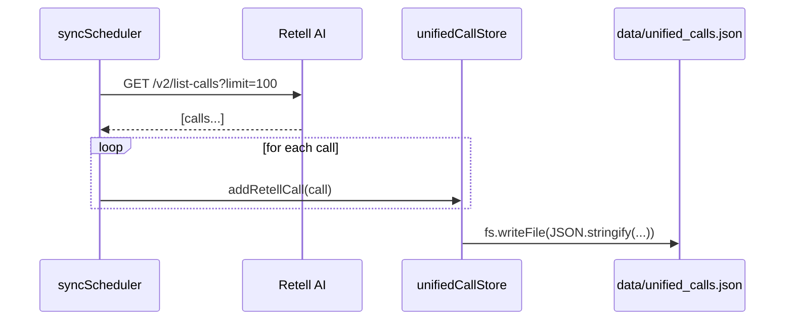
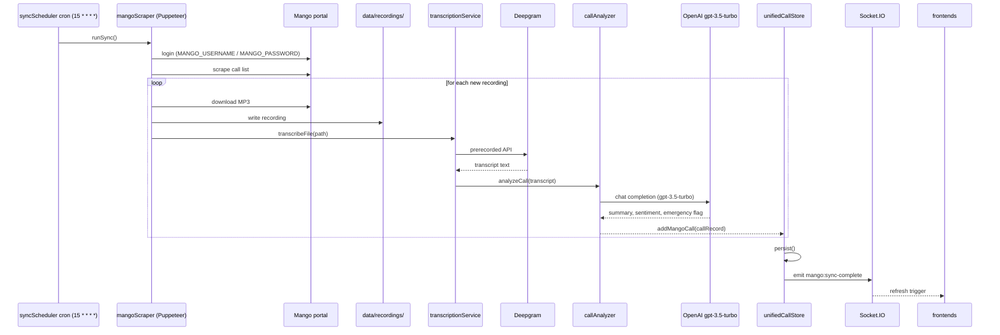
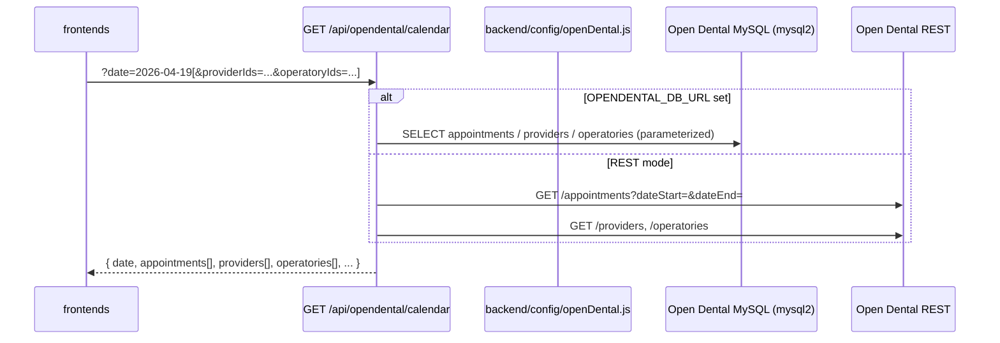
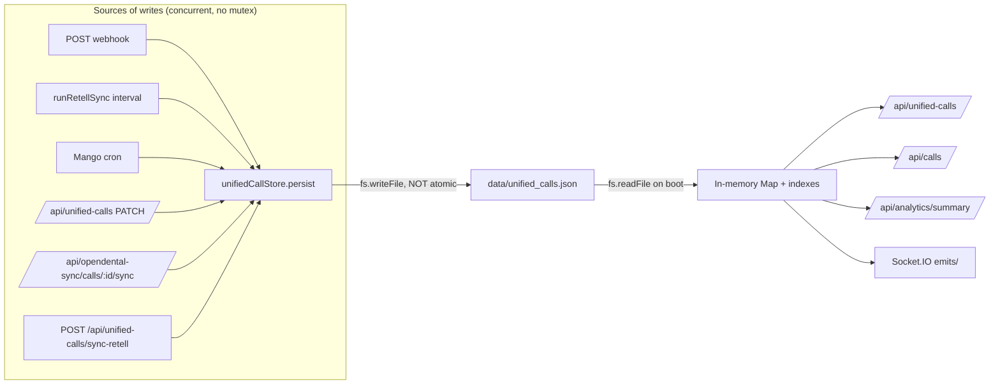

# 06 — Data flow

End-to-end sequences for the five flows that account for nearly all of the system's behavior.

## 1. Inbound Retell call → live monitor

This is the only true real-time path.



**Notes / risks**
- Webhook verification is dev-skipped ([`backend/routes/webhooks.js:21-22`](../backend/routes/webhooks.js)).
- `unifiedCallStore.persist` is **non-atomic** ([`unifiedCallStore.js:472-485`](../backend/services/unifiedCallStore.js)) — a crash mid-write here can blank the call history file.
- `new-dashboard/` has **no consumer** for these socket events (no LiveMonitor page, no `socket.io-client` import in `client/src`).

## 2. Background Retell sync (every 15 min + once at startup)



**Notes**
- Triggered by the `setInterval` in [`backend/server.js:167-172`](../backend/server.js).
- No `isRunning` guard for Retell pulls; if a slow run still has the connection open when the next interval fires, two `runRetellSync` calls execute concurrently and both call `persist()` on the same JSON file.

## 3. Mango sync (cron) → transcribe → analyze → store



**Notes / risks**
- `mangoScraper` keeps a single shared browser instance; concurrent calls serialize.
- The OpenAI prompt embeds the transcript and the caller phone number ([`callAnalyzer.js:107-115`](../backend/services/callAnalyzer.js)). PHI to OpenAI without a documented BAA. (See `audit/07-security.md`.)
- The Mango cron and the Retell `setInterval` both call `unifiedCallStore.persist()` with no mutex — interleaving risk.
- `transcribeUntranscribedMango` runs once at startup +10s ([`server.js:180-184`](../backend/server.js)) to catch up old recordings.

## 4. Open Dental calendar read



**Notes**
- Implemented routes today: `/health`, `/calendar`, `/appointments/range`, `/sync/status`, `/sync/trigger`. The fuller bootstrap (clinics, schedules, scheduleops, asap, slots, appt fields) called for in [`docs/OPEN_DENTAL_CALENDAR_BACKEND_SPEC.md`](../docs/OPEN_DENTAL_CALENDAR_BACKEND_SPEC.md) is **not yet implemented**.
- The legacy `OpenDentalCalendar.js` (FullCalendar) and the new `features/calendar/components/CalendarGrid.tsx` both consume `GET /calendar`.
- A second 3-minute sync `setInterval` runs from [`backend/config/openDental.js:141-152`](../backend/config/openDental.js) — it's a side-effect of importing the config module.

## 5. Booking an appointment (legacy frontend only)

```mermaid
sequenceDiagram
  participant U as Staff user
  participant Dlg as AppointmentBookingDialog (legacy)
  participant API1 as POST /api/opendental/appointments/check-conflicts
  participant API2 as POST /api/opendental/appointments
  participant OD as Open Dental (DB or REST)

  U->>Dlg: pick patient, type, date/time, operatory
  Dlg->>API1: { patientId, dateTime, duration, operatoryId, providerId }
  API1->>OD: query existing appointments at slot
  OD-->>API1: [conflicts] or []
  alt no conflicts
    Dlg->>API2: appointment payload
    API2->>OD: insert/POST appointment
    OD-->>API2: { id }
    API2-->>Dlg: { success }
  else conflicts
    API1-->>Dlg: list conflicts; ask user to pick another slot
  end
```

**Notes**
- Both endpoints are **unauthenticated**. Anyone able to reach `/api/opendental/*` can write into the live PMS.
- `new-dashboard/` does not call these endpoints — its calendar is read-only Phase 1.

## 6. Persistence model (single source of truth)



**Risks**
- A crash mid-write to `data/unified_calls.json` results in a truncated file. On next boot, `JSON.parse` fails, the catch silently starts with an empty store ([`unifiedCallStore.js:56-76`](../backend/services/unifiedCallStore.js)) — **silent total data loss** of the only call history.
- Concurrent `persist()` calls can interleave bytes. There is no file lock and no in-process mutex.
- Recovery is manual restoration from a backup that does not exist (no scheduled snapshots are present in this repo).
- `callbacks.js` keeps an entirely separate **in-memory array** that is **not** persisted at all ([`backend/routes/callbacks.js:10-12`](../backend/routes/callbacks.js)) — every restart wipes the callback queue.

## 7. Cross-flow concurrency map

| Concurrent path | What can collide |
|---|---|
| Retell `setInterval` + Retell webhook arriving | Two writers to `unifiedCallStore.persist` |
| Mango cron + Retell sync | Same |
| `POST /api/unified-calls/sync-retell` (manual) + scheduled Retell sync | Two `runRetellSync` runs against Retell + double persist |
| `liveCallManager` mutations (any webhook event) + `persist()` | OK at the in-memory Map level (single-threaded JS); risk is on the disk write |
| Mango scraper Puppeteer + on-demand `POST /api/mango/fetch/:id` | Both want the single shared browser instance |
| Two clients calling `POST /api/opendental-sync/match-all` | Both walk the entire store, both persist |

There is no global "I am syncing right now" coordinator; each pipeline guards (or doesn't) its own re-entry locally.
