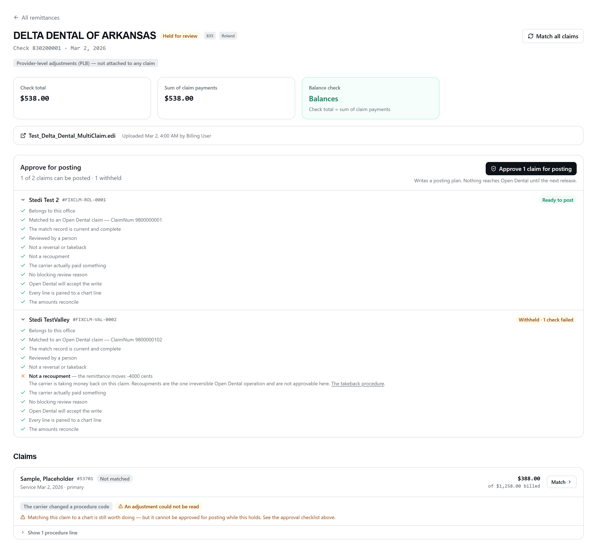
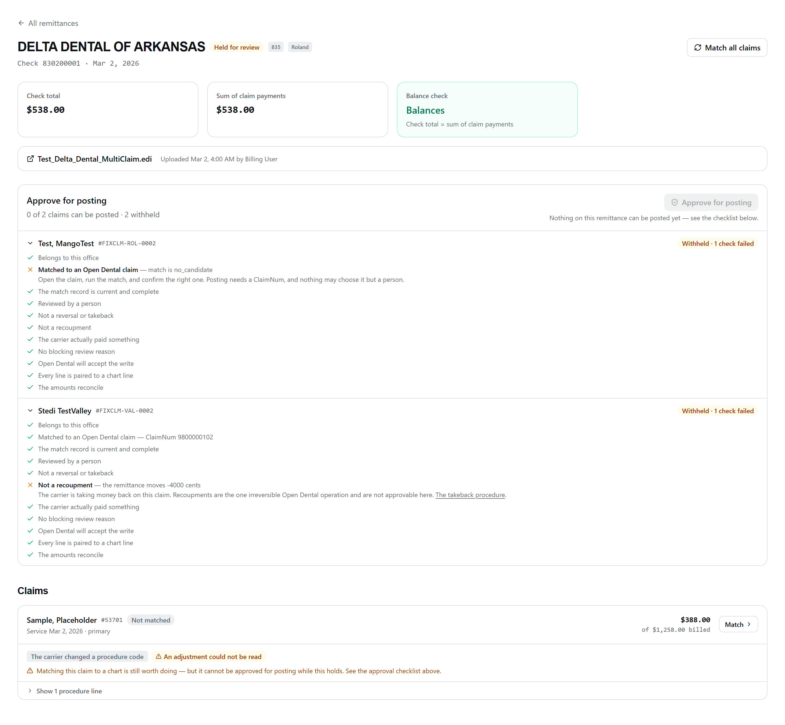
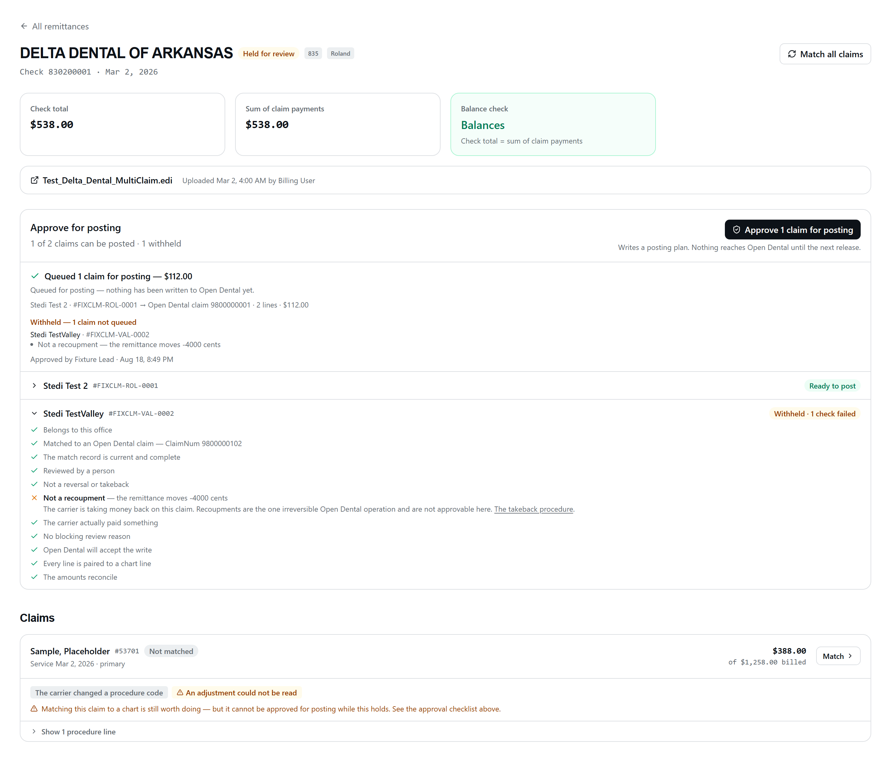
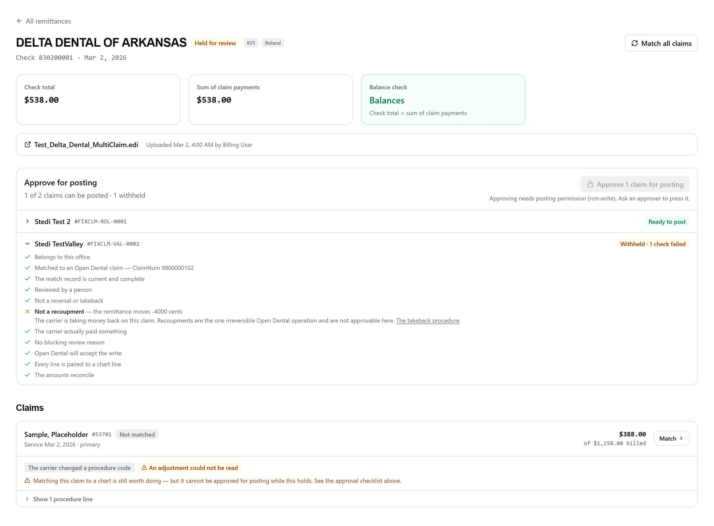

# RCM Slice 6b — the approval gate, and the durable record of intent

The one thing the workbench's disabled **Approve** button has been waiting for.
**Still zero Open Dental writes. Still zero Open Dental calls.**

| | |
| --- | --- |
| Routes (UI) | `/rcm/remittances/:id` (the panel), `/rcm/sop/takeback` (the manual route out) |
| Routes (API) | `GET /api/rcm/remittances/:id/approval`, `POST /api/rcm/remittances/:id/approve` |
| Entitlement | `requireModule('rcm')` — ships dark; no tenant is entitled yet |
| Permission | `rcm.read` for the checklist, `rcm.write` for the approve (D-9) |
| Office | Slice 3's router-wide `requireOffice` — the validated `?office=` query param |
| Migration | `backend/migrations-tenant/1787080000000_rcm_posting_approval.js` (additive only) |
| Code | [`backend/routes/rcm/approvalGate.js`](../backend/routes/rcm/approvalGate.js), [`backend/services/rcm/rcmVocabulary.js`](../backend/services/rcm/rcmVocabulary.js), [`new-dashboard/client/src/pages/rcm/ApprovalPanel.tsx`](../new-dashboard/client/src/pages/rcm/ApprovalPanel.tsx) |
| Tests | `approvalGate.test.js` (46), `rcmNoOdWrites.test.js` (10), `workbench.test.js` (74), `rcmVocabulary.test.js` (17), `rcm-workbench.test.tsx` (49), `rcm-labels.test.ts` (11) |

---

## 1. What "approve" means, and what it does not

Approving writes a **posting plan** to CareIN's own database:

- one `rcm_posting_queue` row per remittance, `status = 'approved'` — the Slice 1
  vocabulary's word for *"approved and NOT yet posted"*;
- one `rcm_posting_queue_line` per claimproc, carrying the **intended**
  `InsPayAmt` / `WriteOff` / `DedApplied` in cents and the Open Dental
  identifiers from the confirmed match snapshot;
- a linkage on each approved claim: `posting_queue_id`, `approved_at`,
  `approved_by`.

`carrier_eob_date` on the queue row is populated from the batch's **deposit
date** — BPR16 for an EFT, what the parser read off the remittance for a check.
It exists because Open Dental's `DateCP` is not writable: a `PUT` returns 200 and
ignores it (G2), so the carrier's own adjudication date has nowhere to live in
the chart and 6c puts it in the note instead. Null when the file carried neither
date, which the note then omits rather than inventing.

**Nothing reaches Open Dental.** `rcmNoOdWrites.test.js` drives the approve path
to *success* against a client whose every verb throws, and asserts not one
method was called — not a write, not even a read. There is no drain, no cron, no
startup sweep and no worker. That is Slice 6c, behind its own gated staging
event.

The screen says so in the server's own words:

> Queued for posting — nothing has been written to Open Dental yet.

That sentence is exactly true today and stops being true the day 6c ships, which
is why it lives on the response rather than in the client.

### Why the record exists before any Open Dental call

`RCM_OD_WRITES.md` §8 names the worst failure window: between the claim PUT to
`"R"` and the `POST /claimpayments`, *"the claim reads Received with money on the
lines and no check exists"*, and recovery *"works, but only if the poster knows
exactly which claimprocs it had touched"*. Open Dental has no transactions (G4),
so that window cannot be closed — only survived. The queue and its lines are
what makes surviving it possible, and they are written first.

---

## 2. The gate

`POST /api/rcm/remittances/:id/approve` takes an office and a batch id **and
nothing else**. The body is empty by design.

### It trusts nothing the client sent

Every condition is re-read from the database inside the transaction and
re-checked there, whatever the workbench displayed a moment earlier. A screen can
be stale; the claim it showed as confirmed may have been force-re-matched by
somebody else since.

**There is no force flag, no override, no query parameter and no admin bypass.**
The only way a withheld claim becomes postable is for a human to fix the thing
that withheld it. `approvalGate.test.js` walks the obvious attempts —
`{force:true}`, `{override:true}`, `{claimIds:[…], skipChecks:true}`,
`?force=true&override=1` — and asserts all four are refused.

### The twelve conditions

Evaluated in this order, which is the order a biller reads them: identity first,
then the human decisions, then facts about the file, then the arithmetic.

| Check | Fails when |
| --- | --- |
| `OFFICE_CONSISTENT` | The claim is stamped with a different practice than its remittance |
| `MATCH_CONFIRMED` | `od_match_status` is not `confirmed`, or `od_claim_num` is null |
| `SNAPSHOT_CURRENT` | No snapshot, wrong version, another office's, no confirmation, or the confirmation names a different ClaimNum |
| `REVIEWED` | Nobody has dispositioned the claim |
| `NOT_REVERSAL` | The claim carries `reversal_not_postable` |
| `NOT_RECOUPMENT` | The claim's paid total, or what the batch says it moved, is negative |
| `NOT_PATIENT_RESPONSIBILITY_ONLY` | The carrier paid nothing **and** the patient owes something |
| `NO_BLOCKING_REASON` | A blocking member of any vocabulary is present (see §3) |
| `NO_BLOCKING_PREFLIGHT` | The confirmed candidate's snapshot carries a blocking `OD_BLOCKERS` fact |
| `LINES_PAIRED` | Any procedure line has no `od_claim_proc_num` |
| `CLAIMPROC_NOT_ALREADY_PLANNED` | One of this claim's chart lines is already on a posting plan — another claim's, or another claim on this same remittance |
| `CLAIM_TOTALS_AGREE` | The claim total, the sum of its lines, and what the batch says it moved do not all agree |

**The recoupment approve swaps three of these and adds two.** `NOT_REVERSAL` and
`NOT_RECOUPMENT` are replaced by `RECOUPMENT_CONFIRMED`, and the checklist gains
`TAKEBACK_ACKNOWLEDGED` (§3.1) and `MATCH_TAKEN_FOR_A_TAKEBACK` (§3.2). It never
has FEWER conditions than the ordinary one — it has different, harder ones, and
every check in the table above still has to pass.

Four of these deserve their own note:

**`OFFICE_CONSISTENT` is reachable, and it was not at first.** `loadForApproval`
selected claims `WHERE office_id = $1` — the module's idiom everywhere else, and
wrong here. A claim on this batch stamped with the other practice simply dropped
out of the checklist while its payment still counted in the batch's sum, so the
only symptom was a `REMITTANCE_UNBALANCED` refusal naming nobody. The claims are
now loaded **by batch** and their office is judged per claim.

The office boundary is not weakened: a foreign row is redacted before it leaves
the loader — the patient name is replaced, every amount dropped, and only
`OFFICE_CONSISTENT` is evaluated. The mismatch is named and withheld without this
office reading the other practice's patient off its own screen.

**`NOT_PATIENT_RESPONSIBILITY_ONLY` is "paid nothing AND patient owes", not
"paid nothing".** A genuine zero — a full contractual write-off, an
applied-to-deductible with no balance — is a legitimate $0 adjudication Open
Dental takes happily, and refusing every zero would strand every claim a payer
zeroed out. There is no review reason for this; it is computed from the stored
totals, because inventing a vocabulary member would put a computed judgement
into a column whose contract is "a fact the parser or the reader established".

**`LINES_PAIRED` demands EVERY line, not just the ones carrying money.** 6c PUTs
against a ClaimProcNum; a line without one is a payment we cannot say where to
put. Posting the paired lines and leaving the rest would put the chart into
exactly the half-written state §8 exists to make recoverable, with nothing
recording which half. Refusing the whole claim keeps the unit of posting the same
as the unit the carrier adjudicated. **Deliberately strict, and ruled to stay
that way**: if 6c's end-to-end run shows Open Dental genuinely has no claimproc
for some line shape, it relaxes with data rather than in advance.

**`CLAIMPROC_NOT_ALREADY_PLANNED` exists because two claims can name one chart
claim.** Nothing makes `(office_id, od_claim_num)` unique across `rcm_claims`:
`confirmMatch` guards only its own row, and a re-uploaded EOB that slipped the
dedupe produces a second batch with a second set of claims. Both confirm to the
same Open Dental claim and pair to the same ClaimProcNums.

The partial unique index then refused the second approve with a raw `23505`,
which `h()` turned into `INTERNAL_ERROR` — after the gate had already told the
biller the claim was postable. A constraint doing its job must not reach a user
as a crash. It is checked in **three** places now, and all three are needed:

1. against plans that already exist, per claim, on the checklist;
2. against the other claims **in this same press** — the per-claim pass cannot
   see them, and two duplicates on one remittance collided at the insert;
3. and the `23505` itself is translated into `CLAIMPROC_ALREADY_PLANNED` 409
   inside the transaction, because the pre-check on one connection cannot see
   another transaction's uncommitted line. The database stays the guarantee;
   (1) and (2) are what make the common case legible.

### The batch's own arithmetic holds the WHOLE approve

`check total − PLB = Σ every claim payment on the batch`, withheld claims
included. A remittance whose money does not add up is not a remittance some of
whose claims are fine — the missing cents could belong to any of them. So an
unbalanced batch is `REMITTANCE_UNBALANCED` 409 and nothing is queued.

Per approved claim, separately: `Σ intended line amounts = the claim's paid total
= what the batch says the claim moved`. A disagreement is a **refusal**, not a
warning.

### Partial success is real success

The unit of approval is the remittance; the unit of refusal is the claim. A check
carrying nine clean claims and one reversal enqueues nine and says so, naming the
tenth and why:

```json
{
  "queued":       [{ "claimId": "…", "odClaimNum": 9800000001, "lines": 2, "totalCents": 11200 }],
  "withheld":     [{ "claimId": "…", "reasons": ["NOT_RECOUPMENT"], "checks": [ … ] }],
  "alreadyQueued": [],
  "note": "Queued for posting — nothing has been written to Open Dental yet."
}
```

**An empty postable set is a refusal, not an empty success.** A 200 saying
"approved 0 claims" reads as *done* on a busy screen, so it is a 409
`NOTHING_APPROVABLE` carrying the per-claim reasons.

**And the attempt is recorded even when everything rolls back.**
`rcm_payment_batches.approval_attempted_at` is written on its own connection,
after the gate's transaction has finished either way. Without it a wholly-refused
approve left no trace at all — no queue row, so no `claims_withheld` obligation —
and the remittance **dropped out of the needs-attention view at the exact moment
its owner was told it needed work**. The same crying-wolf rule the 6a predicate
was rewritten for, failing in the opposite direction: silence where somebody
definitely owes an action. Best effort, deliberately: failing to record an
attempt must never turn a clean refusal into a 500 or undo a committed enqueue.

### Re-approve is allowed and idempotent

A second press enqueues only the claims that were withheld before and now pass.
Already-queued claims come back under `alreadyQueued`; positions on the plan
continue rather than restart, so 6c's replay order stays deterministic across
both approvals. Nothing is ever created twice.

### Refusals, in evaluation order

| Code | HTTP | Meaning |
| --- | --- | --- |
| `INVALID_OFFICE` | 400 | No `?office=`, or not `roland`/`valley` |
| `REMITTANCE_NOT_FOUND` | 404 | No such batch **for this office** — also what a malformed id gets |
| `FORBIDDEN` / `APPROVE_REQUIRES_WRITE` | 403 | The caller does not hold `rcm.write` (see §5) |
| `REMITTANCE_UNBALANCED` | 409 | The check's own arithmetic does not reconcile |
| `NOTHING_APPROVABLE` | 409 | Nothing on this remittance can be posted yet; `claims` carries why |
| `CLAIM_ALREADY_QUEUED` | 409 | Somebody approved a claim between the locked read and the write |
| `CLAIMPROC_ALREADY_PLANNED` | 409 | Somebody's concurrent approve took one of these chart lines first |
| `QUEUE_ALREADY_RUNNING` | 409 | A plan for this remittance is past `approved` — cannot fire until 6c |

---

## 3. D-11 — blocking reasons versus annotating ones

`docs/RCM_ERA_FIDELITY.md` proposed the split; this slice **ratifies it as data**.

The principle: **a reason BLOCKS when acting on the proposal could move the wrong
amount of money, or money that should not move at all. It ANNOTATES when it tells
a biller something true that does not change what to post.**

It lives in `rcmVocabulary.js` as `REASON_GATE`, one flat map over three
vocabularies (claim review reasons, remittance flags, line flags), with exactly
**two consumers**: the approval gate, and the workbench's chip colour. A screen
showing a reason in amber while the gate lets it through — or the reverse — is
the honest-states rule failing in the most expensive place there is, so
`rcm-labels.test.ts` reads the backend source and fails if the client's mirror
disagrees about a single slug.

**A reason absent from the map is BLOCKING** (fail closed), and
`rcmVocabulary.test.js` asserts every member of all three vocabularies appears in
it, so that default is a backstop rather than a routine path.
`uncertain_line:<N>` is handled explicitly — a line the model was unsure about is
money read with low confidence.

### 3.1 D-11 AMENDMENT (2026-08-27) — the takeback confirmation answers two flags

**Ruled after the finding below. It is the first and so far only exception to
"one vocabulary, no exceptions", and it is written as a partition rather than an
exemption.**

#### What was found

`evaluateClaim`, run with `recoupmentAllowed: true`:

```
6d hand-built fixture (no parser flags) => NO_BLOCKING_REASON passed: true
a REAL reversal 835 from the parser     => NO_BLOCKING_REASON passed: false
                                           reversal_not_postable, negative_total_payment
```

The ERA parser marks a reversal claim `reversal_not_postable` and flags its
remittance `negative_total_payment`. Both are blocking. `NO_BLOCKING_REASON` was
computed over every reason unconditionally — the D-6 swap replaces
`NOT_REVERSAL` / `NOT_RECOUPMENT` with `RECOUPMENT_CONFIRMED` and never touched
the blocking list — so **D-6's typed-confirmation path was unreachable for any
835 a real carrier would send.** Every takeback test 6d shipped passed, because
they build the claim by hand: a negative amount and an empty
`needsReviewReasons`. *A hand-built fixture for one stage of a pipeline is a
claim about the stage upstream of it, and nothing was checking that claim.*

#### The ruling

On the **recoupment approve only**, `reversal_not_postable` and
`negative_total_payment` are answered by a single named check:

| | |
| --- | --- |
| Code | `TAKEBACK_ACKNOWLEDGED` |
| Passes when | the claim really is a takeback — the same `recoup` that `RECOUPMENT_CONFIRMED` turns on, so the two cannot disagree |
| Pass detail | *This is a takeback — confirmed by typing -1.00* (the amount from `formatRecoupmentTotal`, so it is the string the approver actually typed) |
| Ordinary approve | **never added to the checklist at all**, and both flags block exactly as they did in 6b |

**A PARTITION, NOT A FILTER, and the distinction is the whole ruling.** Every
reason is still accounted for by exactly one visible check: the two takeback
flags go to `TAKEBACK_ACKNOWLEDGED`, everything else to `NO_BLOCKING_REASON`.
Written as `blocking.filter(...)` a reason would simply vanish from the screen,
and D-11's point is that no code path gets to decide a flag does not apply to
it. Here the flag still applies — it is answered, by name, in public, and the
check can **fail**: reversal flags on a claim whose money moves forwards is a
contradiction the screen shows rather than absorbs.

**Exactly two flags, and adding a third is a ruling, not a fix.**
`TAKEBACK_FLAGS` in `approvalGate.js` is the one place in the module where a
blocking reason can be answered by something other than removing its cause. A
truncated envelope or an unreadable line amount still blocks a recoupment
approve — neither is a fact about money moving backwards, they are facts about
not being able to read the file at all, and no typed amount confirms those.

Pinned by six tests in `approvalGate.test.js`, including that the same
parser-produced claim **fails** the ordinary gate on those exact flags, and that
`TAKEBACK_ACKNOWLEDGED` never appears in an ordinary checklist in any shape.

### 3.2 WALK NIGHT 2 (2026-08-28) — the same lesson, one stage further down

**§3.1 unblocked the takeback's REVIEW REASONS. This unblocks its EVIDENCE.**

#### What was found

With the reversal 835 matched to claim 53830 — Received, InsPayAmt $1.00, on
check 21424, the state the drain had put it in twenty minutes earlier — the
takeback approve refused with the correct total typed. The checklist named it:

```
The chart is ready for this payment   LINE_HAS_CLAIM_PAYMENT, NO_PAYABLE_LINES
Every line matched to a chart line    1 of 1 lines have no ClaimProcNum
                                      "no postable line on this claim"
```

Every one of those sentences is **true about a payment and says nothing about a
reversal.** A payment needs a line Open Dental will let it PUT money onto: not
deleted, not transferred, not already attached to a check. **A takeback needs the
exact state that refusal describes** — its target line is paid, and on a real
reversal it is on a check already, because the money it is reversing is money
this module posted. The two lanes ask inverse questions and `claimMatch` only
knew how to ask one of them.

`§3.1`'s own test passed because the fake chart's claim was never in the
post-drain state. **A hand-built fixture for one stage of a pipeline is a claim
about the stage upstream of it** — recorded in §3.1, and true again one layer
down.

#### The ruling — the same partition, on the pre-flight facts

The lane is carried by `claimMatch.isTakeback` (**one predicate**;
`approvalGate.isRecoupment` now delegates to it, so the match and the gate
cannot disagree about which question is being asked) and is **stored on the
snapshot** as `takeback`.

| Fact | Payment lane | Takeback lane |
| --- | --- | --- |
| a line is paid and attached to a check | `LINE_HAS_CLAIM_PAYMENT` — **blocking** (OD refuses `Cannot change InsPayAmt when Status is Received and attached to a ClaimPayment`) | `LINE_PAID_AND_ON_CHECK` — **reported, not blocking.** It is the precondition, and it stays on the list because it is the fact that makes the ordinary button refuse |
| every line is already paid | `NO_PAYABLE_LINES` — **blocking** | not raised |
| no line carries a payment | not raised | `NO_REVERSIBLE_LINES` — **blocking.** A takeback against a line the carrier never paid reverses nothing |
| the takeback exceeds what the chart shows was paid | not applicable | `TAKEBACK_EXCEEDS_PAYMENT` — **blocking**, compared as magnitudes; skipped, never passed, when the amount is unknown |
| deleted / `'unknown'` / transferred / blocked status | **blocking** | **blocking** — identical. These are reasons Open Dental cannot be trusted about a line at all, and no direction of money makes an unreadable procedure safe |
| line pairing | eligible = not deleted, not transferred, not blocked, **no check attached** | eligible = not deleted, not transferred, not blocked, **`InsPayAmt ≠ 0`**. Unpaired reads *"no paid line on this claim to reverse"* |

**A PARTITION AGAIN, NOT A RELAXATION.** The inversion is exactly two codes
wide, the fact still prints under its own name with the opposite verdict, and
the takeback lane gains **two refusals of its own** that the payment lane has no
use for. Nothing was switched off: a takeback against an unpaid line, or one
larger than the payment on the chart, is refused where before it was not
expressible.

**Being on a check is reported, not required.** A line paid but not yet attached
to a ClaimPayment still has money to take back, and demanding the check would
refuse a takeback against a payment posted by hand in Open Dental.

#### And the evidence must have been gathered for the right question

| | |
| --- | --- |
| Code | `MATCH_TAKEN_FOR_A_TAKEBACK` |
| Path | **recoupment only**, like the two checks above it |
| Passes when | `snapshot.takeback === true` |
| Fix | *Run the match again on this claim.* |

`NO_BLOCKING_PREFLIGHT` and `LINES_PAIRED` both read the snapshot, and the
snapshot answers one of two opposite questions. Asserting the lane **before**
either of them speaks means a biller reading three red checks is told the one
thing that fixes all three, instead of two true-but-irrelevant sentences about
payments. A v2 snapshot written before the field existed carries no lane and
reads as `false` — correct rather than merely convenient: those snapshots really
were taken for a payment.

#### Pinned by `routes/rcm/takebackAgainstPostedChart.test.js`

**The chart in that file is not written down.** Plan A is posted through the
real `postingDrain.drainOffice` against `FakeOd`, and whatever state that leaves
is what the reversal is evaluated against — including the assertion that the
payment lane still produces the walk night refusal, and that the ordinary
Approve button still refuses the claim outright. If the drain's output and the
takeback's expectations ever drift apart again, that file is what notices.

### Blocking (24)

| Reason | Why it blocks |
| --- | --- |
| `reversal_not_postable` | A takeback. The negative-supplemental path is irreversible in Open Dental (G10) |
| `secondary_payer_adjudication` | COB: what the other payer already did changes what we should post |
| `prior_payer_payment_on_primary_claim` | The file contradicts itself about who paid first |
| `unparseable_cas` | Money in a CAS we could not account for |
| `no_service_lines` | Nothing to post, and the file says there should be |
| `line_total_mismatch` | Our lines do not reach the payer's own claim total |
| `unstorable_adjustment_group` | An adjustment could not be stored at all |
| `patient_resp_mismatch` | Two stored numbers disagree about what the patient owes |
| `unreadable_amount` | A number we could not read; whatever it belonged to is wrong |
| `partial_adjustment_segment` | Part of a segment lost — some money is unrepresented |
| `claim_line_allowed_mismatch` | Two numbers disagree about the allowed total |
| `totals_unreconciled` | The sums are not trustworthy, by construction |
| `low_confidence` | The reader was unsure about the whole document; every amount is suspect |
| `uncertain_line:<N>` | One printed line read with low confidence — that line's money is suspect |
| `no_procedures_extracted` | Nothing to post, and the document says there should be |
| `paid_total_mismatch` | The procedure payments do not sum to the claim total |
| `billed_total_mismatch` | The charges do not sum — and billed is what 6c re-verifies against |
| `negative_amount` | "Most often a misread column" — and a real one is the 6d recoupment path |
| `no_claims_extracted` | Nothing to propose, and the document says there should be |
| `batch_paid_total_mismatch` | The claim payments do not sum to the check total |
| `negative_total_payment` | The whole remittance is a takeback |
| `no_claims_in_remittance` | No CLP at all, and the file says there should be |
| `claim_total_mismatch` | Claim payments do not reach the check total |
| `envelope_counts_mismatch`, `envelope_incomplete` | The file may be TRUNCATED — claims may be missing entirely |

### Annotating (25)

| Reason | Why it does not block |
| --- | --- |
| `claim_denied` | A denial is a correct, complete adjudication with nothing to post |
| `procedure_downcoded` | The payer changed a code and we recorded both. The money is not uncertain |
| `claim_level_adjustments_present` | WHERE a deductible was reported is a display fact; the amount is correct |
| **`allowed_amount_mismatch`** | **D-11's one contested call.** Since A3 we always post the DERIVED write-off; the reported `AMT*B6` is evidence and is never the figure written to Open Dental. A disagreement says the payer's file is internally inconsistent, not that our number is wrong — and `line_total_mismatch` independently catches the case where our arithmetic actually is. It fires on 7 of the 13 original fixtures, so this single verdict is most of what the split buys |
| `missing_npi`, `missing_dob`, `missing_check_number`, `missing_subscriber_id`, `missing_payer`, `missing_claim_number`, `missing_patient_name` | Identity, not money — and the gate demands a human-confirmed match anyway |
| `invalid_service_date`, `service_date_in_future` | A date, not an amount. `DateCP` is not writable regardless (G2) |
| `plb_adjustments_present` | Provider-level money is acted on by nobody here. It does not make the CLAIMS wrong |
| `no_payment_made` | `BPR04 = NON` is a legitimate zero-dollar remittance. The claims are still correct |
| `multi_transaction_file` | Each ST/SE became its own batch with its own key; nothing about any one is uncertain |
| `downcode`, `bundled`, `denied`, `partial_pay`, `unexplained_adj`, `frequency_limit`, `not_covered`, `pre_auth_required`, `allowed_mismatch` | Line flags. Most restate a claim reason one level down; `allowed_mismatch` is A3's line-level twin and is ruled the same way |

### What the split does NOT change

`eraIngest.batchStatusFor` still holds a batch `open` when **anything at all** is
flagged. `open` means "something on this file was flagged" — a different question
from "may this claim be posted", and changing what `ready` promises is a separate
decision. The fidelity doc's implementation note proposed changing it; that half
is **not** adopted here.

---

## 4. Idempotency, enforced by the database

Two constraints, at two levels. Both were rehearsed on PostgreSQL 17 and are
proven to refuse (§8).

**Claim level — `rcm_claims.posting_queue_id`.** A single-valued FK column: a
claim can be linked to at most one plan because a column holds one value. The
enqueue does its check and its write in ONE statement (`… WHERE posting_queue_id
IS NULL`), so a racing second approve matches no row, writes nothing and finds
out — the same idiom `confirmMatch` uses. A CHECK pairs it with `approved_at` and
`approved_by` (all three or none) and another asserts a queued claim is a
confirmed one.

**Money level — a partial unique index** on `rcm_posting_queue_line (office_id,
od_claim_proc_num) WHERE is_supplemental = false`. The same Open Dental claimproc
can never be planned for an ordinary adjudication twice, in any office, by any
path — including one added next year that forgets to look at the column above.

The predicate is load-bearing: a **recoupment** goes through `POST
/claimprocs/Supplemental` against a claimproc that has already been paid, so a
legitimate 6d supplemental would collide under a total unique index. Recoupments
cannot pass the 6b gate at all, so the exemption opens nothing today; it is there
so 6d does not have to drop and rebuild the constraint protecting everything else.

Office is in both keys, because ClaimProcNum numbering restarts in every Open
Dental database — the same reason PatNum 7115 is two different people.

### A queued claim cannot be re-matched or re-pointed

`rcm_claims_approved_is_confirmed_check` means a forced re-run on an approved
claim — which NULLs `od_claim_num` and moves the status off `confirmed` — is
refused by the database. It used to surface as `INTERNAL_ERROR` **after** the
Open Dental read had already happened: a chart read for an operation that could
never have completed.

Both paths now refuse before any Open Dental call, with `CLAIM_ON_POSTING_PLAN`
409:

- `POST /claims/:id/match` with `force`, checked in `runClaimMatch` as soon as
  the claim is loaded and before the transport is even resolved;
- `POST /claims/:id/confirm-match` with a **different** ClaimNum, under the
  existing row lock. The same ClaimNum stays idempotent — it asks for a decision
  already recorded and gets it. "Release that first" was honest advice on an
  ordinary confirmed claim and impossible advice on an approved one, so the
  message says the reachable thing instead.

Releasing a plan is 6c's to build.

---

## 5. Permission (D-9)

| Tier | Checklist (`GET …/approval`) | Approve (`POST …/approve`) |
| --- | --- | --- |
| `admin`, `office` | ✅ | ✅ |
| `reviewer` | ✅ | ❌ 403 |
| anything else | ❌ | ❌ |

The checklist runs on `rcm.read`, which `reviewer` holds. Seeing why a claim is
withheld is not a posting act, and the person who did the reviewing is the one
best placed to fix what she is looking at. The response says so in a field rather
than leaving the screen to infer it from a role name: `canApprove` is the
server's answer and `approveRequires` names the permission a colleague needs.

`POST …/approve` is deliberately **not** in `routes/rcm/index.js` `QUEUE_PATHS`,
so the mount's `requireReadWrite('rcm.read','rcm.write')` demands `rcm.write` for
it by construction. A `reviewer` therefore never reaches the handler at all, and
receives the platform's `FORBIDDEN` 403 carrying `action: 'rcm.write'`. The
in-handler `holdsPermission` check behind it (`APPROVE_REQUIRES_WRITE`) is
defence in depth for a future remount, not the primary gate — see §10 for the one
consequence of that choice.

---

## 6. The screens

### The checklist comes before the button



Every condition, per claim, with pass/fail and the server's own copy about what
to DO — rendered as soon as the remittance opens, without anything being pressed.
A biller should be able to see that a claim will be withheld and go fix it
(confirm the match, review it, route the reversal to the SOP) rather than pressing
a button to find out. **Pressing a button to discover a refusal is how people
learn to press buttons hopefully.**

The checklist and the button run the same server-side evaluation, so the screen
cannot predict an outcome the button then contradicts.

### An honest refusal



Nothing queued, one audit row, and the reasons per claim. The data stays on
screen: a refusal here is the gate working, and the checklist is precisely what
explains it.

### A partial approve



What was queued, with the Open Dental claim each will touch. What was withheld,
with every failing condition. The approver and the time. And the honest state, in
the server's words.

### The reviewer's view



Identical checklist. Disabled button, naming the permission an approver holds.
The tier decides the button, never the truth.

### Confirm above a red blocker — the ruling

**Confirm stays enabled.** Linking a proposal to a chart claim is not posting, and
a biller who can see the right claim should be able to say so. What 6b adds is
that the consequence is now **predicted where the confirmation happens** — the
claim card says this confirmation cannot be approved and why, and the checklist
says which condition. Before, the only place the consequence appeared was at the
gate, after the linkage was already committed.

---

## 7. Obligations after D-12

`attentionFor` gains three entries. The division is the one D-12 settled: an
OBLIGATION is an action a human still owes; an OBSERVATION is a fact.

| | Reason | When |
| --- | --- | --- |
| Obligation | `claims_unreviewed` | A claim has not been marked reviewed |
| Obligation | `batch_no_claims` | The remittance has no claims at all |
| Obligation | `claims_awaiting_approval` | Every claim reviewed, and at least one is confirmed, unqueued and carries nothing blocking — **an approver owes an action** |
| Obligation | `claims_withheld` | An approve has run on this remittance and left a claim out — **somebody owes a fix or a manual disposition** |
| Observation | `claims_queued` | A claim is on a posting plan — the SYSTEM owes the next step and no human does |

Two properties worth stating:

- **`claims_withheld` can only fire after an approval exists.** Before that there
  is nothing to be withheld *from*: an unapprovable claim that a biller reviewed
  with "the carrier owes a corrected EOB" is finished work, and calling it an
  obligation is exactly the false alarm the 6a predicate was rewritten to stop
  raising.
- **A fully-queued remittance leaves the default view; a partially-withheld one
  does not.** Both are pinned by tests.

The list decides between the two obligations with `approvalGate.looksApprovable`
— the cheap, *necessary but not sufficient* subset of the gate, answerable from
columns the claim list already selects. The full gate reads every claim's match
snapshot (the whole candidate payload, Open Dental patient names included) and
every line; doing that once per row on the cheapest screen to colour a chip is
not a trade worth making. Being wrong between the two mislabels **which** human
owes the action, never **whether** one does — and one click resolves it. Nothing
is ever enqueued on the strength of it.

---

## 8. Migration rehearsal (PostgreSQL 17)

`up` → objects present → `down 1` → `up` again → `down` all the way, all clean on
a throwaway `postgres:17` container.

**Eight behaviours are exercised against the live constraints: four REFUSALS and
four things that must still be allowed.** Both halves matter — a constraint that
refuses everything is as wrong as one that refuses nothing, and three of the four
allowances are cases an over-eager index would have broken.

The four refusals:

```
duplicate key value violates unique constraint "rcm_posting_queue_line_claimproc_unique"
  DETAIL:  Key (office_id, od_claim_proc_num)=(roland, 99001) already exists.

new row for relation "rcm_claims" violates check constraint
  "rcm_claims_approval_check"                       -- a half-recorded approval

new row for relation "rcm_claims" violates check constraint
  "rcm_claims_approved_is_confirmed_check"          -- queued but not confirmed

new row for relation "rcm_payment_batches" violates check constraint
  "rcm_payment_batches_approval_attempt_check"      -- a half-recorded attempt
```

The four allowances:

```
the same claimproc as a SUPPLEMENTAL          INSERT 0 1   (6d's recoupment path)
the OTHER office planning its own 99001       INSERT 0 1   (numbering is per database)
a fully-recorded approval on a confirmed claim INSERT 0 1
a recorded ATTEMPT with no queue row at all   UPDATE 1     (the refusal case)

 office_id | position | od_claim_proc_num | is_supplemental
-----------+----------+-------------------+-----------------
 roland    |        1 |             99001 | f
 roland    |        3 |             99001 | t
 valley    |        1 |             99001 | f
```

---

## 9. Debts this slice paid

Each was logged in the #88 or #89 review and is fixed here.

| | What changed |
| --- | --- |
| **Batch-level flags render** | `BATCH_COLUMNS` selects `flags`; the detail shows them as chips coloured by the D-11 split. A whole-check takeback used to surface only as "Held — something on this remittance was flagged". (The EOB path already wrote the column — Slice 5.5 fixed that half.) |
| **The 5.5 vocabulary is labelled once** | `format.ts` kept a SECOND reason map that went stale the moment 5.5 landed: it carried `low_confidence_extraction` and `uncertain_line`, neither of which the backend has ever emitted, while the thirteen real EOB reasons rendered as raw slugs. The workbench now reads `labels.ts` — the map `rcm-labels.test.ts` already checks against the backend source. Line flags moved with it. |
| **PLB detail** | Each provider-level adjustment listed with its code, amount, published description and reference. Descriptions come from the row (the parser already holds the published PLB03-1 list) — a code with no published wording renders BARE rather than glossed with a guess. The "manual SOP" prose is now a real anchor to `/rcm/sop/takeback`, a page that says what CareIN already did, what a person does next, and admits the practice's own written procedure does not exist yet. |
| **Server-side needs-attention + paging** | `GET /remittances` takes `view=attention\|all`, computes the predicate over the WHOLE office, and returns `total`, `needsAttentionCount` and `matchingCount` over the same population. "12 needing attention · 640 total" is now one statement about one set. The client stopped filtering a 100-row page and got a real pager. The API's default view is `all` — a list endpoint that silently hides most of the list is a trap for the next caller; the screen asks for the view it wants. |
| **Non-uuid `:id` → 404** | `helpers.isUuid` guards the three `/:id` routes. Postgres refuses a non-uuid literal in a uuid comparison, so a malformed id used to 500 — and the shape of the error told a prober which ids were real. `FakeRcmDb` fixtures now use real uuids, so the tests exercise it. |
| **The seeder could not run** | `scripts/rcm-seed-fixtures.cjs` set `od_claim_num` and left `od_match_status` at its `not_run` default, which Slice 6a's CHECK forbids in both directions — every `--execute` against a migrated database would have failed. Fixed, with the whole confirmation and a review stamp rather than just the status, and a test that pins it. |

### And five found in review (PR #96)

| | What it was, and what it is now |
| --- | --- |
| **A unique violation was a 500** | Two claims can be confirmed to one Open Dental claim, so the partial index refused the second approve with a raw `23505` — `INTERNAL_ERROR`, after the gate had said "postable". Now a named condition on the checklist, a self-collision pass over the postable set, and a `CLAIMPROC_ALREADY_PLANNED` 409 for the race. |
| **A refused approve made the remittance vanish** | `claims_withheld` keyed on a queue row existing; a full refusal rolls back and leaves none. `approval_attempted_at` is written outside the transaction and is what keeps the row in the queue. |
| **`OFFICE_CONSISTENT` was unreachable** | Claims were loaded office-scoped, so a foreign claim dropped out of the checklist and surfaced only as an unexplained unbalanced total. Loaded by batch now, judged per claim, and redacted so naming it discloses nothing. |
| **`NO_BLOCKING_PREFLIGHT` failed open** | A confirmed ClaimNum absent from `snapshot.candidates` gave `blockers = []` and the check PASSED. Absence read as clean — the module's recurring defect shape. The candidate's existence is now required by `SNAPSHOT_CURRENT` and re-asserted here. |
| **Force re-match on a queued claim 500'd** | After the Open Dental read, on the new CHECK. Refused with `CLAIM_ON_POSTING_PLAN` before any chart is touched, on both the match and the confirm paths. |
| **`labels.ts` described a drift test that did not exist** | It does now — and on its first run it caught the client failing **OPEN** on an unknown slug, the exact opposite of the header's promise. The client mirrors the full verdict map rather than a blocking set. |

---

## 10. Known limits — logged here, not fixed

| | Limit | Why it waits |
| --- | --- | --- |
| **A `reviewer`'s 403 is the platform's, not the gate's** | The slice brief asked for a named message and an `UNAUTHORIZED` audit row on the approve refusal. `POST …/approve` is deliberately not exempt from the mount's write gate, so the middleware refuses first with `FORBIDDEN` + `action: 'rcm.write'` and writes no audit row; the named `APPROVE_REQUIRES_WRITE` check behind it is unreachable in practice. Widening the mount to get a prettier refusal would trade a structural guarantee for a message. **The user-visible half is discharged**: the checklist (which a reviewer CAN read) says who can press it, and the client renders the named sentence on either code. **PM ruling wanted** if the audit row matters. |
| **`LINES_PAIRED` demands every line** | Including zero-dollar ones. Strict on purpose (§2); relaxing it is a ruling, not a refactor. |
| **The remittance key for an EOB-derived batch is DERIVED, not reserved** | Only the ERA path writes `rcm_remittance_keys`. The gate prefers that row and falls back to `buildBatchRemittanceKey` over the batch's own identity components — the same builder, so both doors produce one key for one physical check. No reservation row is written: reserving is the posting protocol's act and belongs to 6c. |
| **The list's attention scan reads every claim for the office** | Six narrow columns, no PHI, one extra query per page load. Correct and cheap at real sizes; the shape to fix at scale is a materialised predicate, not a smaller scan. |
| **`GET /remittances/:id` is still unbounded and N+1** | Unchanged from 6a. Real carrier checks in this practice are single digits. |
| **`rcm_user_map.platform_email` still has no unique constraint** | Unchanged from 6a. A migration plus a de-dupe pass. |
| **The batch match is still a held HTTP request** | The polled job it wants needs run state — a table this slice deliberately did not add. The posting queue is not that table: it records intent to post, not the progress of a match. |

---

## 11. Staging validation

The **negative walk**, which is the acceptance for staging.

> **Which remittance.** This is the **Delta batch Beau uploaded in the Slice 5
> walk** — a real 835 whose two claims are `no_candidate` (the fixture PatNums do
> not exist in that database) and which Beau marked reviewed during the 6a walk.
> It is NOT one of the seeder's fixtures: `rcm-seed-fixtures.cjs` now produces
> confirmed, reviewed claims on purpose, so that a POSTABLE state exists to
> demonstrate at all. The two coexist in the same tenant and this walk wants the
> uploaded one.

1. Sign in as an `admin` or `office` user and open **/rcm → Remittances**.
2. Open the **Delta batch from the Slice 5 upload** — both claims
   `no_candidate`, both reviewed.
3. The approval checklist shows **both claims withheld**, each failing
   `MATCH_CONFIRMED` — "match is no_candidate" — with the fix under it.
4. Press **Approve**. Expect an honest refusal listing both claims and their
   reasons.
5. Confirm nothing was queued and exactly one audit row was written:

```sql
SELECT count(*) FROM rcm_posting_queue;            -- 0
SELECT count(*) FROM rcm_posting_queue_line;       -- 0
SELECT posting_queue_id FROM rcm_claims WHERE office_id = 'roland';   -- all NULL

SELECT action, resource_type, resource_id, result, office, user_id, ts
  FROM audit_log
 WHERE resource_type = 'rcm_posting_approval'
 ORDER BY ts DESC LIMIT 5;                          -- one CREATE / ERROR row
```

6. Back on the list, the remittance is **still there**, showing
   **`claims_withheld`** as an obligation. This is the step that would have
   failed before review: the refusal rolled back, nothing was queued, and the
   remittance dropped out of the default view in the same breath as telling its
   owner it needed work. `approval_attempted_at` is what keeps it:

```sql
SELECT check_number, approval_attempted_at, approval_attempted_by
  FROM rcm_payment_batches WHERE office_id = 'roland';   -- stamped, despite the rollback
```

7. For the POSITIVE side, open one of the seeded fixture remittances instead:
   Roland's third claim is confirmed, reviewed and postable with nobody having
   approved it, so the checklist shows a live button and the list shows
   `claims_awaiting_approval`. Valley's second claim is the recoupment and is
   permanently withheld on `NOT_RECOUPMENT`.

The **positive path** (confirmed + reviewed → queued) is proven by the route
tests and by the seeded screenshot until 6c's gated end-to-end run on the
designated test patients.

---

## 12. Out of scope

**The drain, and any Open Dental write** (6c) · **the recoupment typed
confirmation and the document attach** (6d) · **the persisted batch-match job**
(Slice 7 — it needs run state, a table this slice does not add; the posting queue
is not it) · **OCR** (its own PR) · reconciliation, VCC, Stedi · entitlement
changes · prod.
