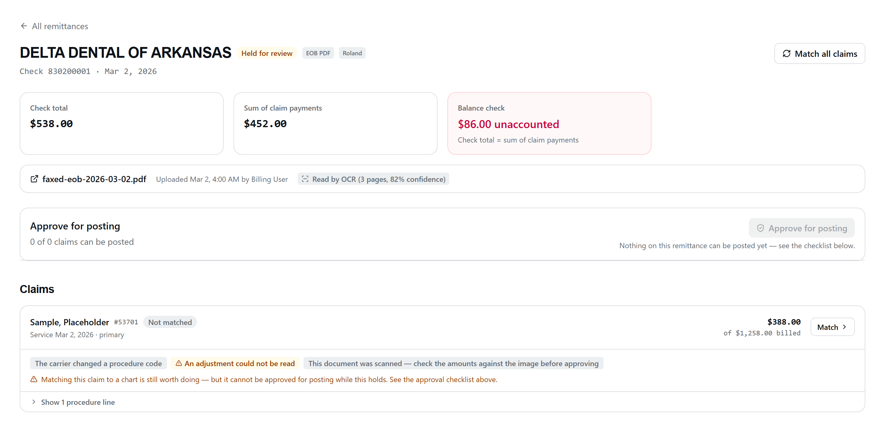

# RCM Slice 4 — EOB ingestion

EOB PDFs in, extraction **proposals** out.

A proposal is `rcm_claims` rows in `pending_review`, with `rcm_procedure_lines` and
`rcm_procedure_adjustments` beneath them. **Nothing in this slice touches Open Dental.**
There is no OD client in the ingestion module's require graph, and
`backend/routes/rcm/eobNoOdImports.test.js` fails if one appears. Turning an approved
proposal into a chart write is Slice 6, in a different module, behind
`assertOfficeMatch`.

This is the RCM module's **first write surface**. `rcm.write` was mounted and deliberately
unused in Slice 3 so that this POST would demand it by construction rather than by
whoever added it remembering.

---

## 1. The flow

```
browser  ── multipart PDF ──►  POST /api/rcm/eob?office=roland|valley
                                 │  auth gate → tenantContext → requireModule('rcm')
                                 │  → requireReadWrite(rcm.read, rcm.write) → requireOffice
                                 │
                                 ├─ magic-byte check (%PDF-), size floor/ceiling
                                 ├─ SHA-256 → dedup probe on (office_id, file_hash)
                                 ├─ Blob PUT under an OPAQUE uuid key
                                 ├─ INSERT rcm_eob_uploads … status 'uploaded'
                                 ├─ audit CREATE rcm_eob_upload  (fail-closed)
                                 └─ enqueue { tenantId, tenantSlug, office, uploadId }
                                                │
        eobExtractionQueue (serial, in-process) ▼
                                    eobExtractionWorker.runExtraction
                                      │
                                      ├─ LLM configured?      no → PAUSE (stays 'uploaded')
                                      ├─ daily $ cap left?    no → PAUSE (stays 'uploaded')
                                      ├─ status → 'processing'
                                      ├─ Blob GET → pdf-parse text layer
                                      │    └─ no text layer? → OCR pre-step (§10)
                                      │         ├─ OCR cap left?  no → PAUSE (stays 'uploaded')
                                      │         └─ Azure Document Intelligence → text
                                      ├─ budget.assertAllowed()      ← hard backstop
                                      ├─ Azure OpenAI, strict json_schema
                                      ├─ budget.charge(usage)        ← charged on return
                                      ├─ normalize + derive review reasons
                                      └─ ONE TRANSACTION:
                                           rcm_payment_batches      (1, status 'open')
                                           rcm_claims               (N, 'pending_review')
                                           rcm_procedure_lines      (per claim)
                                           rcm_procedure_adjustments (CARC/RARC)
                                           rcm_batch_claim_payments (N links)
                                           UPDATE rcm_eob_uploads → 'extracted'
```

`GET /api/rcm/eob?office=…` returns this office's uploads plus the breaker state.

### Endpoints

| Method | Path | Gate | Notes |
| --- | --- | --- | --- |
| `POST` | `/api/rcm/eob?office=` | `rcm.write` | multipart, field name `file`, PDF only, 25 MB max |
| `GET` | `/api/rcm/eob?office=` | `rcm.read` | `?limit=` (≤200, default 50), `?offset=` |

Office comes from the validated `?office=` query param, router-wide
(`routes/rcm/index.js`). There is no body field that can change which practice a document
lands in.

### POST responses

| Status | When |
| --- | --- |
| `201` | New document stored and queued |
| `200` | These exact bytes are already on file for this office (`duplicate: true`; `requeued: true` when a stuck upload was put back on the queue) |
| `400` | `INVALID_OFFICE`, `NO_FILE`, `FILE_TOO_SMALL`, `INVALID_UPLOAD` |
| `401` | Not signed in |
| `403` | `MODULE_NOT_ENTITLED`, or `FORBIDDEN` with `action: "rcm.write"` |
| `413` | `FILE_TOO_LARGE` |
| `415` | `NOT_A_PDF` — decided on **magic bytes**, not the declared content type |
| `503` | `EOB_STORAGE_UNAVAILABLE` — no blob account configured |

---

## 2. Honest states on `rcm_eob_uploads`

The CHECK constraint allows four, and each means exactly one thing:

| `status` | Meaning |
| --- | --- |
| `uploaded` | The bytes are stored. Extraction has **not been attempted**. |
| `processing` | An attempt is in flight; money may have been spent. |
| `extracted` | Proposal rows exist. Set **inside the same transaction** as the rows it points at. |
| `failed` | We tried, on this document, and it did not work. `error_message` says why. |

**`error_message` on an `uploaded` row is not a failure.** It is the reason extraction has
not started — the daily cost cap is spent, or no LLM deployment is configured. `error_message`
is the only free-text column the Slice 1 schema gives us, so it does double duty; the UI
distinguishes the two cases by `status`, and so should you.

`extracted` never appears before its rows. The upload's flip is the last statement in the
same transaction as the batch, claims, lines, adjustments and links. A failure anywhere —
including on the flip itself — rolls all of it back and leaves the upload retryable.
`backend/services/rcm/eobExtractionWorker.test.js` injects a failure at both points and
asserts nothing survives.

### Retrying

**Re-uploading the same PDF is the retry.** There is no retry endpoint and no background
rescan, because a rescan is exactly the "background scanning" this slice is not allowed to
do. The POST dedups on `(office_id, file_hash)`:

- prior row `extracted` → returns the existing result, **spends nothing**
- prior row `processing` → returns it as-is, does **not** queue a second attempt
- prior row `uploaded` or `failed` → clears `error_message` and **re-queues**

That last case is also how a process restart recovers: the in-process queue does not
survive one, so anything left waiting is restarted by a person re-uploading it.

### The startup sweep

A restart also kills anything that was mid-attempt, and that row still says `processing` —
a claim that work is happening when the queue that owned it no longer exists. On boot,
`sweepInterruptedExtractions()` (`backend/services/rcm/eobStartupSweep.js`) marks every
`processing` row `failed` with:

> Extraction was interrupted — the server restarted while this document was processing.
> Upload it again to retry.

Nothing else is touched: an `uploaded` row waiting on the cost cap keeps its pause, an
`extracted` proposal is left alone, and an already-`failed` row keeps its own reason.

Two conditions make this safe, and both are load-bearing:

1. **It runs above `server.listen()`** — so no request served by this process can have set
   a row to `processing` yet. `eobStartupSweep.test.js` asserts that ordering against
   `server.js` source, because a mount-order constraint living only in prose is one waiting
   to be broken.
2. **`maxReplicas = 1`.** Under a second replica this sweep is actively harmful: replica B
   booting would mark replica A's genuinely in-flight extraction `failed`, and A would then
   commit a proposal against a row that says it failed. A "older than my boot" timestamp
   filter does **not** fix that — A's row was set to `processing` before B booted. The real
   fix is a lease/heartbeat on the row, and that is work to do **before** raising
   maxReplicas, not after.

It never blocks startup. An unreachable tenant database is logged and skipped — refusing to
start the app because one tenant's housekeeping failed would trade a stale row for an outage.

### How the panel stays honest about them (2026-08-17)

Extraction is asynchronous: `POST /api/rcm/eob` returns as soon as the bytes are stored, and
the queue finishes a second or two later. The first staging upload proved why that matters —
the document extracted in **3.7s**, the row went to `extracted`, and the chip still read
"Extracting" indefinitely, because `EobUploadPanel` fetched exactly twice (on mount and after
the upload) and its post-upload fetch landed ~2s early. Nothing on the server lied; the page
stopped asking. **A UI that keeps asserting a state it no longer knows to be true is the same
failure as a server reporting a send it did not make.**

The panel now polls `GET /api/rcm/eob`, and every part of the shape is a limit:

| | |
| --- | --- |
| when | only while a row is `processing`, or `uploaded` **with no `error_message`** |
| tempo | 3s for the first 30s, then 10s |
| ceiling | 5 minutes of foreground waiting, then it stops and **says** it stopped, with a "Check again" button |
| background | paused while the tab is hidden, and hidden time is given back rather than counted |
| teardown | cleared on unmount and on an office change |

An `uploaded` row that carries an `error_message` is **terminal for polling**: it is waiting
on the cost cap's local midnight or on a deployment, and neither arrives sooner for being
asked about. This is the one place the double duty of `error_message` (§2) is load-bearing in
the client.

Why so careful: the API limiter allows **600 requests / 15 min per signed-in user**
(`backend/middleware/rateLimit.js`), and the RCM page renders one panel per office. A flat 3s
poll held for the full five minutes would be 100 requests from a single panel, and two
panels polling at once would consume the entire sustained rate. The backoff makes the worst
case ~37. A standing timer on an open tab is precisely how the 2026-08-12 429 incident
happened, and this must not be a second cause of it.

---

## 3. The daily cost breaker (decision D-4)

`backend/services/rcm/extractionBudget.js`. Same shape as the voice transcription rail,
for the same reasons — that rail exists because of a real cost incident.

> **There is a SECOND, separate rail** for OCR pages (`ocrBudget.js`, $2.00/day). Same
> shape, different resource, different meter, different reset clock — and neither can
> consume the other. See [§10](#10-ocr-for-scanned-eobs) for why they are split and how a
> user is told which one stopped them.

- **Integer cents**, estimated from the response's token usage, rounded **up** to the cent.
- **$10.00/day** by default (`RCM_EXTRACTION_MAX_CENTS_PER_DAY=1000`). `0` = unlimited.
- **Local day**, `America/Chicago` by default. UTC midnight is early evening in Central, so
  a UTC-keyed counter rolls the budget mid-shift.
- **Persisted** to `rcm_extraction_budget.json` in `CALLSTORE_DIR`, so a container restart
  cannot hand back a fresh $10. This is the exact failure the transcription counter had.
- **Two gates, not one**: `check()` is the polite pre-check callers consult so they can
  pause cleanly; `assertAllowed()` is the hard backstop immediately before the spend, which
  throws even if a caller skips the first.

**The cap is a safety rail.** No code path raises it, retries around it, or splits a job to
slip under it. Changing it is an env change made deliberately by a person, with the same
do-not-raise culture as `MAX_TRANSCRIPTION_MINUTES_PER_DAY`.

**A tripped breaker never rejects an upload.** The POST still returns 201, the document is
stored, and the job is parked in the queue with a timer set for the next local midnight.
The API says so:

```jsonc
"extraction": {
  "paused": true, "usedCents": 1000, "capCents": 1000, "remainingCents": 0,
  "resetsAt": "2026-08-15T05:00:00.000Z", "timezone": "America/Chicago",
  "persisted": true, "queue": { "pending": 0, "deferred": 2, "running": false }
}
```

Because tokens are only priced after the call returns, the cap gates **starting** an
extraction, not the total. One large document can overshoot by its own cost — the same
stated property the transcription rail has, and the alternative is refusing every document
we cannot price in advance, which is all of them.

---

## 4. PHI handling

**Blob keys are opaque**: `tenant/<slug>/rcm/eob/<uuid>.pdf`. No filename, no patient name,
no claim number, and not even the office. EOB filenames routinely carry patient names, and a
key is not private — it lands in blob inventory, storage metrics, and any error string that
quotes it. `buildEobKey` takes **no** filename parameter, and `putEob` mints the key itself
rather than accepting one, so there is nothing to pass in by mistake. Pinned by
`backend/services/rcm/eobBlobStore.test.js`.

The uploaded filename **is** stored, in `rcm_eob_uploads.filename` — a PHI column in a PHI
table — because it is how the person who uploaded a document recognizes it. It never reaches
a blob path or a log line. The route logs upload ids, never filenames.

`file_key` and `file_url` are **not** in any response body. The container is private, there
are no SAS tokens, and a key in a response is a key in a browser cache.

Both the POST (CREATE) and the GET (READ) write an `audit_log` row **fail-closed** — the
list carries filenames, which makes it a PHI read. `resource_id` is the upload id we minted;
`resourceId` is null on the list read because "the office's uploads" has no single id.

Extracted document text is PHI. It exists in memory for one extraction, is never written to
disk, and is never logged — only its character count is.

**OCR sends the document ITSELF, not just its text.** When a scan escalates (§10), the PDF
bytes go to **Azure AI Document Intelligence** in a request body — a page image full of a
patient's name and date of birth. That is covered by Microsoft's BAA in the Azure Product
Terms, the same instrument that covers Azure OpenAI and Azure Speech, and it is reached with
the same managed identity and the same token audience. **No image leaves that boundary**:
there is no third-party OCR here and no fallback to one, and unconfigured means the document
fails honestly rather than being routed anywhere else. Nothing in `documentOcr.js` logs the
document, the extracted text, or any fragment of either — only page counts, confidences and
elapsed milliseconds. The bytes are never written to disk on either side of the call.

---

## 5. Configuration

| Var | Default | Effect |
| --- | --- | --- |
| `RCM_BLOB_ACCOUNT_URL` | — | `https://<acct>.blob.core.windows.net`. Absent ⇒ POST 503s. Shared with the ERA store: one storage account holds both containers. **Set on staging; deliberately NOT on prod** — see the promotion checklist below. |
| `RCM_EOB_CONTAINER` | `rcm-eob` | Private container for EOB PDFs. **Leave unset.** The default is the container that exists in both environments. |
| `RCM_EXTRACTION_MAX_CENTS_PER_DAY` | `1000` | The breaker. `0` = unlimited. Non-numeric falls back to 1000. |
| `RCM_EXTRACTION_BUDGET_TZ` | `America/Chicago` | Day boundary for the breaker. |
| `RCM_LLM_INPUT_CENTS_PER_MTOK` | `25` | Price estimate, cents per million input tokens. |
| `RCM_LLM_OUTPUT_CENTS_PER_MTOK` | `200` | Price estimate, cents per million output tokens. |
| `RCM_AZURE_OPENAI_DEPLOYMENT` | — | RCM-only override for `AZURE_OPENAI_DEPLOYMENT`. |
| `RCM_LLM_MAX_COMPLETION_TOKENS` | `16384` | Azure 400s a value above the deployment's window. |
| `AZURE_OPENAI_ENDPOINT`, `AZURE_OPENAI_DEPLOYMENT`, `AZURE_OPENAI_API_VERSION`, `AZURE_OPENAI_AUTH_MODE`, `AZURE_OPENAI_API_KEY` 🔒 | see CLAUDE.md | The platform's existing path, unchanged. Managed identity is the default; `api_key` is an explicit opt-in. |
| `CALLSTORE_DIR` | `<repo>/data` | Where **both** persisted breaker counters live. **Prod sets `/data`.** Unset in a container = they reset on every deploy. |
| `OFFICE_TIMEZONE` | `America/Chicago` | Day used for `received_date` on extracted claims. |

### OCR (scanned documents)

| Var | Default | Effect |
| --- | --- | --- |
| `RCM_OCR_ENDPOINT` | — | `https://<name>.cognitiveservices.azure.com`. **Absent ⇒ OCR is off**, and an image-only PDF fails with `no_extractable_text` exactly as it did before the OCR slice. That is a legal, documented state, not a degraded one. |
| `RCM_OCR_MODEL` | `prebuilt-read` | **Leave it.** `prebuilt-layout` costs 6.7× and returns structure the extraction prompt does not consume. Changing it *requires* changing `RCM_OCR_CENTS_PER_KPAGE` to match, or the breaker under-counts by that factor. |
| `RCM_OCR_API_VERSION` | `2024-11-30` | Document Intelligence v4.0 GA. |
| `RCM_OCR_AUTH_MODE` | `managed_identity` | `azure_cli` for local dev (`az login`), `api_key` as a last resort. Exactly one credential is used — never a silent fallback. |
| `RCM_OCR_API_KEY` 🔒 | — | Only read when `RCM_OCR_AUTH_MODE=api_key`. |
| `RCM_OCR_MAX_CENTS_PER_DAY` | `200` ($2.00) | **The second breaker.** `0` = unlimited. Non-numeric falls back to 200. |
| `RCM_OCR_BUDGET_TZ` | `America/Chicago` | Day boundary for the OCR breaker. |
| `RCM_OCR_CENTS_PER_KPAGE` | `150` | $1.50 per **1,000** pages — the S0 `prebuilt-read` list price, verified against the Azure retail price API on 2026-08-19. |
| `RCM_OCR_MIN_CONFIDENCE` | `0.85` | Below this mean word confidence, every claim from the document gets `ocr_low_confidence`. |
| `RCM_OCR_UNUSABLE_CONFIDENCE` | `0.55` | Below this, the document is REFUSED with rescan advice instead of annotated. |
| `RCM_OCR_TIMEOUT_MS` | `120000` | The whole submit-and-poll cycle. |
| `RCM_OCR_POLL_INTERVAL_MS` | `2000` | How often the long-running operation is polled. |

Auth is Azure AD only — for blob and for the LLM. The platform's storage accounts have
shared-key auth disabled, so there is no connection-string path and none may be added.

There is **no** OpenAI-direct escape hatch here. `ALLOW_OPENAI_DIRECT` is honored by the
voice summarizer (a worse summary is the downside) and is deliberately ignored by this
module (invented dollar amounts in a claim is the downside).

### What is provisioned today (2026-08-17)

Both RCM containers live on the **same storage accounts as TC media** — same PHI class,
same tenant, same posture (shared-key auth off, public blob access off, 14-day blob *and*
container soft delete), separated by container and by key prefix. `Storage Blob Data
Contributor` is granted at **container** scope, matching `tc-media`.

| | staging | prod |
| --- | --- | --- |
| account | `stcareinstaging` (rg-carein-staging) | `stcareinprod` (rg-carein-prod) |
| containers | `rcm-eob`, `rcm-era` ✅ | `rcm-eob`, `rcm-era` ✅ |
| RBAC (MI + `admin@carein.ai`) | ✅ | ✅ |
| `RCM_BLOB_ACCOUNT_URL` | ✅ set | ❌ **deferred — see below** |

Document Intelligence is a separate Azure resource, in the same resource group, reached with
the same managed identity and the same `https://cognitiveservices.azure.com/.default` token
audience as Azure OpenAI and Azure Speech:

| | staging | prod |
| --- | --- | --- |
| resource | `docint-carein-staging` (S0, southcentralus) ✅ | ❌ **not provisioned — see below** |
| RBAC (`Cognitive Services User` → `id-carein-staging`) | ✅ | ❌ |
| `RCM_OCR_ENDPOINT` | ✅ set on `ca-carein-backend` | ❌ **deferred** |

Containers are **not** on `stcareinstgcallstore`. That account has shared-key auth *enabled*
because Container Apps AzureFile mounts authenticate with the account key; keeping PHI blobs
off it is the entire reason it exists separately
([project_staging_callstore_durability](DEV_PROD_WORKFLOW.md#gotchas)).

### Prod promotion checklist

RCM ships dark, so prod carries the containers and the RBAC but **not** the env var: setting
it restarts the backend, and prod has known readiness-probe flakiness at `maxReplicas=1`.
Deferring it is only safe if it is not forgotten — so it is a line item here:

- [ ] **Set `RCM_BLOB_ACCOUNT_URL` on `ca-carein-prod-backend`** during the promotion window,
      *before* flipping the `rcm` entitlement. Without it, the first prod upload returns
      `503 EOB_STORAGE_UNAVAILABLE` — the exact failure staging hit on 2026-08-17.

  ```bash
  az containerapp update --subscription "Azure subscription 1" \
    -n ca-carein-prod-backend -g rg-carein-prod \
    --set-env-vars RCM_BLOB_ACCOUNT_URL=https://stcareinprod.blob.core.windows.net
  ```

  Do **not** set `RCM_EOB_CONTAINER` or `RCM_ERA_CONTAINER`. Check `gh run list
  --workflow=prod.yml` for an in-flight deploy first, and confirm afterwards that the new
  revision kept its image tag and `CALLSTORE_DIR=/data`.

- [ ] Verify the containers and RBAC are still in place (they were created 2026-08-17):
      `az storage container-rm list --subscription "Azure subscription 1" --storage-account stcareinprod -o table`

- [ ] **Provision Document Intelligence in prod, and set `RCM_OCR_ENDPOINT`** — the same
      shape as the blob var above, and deferred for the same reason (setting an env var
      restarts the backend). Prod is deliberately left with **no** OCR resource at all, so
      until this is done a scanned EOB in prod fails honestly with `no_extractable_text`.

  ```bash
  SUB="Azure subscription 1"

  # 1. the resource
  az cognitiveservices account create --subscription "$SUB" \
    -n docint-carein-prod -g rg-carein-prod \
    --kind FormRecognizer --sku S0 --location southcentralus \
    --custom-domain docint-carein-prod --yes

  # 2. RBAC for the prod backend's managed identity.
  #    ⚠ Use the identity's principalId, NOT its clientId. `az identity list -o table`
  #    shows the CLIENT id in the column people reach for; read principalId explicitly.
  PID=$(az identity show --subscription "$SUB" -n <prod-identity> -g rg-carein-prod \
          --query principalId -o tsv)
  SUBID=$(az account list --query "[?name=='$SUB'].id" -o tsv)
  az role assignment create --subscription "$SUB" \
    --assignee-object-id "$PID" --assignee-principal-type ServicePrincipal \
    --role "Cognitive Services User" \
    --scope "/subscriptions/$SUBID/resourceGroups/rg-carein-prod/providers/Microsoft.CognitiveServices/accounts/docint-carein-prod"

  # 3. the env var
  az containerapp update --subscription "$SUB" \
    -n ca-carein-prod-backend -g rg-carein-prod \
    --set-env-vars RCM_OCR_ENDPOINT=https://docint-carein-prod.cognitiveservices.azure.com
  ```

  Do **not** set `RCM_OCR_MODEL`, `RCM_OCR_AUTH_MODE` or any threshold var: every default
  is the intended production value. Afterwards, count the env vars on the new revision and
  confirm nothing else moved — `--set-env-vars` is additive, but a mistyped flag is not.

  > ⚠ **Git Bash mangles `--scope`.** MSYS rewrites a leading `/subscriptions/...` into a
  > Windows path and `az` then fails with `MissingSubscription`, which reads like a login
  > problem and is not. Prefix with `MSYS_NO_PATHCONV=1`, or run the role assignment from
  > PowerShell.

- [ ] Only then flip the `rcm` module entitlement for the tenant.

---

## 6. What the extraction produces

One remittance (check/EFT) can pay **many** patients, so the model returns
`{ payment, confidence, claims[] }` and a single-patient EOB is the array-of-one case. Per
procedure line the model also returns **structured CARC/RARC** and a **per-line confidence**.

Review reasons land in `rcm_claims.needs_review_reasons` (a `text[]` with no CHECK):

`low_confidence`, `missing_npi`, `missing_dob`, `missing_check_number`,
`missing_subscriber_id`, `missing_payer`, `missing_claim_number`, `missing_patient_name`,
`no_procedures_extracted`, `paid_total_mismatch`, `billed_total_mismatch`,
`invalid_service_date`, `service_date_in_future`, `negative_amount`,
`batch_paid_total_mismatch`, and `uncertain_line:<N>` (1-based printed position).

**Low confidence widens review; it never resolves anything.** No branch anywhere "corrects"
a number the model was unsure about. An uncertain line is flagged and stored exactly as read.
Per-line confidences themselves live in `rcm_claims.raw_extracted_json` — `rcm_procedure_lines`
has no confidence column and its `flags` CHECK has no slot for uncertainty, so the pointer
lives on the claim and the value lives in the payload. Slice 7's review UI reads it there.

A whole-check imbalance is stamped on **every** claim in the batch, not only on the batch: a
reviewer works one claim at a time, and a flag that lives only on the batch is a flag nobody
sees.

Batches are created `'open'`, never `'ready'` — `ready` means a human has looked.

---

## 7. Known gaps

1. **~~Image-only PDFs do not extract.~~ BUILT — see §10.** An OCR pre-step now reads them.
   The residual limits are listed there (handwriting, stapled multi-EOB scans, tables).
2. **PDF only.** The upload route takes `%PDF-` magic bytes and nothing else, so a phone
   photo saved as JPEG still bounces even though OCR would read it happily. Accepting
   images is now *nearly* free — the reader takes them either way, and `prebuilt-read`
   supports JPEG/PNG/BMP/TIFF/HEIF — but the content-hash dedupe, the blob content type and
   the `looksLikePdf` gate all assume PDF, so it is a small deliberate slice rather than a
   flag flip.
3. **The queue does not survive a restart.** See §2 "Retrying" and "The startup sweep".
4. **Charging is post-hoc.** See §3 — and see §10 for the one rail where it is *not*,
   because pages are knowable in advance and tokens are not.
5. **Single replica.** The startup sweep assumes `maxReplicas = 1`; raising it needs a
   lease on `processing` rows first. See §2 "The startup sweep".

---

## 8. Testing it on staging

Never a real EOB on staging before the Slice 6 era. Use a synthetic one.

### Prerequisites

- The tenant is entitled to `rcm` (Platform Console). It ships dark, so everything 403s until
  it is.
- `RCM_BLOB_ACCOUNT_URL` points at a private container the staging container app's managed
  identity can write (`Storage Blob Data Contributor`).
- `AZURE_OPENAI_ENDPOINT` + `AZURE_OPENAI_DEPLOYMENT` are set and the MI holds
  `Cognitive Services OpenAI User`.
- `CALLSTORE_DIR=/data` so the breaker counter persists.

### Make a synthetic EOB PDF

Any tool that produces a **text** PDF works — the important part is that it has a text
layer and contains no real person. A minimal generator, run from `backend/`:

```bash
node -e '
const fs = require("fs");
const lines = [
  "EXAMPLE DENTAL PLAN - EXPLANATION OF BENEFITS",
  "CHECK NUMBER: CHK-100200   CHECK DATE: 2026-08-10   EFT",
  "PATIENT: TESTPATIENT, ALPHA   DOB: 1985-03-15   SUBSCRIBER ID: SUB-0001",
  "CLAIM: CLM-2026-1001   DATE OF SERVICE: 2026-07-21   NPI: 1598324220",
  "D0120 PERIODIC ORAL EVAL   BILLED 59.00 ALLOWED 57.00 PAID 57.00  CO-45",
  "D1110 PROPHYLAXIS ADULT    BILLED 108.00 ALLOWED 106.00 PAID 106.00",
  "CLAIM TOTALS: BILLED 167.00 ALLOWED 163.00 PAID 163.00",
  "CHECK TOTAL PAID: 163.00",
];
let y = 720, content = "";
for (const l of lines) { content += `BT /F1 10 Tf 40 ${y} Td (${l}) Tj ET\n`; y -= 18; }
const pdf = "%PDF-1.4\n1 0 obj<</Type/Catalog/Pages 2 0 R>>endobj\n"
  + "2 0 obj<</Type/Pages/Kids[3 0 R]/Count 1>>endobj\n"
  + "3 0 obj<</Type/Page/Parent 2 0 R/MediaBox[0 0 612 792]/Resources<</Font<</F1 4 0 R>>>>/Contents 5 0 R>>endobj\n"
  + "4 0 obj<</Type/Font/Subtype/Type1/BaseFont/Helvetica>>endobj\n"
  + `5 0 obj<</Length ${content.length}>>stream\n${content}\nendstream endobj\n`
  + "trailer<</Root 1 0 R>>\n";
fs.writeFileSync("synthetic-eob.pdf", Buffer.from(pdf, "latin1"));
console.log("wrote synthetic-eob.pdf");
'
```

### Upload it

> **`DASHBOARD_API_TOKEN` will NOT work here, and this is the trap the TC and Mango slices
> both hit.** `/api/rcm` sits behind `tenantContext`, which fails closed with
> **403 `TENANT_UNRESOLVED`** for any request carrying no *user* identity — and a shared
> bearer carries none (`middleware/tenantContext.js:221`). Every check below needs a real
> **SSO session cookie**. Sign in to the staging dashboard, then copy the session cookie out
> of DevTools (Application → Cookies) into `$COOKIE`.

The UI is the primary path: `/rcm` → **EOB ingestion** → the office's drop zone. To drive it
from a shell instead:

```bash
COOKIE='connect.sid=<value copied from the browser>'

curl -X POST "https://<staging-host>/api/rcm/eob?office=roland" \
  -b "$COOKIE" \
  -F "file=@synthetic-eob.pdf"
```

Test the role gate the same way, signed in as a `tc` user: the POST must 403 with
`action: "rcm.write"`, and the GET with `action: "rcm.read"`.

### Watch it

```bash
# The upload list, with the breaker state
curl -s "https://<staging-host>/api/rcm/eob?office=roland" -b "$COOKIE" | jq

# The proposal, once status reaches 'extracted'
curl -s "https://<staging-host>/api/rcm/claims?office=roland&status=pending_review" -b "$COOKIE" | jq
```

Expect, in order: `uploaded` → `processing` → `extracted`, then a claim in `pending_review`
carrying `totalPaidCents: 16300` and a `resultBatchId` on the upload.

Container logs show one line per extraction with the token count and the running spend:

```
[rcm/eob] upload <id> extracted with 1834 tokens (~1¢; $0.01 of $10.00 today)
```

### Also worth proving on staging

- **The breaker.** Set `RCM_EXTRACTION_MAX_CENTS_PER_DAY=1`, upload, and confirm the POST
  still returns 201, the row stays `uploaded` with the paused reason, and the list reports
  `paused: true` with a `resetsAt`. Then restore the cap and re-POST the same PDF to confirm
  it re-queues and extracts.
- **Dedup.** Upload the same file twice — one row, `duplicate: true`, no second spend.
- **The non-PDF refusal.** `curl -b "$COOKIE" -F "file=@something.png"` → 415 `NOT_A_PDF`.
- **Office scoping.** Upload to `valley`, then confirm `?office=roland` does not list it.
- **The startup sweep.** Point the app at an unreachable Azure OpenAI endpoint so an upload
  parks at `processing`, then `az containerapp revision restart`. After the restart that row
  must read `failed` with the "server restarted" reason — never a permanent `processing`.

---

## 9. Where the code lives

| Piece | Path |
| --- | --- |
| Routes | `backend/routes/rcm/eob.js` |
| Pure extraction engine (schema, prompt, normalization, review reasons) | `backend/services/rcm/eobExtraction.js` |
| Extraction worker (blob → LLM → rows, one transaction) | `backend/services/rcm/eobExtractionWorker.js` |
| Queue seam | `backend/services/rcm/eobExtractionQueue.js` |
| Startup sweep (interrupted → failed) | `backend/services/rcm/eobStartupSweep.js` |
| Cost breaker (Azure OpenAI tokens) | `backend/services/rcm/extractionBudget.js` |
| Cost breaker (Document Intelligence pages) | `backend/services/rcm/ocrBudget.js` |
| OCR transport (Document Intelligence) | `backend/services/rcm/documentOcr.js` |
| Blob store (opaque keys) | `backend/services/rcm/eobBlobStore.js` |
| PDF text **and the OCR escalation** | `backend/services/rcm/eobDocumentText.js` |
| Azure OpenAI seam | `backend/services/rcm/rcmLlm.js` |
| UI | `new-dashboard/client/src/pages/rcm/EobUploadPanel.tsx` |
| API client | `new-dashboard/client/src/features/rcm/api.ts` |
| EOB PDF fixtures + their generator | `backend/test/fixtures/rcm/eob/` |
| Screenshots | `docs/screenshots/rcm-eob/` |

Related: [RCM_SCHEMA.md](RCM_SCHEMA.md) (the `rcm_*` tables),
[RCM_OD_WRITES.md](RCM_OD_WRITES.md) (what Slice 6 will be allowed to do),
[MODULES.md](MODULES.md) (entitlement).

---

## 10. OCR for scanned EOBs

About half of what a dental office receives is a scan: a fax, a photocopy, a phone photo of
a page. Those PDFs carry page IMAGES and no text at all, and until this slice they bounced.

### The flow

```
upload ──► pdf-parse text layer
             │
             ├─ >= 40 chars ──────────────────────────────► the extraction prompt
             │                                              (source: text_layer)
             └─ < 40 chars  ──► OCR configured?
                                  │
                                  ├─ no  ──► FAIL `no_extractable_text`  (unchanged)
                                  │
                                  └─ yes ──► OCR cost gate (priced from the page count)
                                               │
                                               ├─ spent ──► PAUSE at 'uploaded'
                                               │
                                               └─ ok ──► Azure Document Intelligence
                                                           │
                                                           ├─ unreadable ──► FAIL `ocr_unreadable`
                                                           ├─ too long   ──► FAIL `document_too_large`
                                                           └─ ok ────────► the extraction prompt
                                                                           (source: ocr)
```

**The trigger is the honest failure we already detected**, not a file sniff: a document
escalates when its text layer yields fewer than `MIN_DOCUMENT_CHARS` (40) — the exact
condition that used to raise `NO_EXTRACTABLE_TEXT`. **A text-layer PDF therefore never pays
for OCR**, and it structurally cannot: the escalation lives on the far side of a read that
already failed.

**OCR is a pre-step, not a second engine.** Both paths produce a string that goes to the
same prompt, against the same schema, producing the same rows. Nothing downstream of
`eobDocumentText.extractPdfText()` branches on scanned-vs-digital except the provenance
marker and the confidence review reason.

### The model: `prebuilt-read`, and why not `prebuilt-layout`

Verified against the Azure retail price API on 2026-08-19 (S0, southcentralus,
0–1M pages/month):

| model | price | per page |
| --- | --- | --- |
| `prebuilt-read` | **$1.50 / 1,000 pages** | $0.0015 |
| `prebuilt-layout` | $10.00 / 1,000 pages | $0.0100 — **6.7×** |

Read returns exactly what a pre-step needs: `content` (the whole document as text in reading
order), a `pages[]` array to count, and per-word `confidence`. Layout adds tables, selection
marks and paragraph roles — structure the extraction prompt does not consume, because it
takes a plain string. Paying 6.7× for structure nothing reads is not a trade, and a
table-aware prompt would be the forked engine this slice exists not to build.

Measured on the synthetic fixtures against `docint-carein-staging`, 2026-08-19: a clean
one-page scan reads in ~2.3s at **0.991** mean word confidence.

### Two cost rails, and how they differ

| | extraction | OCR |
| --- | --- | --- |
| resource | Azure OpenAI | Azure Document Intelligence |
| unit | tokens | pages |
| cap | `RCM_EXTRACTION_MAX_CENTS_PER_DAY`, **$10.00/day** | `RCM_OCR_MAX_CENTS_PER_DAY`, **$2.00/day** |
| persisted as | `rcm_extraction_budget.json` | `rcm_ocr_budget.json` |
| gate | starting only | **the whole document**, priced up front |
| error code | `RCM_EXTRACTION_BUDGET_EXCEEDED` | `RCM_OCR_BUDGET_EXCEEDED` |

**They are separate on purpose and never consume each other.** One counter would let a
morning of scanned faxes silently eat the money that reads the afternoon's digital EOBs —
and the biller who got stopped would be told "the daily cost cap is used up" without being
able to tell which cost or what to do about it. Every message, banner and spend line names
its rail.

**The OCR rail can refuse before spending, and the token rail cannot.** A PDF's page count
is known from the file; a token count is only known from the response. So OCR refuses a
document it cannot afford *in full* rather than starting one and overrunning — while the
extraction cap still gates only *starting*, and one large document can still overshoot it
by its own cost.

The charge is Document Intelligence's **own** reported page count, not the estimate: a page
tree that lies, or an embedded multi-page TIFF, must be billed for what actually ran.
Pricing rounds **up** to the cent, so a one-page read costs 1¢ against a real 0.15¢. The cap
is a rail, not an invoice; over-counting small documents is the safe direction.

**$2.00/day is ~1,333 pages.** Two offices posting every scanned EOB they receive are
nowhere near that — a heavy day is tens of pages. The cap is sized to stop a runaway (a
retry loop, a 400-page PDF uploaded ten times), not to ration normal work. **No code path
raises either cap.**

A tripped OCR rail is a **pause**, not a failure: the upload stays at `uploaded` with a
reason naming the OCR cap and its own reset time. Nothing is dropped.

### Provenance: what the biller sees

`rcm_eob_uploads` records how each document was read, written **inside the same transaction
as the proposal** — a row that says "read by OCR" is a row whose claims exist.

| column | meaning |
| --- | --- |
| `text_source` | `text_layer` \| `ocr` \| **NULL = not read yet** |
| `ocr_page_count` | pages Azure read and billed. NULL off the OCR path |
| `ocr_mean_confidence` | 0.000–1.000, word-count weighted. **NULL = not reported**, which is not the same as "certain" |

A database CHECK keeps the three telling one story: `ocr` requires a page count, and
anything else must carry neither number. Provenance that contradicts itself is worse than
none, because it looks authoritative.

It surfaces on three screens, in one wording (`provenanceLabel` in `features/rcm/labels.ts`):

- **remittance detail** — beside the source-document link: *"Read by OCR (3 pages, 94%
  confidence)"*

  

  The grey chip beside the amber one on the claim is the picture worth having: `An
  adjustment could not be read` is BLOCKING and will withhold this proposal; `This document
  was scanned` is ANNOTATING and will not. Both stay visible — the D-11 split decides the
  weight, never the visibility.

- **claim detail** — at the top of "what the carrier said", because it qualifies every
  figure below it
- **upload panel** — on each row, once there is an answer

NULL renders as **nothing at all**. An 835 was parsed, never read; an EOB from before this
slice has no record. Filling that gap with "text layer" would be the screen asserting
something nobody wrote down.

> `confidence` on `rcm_claims` is a different number: the extraction model's confidence in
> its reading of a *string*. Provenance is about where that string came from.

### The confidence floors

| floor | default | what happens below it |
| --- | --- | --- |
| `RCM_OCR_MIN_CONFIDENCE` | **0.85** | every claim from the document gets `ocr_low_confidence` |
| `RCM_OCR_UNUSABLE_CONFIDENCE` | **0.55** | the document is **refused** with rescan advice |

0.85 means roughly one word in seven was a guess — perfectly readable to a human and
perfectly plausible to the extraction model, which is exactly the danger: a plausible
misreading of a dollar column still looks like a number. So it **widens review and resolves
nothing**.

0.55 means nearly half the words are guesses. There is no review a human can perform on a
claim built out of that, because the amounts she would check against are themselves the
misread ones. So it is a refusal, and the message says what to do: *"rescan at 300 dpi in
black and white, ask the payer for a text PDF, or enter this EOB manually."*

`ocr_low_confidence` is **annotating** under D-11 — a grey chip, not amber. It is a fact
about how confidently the document was read, not a claim that any stored amount is wrong,
and every arithmetic check the EOB path already runs (`paid_total_mismatch`,
`billed_total_mismatch`, `batch_paid_total_mismatch`) is blocking and still runs on OCR
output. Blocking here as well would withhold every scanned claim on a signal that cannot
tell a faint fax from a wrong figure.

### Truncation (A6) covers the OCR path

The 120,000-character refusal applies to OCR output too, and matters **more** there: OCR is
longer and noisier than a text layer for the same pages, so a document that would have fitted
as a digital PDF can overrun as a scan. A scanned bulk EOB that silently lost its tail claims
is the same defect as a digital one that did, so it is the same refusal — same
`document_too_large` code, wording that says the reading was by OCR, and no partial stored.

### New failure codes

| code | meaning | what the poster should do |
| --- | --- | --- |
| `ocr_unreadable` | the reader worked; the SCAN was bad | rescan at 300 dpi, or enter it manually |
| `ocr_failed` | the reader never got that far — refused the file, timed out, or was unreachable | try again; if it is a scan, rescan as PDF |
| `ocr_budget_exhausted` | the OCR cap was consumed between the gate and the spend by a concurrent job | wait for the OCR reset (the normal tripped path pauses instead and sets no code) |

### Known limits

- **Handwriting.** `prebuilt-read` does return handwritten text, but a hand-written
  correction on a printed EOB (a crossed-out amount, a margin note) is read as ordinary
  text with no signal that it was written by hand. The extraction model then treats it as
  printed. Confidence usually drops enough to raise `ocr_low_confidence`, but that is a side
  effect, not a guarantee.
- **Stapled multi-EOB scans.** A single scan holding several checks becomes ONE document
  with one payment header. The extraction schema expects one remittance per document, so a
  stack scanned in one pass will produce a proposal that reconciles against the first check
  and flags the rest as mismatches. Scan one EOB per file.
- **Tables.** Read produces text in reading order, not cells. Column alignment survives in
  practice for the fixtures and the payer layouts seen so far, but a wide multi-column table
  can interleave. This is the case `prebuilt-layout` would help with, and the point at which
  its 6.7× price would be worth re-arguing — with measurements, not a hunch.
- **PDF only.** Images (JPEG/PNG/TIFF/HEIF) would read fine but the upload route still
  requires `%PDF-` magic bytes. See §7.
- **One page count.** Azure's count and the PDF's own can disagree. Both are stored:
  `ocr_page_count` is what ran and what was billed.

### The fixtures

`backend/test/fixtures/rcm/eob/` — three committed PDFs and the script that made them
(`make-eob-fixtures.js`, run only to regenerate). **No real scan is used anywhere**: there is
no redaction that survives OCR, since the whole point is that a machine reads the pixels.

| fixture | how it was made | what it proves |
| --- | --- | --- |
| `Test_EOB_TextLayer.pdf` | hand-assembled PDF text operators | a text layer never calls OCR |
| `Test_EOB_Scanned.pdf` | the same content laid out as HTML, rasterised to JPEG by Chromium at ~150 dpi, wrapped as a `/DCTDecode` image XObject | the escalation, and a clean read (measured: 1 page, 560 chars, **0.991**) |
| `Test_EOB_Scanned_Degraded.pdf` | same, pale grey on white at ~50 dpi, skewed, JPEG quality 25 | the can't-read path (measured: 4 chars, **0.157** — it trips both refusal conditions) |

The live probe (`documentOcrLive.test.js`) runs against staging on `RCM_OCR_LIVE=1` and is
skipped otherwise; it is what keeps the thresholds tied to what the service actually does:

```bash
cd backend
RCM_OCR_LIVE=1 \
RCM_OCR_ENDPOINT=https://docint-carein-staging.cognitiveservices.azure.com \
RCM_OCR_AUTH_MODE=azure_cli \
node --test --test-concurrency=1 services/rcm/documentOcrLive.test.js
```

### The staging walk

1. Upload `Test_EOB_Scanned.pdf` to Roland. The chip goes **Waiting → Extracting →
   Proposal ready**.
2. Open the remittance. The source-document row reads **"Read by OCR (1 page, 99%
   confidence)"**.
3. Back on the upload panel, **two** spend lines have moved — "Extraction spend today" and
   "Scan-reading (OCR) spend today" — and they are separate numbers.
4. Upload `Test_EOB_Scanned_Degraded.pdf`. It **fails** with the rescan message, and the OCR
   spend moves while the extraction spend does not: nothing was sent to the model.
