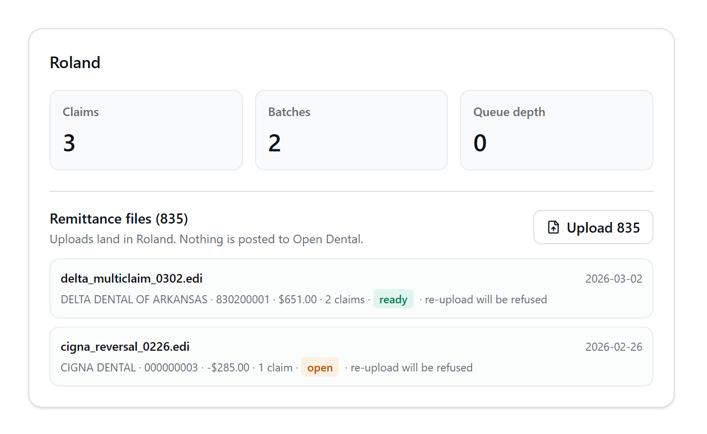
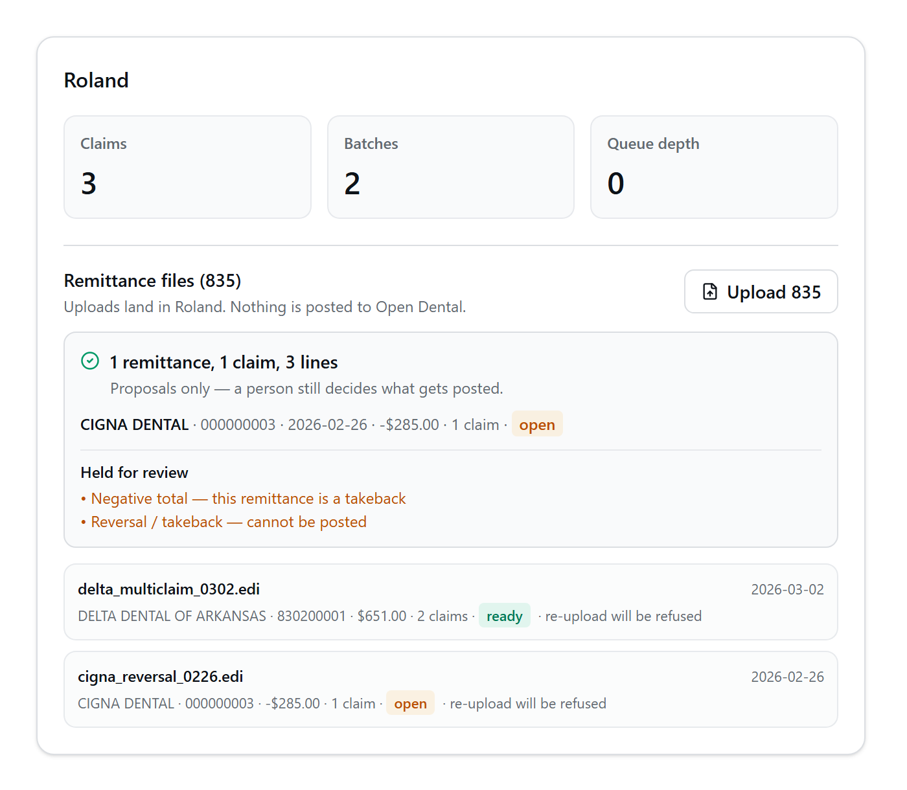
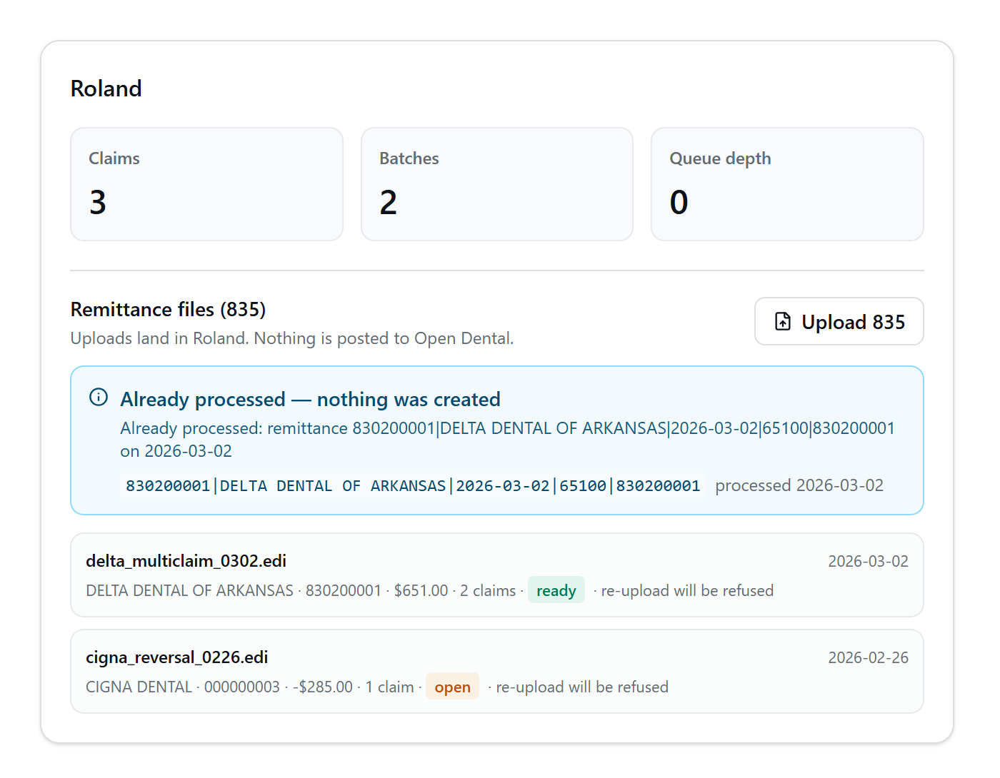

# RCM Slice 5 — Manual 835 (ERA) upload

Upload a carrier's X12 835 remittance file, parse it, and record what it says as
**proposals** a human can act on. Two things port here from the standalone `rcm-posting`
app with their test suites: the **`eraParser`** and the **remittance-key reserve →
finalize / release protocol**, which is this module's dedupe primitive and is now
office-scoped.

**Nothing in this slice touches Open Dental.** Matching a remittance line to a real OD
claim needs the odReads seam and one audit row per PHI read; that is Slice 6. **Stedi
stays dormant** — no polling, no API, and `rcm_stedi_poll_state` stays empty.

| | |
| --- | --- |
| Routes | `POST /api/rcm/era`, `GET /api/rcm/era` |
| Entitlement | `requireModule('rcm')` — ships dark; no tenant is entitled yet |
| Permission | `rcm.write` on POST, `rcm.read` on GET (the mount's `requireReadWrite`) |
| Office | Slice 3's router-wide `requireOffice` — the validated `?office=` query param |
| Code | [`backend/services/rcm/`](../backend/services/rcm/), [`backend/routes/rcm/era.js`](../backend/routes/rcm/era.js) |
| Tests | `eraParser.test.js` (44), `remittanceKey.test.js` (23), `era.test.js` (34) |
| Source of the port | `rcm-posting @ fix/prod-acr-registry-identity` (`9bf5ac8`) |

---

## 1. The flow

```
 .edi bytes ─► parse835 ────────────────────► refuse 422 if not an 835
                  │                            (nothing stored, nothing reserved)
                  ├─► no payment date? ──────► refuse 422 ERA_MISSING_PAYMENT_DATE
                  ├─► no trace/check? ───────► refuse 422 ERA_NO_REMITTANCE_IDENTITY
                  │
                  ▼
        pre-check the remittance keys ───────► refuse 409 ALREADY_PROCESSED
                  │
                  ▼
        Blob: tenant/<slug>/rcm/era/<uuid>.edi     ← the audit artifact
                  │
                  ▼
   BEGIN ─► reserve key(s) ──► refuse 409 (ROLLBACK)
              │
              ├─► rcm_payment_batches        one per check      'open' | 'ready'
              ├─► rcm_claims                 one per CLP        'pending_review'
              ├─► rcm_procedure_lines        one per SVC
              ├─► rcm_procedure_adjustments  CARC + RARC
              ├─► rcm_batch_claim_payments   one per claim      'pending'
              ├─► finalize key(s) ──────────► 'posted', linked to the batch
              └─► rcm_eob_uploads            the upload record  'extracted'
   COMMIT ─► audit CREATE ─► 201
```

Parse happens **first**, before any storage or reservation: a blob write for an
unparseable upload is litter, and a reservation for one is a key we could not have
derived. The blob write happens **before** the transaction, so a committed proposal can
never reference a blob that does not exist; the reverse — a blob whose transaction rolled
back — is a few orphaned kilobytes, and the retry writes a fresh one.

### Why the body is raw bytes

The repository has no multipart middleware and no `multer` dependency, and adding one for
a single route is a larger change than the route. A browser can POST a `File` object
straight as the request body, so the client sends the bytes and puts the name in
`X-RCM-Filename` (percent-encoded — a header value must be Latin-1, and `fetch` refuses an
accented filename outright). If a second upload route ever needs true multipart, that is
the moment to take the dependency.

```bash
curl -X POST 'https://<host>/api/rcm/era?office=roland' \
  -H 'Content-Type: application/edi-x12' \
  -H 'X-RCM-Filename: delta_multiclaim_0302.edi' \
  --data-binary @Test_Delta_Dental_MultiClaim.edi
```

---

## 2. Dedupe — the headline

A **remittance key** identifies one carrier payment from its own contents:

```
<trace>|<payer>|<payment date>|<amount in cents>|<check number>     uppercased
830200001|DELTA DENTAL OF ARKANSAS|2026-03-02|65100|830200001
```

`UNIQUE (office_id, remittance_key)` in `rcm_remittance_keys` is the backstop;
[`remittanceKey.js`](../backend/services/rcm/remittanceKey.js) is the behaviour around it.

**Uploading the same 835 twice creates zero proposals and says so:**

```json
409 {
  "success": false,
  "code": "REMITTANCE_ALREADY_PROCESSED",
  "error": "Already processed: remittance 830200001|DELTA DENTAL OF ARKANSAS|2026-03-02|65100|830200001 on 2026-03-02",
  "remittances": [
    { "index": 0, "remittanceKey": "830200001|…", "status": "posted",
      "batchId": "…", "processedAt": "2026-03-02T15:04:00.000Z" }
  ]
}
```

### Office is in the uniqueness

The source declared a bare global `UNIQUE(remittanceKey)`, which it could afford because
it had no office dimension at all. Here two practices legitimately receive distinct checks
whose components collide — same payer, same day, same amount — and a global key would let
one office's remittance **silently block the other's**. The failure would look exactly like
successful dedupe, which is the worst way for it to look. **The same file uploaded to the
other office is accepted**, and `era.test.js` pins both directions.

### There is no override

`forceDuplicate` from the source is **not ported and has no successor** — no query param,
no header, no body field. `era.test.js` asserts that `?force=`, `?forceDuplicate=`,
`?override=`, `?allowDuplicate=` and `?skipDedupe=` all still 409. If a legitimate
re-process case appears it stops the work and goes to the PM as a named, designed
operation.

### All-or-nothing per file

A file carrying several ST/BPR transactions is several checks, each with its own key. If
**any** of them is already processed, the whole file is refused and the response names
which. Accepting the new ones and skipping the seen ones would leave an operator unable to
say what landed from the file they just uploaded, and re-uploading a superset of an
already-processed file is far more often a mistake than an intent.

### The three states

| Status | Means | Blocks a re-upload? |
| --- | --- | --- |
| `pending` | Reserved; the guarded work is in flight, or died mid-flight | **Yes** |
| `posted` | Finalized; the proposals exist and `batch_id` names them | **Yes** |
| `failed` | Released; nothing landed | No — a retry takes it over |

`pending` blocks as firmly as `posted`. Until a human has confirmed what did or did not
land, the safe reading of "we may already have done this" is that we did.

**In Slice 5 the guarded work is a single Postgres transaction**, so reserve, every row,
and finalize commit or roll back together. A failure leaves **no key row at all** — a
cleaner retry than a `failed` release, and the property `era.test.js` pins under
*"A FAILED INGEST DOES NOT POISON THE KEY"*. Concurrency is handled by the unique index
rather than by application code: two simultaneous uploads of one file race on
`(office_id, remittance_key)`, and the loser sees the conflict.

`releaseRemittanceKey` is therefore **not on this slice's happy path**. It is implemented,
tested and exported because Slice 6 writes to Open Dental between reserve and finalize —
where a rollback cannot undo what already reached the chart — and because it is the
operator's recovery for a crashed reservation today.

---

## 3. What gets created, and what gets flagged

Everything written is a **proposal**: a record of what the carrier's file said, not a
payment. `od_patient_id`, `od_claim_num` and `od_claim_proc_num` are all NULL, and
`total_received_cents` stays 0 with `payment_status` `unpaid` — those columns are about
*our* chart, and Slice 6 is what moves them.

### Batch status is the honest signal

| Status | When |
| --- | --- |
| `ready` | Nothing on the batch needs a human first |
| `open` | **Anything** was flagged — a reversal, a PLB, a downcode, an unreadable adjustment, a total that does not reconcile |

`ready` means "a person could act on this now", and a status that said that about a
takeback would be a lie.

### Detect-and-flag, never dropped and never posted

| Structure | What happens |
| --- | --- |
| **Reversal / takeback** (CLP02 = 22) | Claim and all negative lines **created**; `needs_review_reasons = ['reversal_not_postable']`; batch held `open`. A negative supplemental is the single irreversible Open Dental operation, so it never reaches a posting path by accident. |
| **Denied claim** (CLP02 = 4) | Created, every line marked `is_denied`, with its CARC and RARC codes — which *are* the product, since OD's `ClaimAdjReasonCodes` is read-only over its API |
| **PLB** (provider-level balance) | Stored on the batch as `plb_adjustments` + `plb_total_cents`; belongs to no single claim, so the batch is held `open` |
| **Secondary / COB** | `AMT*D` prior payment recorded; `secondary_payer_adjudication`. If CLP02 calls the claim primary while reporting a prior payer's money, `prior_payer_payment_on_primary_claim` surfaces the contradiction rather than reconciling it |
| **Downcode** (SVC06 present) | `is_downcoded`, both codes stored, `procedure_downcoded` on the claim |
| **Unreadable CAS pair** | **No** adjustment row is invented; `unexplained_adj` on the line and `unparseable_cas` on the claim |
| **Unknown CARC group** | The adjustment is skipped (the CHECK constraint would abort the file) and `unstorable_adjustment_group` is recorded |
| **Zero-payment file** (BPR04 = NON) | Parsed and stored normally; `no_payment_made` on the remittance |

### Claim-level review reasons

`reversal_not_postable` · `claim_denied` · `secondary_payer_adjudication` ·
`prior_payer_payment_on_primary_claim` · `unparseable_cas` ·
`unstorable_adjustment_group` · `procedure_downcoded` · `no_service_lines` ·
`line_total_mismatch`

### Remittance-level flags

`plb_adjustments_present` · `negative_total_payment` · `no_payment_made` ·
`no_claims_in_remittance` · `claim_total_mismatch`

---

## 4. Refusals

| Code | HTTP | When |
| --- | --- | --- |
| `INVALID_OFFICE` | 400 | `?office=` missing or not `roland`/`valley` |
| `ERA_EMPTY_UPLOAD` | 400 | No bytes |
| `ERA_BODY_NOT_RAW` | 415 | `Content-Type: application/json` — the global `express.json()` already consumed it, so `raw()` would hand back an empty buffer and the failure would read as an empty file |
| `ERA_PARSE_FAILED` | 422 | Not a parseable 835 |
| `ERA_NO_REMITTANCES` | 422 | Parsed, but carries no BPR payment transaction |
| `ERA_MISSING_PAYMENT_DATE` | 422 | Neither `DTM*405` nor `BPR16` |
| `ERA_NO_REMITTANCE_IDENTITY` | 422 | Neither a trace number nor a check number |
| `REMITTANCE_ALREADY_PROCESSED` | 409 | The dedupe refusal |
| `ERA_STORAGE_UNAVAILABLE` | 503 | Blob storage not configured — the raw file **is** the audit artifact, so rows are never written without it |
| `MODULE_NOT_ENTITLED` | 403 | In `error`, not `code` — the platform's existing denial shape |
| `FORBIDDEN` | 403 | Role lacks `rcm.write` (POST) or `rcm.read` (GET) |

---

## 5. Config

| Var | Default | Effect |
| --- | --- | --- |
| `RCM_BLOB_ACCOUNT_URL` | — | `https://<acct>.blob.core.windows.net`. **Unset ⇒ every upload 503s.** No environment has this yet. |
| `RCM_BLOB_CONTAINER` | `rcm-era` | Container name |
| `AZURE_USE_MANAGED_IDENTITY`, `AZURE_MANAGED_IDENTITY_CLIENT_ID` | — | Same convention as `tcMediaStore` / `config/secrets.js` |

AAD only. The storage accounts have shared-key auth disabled, so there is deliberately no
connection-string path and no SAS. Containers are private; Slice 5 writes the key and
serves nothing, and the download proxy is Slice 7's.

### PHI

- **Blob keys are opaque**: `tenant/<slug>/rcm/era/<uuid>.edi`. Uploaded 835 filenames
  routinely carry a payer *and* a patient (`Delta_Smith_John_0302.edi`), which is why
  `rcm_eob_uploads.filename` is documented PHI — and why the blob path must not become a
  second, unguarded copy of it. A test asserts the key carries no fragment of the filename.
- **`file_url` is `''`.** The column is NOT NULL and the platform rule is that rows carry
  blob keys, never URLs. An empty string says that truthfully; a fabricated URL would not.
- **Filenames never reach a log line.** The route logs counts and the actor, nothing else.
- Both routes write an audit row fail-closed — `CREATE` on upload, `READ` on the list
  (filenames are PHI). An audit failure 500s rather than serving PHI untracked.
- `rcm_payment_batches.created_by` is **NULL**: it is a FK to `rcm_user_map` and the staff
  crosswalk is deferred to Slice 6. Attribution lives in `audit_log` until then.

---

## 6. Porting notes — deviations from the source

Every one of these is deliberate and commented at its site in
[`eraParser.js`](../backend/services/rcm/eraParser.js). **D4 and D5 are open questions for
the PM, not settled calls**, and both are flagged at runtime rather than decided silently.

| | Deviation | Why |
| --- | --- | --- |
| D1 | `x12-parser` dependency → internal [`x12.js`](../backend/services/rcm/x12.js); `parse835` is synchronous | The backend is CommonJS with no build step; a streaming ESM dependency is a compat risk for ~60 lines of splitting, and the stream forced a Promise around a pure function |
| D2 | **The payment date never falls back to today** — `null`, and the route refuses | The source's `new Date()` invented a check date that disagreed with the bank *and* fed the remittance key, making the dedupe primitive time-dependent |
| D3 | **One remittance per ST/BPR transaction** (`remittances[]`) | The source merged every transaction into one check — summing all amounts while keeping only the first trace number, which describes no real payment |
| D4 | ⚠ **SVC06 read as the ORIGINAL SUBMITTED code (X12 spec)** | See below |
| D5 | ⚠ **An implausible CARC token is flagged, never invented** | See below |
| D6 | `subscriber_id` from NM1*IL/QC element 9; `group_number` from `REF*1L` | The source read `REF*1L` (Group or Policy Number) as the subscriber id and hardcoded the group to the string `"N/A"` |
| D7 | Provider NPI falls back to NM1*82 element 9 | Every file in the corpus is this case; the source returned `"0000000000"` |
| D8 | **CLP02 is surfaced** | The source parsed the claim status into a variable it never read, so a denial and a reversal were indistinguishable from a clean payment. Honest states are not implementable without it |
| D9 | RARC remark codes read from `LQ*HE` | The source never read `LQ`, so `rcm_procedure_adjustments.remark_code` had no source of data |
| D10 | CARC 97's description corrected to the bundling text | The source's table said "Benefit maximum reached", which is CARC 119 — and that string lands in front of billing staff |
| D11 | A missing DOB is `null`, not `'0001-01-01'` | That sentinel is Open Dental's null-date convention; it has no business in a Postgres `date` column |
| D12 | **Each claim's segment window is bounded by the next CLP** | The source searched to the end of the transaction, so a claim missing its own NM1/DMG/REF silently inherited the **next patient's** name, DOB or member id — a PHI mix-up, in the multi-claim shape that is the common one |

Also: `claims.source` is `'manual_upload'`, not the source app's `'clearinghouse'`. The
document is a clearinghouse artifact but the ingestion is a human act, and that is the
thing that will differ from the future Stedi path when Slice 8 reconciles them.

### ⚠ D4 — Downcodes: the corpus and X12 disagree

X12 005010X221A1 defines **SVC01 as the ADJUDICATED code and SVC06 as the ORIGINAL
SUBMITTED one**, present only when the payer changed it. The parser follows the
specification, because real payer files do and Slice 6 posts real money against whichever
code we recorded.

Both downcode fixtures are written the other way round, and
[`fixtures/rcm/README.md`](../backend/test/fixtures/rcm/README.md) describes them that way
("a paid code (`AD:D0120`) different from the billed code (`AD:D0150`)"):

```
Test_Cigna_Downcode.edi      SVC*AD:D0150*102*57***AD:D0120
Test_Bundled_Downgraded.edi  SVC*AD:D2740*1258*485***AD:D2791
```

Their reading is the clinically sensible direction — a comprehensive exam downcoded to a
periodic one, a porcelain crown downgraded to full cast — so the corpus is coherent with
itself and merely non-conformant to X12.

**Consequence:** against those two files the parser reports `billedCode=D0120 /
paidCode=D0150` and `billedCode=D2791 / paidCode=D2740` — inverted relative to the README,
deliberately and visibly. The test that pins this says so in its own name.

**`isDowncoded` is symmetric** (the codes differ), so detection, the line flag, and the
claim's review reason are unaffected either way. Only which column each code lands in is at
stake — and that matters when Slice 6 posts.

**Resolving it** means either a **new** spec-conformant fixture (the corpus is fixed; no
file may be edited) or a PM ruling that the corpus convention is the intended one.

### ⚠ D5 — `Test_Mixed_Adjustments.edi` has a malformed CAS

CAS repeats as reason/amount/**quantity** triples — CAS02-03-04, CAS05-06-07. The fixture
writes:

```
CAS*PR*1*50*2*25.50
```

Per the specification that is `(PR-1, $50.00, qty 2)` followed by a reason code of
`"25.50"` with no amount. The arithmetic shows what the author meant: the claim's PR
amounts only reach its CLP05 patient responsibility of **$257.50** if this is two pairs,
PR-1 $50.00 and PR-2 $25.50 — i.e. the empty quantity element (`CAS*PR*1*50**2*25.50`) was
omitted.

The parser reads the specification, validates that each reason token could be a CARC at
all, and on failure records **nothing** for that pair while raising `unexplained_adj` on
the line and `unparseable_cas` on the claim. Both alternatives were worse: writing
`reason_code = '25.50'` puts a fabricated code in front of billing staff, and dropping it
silently loses $25.50 of patient responsibility with no trace.

A test renders the same shape written to specification and shows it parses as intended,
which is the evidence for reading the fixture as mis-authored rather than the parser as
wrong. **A corrected fixture would need to be a new file.**

---

## 7. Staging validation

RCM ships dark, so this needs the `rcm` entitlement flipped for the tenant from the
Platform Console, and `RCM_BLOB_ACCOUNT_URL` set on the staging container app.

1. Sign in to staging as an `admin` or `office` user and open **/rcm**.
2. On the **Roland** card, press **Upload 835** and choose
   `backend/test/fixtures/rcm/Test_Delta_Dental_MultiClaim.edi`.
3. Expect **1 remittance, 2 claims, 4 lines**, the batch `ready`, and no review flags —
   
4. **Upload the same file again.** Expect the honest refusal — *"Already processed:
   remittance `830200001|DELTA DENTAL OF ARKANSAS|2026-03-02|65100|830200001` on
   2026-03-02"* — and **no new rows**.
5. Confirm the same file uploaded to the **Valley** card is **accepted**: the key is
   office-scoped.
6. Upload `Test_Reversal_Recoupment.edi` to Roland. Expect the claim and all three
   negative lines created, `Reversal / takeback — cannot be posted` under **Held for
   review**, and the batch `open`.
7. Confirm nothing was written to Open Dental — no `claimproc`, no `claimpayment`.

```sql
-- what the office now holds
SELECT b.payer, b.deposit_date, b.total_amount_cents, b.claim_count, b.status,
       k.remittance_key, k.status AS dedupe_status
  FROM rcm_payment_batches b
  LEFT JOIN rcm_remittance_keys k ON k.batch_id = b.batch_id
 WHERE b.office_id = 'roland'
 ORDER BY b.created_at DESC;
```

---

## 8. Screenshots

| | |
| --- | --- |
| The office's remittance list, with dedupe status |  |
| An accepted upload that was **flagged** (the reversal) |  |
| **The duplicate refusal** |  |

The duplicate is rendered as information, not as a failure: the operator did nothing
wrong, the system already holds this check, and the useful next move is to look at the
batch it became. There is no retry button, because there is no override to retry with.

---

## 9. Out of scope

OD matching and posting (Slice 6) · the review UI beyond this upload list (Slice 7) ·
Stedi polling and the 835 feed · reconciliation (Slice 8) · entitlement changes · prod.
