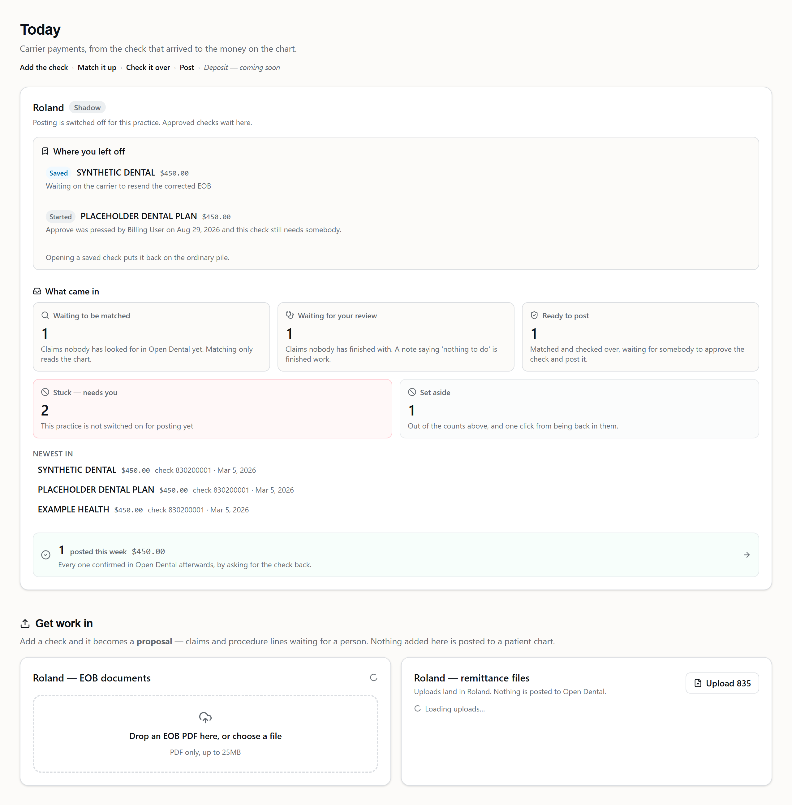
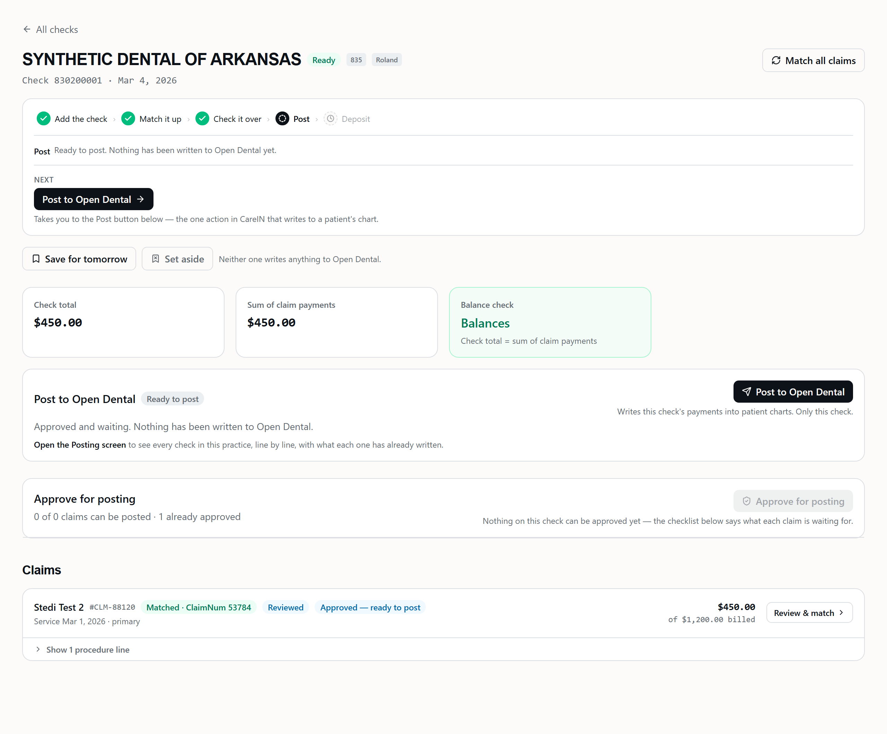
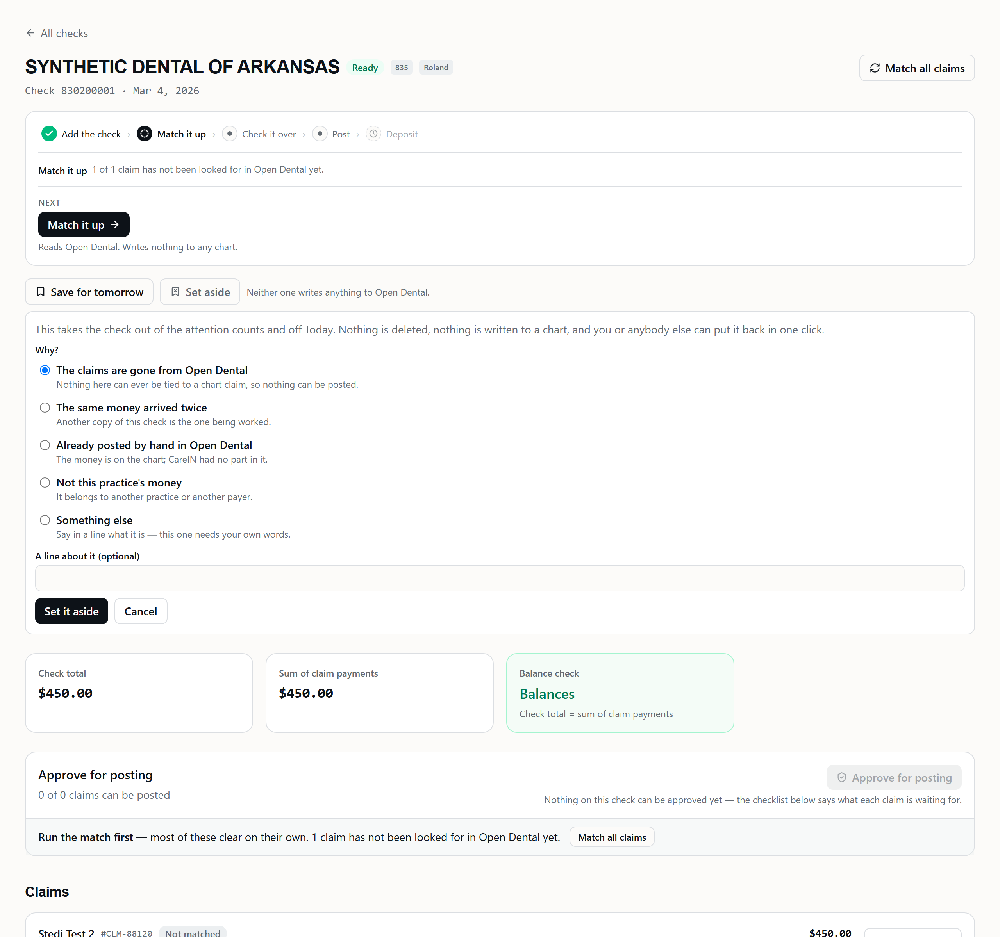
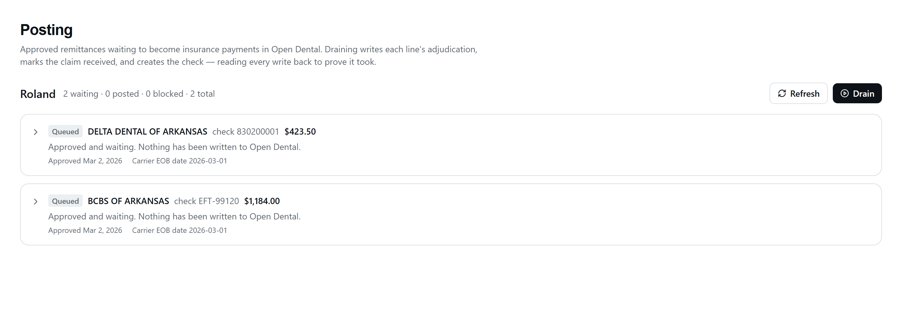
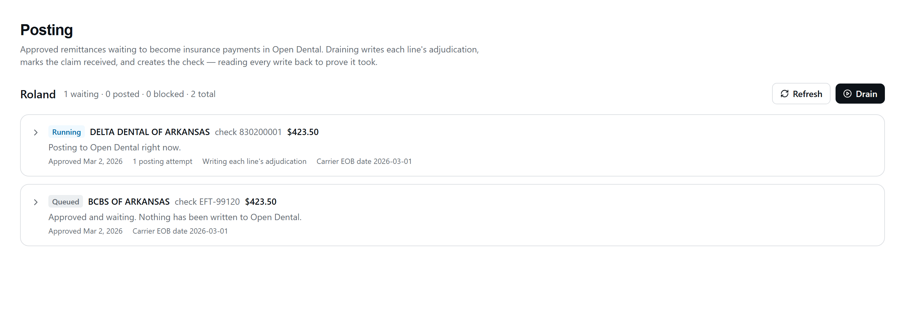
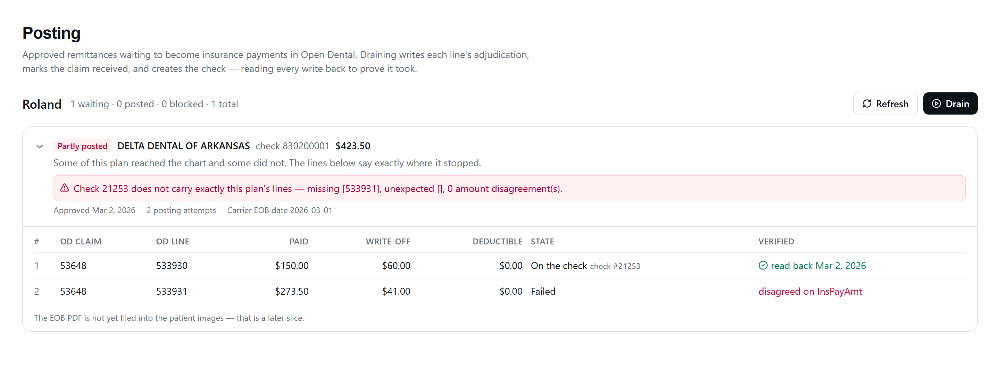
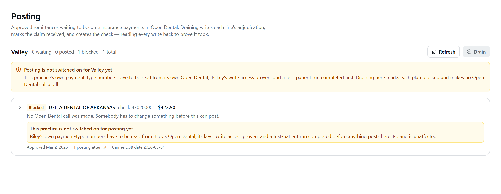
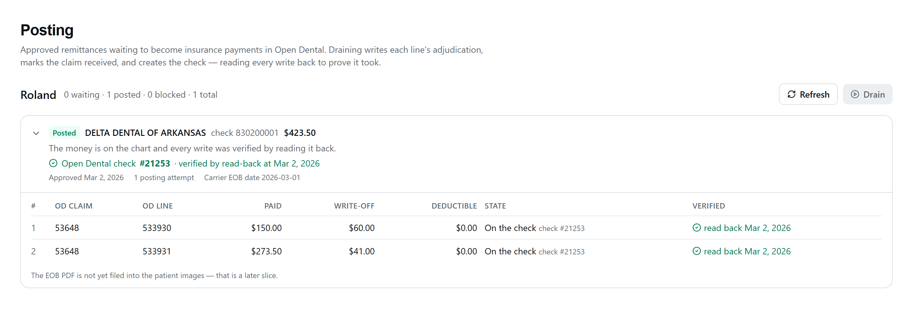
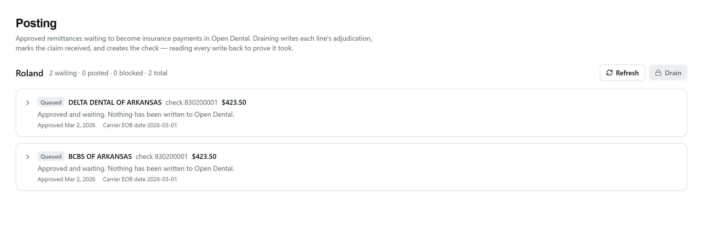

# RCM Slices 6c + 6d — the drain, the takeback and the EOB

**The first Open Dental write in this module.** Approved remittances become real
insurance payments on real patients' ledgers, in the correct office's database,
through the forced call sequence `docs/RCM_OD_WRITES.md` proved live on
2026-08-13.

| | |
| --- | --- |
| Routes (UI) | `/rcm/posting` |
| Routes (API) | `GET /api/rcm/posting/queue`, `GET /api/rcm/posting/queue/:id`, `POST /api/rcm/posting/drain`, `GET /api/rcm/remittances/:id/recoupment`, `POST /api/rcm/remittances/:id/approve-recoupment`, `POST /api/rcm/posting/queue/:id/attach-document`, **`GET/PUT /api/rcm/office-settings/:office`**, **`POST /api/rcm/remittances/:id/comparison`**, **`GET /api/rcm/comparison/tally`**, **`GET /api/rcm/comparison/summary`** |
| Entitlement | `requireModule('rcm')` — ships dark; no tenant is entitled yet |
| Permission | `rcm.read` for the queue, **`rcm.post` for the drain, the withdrawal and the document retry**, **`rcm.settings` (admin only) for the shadow-gate switch and the comparison summary**, **`rcm.queue` for recording a comparison** (D-9 + §2.5 + §2.6) |
| Office | Slice 3's router-wide `requireOffice` — the validated `?office=` query param |
| Offices enabled | **roland only.** valley is fail-closed (D-7, §9) |
| Shadow gate | **Both offices ship switched OFF** (`rcm_office_settings.drain_enabled`). Roland clears the code ceiling and still cannot write to a chart until an admin flips it — §2.5 |
| Migration | `1787120000000_rcm_posting_drain.js` (6c) + `1787260000000_rcm_recoupment_and_documents.js` (6d) + **`1787400000000_rcm_office_settings.js`** (the shadow gate) + **`1787900000000_rcm_shadow_comparison.js`** (the comparison, C-2) + **`1788000000000_audit_log_prior_state.js`** (what a revision replaced) — all additive only |
| Code | [`services/rcm/postingDrain.js`](../backend/services/rcm/postingDrain.js), [`services/rcm/odPostingWrites.js`](../backend/services/rcm/odPostingWrites.js), [`services/rcm/odOfficeConfig.js`](../backend/services/rcm/odOfficeConfig.js), [`services/rcm/postingGate.js`](../backend/services/rcm/postingGate.js), [`routes/rcm/posting.js`](../backend/routes/rcm/posting.js), [`routes/rcm/officeSettings.js`](../backend/routes/rcm/officeSettings.js), [`pages/rcm/PostingQueue.tsx`](../new-dashboard/client/src/pages/rcm/PostingQueue.tsx), [`pages/admin/RcmPostingSettingsCard.tsx`](../new-dashboard/client/src/pages/admin/RcmPostingSettingsCard.tsx), [`routes/rcm/comparison.js`](../backend/routes/rcm/comparison.js), [`components/rcm/CheckComparison.tsx`](../new-dashboard/client/src/components/rcm/CheckComparison.tsx), [`pages/admin/RcmShadowComparisonCard.tsx`](../new-dashboard/client/src/pages/admin/RcmShadowComparisonCard.tsx) |
| Tests | `postingDrain.test.js` (78), `approvalGate.test.js` (58), `odOfficeConfig.test.js` (20), `posting.test.js` (25), `rcmNoOdWrites.test.js` (16), `rcmS10Scripts.test.js` (45), **`shadowGate.test.js` (12)**, **`officeSettings.test.js` (16)**, **`postingGate.test.js` (7)**, `rcmGuard.test.js` (22), `rcm-labels.test.ts` (35), **`rcm-shadow-gate.test.tsx` (15)**, **`shadowComparison.test.js` (28)**, `audit.test.js`, **`rcm-shadow-comparison.test.tsx` (22)**, `rcm-plain-language.test.ts` (7) |

---

## 1. What changed, in one sentence

`rcm_posting_queue` stopped being a record of intent and became a record of what
happened.

Everything before this slice was provably incapable of writing to a chart:
`rcmNoOdWrites.test.js` drove the entire module — including the approve path, to
success — against an Open Dental client whose every write verb threw, and
asserted that not one was called. **That test still exists and still passes.** It
now carries an allow-list of exactly one file.

---

## 1a. The canon — the numbered decisions, written where you can read them

**Why this section exists.** These are cited by number in briefs and reviews, and
until now several of them lived only in the PM's own notes — a store no session
working in this repo can open (see `CLAUDE.md`, *What you can actually read*). A
decision nobody can look up is a decision the next slice breaks by accident. Cite
by number here, and state the number's text beside it.

| | Decision | Where it lives |
| --- | --- | --- |
| **D-7** | valley is **fail-closed** for posting until three prerequisites are met, and being entitled is not one of them. | §9 |
| **D-9** | The posting acts split out of `rcm.write` into **`rcm.post`**, and the shadow switch into **`rcm.settings`** (admin only). Reviewing is `rcm.queue`. | §12 |
| **D-11** | The gate's checks are a **`REASON_GATE`**: a check absent from the map is **blocking**, never advisory. A new check refuses by default until somebody decides otherwise. | `RCM_APPROVAL_GATE.md` |
| **D-13** | **DefNums are resolved LIVE, per office, BY NAME — never a numeric constant, ever.** | below |
| **D-14** | A plan is **immutable once approved**, and so are the decisions snapshotted onto it. | §14.0b, §15.1b |
| **D-15** | **`blocked` must be drainable.** | below |
| **D-16** | There is **exactly one upload surface** in the module, and it is a page of its own — `/rcm/bring-in`. Every other screen navigates to it. | §14.0d |
| **D-17** | The takeback screen explains the reversal in full **before** the mechanism — including that somebody must ring the patient, and that this app will not. **The typed confirmation is unchanged** (D-6). | §14.0d |

### D-13 — by name, per office, every time

Definition numbers are per-database. The same word is a different number in each
practice's Open Dental: the CareIN CommLog type is **486** at Roland and **451**
at Riley; the document category the EOB files into is **473** and **429**. A
number copied from one practice into the other does not fail — **it writes the
wrong type into a real chart, quietly.**

So nothing in this module may hold a DefNum as a constant. Every one is resolved
at the moment of use, from that office's own definitions, by its **name**:

- the name is what a setting stores (`writeoff_adjtype_name` — §14.0b);
- an empty name is refused by the route *and* by a CHECK constraint;
- a name that does not resolve **in that office's own database** refuses the
  claim, at post time, with the name in the message. Never a default, never a
  fallback to the other office's number, never a guess.

The reverse also holds: a probe or a runbook that records "DefNum 473" has
recorded a fact about **one** office and must say which.

### D-15 — `blocked` must be drainable, and a Drain press is a human act

**A blocked row with no exit is a roach motel.** If a status can be entered but
not left, the screen ends up instructing a biller to do something the software
cannot then accept — which is exactly the bug §2.2.1 describes, where `blocked`
was excluded from `DRAINABLE_STATUSES` and every row that reached it was stuck
forever.

The two halves are one decision, and dropping either breaks it:

1. **Every refusal state has a way out** — fix the named cause, press Drain
   again. `approved`, `failed`, `partially_posted` and `blocked` are all
   drainable; `posted` is the only terminal state.
2. **Nothing retries on its own.** Pressing Drain is a person deciding to try
   again. That is what makes (1) safe: a re-press with the cause unfixed blocks
   again with the same reason and a higher `attempt_count`, and for a policy
   block it costs zero Open Dental calls.

**A new blocked reason must therefore ship with the press that clears it.** B1's
`office_writeoff_not_postable` is the pattern: it refuses a decided write-off
this build cannot honestly write, and the moment B2 teaches the write to carry
the decided figure the same Drain press clears it — no migration, no rescue
script, no support call.

---

## 2. The state machine

### 2.1 The words

The 6c brief names the plan states `queued → running → …`. The database, since
Slice 1, calls the first two `approved` and `posting`.

**The stored words are not renamed.** They mean the same thing — Slice 1's own
header defines `approved` as *"approved and NOT yet posted"* — and a rename would
be a data migration on a shipped table plus an edit to the 6b gate that writes
`'approved'` by name, bought for a synonym. The API ships **both**: the raw
`status` and the screen's `statusLabel`. `postingDrain.QUEUE_STATUS_LABEL` is the
single map between them, and `postingDrain.test.js` pins that it covers every
value the CHECK constraint can hold, in both directions.

### 2.2 Plan states

```
approved ──┐                          (the brief's "queued")
failed ────┼─► posting ──► posted             (the brief's "running")
partially_posted ─┘   ├─► partially_posted
                      ├─► failed
                      └─► blocked
```

| Stored | Screen | Means |
| --- | --- | --- |
| `approved` | Queued | A human approved it. **Nothing has been written to Open Dental.** |
| `posting` | Running | A drain owns this plan right now. |
| `posted` | Posted | The money is on the chart, the check exists, and the reconciliation read confirmed the check carries exactly this plan's lines. |
| `partially_posted` | Partly posted | Some of the sequence reached the chart and some did not. The lines say exactly where. |
| `failed` | Failed | Nothing was written. |
| `blocked` | Blocked | **No Open Dental call was made** and none will be until a human changes something. |
| `withdrawn` | Retired | **TERMINAL.** This plan will never post. Not in `DRAINABLE_STATUSES`, so it cannot be pressed at all. |

**`blocked` is not `failed`, and the distinction is load-bearing.** `failed`
means something was attempted and did not work; `blocked` means nothing was
attempted. Collapsing them would leave the queue unable to say which of two very
different things happened — and the two need different actions from different
people.

### 2.2.0 `withdrawn` — the one state with no way out

A plan can be approved for money that is never going to post through CareIN. Its
Open Dental claim was deleted; the remittance was re-keyed by hand; the biller
posted it in the desktop and only then found the queue. Until 6e the only honest
thing the queue could do was keep offering to drain it.

**Why this is a status and not another `blocked_reason`.** `blocked_reason`
carries no CHECK, so a new reason would have needed no migration at all. It would
also have been wrong. §2.2.1 defines `blocked` by a promise — *it has a way
out* — and every reason in that vocabulary is something a human can act on.
A deleted ClaimNum is not, because Open Dental never reissues one. Filing it
under `blocked` would let a biller press Drain forever, one paced Open Dental
read per press, and would make §2.2.1's promise false for a member of its own
vocabulary.

| Reason | Who decided | Note |
| --- | --- | --- |
| `target_removed` | the drain | none — there is no human in that path, and making the machine invent prose is the habit `blocked_reason` exists to avoid |
| `manual` | a person with `rcm.write` | **required**, and the only account of the decision |

**It is not a delete.** The plan, its lines, its approval and its audit trail all
stay. `rcm_posting_queue` is unique on `(office_id, remittance_key)` — a
remittance gets exactly ONE plan, ever (§15.1) — so deleting the row would
silently make a second plan enqueueable for the same money.

**It is unreachable from `posted`, `partially_posted` and `posting`.** Money that
moved happened, and a withdrawal that could cover a posted plan would be a way to
make the queue disagree with the chart. `posting` is excluded for the same reason
the drain never picks it up: a run owns that row. Three guards say so —
`WITHDRAWABLE_STATUSES` in the `UPDATE`'s own `WHERE`, the route's 409, and
`rcm_posting_queue_withdrawn_no_money_check`, which refuses the *evidence* rather
than the state and is the half a future code path cannot talk its way past.

**The 404 pre-check costs nothing extra.** The drain's first Open Dental call is
already `GET /claims/{n}` — rule 3, the chart's truth before any decision — so
asking "does this claim still exist" is not a new call, it is a different reading
of the answer. A 404 is not a failure to find out; it IS finding out. **Every
other non-ok status still yields `failed`**, because a timeout or a 500 means
nobody knows yet, and retiring a good plan over a bad minute has no undo.

**What it does NOT do.** It does not touch Open Dental — nothing is written,
nothing is reversed, and a chart that already carries money keeps it. It does not
un-spend any Open Dental id either.

**AND IT DOES NOT FREE THE REMITTANCE.** The unique index is on
`(office_id, remittance_key)` and a withdrawn plan is still a plan, so
**a remittance whose plan has been retired can never be posted through CareIN
again.** A biller who retires a mis-approval intending to redo it correctly finds
that out when the second approve is refused — by which time the first is gone.
The dialog says so in those words before the confirm, and the retired row repeats
it for whoever finds it later. §15.1's **6d.2** lifts the restriction and has
been rescheduled to land BEFORE the first real drain at Roland.

#### Retiring a plan from inside a container

The button is the normal path. `scripts/rcm-withdraw-plan.js` is for the case it
cannot reach — an operator on `az containerapp exec` rather than a browser. The
first plan it was written for is the 2026-08-26 walk's orphan: queue
`9ad950ad-…`, whose claim 53805 the §11 unwind deleted.

```bash
# Dry run FIRST — it prints the plan it would retire, and stops.
RCM_TENANT=carein node scripts/rcm-withdraw-plan.js \
  --office roland --queue 9ad950ad \
  --note "claim 53805 was deleted by the s11 unwind on 2026-08-26"

# Then, once the printed plan is the right one, the same command plus --execute.
```

The id is a **PREFIX** — queue ids reach an operator truncated, through a
screenshot or a log line, and retyping 36 characters into a shell that splits on
whitespace is how the wrong plan gets retired. Two matches is a refusal, never a
coin flip. It goes through the same `withdrawRow` the button uses, so every guard
applies, and it reads the row back before reporting success.

### 2.2.1 The recovery contract — `blocked` has a way out

**`blocked` → fix the named cause → press Drain again.** That is the whole
contract, and it is what every blocked row's own message asks for
(*"Resolve the extra line in the chart, then drain again."*).

An earlier version of this slice made that instruction impossible: `blocked` was
excluded from `DRAINABLE_STATUSES` on the argument that "retrying a refusal
automatically is how it becomes a loop". But **there is no automatic anything in
this module** — pressing Drain is a human decision — and with `blocked` excluded
nothing anywhere could ever run one again. Not the drain's own scan, not the
startup sweep (which only re-homes `posting`), and not the 6b gate (which refuses
any plan past `approved`). A transient `office_config_unresolved`, an
`eligible_total_mismatch` the biller then fixed, and every valley row on the day
valley is enabled were all permanently stuck, with the screen telling them to do
something that could not be done.

So `approved`, `failed`, `partially_posted` and `blocked` are all drainable.
**`posted` is the only terminal state.**

Re-pressing a plan whose cause persists is cheap and honest: it blocks again with
the same reason and an incremented `attempt_count`. For a POLICY block — valley,
a recoupment, the environment guard, an office disagreement, arithmetic that does
not add up — `checkPreconditions` runs before the office's configuration is
resolved, so a re-press costs **zero Open Dental calls** however many times it is
made.

**`posted` requires BOTH proofs, enforced by the database**, not only by the code
that sets it:

```sql
CHECK (status <> 'posted'
       OR (od_claim_payment_num IS NOT NULL AND reconciled_at IS NOT NULL))
```

A check number says money landed somewhere; `reconciled_at` says the check
contains exactly the lines this plan intended. The whole value of the state is
that a screen may trust it without re-deriving it, so the constraint is where the
promise lives.

### 2.3 Line states

```
pending ──► claimproc_written ──► claim_received ──► paid
   │
   ├──► skipped_already_posted   (resume: OD already shows our exact amounts)
   └──► failed
```

`skipped_already_posted` is new, and it is deliberately **not** Slice 1's
`skipped`. *"We chose not to"* and *"it was already done"* are different facts
about money, and only the second one proves a resume did not double-post.
Slice 1's `skipped` stays in the vocabulary and stays unused by this slice.

**`recouped` is 6d's, and it is a separate word from `paid` on purpose.** A line
that ends `paid` is money the carrier sent; a line that ends `recouped` is money
the carrier took back. Collapsing them would make the queue unable to answer
*"what did this practice actually receive"*, which is the question the whole
module exists to answer.

```
pending ──► recouped        (a takeback: POST /adjustments, or the supplemental)
```

A takeback line never passes through `claimproc_written` / `claim_received` /
`paid`. It targets a claimproc that is **already** Received and **already** on a
check — that is what makes it a takeback — so it is held out of the ordinary
decision loop entirely (§3.7).

### The EOB filing is NOT a line state and NOT a plan state

It is its own axis, on its own columns, and that is the whole of §8's *"a
document failure is retryable and never a financial error"* expressed in the
schema. A plan whose money is correct and proven **stays `posted`** whether or
not a PDF reached the chart.

> ⚠️ **`null` and `none` are different, and the difference is outstanding work.**
> The first draft used `null` for both *"not attempted"* and *"nothing to file"*.
> Those collide on the one case that matters: a process that dies between
> `posted` and the attach leaves `null`, the screen renders *"nothing to file"*
> with no retry offered, and **the EOB is silently never filed**. A state that
> hides outstanding work is exactly what the honest-states rule forbids.

| `document_attach_status` | Means | Retry offered? |
| --- | --- | --- |
| `null` | **Not attempted, and only that.** On a plan that has not posted yet it is simply too early. **On a `posted` plan it is OUTSTANDING WORK** — the attach never ran. | **Yes**, same as `failed` |
| `none` | **Examined, and there is genuinely nothing to file** — an 835 that arrived with no document. Written explicitly, with `document_attach_at` stamped, so *"we looked"* is a recorded fact rather than an absence somebody has to interpret. | No — nothing behind the button |
| `attached` | Filed into every patient chart on the plan, each with the `DocNum` read back from that patient's own document list. | No |
| `partial` | Some patients filed and some did not. Named rather than rounded up — `attached` would claim a document exists in a chart where it does not. | Yes |
| `failed` | Nothing filed. The payment is unaffected and the plan is still `posted`. | Yes |

**The startup sweep COUNTS the `posted + null` plans and says so in the log; it
does not file them.** Uploading to a patient's chart on boot would be an
automatic chart write, and §8's whole doctrine is that a human presses the
button — the sweep re-homes work so a person can act on it and has never itself
written to Open Dental. The posting page offers the retry; the sweep makes sure
somebody knows to look.

Per-patient rows live in `rcm_posting_document`, one per `(plan, patient)`,
enforced by a unique index rather than by the code that files them.

### 2.4 Blocked reasons

Machine slugs, never sentences. The UI renders copy from the slug
(`features/rcm/posting.ts`), and `rcm-labels.test.ts` fails the build if the
backend gains one the client has no copy for.

| Reason | Means |
| --- | --- |
| `valley_not_enabled` | D-7 (§9). Never a silent skip, never a roland fallback. |
| `recoupment_unconfirmed` | **6d re-scoped this.** In 6c it meant *"this module does not do takebacks at all"*. It now means the narrower and sharper thing: a takeback reached the drain **without** going through D-6's typed confirmation — either the plan is not flagged `is_recoupment`, or a takeback line does not name the path it was authorised for. Either way, nothing is sent. |
| `no_adj_type` | This practice's own Category-1 list carries nothing named `Insurance deductions from previous payments`, so the **reversible** takeback cannot be written here. A refusal, and **never** a silent promotion to the irreversible supplemental — nobody authorised that. |
| `no_doc_category` | This practice's Category-18 list has no `Insurance` or `Financial` category, so there is nowhere to file the EOB. |
| `office_config_unresolved` | This practice's own PayType could not be read from its own Open Dental. |
| `no_pay_type` | The practice's Category-32 list carries nothing named for a check or an EFT. |
| `eligible_total_mismatch` | The claims carry insurance money this plan did not put there. Caught **before the first write**, so nothing was attempted. |
| `office_mismatch` | The plan, its lines and its claims disagree about the practice. |
| `plan_empty` | Nothing postable, or a line naming no claim. |
| `claim_not_confirmed` / `claim_not_on_this_plan` | A claim drifted off its confirmation or its plan. |
| `negative_intent` | A negative write-off or deductible — a parse defect, not a recoupment. |
| `plan_total_mismatch` | The lines do not sum to the plan's recorded total. |
| `snapshot_superseded` | A claim's match snapshot is an older format. |
| `od_writes_disabled` | `OPENDENTAL_WRITE_DISABLED=true` in this environment. |

A `blocked` row carries its reason by CHECK constraint — `blocked` implies a
reason and a reason implies `blocked` — so a refusal nobody can act on, and a
stale refusal rendered over a run that has since moved on, are both unstorable.

---

### 2.5 The shadow gate

**Roland goes to production switched OFF.** A real biller works real EOBs end to
end — upload, match, confirm, review, approve — and a chart write stays
impossible until a human flips a switch. *"Everyone remembers not to press
Drain"* is not a gate; this is.

Go-live plan reference: `rcm-go-live-plan.md` §2, delivered to Beau 2026-08-26.
(That plan is a delivered document, not a file in this repo.)

#### The two conditions

Every Open Dental write in the drain needs **both**, and neither substitutes for
the other:

| # | Condition | Where | Changed by |
| --- | --- | --- | --- |
| 1 | office ∈ `OFFICES_ENABLED_FOR_POSTING` | code (`postingDrain.js:336`) | a code change, with the evidence in the same commit (§9) |
| 2 | `rcm_office_settings.drain_enabled` | the tenant database | an **admin**, from Admin → Offices |

They answer different questions. The ceiling says *this practice has been
validated* — its DefNums read from its own Open Dental, its key's write groups
proven, its end-to-end run. The switch says *and today it may*. Roland clears the
ceiling and still ships off.

**Read at drain time, never cached.** `odOfficeConfig` caches a practice's
DefNums for an hour, which is right for a value that changes once a year and
costs a paced Open Dental call to read. This is the opposite: a human flips it
precisely so the NEXT press behaves differently, and an answer up to an hour old
would mean the flip silently did not take. One local Postgres SELECT per press.

**Fails closed.** A missing settings row reads as `false` and logs once per
office per process. The migration seeds both offices, so an absent row means
either a database migrations have not reached or a row somebody removed —
neither is a licence to write to a chart.

#### The refusal is the ROUTE's, and the plans do not move

`POST /posting/drain` answers **409** with the ordinary refusal shape plus a
`blocked` slug:

```json
{ "success": false, "code": "DRAIN_DISABLED_FOR_OFFICE",
  "blocked": "drain_disabled_for_office", "office": "roland",
  "error": "Posting is switched off for this practice (shadow mode). …" }
```

**No plan moves to `blocked`.** That is the difference from D-7, and it is
deliberate. A valley plan is blocked per row because *"this practice has never
been validated"* is a fact about that plan that a biller must see on it. Shadow
mode is a switch somebody will flip this week, and marking twenty approved plans
`blocked` on the way would make her re-press every one afterwards to clear a
state that was never about them. `drain_disabled_for_office` is therefore **not**
in `BLOCK_REASONS`, and `rcm-labels.test.ts` pins that the two vocabularies stay
disjoint.

Nothing else moves either: no row is claimed, no `attempt_count` advances, no
`rcm_user_map` crosswalk row is minted for a press that was refused. **One audit
row per press** (`READ rcm_posting_drain`, `result: ERROR`), not one per plan —
what happened is that a person pressed a button and was refused.

`POST /posting/queue/:id/attach-document` carries the same gate, for the same
reason: *"no Open Dental write while posting is switched off"* is a claim about
the chart, not about money.

#### What the screens say

| Where | Copy |
| --- | --- |
| Posting page, beside the office name | badge **`Shadow`** |
| Posting page, beside the disabled Drain button | *"Posting is switched off for Roland (shadow mode). Approved plans wait here."* |
| Posting page, banner | the same sentence, plus *"An administrator switches posting on for a practice under Admin → Offices. Until then nothing here reaches Open Dental."* |
| RCM inbox, beside the office name | badge **`Shadow`**, with *"Posting is switched off for this practice. Approved plans wait here."* |

Rendered, **never a tooltip** — §15.2, finding 4: the practice reads these
screens on a tablet. The quietest available tone, not amber: nothing is wrong,
and painting it as a warning would put it in the same visual family as
`blocked`, which is a plan somebody has to go fix. The banner shows only when
the practice otherwise clears the ceiling — one silence, one explanation.

#### The switch

`GET | PUT /api/rcm/office-settings/:office`, `rcm.settings` (**admin only** —
narrower than the `rcm.post` that presses Drain: an `office` user runs the day,
an `admin` decides what the day is allowed to do). The read is gated too, so the
card is *absent* rather than greyed for everybody else; the Posting page already
tells every role what they need to know.

- **Never an env var.** §9 refuses one for the ceiling because a typo in an app
  setting would open a practice nobody validated. This refuses one for a second
  reason: an app setting is invisible to the people who work in the practice, it
  cannot record who turned it on, and a redeploy can lose it.
- `{ "drainEnabled": boolean }`, and a non-boolean is a **400**, never a
  coercion — `"false"` is a truthy string.
- An **UPDATE**, never an upsert. A missing row is a 409 naming the migration.
- The office is asserted, never taken: `:office` and any `office` in the body may
  agree with the validated `?office=` or the request is refused
  (`OFFICE_MISMATCH`). Neither can redirect the write to the other practice.
- One `UPDATE rcm_office_settings <office>` audit row per flip, on or off. The
  before and after live in the row itself (`drain_updated_by` / `drain_updated_at`
  and the boolean), so `audit_log` gains no columns.
- The toggle is **disabled with the reason rendered** for an office the code
  ceiling refuses. A switch you can flip that changes nothing is worse than one
  you cannot.

The columns are additive on Slice 1's existing `rcm_office_settings` table (which
already means "one row per office, what this practice runs under" and carries the
VCC merchant fee). `drain_updated_at` is distinct from the table's own
`updated_at` on purpose: *"when was posting last switched"* is not *"when did
this row last change"*, and answering the first with the second would date the
gate to whenever somebody last edited a merchant fee.

### 2.6 The shadow-mode comparison — "did the app get this check right?" (C-2)

**The shadow period exists to answer one question, and until now nothing in the
product recorded the answer.**

§2.5 buys several weeks in which a real biller works real remittances to
`approved` while a chart write stays impossible, and posts the same money by hand
in Open Dental. The point of that period is whether what this app worked out
matches what she would have done. The go-live plan answered it with a
**hand-maintained CSV** — which asks a tired person at 9pm to do bookkeeping
about her own work, and the first thing that gets dropped is the record, not the
work. The decision to switch posting on then rests on somebody's impression.

C-2 replaces that with **one click at the moment she already knows the answer**,
and turns the exit criterion from a conversation into a number.

#### The capture

Beneath the shadow panel on a check that has been **approved while posting is
switched off** (`components/rcm/CheckComparison.tsx`):

> **Did the app get this check right?**
> You're the check on the app right now. Say so either way — it takes one click
> and it's how posting eventually gets switched on.
> **[ Yes — same as I did by hand ] [ No — something was off ]**

*Yes* records and is done. *No* opens an **inline form, never a modal** — the
figures she is comparing against are three inches up the same page — carrying a
closed list of five and a **required** line in her own words:

| Slug | What she reads |
| --- | --- |
| `payment_amount` | The payment amount |
| `write_off` | A write-off |
| `patient_portion` | The patient's number |
| `wrong_target` | The wrong claim or the wrong patient |
| `other` | Something else |

The note is required for **every** slug, unlike `set_aside_reason` which demands
it only on `other`: a set-aside's slug is usually the whole story, and *"the
payment amount"* without the two figures is a defect report nobody can act on
three weeks later.

Beneath it, the running tally in her words — *"So far: 18 checks compared, you
marked 17 the same and 1 off (the payment amount, Aug 22)."*

#### The rules

- **Changeable until the check posts.** She may have said *the same* and found the
  difference an hour later; refusing the second answer would leave the record
  saying the opposite of what she now knows. A change advances
  `comparison_revision` and files a second `audit_log` row — it is **recorded,
  never a silent overwrite**. Re-sending an identical answer is a 200 that writes
  nothing (`recorded: false`), so a double-click cannot make the summary claim a
  check was answered twice.
- **`posted` and `partially_posted` close it** (`COMPARISON_CLOSED`, 409). Money
  is on the chart, so there is no hand posting left to compare against. `failed`,
  `blocked` and `withdrawn` do **not** close it — nothing reached a chart in any
  of them, and a retired check in particular *will* be posted by hand.
- **A check nobody has approved cannot be answered** (`COMPARISON_NOT_APPROVED`,
  409): the app has not yet said what it would do.
- **`rcm.queue`** (D-9) — the tier that marks a claim reviewed and parks a check.
  Registered in `QUEUE_PATHS` with its own `requirePermission`, so a `reviewer`
  reaches it.

#### It cannot affect posting, and that is proved rather than promised

Nothing `postingDrain` reads lives on these columns. `shadowComparison.test.js`
drives the **real** posting run twice against two databases identical but for one
thing — the first has an answer recorded **through the real HTTP route**, the
second has none — and compares the Open Dental call transcript, in order, and the
rows each run left. Recording the answer through the route rather than seeding it
is §15.1a's rule: a hand-written fixture would be a claim about what the route
stores, and the place a real coupling would hide.

#### The revision says which way it went

`comparison_revision` says an answer was CHANGED. It cannot say **which way**, and
the two directions mean opposite things: a `same` corrected to `differed` is the
app being caught, and a `differed` corrected to `same` is the biller catching
herself. Somebody weighing whether to switch posting on needs to tell them apart.

So a revision's audit row carries **`prior_state`** — what the answer was
immediately before it, as `same` or `differed:<reason>`
(`1788000000000_audit_log_prior_state.js`). The whole chain falls out of it: for
one check ordered by `ts`, each row names its predecessor and the batch row names
the answer that stands.

```
row 1  prior_state = NULL                  first answer — replaced nothing
row 2  prior_state = 'same'                ⇒ answer 1 was `same`
row 3  prior_state = 'differed:write_off'  ⇒ answer 2 was that
the batch row's own columns                ⇒ answer 3, the one that stands
```

Recording the NEW state as well would be the same fact written twice, and two
copies of one fact are two chances to disagree.

**SLUGS ONLY, and the database enforces it.** The note never appears here, on the
rule that keeps every biller's sentence out of the trail. `audit_log` has no
detail column deliberately — a column called `detail` would become a copy of
somebody's prose within two slices whatever its comment said — so
`audit_log_prior_state_check` constrains the value to `^[a-z0-9_]{1,32}(:[a-z0-9_]{1,31})?$`.
A sentence has a space, a capital or a punctuation mark; a patient's name has a
capital. Neither is storable, by the database rather than by anybody remembering.

`prior_state` is a platform column on the precedent `source_ref` and
`origin_office` set: an audit DIMENSION one feature needs first, named for what
it means rather than for the feature. Nothing about it is comparison-specific —
"what did this action replace" is a question any revisable decision will raise.

#### The summary cautions before it shows her words

The differences table carries `comparison_note`, which is **PHI-capable by the
migration's own comment** — a biller may name a patient in one. And this screen
has exactly one reader: somebody writing up how the shadow period went. That is
precisely the moment a patient's name gets copied out of a clinical system into a
document that leaves it, and nothing downstream of the card would catch it.

So, rendered directly above the notes — not in the card header, because a warning
three paragraphs from the thing it is about is a warning people scroll past:

> These lines are in the biller's own words, and one of them may name a patient.
> Read them here — don't paste them into a report, a message or a ticket. Refer to
> the check number instead.

It names the safe alternative on purpose. *"Do not copy this"* with no way left to
refer to the check is an instruction people work around rather than follow. It is
absent when there are no differences: a caution over an empty table is noise, and
noise is what trains people to skip the one that matters.

#### The summary — Admin → Offices, directly beneath the switch

`GET /api/rcm/comparison/summary?office=&from=&to=`, **`rcm.settings` (admin
only)** — the same tier as the switch it informs, so the card is *absent* rather
than greyed for everybody else. No new nav item, no chart, no dashboard: an exit
criterion kept on a page of its own is one nobody reads before pressing.

**The number that matters is `matchedRun`** — how many of the most recent answers
in a row came out the same — and it is deliberately **not a proportion**. Nine
matching checks followed by one that differed averages the same as one that
differed followed by nine matching, and they mean opposite things. `matchedRun`
and `comparedAllTime` are computed over the whole practice and ignore `from`/`to`:
a run that a start date happens to cut in half is not a run.

The run is **not shown to the biller at all**. It is a streak, and a streak is a
thing people protect rather than report against.

#### What is deliberately not built

No scoring, no percentage, no badge, no "accuracy" language, and no automatic
comparison of the app's figures against Open Dental — that is the confirmation
the posting run already does, and it does not run in shadow. **She is checking
the software; she is not being graded.** If the copy ever reads as a measurement
of her, the honest answer starts to carry a cost, and the honest answer is the
only product of the shadow period.

That rule is a **test**, not an intention: `rcm-plain-language.test.ts` carries a
second, tighter banned list (`accuracy`, `score`, `grade`, `correct/incorrect`,
`streak`, percentages) over `CheckComparison.tsx`, `features/rcm/comparison.ts`
and `RcmShadowComparisonCard.tsx`. It is scoped to those files rather than added
to the module-wide list because three of those words are **right** elsewhere here
— `score` is what the Open Dental matcher produces, and *"the payment itself
posted correctly"* is about a payment rather than a person. A test below fails if
one of the three files is renamed, because a guard pointed at a path that no
longer exists passes forever.

#### Endpoints

| | |
| --- | --- |
| `POST /api/rcm/remittances/:id/comparison` | `{ verdict: 'same' }` or `{ verdict: 'differed', reason, note }` — `rcm.queue` |
| `GET /api/rcm/comparison/tally` | counts + `matchedRun` + the newest difference's slug and day — `rcm.queue` |
| `GET /api/rcm/comparison/summary` | the above plus every difference with its note — **`rcm.settings`** |

Refusals: `COMPARISON_VERDICT_REQUIRED` 400 · `COMPARISON_SAME_TAKES_NO_REASON`
400 · `COMPARISON_REASON_REQUIRED` 400 · `COMPARISON_NOTE_REQUIRED` 400 ·
`NOTE_TOO_LONG` 400 · `REMITTANCE_NOT_FOUND` 404 · `COMPARISON_NOT_APPROVED` 409
· `COMPARISON_CLOSED` 409.

Migration `1787900000000_rcm_shadow_comparison.js`, additive on
`rcm_payment_batches`: `comparison_verdict`, `comparison_reason`,
`comparison_note`, `comparison_by` (FK `rcm_user_map` RESTRICT, D-5),
`comparison_at`, `comparison_revision` (`integer NOT NULL DEFAULT 0`), plus a
partial index on `(office_id, comparison_at) WHERE comparison_at IS NOT NULL`.

---

## 3. The forced order

Not a preference. Open Dental has no transactions, no savepoints and no rollback
endpoint (**G4**), and the sequence below is the only one the API expresses.

```
per line   PUT  /claimprocs/{n}   {Status:"Received", InsPayAmt, WriteOff, DedApplied}
           GET  /claimprocs?ClaimNum=      ◄── READ BACK AND COMPARE
per claim  PUT  /claims/{n}       {ClaimStatus:"R", DateReceived}
           GET  /claims/{n}                ◄── READ BACK AND COMPARE
per check  POST /claimpayments[/Batch]     CheckAmt = Σ eligible InsPayAmt
           GET  /claimprocs?ClaimPaymentNum=  ◄── RECONCILE
per line   POST /adjustments                    (6d, takeback — REVERSIBLE)
           GET  /adjustments?PatNum=       ◄── READ BACK AND COMPARE
    …or   POST /claimprocs/Supplemental        (6d, takeback — G10, PERMANENT)
           GET  /claimprocs?ClaimNum=      ◄── READ BACK AND COMPARE
per patient POST /documents/Upload              (6d, the EOB)
           GET  /documents?PatNum=         ◄── READ BACK; the DocNum is the proof
```

**The two 6d steps are last, and in that order, for two different reasons.** A
takeback runs after the positive side is complete and proven, so a failure there
leaves a chart whose paid half is intact and legible rather than a half-written
claim with a permanent negative supplemental hanging off it. The document runs
after everything, because a document failure is retryable and never a financial
error.

**Every call is one the Spike 0b transcript executed.** Test 2 wrote
`{Status:"Received", InsPayAmt:0.60, WriteOff:0.20, DedApplied:0.20}` and read
back exactly those; test 3 flipped the claim to `"R"`; test 4 created the check;
test 10 did it in batch across two claims.

### 3.1 Why this order and no other

`POST /claimpayments` requires `CheckAmt` to equal the total of the ClaimProcs'
`InsPayAmt` *"with ClaimPaymentNum=0"*, and `InsPayAmt` *"cannot be updated when
there is already a ClaimPayment attached"* (test 11, verbatim: `400 "Cannot
change InsPayAmt when Status is Received and attached to a ClaimPayment."`).
Money before check, per-line before per-claim, per-claim before the check.
Creating an empty check and allocating to it afterwards is not expressible.

### 3.2 G2 — a 200 is not proof, and this is the most important rule here

Spike 0b test 2b:

```
PUT /claimprocs/533930 {DateCP: "2026-07-01"}  -> 200 OK
read-back                        : DateCP = "2026-08-13"   (unchanged)
```

> *"A posting engine that believes its own 200 will report back-dated
> adjudication it never performed."*

So every write function in `odPostingWrites.js` is a **write-then-read-back pair
that returns a verdict, never a status**. `agreed: false` is a failure of that
step with the disagreement stored, whatever the HTTP status said. There is no
branch anywhere in this slice that reports success from a response code.

And **`DateCP` is never sent.** Not "sent and tolerated" — never sent.
`postingDrain.test.js` asserts it is absent from every write body. The carrier's
adjudication date lives in `rcm_posting_queue.carrier_eob_date` and in the note
text, and the module never claims to have back-dated a chart.

### 3.3 `DateReceived` — a decision worth naming

The claim PUT sets `DateReceived` from **the carrier's own EOB date** when the
remittance carried one, falling back to today in `OFFICE_TIMEZONE` (not UTC —
UTC midnight lands mid-evening in Central, so a 7pm drain would stamp tomorrow).

`DateReceived` is the claim-level "when did the response arrive", the carrier's
remittance date is the truest available answer, and unlike `DateCP` this field
**is** writable and **is** verified by read-back. "Today" would stamp the date
the drain happened to run, which is an artefact of our scheduling rather than a
fact about the claim.

### 3.4 The note, and why it is appended rather than written

A PUT that includes `ClaimNote` **replaces** it. The practice writes real notes
in that field — a denial narrative, a call reference — so the drain reads the
existing note and appends one delimited line:

```
CareIN RCM posting <queueId> · posted by <operator> · carrier EOB date 2026-03-01
```

Idempotent: a note already carrying this plan's id is left alone, so a resume
does not stack a copy per attempt. No patient identity is in it — the note names
the operator, the plan and the payer's date, all of which we minted or the payer
stated.

### 3.5 The eligible-total pre-check

`CheckAmt` must equal the eligible total EXACTLY, and *eligible* is a property of
the **chart**, not of our plan: test 5's refusal names it —
`400 "CheckAmt does not match the total of eligible ClaimProcs."`

It is checked **twice**, and the placement of the first one is the point:

1. **Before the first write**, from the resume read that already happened. Any
   FOREIGN claimproc on these claims that is unattached and carries money makes
   our number wrong. That is `blocked: eligible_total_mismatch` with **nothing
   written at all** — which is what `blocked` promises. Discovering it at the
   check step instead would leave the chart in the §8 window over a condition
   that was already visible.
2. **After the writes, before the POST** — this one proves that *our own* writes
   produced the total we are about to assert. G2 again: each PUT read back
   agreeing, but the SUM is a different claim from any one of them. A
   disagreement here is `partially_posted`, **not** `blocked`: money is on the
   chart, and a state promising nothing was attempted would be a lie.

**Neither is ever a retry with a different number.**

### 3.6 The check endpoint

`resolveCheckEndpoint` picks `single` or `/Batch` from the office's own
`ClaimPaymentBatchOnly` preference and the claim count. **Unknown resolves to
`batch`**, because Batch is legal on a practice that permits both — the choice
that is correct under either truth. Guessing `single` would be a coin flip whose
losing side is a 400 in the middle of the sequence.

### 3.7 The takeback — two paths, and only one of them can be undone

**D-6.** A carrier taking money back can be written two ways, and they are not
equivalent. The difference *is* the decision:

| Path | Verb | Undo |
| --- | --- | --- |
| `adjustment` — **the default** | `POST /adjustments` under the office's own `Insurance deductions from previous payments` type | **Reversible — by an OFFSETTING adjustment.** ⚠ There is **no `DELETE /adjustments`** (G6). Spike 0b test 8 proved a −1.00 reversed by a +1.00 nets the ledger to zero. |
| `supplemental` — **opt-in only** | `POST /claimprocs/Supplemental` with a negative `InsPayAmt` | **G10. NONE.** Cannot be reverted, cannot be deleted, and it permanently pins its claim and its procedure. |

> ⚠️ **A correction to the 6d brief.** The brief described the adjustment path as
> *"deletable"*. It is not. `docs/RCM_OD_WRITES.md` §5 and G6 are explicit:
> *"No DELETE documented. Reversal must be an offsetting adjustment."* The path
> is genuinely reversible and genuinely the safer of the two — but reversal means
> posting a second, offsetting entry, never removing the first. The unwind
> (§11) reflects this.

**The 422 refusal echoes the expected phrase, and that is deliberate.** The
dialog already renders the same string verbatim from `GET
/remittances/:id/recoupment`, so the refusal is telling the approver nothing the
screen did not just show them. D-6's ceremony is friction against an *accidental*
click on an irreversible operation — it is not a secret, and it must not be
"hardened" later into a guessing game where somebody who mistypes is told only
that they were wrong.

**Neither path is ever chosen by the drain.** The approver chose, the plan
recorded it on every line as `recoupment_path`, and `drainTakebacks` executes
what was recorded. A takeback line that names no path is
`blocked: recoupment_unconfirmed` — the drain will not pick between an operation
that can be undone and one that cannot on a biller's behalf.

**A supplemental that reads back with a different amount is `failed`, not
`posted` — and the row says the supplemental EXISTS and is PERMANENT.** This is
the one place in the module where `failed` would otherwise be a dangerous word:
everywhere else a failure invites *"fix it and drain again"*, and here there is a
negative supplemental on a patient's claim that no retry, no offsetting entry
through this API and no amount of re-pressing will remove. The line's
`last_error` says so, and says the only remedy is Open Dental's desktop
application.

**A mixed plan's check is the POSITIVE total only.** `intended_total_cents` is
the whole plan including the negatives; asserting *that* as a `CheckAmt` would be
asserting a number Open Dental's own eligible-total rule cannot produce, because
the takeback's target claimproc sits on an earlier check and contributes nothing
to this one. **A pure-recoupment plan creates no check at all** — there is no
positive side to assert, and minting one to keep the shape uniform would put an
entry in the practice's deposit that never existed.

That last point is why the migration had to relax `rcm_posting_queue_posted_proof_check`:
`posted` demanded a `ClaimPaymentNum`, which a pure recoupment correctly does not
have. The relaxation opens exactly that one door — an ordinary plan **still**
cannot be `posted` without its check number, and `reconciled_at` is still
required either way.

### 3.8 The EOB document

Filed **after** the plan reaches `posted`, into **each** patient on the plan,
under the office's own `Insurance` (or `Financial`) DocCategory resolved by
**name** — `131` in both practices, which §9(b) records as a *coincidence*:
`Consent Forms` is `473` in roland and `429` in valley on the very same list.

`DateCreated` wants `"yyyy-MM-dd HH:mm:ss"` here and nowhere else in this API.
Spike 0b hit that; it is Open Dental's own inconsistency, not a transcription
error.

**Adopt before create.** Before uploading, the patient's own document list is
read and a document already carrying this plan's description is adopted. A retry
after a lost response must find what it already filed rather than putting a
second copy of the same EOB into somebody's chart — a mess only Open Dental's
desktop application can clean up. The description is deterministic and carries
**no patient identity**: `CareIN RCM · <payer> · check <num> · <date>`.

**Only an actual PDF is filed.** Slice 4's EOB lane stores the document a human
received; Slice 5's ERA lane stores raw X12 835 text, which is not a document
anybody would open. An ERA-only remittance reports `status: 'none'` —
*examined, nothing to file* — rather than a failure, and explicitly rather than
as a `null` that would be indistinguishable from an attach that never ran. The brief suggested rendering the 835 as a PDF;
nothing in this repo renders one, and inventing a renderer inside a posting drain
would be a second unproven document pipeline. **Logged as a gap, not built.**

---

## 4. Resume — from Open Dental's truth, never from memory

**Rule: before any write on any attempt — first or fifth — the machine reads the
chart and continues from what it says.**

This runs on every attempt, not only on a "resume", because *first attempt* is
not something the machine can know: a process that died between the first PUT and
its first persist looks exactly like a fresh start.

```
GET /claims/{n}                     per distinct claim
GET /claimprocs?ClaimNum={n}        per distinct claim
GET /claimprocs?ClaimPaymentNum=    if the plan already holds a check number
```

`decideLineAction` then decides, per line, from the chart:

| Chart says | Action | Why |
| --- | --- | --- |
| Not received | **write** | The ordinary case. |
| `Received`, our exact amounts, no check | **skip** → `skipped_already_posted` | Already done. Recorded with a reason, never as a silent success. |
| `Received`, our exact amounts, **on a check** | **adopt** | Test 11 says a PUT would be refused, and it would be wrong anyway. Carries the check number. |
| `Received`, **different** amounts | **conflict** | Somebody else posted it. Refusal. |
| `Adjustment` / `InsHist` / `Cap*` / `IsTransfer` | **conflict** | The statuses Open Dental refuses to update — predicted, not discovered as a 400. |
| Not on the claim at all | **conflict** | The plan is built on something that has since changed. |

**A conflict refuses the whole row, not one line.** The unit Open Dental
adjudicated is the claim, and the eligible-total rule makes the check a statement
about *all* of a claim's unattached lines. Posting the rest would assert a
`CheckAmt` over a set we do not understand. Also worth remembering here:
*"Editing a received ClaimProc can delete all of the Income Transfers on the
claim"* — the most dangerous sentence in Open Dental's documentation.

### 4.1 Persistence

Every transition is committed **before** the Open Dental call it precedes. There
is no transaction spanning an OD call: holding one open across a 1.2-s-paced
round trip would pin a connection for the length of the drain and buy nothing,
because Open Dental cannot participate in it.

`drain_step` is the row's cursor. It is **advisory** — resume trusts the chart,
not the cursor — and exists so a stuck row is legible to a human without an OD
round trip.

### 4.2 Where it failed decides what the row says

| Failed at | Row becomes |
| --- | --- |
| **before `resolve_config`** — loading the plan, its preconditions, recording its shape | **back to `approved`**, `drain_step` null, the message in `last_error`, `attempt_count` returned to what it was. The exception is still re-thrown. |
| `resolve_config`, `read_od_truth` | `failed` — no write was issued, so nothing moved. |
| `claimproc_writes` onwards | `partially_posted` — a request that threw **may** have reached Open Dental. |

A dead socket does not say whether the server acted, so "the first PUT was
attempted" and "the first PUT landed" are indistinguishable from inside. Claiming
`failed` would be claiming nothing moved. `postingDrain.test.js` pins this.

**The first row is 2026-08-26's.** `drainOffice` claims a plan before
`drainRow` runs, so from that instant it reads `posting` to every screen in the
practice. An exception that escapes the pre-flight left it there forever — a
plan showing a step, with no process behind it, until a container restart. But
nothing had been attempted: no configuration read, no chart touched, no line
moved. The honest state for that is the state the plan was already in, so
`releaseRow` gives it back and the biller simply presses again once the defect
is fixed.

`attempt_count` comes back down with it. `claimRow` increments on the way in,
and that number means *times this plan has been tried against Open Dental* — a
crash that never reached Open Dental did not try it. `WHERE status = 'posting'`
on the release is what makes it safe to call from a catch: it can only release a
row this run claimed, never one `blockRow` has already settled.

The exception is **re-thrown**, and the route returns it: 500 `DRAIN_FAILED`
with the message. A plan that cannot be loaded is a defect, not a state a biller
can act on, and the flat *"Internal error"* the walk actually showed threw away
the one sentence that named the bug.

---

## 5. Idempotency — proofs, not assurances

### 5.1 No second check, ever

Before `POST /claimpayments*` the drain checks **two** things:

1. `od_claim_payment_num` on the row; and
2. the chart — if our own lines already carry a non-zero `ClaimPaymentNum`, that
   check **is** this plan's check, created by an earlier attempt that died before
   it could record the number. It is **adopted**.

There is no path through the code that reaches the POST with a check already in
hand. A plan whose lines are spread across two different checks is
`OD_MULTIPLE_CHECKS` — a refusal, not a guess.

The check number is persisted in **one statement immediately after the 201**,
before the reconciliation read. That is the narrowest window in the sequence and
the most expensive one to widen.

### 5.2 The tests that prove it

`postingDrain.test.js` kills the process after each write in turn and resumes
against the chart the dying run left behind, through a fresh client — exactly
what a restarted container gets:

| Killed | Mid-state | After resume |
| --- | --- | --- |
| before the claimproc PUT lands | `partially_posted` | `posted`, 1 landed claimproc write, **1 check** |
| after the claimproc PUT, before the claim PUT | `partially_posted` | `posted`, 1 landed claimproc write, **1 check** |
| after the claim PUT, before the check (**the §8 window**) | `partially_posted` | `posted`, 1 landed claimproc write, **1 check** |
| **the check LANDED and the response was lost** | `partially_posted`, `od_claim_payment_num` null, check really in the chart | `posted` by **adopting** it — the resume issues **zero writes** |

Duplicate writes are counted as writes that **landed**, not calls attempted: a
call that never reached the database changed nothing, and the two differ by
exactly one on every crash.

Plus: re-running a `posted` plan is `ran: 0` and touches Open Dental **not at
all**; two concurrent drains are `DRAIN_ALREADY_RUNNING` 409.

### 5.3 The database's own guarantees (from 6b, still doing the work)

- `rcm_claims.posting_queue_id` — a claim can be on at most one plan.
- a partial unique index on `rcm_posting_queue_line (office_id,
  od_claim_proc_num) WHERE is_supplemental = false` — one claimproc, one ordinary
  adjudication, in any office, by any path.
- `rcm_posting_queue (office_id, remittance_key)` unique — one plan per check.

Office is in every one of those keys, because ClaimProcNum numbering restarts in
every Open Dental database.

---

## 6. Per-office runtime configuration

Resolved at drain time from **the office's own** Open Dental, cached one hour,
never hardcoded.

| What | Where | Roland (verified live) |
| --- | --- | --- |
| PayType | definitions **Category 32** | 296 Check · 297 EFT · 404 Credit Card · 472 Insurance Check |
| AdjType | definitions **Category 1** | 39 rows; sign carried from `ItemValue`. **WRITTEN by 6d** — `pickAdjType(config,'recoupment')` → roland **477** / valley **435** `Insurance deductions from previous payments` |
| DocCategory | definitions **Category 18** | 33 rows. **WRITTEN by 6d** — `pickDocCategory` → **131** `Insurance` in both practices, which is a coincidence (`Consent Forms` is 473/429) |
| `ClaimPaymentBatchOnly` | preferences | `0` |
| `ShowAutoDeposit` | preferences | `0` |

**Numeric `Category=` only.** `?category=InsurancePaymentType` and
`?category=NotARealCategory` both returned the same unfiltered 100-row page
spanning Categories 0–6 — *"a string filter is a lie, not a 400"*.
`odOfficeConfig.test.js` drives that behaviour explicitly rather than asserting it
in a comment, and every row is re-filtered client-side so an ignored filter yields
a correct (possibly empty) set rather than a wrong one.

**An insurance check prefers `Insurance Check` (472) over `Check` (296)** — exact
case-insensitive name match, most specific first. A substring rule would make the
answer depend on list order.

**6d: AdjType and DocCategory are now WRITTEN, not merely read.** Both resolve by
name on the same rules, and the AdjType additionally checks the **sign**:
`ItemValue` is `+` or `-` and `AdjAmt` must agree, or Open Dental refuses with
`400 "AdjAmt must be negative for this AdjType."` (Spike 0b test 8). A definition
whose stated sign disagrees with the purpose is refused here rather than
discovered as a 400 mid-takeback; an *unsigned* row is accepted, because the sign
is advisory metadata and refusing on its absence would make a correctly-named
type unusable.

> ⚠️ **DefNum 10 is live in BOTH practices and means something different in each:**
> `Write-off` in Roland, `Insurance Write off` in Riley. A hardcoded 10 would post
> a plain write-off in one practice and an insurance write-off in the other,
> silently, forever. `odOfficeConfig.test.js` asserts both meanings and that
> neither is what a recoupment resolves to, in either practice.

A practice carrying **no** recoupment AdjType is `blocked: no_adj_type` — a
refusal, never a fallback to a plausible-looking neighbour and never a promotion
to the irreversible supplemental. An adjustment booked under the wrong type is a
number in the practice's books meaning something other than what happened, and
unlike a wrong PayType it is not even correctable by deletion.

**No stale fallback, unlike `commlogTypes.js`.** That module serves a stale
catalogue on a failed refresh, and that is right for a dropdown: the office's own
verified default is accepted without consulting the list. Posting has no such
default. There is no PayType we may assume, and a check filed under the wrong
payment method is a reconciliation problem discovered weeks later — so an
unresolvable config is `blocked`, and a 200 carrying no usable payment type is a
refusal rather than an empty configuration.

---

## 7. Attribution

**Open Dental cannot attribute an API write to a human.** Spike 0b test 13: every
row logs `UserNum: 0`, `LogSource: "API"`, `LogText: "Created by Sparkman DDS
through API."` — the OD user bound to the developer key.

So attribution is three things, and only the middle one is in the chart:

1. **`rcm_posting_queue.approved_by`** — who authorised it (6b, crosswalk-typed).
2. **The free-text note** on the claim and the check — the operator's name and
   the plan id, the only thing Open Dental can hold.
3. **`audit_log`** — the real record. **One row per Open Dental call, reads
   included**, carrying office, action, and the OD identifier touched. Writes
   carry the read-back verdict as `result` (`SUCCESS` / `ERROR`), and the
   read-back gets its **own** `READ` row rather than being folded into the write
   — rule 13 is "one row per PHI read AND per write", not "per operation".

Plus `rcm_posting_queue.drained_by` / `drain_attempt_at`: who pressed, and when.

### 6d — the takeback's own trail, successes AND refusals

An ordinary approve writes `CREATE rcm_posting_approval`. **A takeback writes
`CREATE rcm_recoupment_approval`, and an ordinary `APPROVE` row is never written
for a recoupment plan.** The two resource types are disjoint, so *"every takeback
anybody ever authorised"* is one indexed query on `(resource_type, resource_id)`.

**A REFUSED takeback is on the same trail.** `respondToApprovalError` files every
refusal through `auditRcmDenial` under the resource the caller was acting on, so
a wrong typed phrase leaves a row with `result: ERROR`, the actor, the office and
the remittance — three wrong guesses leave three rows. That is deliberate: the
brief's *"nothing recorded"* means **no approval** (no plan, no claim link, no
attempt stamp), not *no trail*. Read the other way it would make repeated
guessing at an irreversible operation invisible, which is the one thing an audit
log exists to prevent.

*(Why the event is named in `resource_type` rather than as an
`APPROVE_RECOUPMENT` action: `audit_log_action_check` permits only
`READ | CREATE | UPDATE | DELETE`, and there is no `detail` column. Widening an
append-only, cross-module table so one RCM event can name itself is a much larger
change than the event warrants — see the 6d migration's header.)*

The audit write is **fail-closed**, and the consequence is deliberate: a failed
audit throws, which aborts the row mid-sequence and leaves it `partially_posted`.
That is correct — carrying on writing to a chart with no recorded trail is what
hard rule 5 forbids, and resume re-reads Open Dental anyway, so the abort costs a
retry rather than correctness.

---

## 8. The trigger, the pacing, and the runner

**A human presses a button. That is the only way a chart gets written.**

No cron. No timer. No auto-drain on approve. The startup sweep
(`sweepInterruptedPostings`) is the single automatic thing and it does **not**
drain — it re-homes rows a dead process left at `posting` back to `approved` so a
human can press the button again. A container restart that posted payments by
itself would be the opposite of every rule in this module.

*(Auto-drain on approve is a later decision, once the state machine has lived on
staging.)*

**Pacing (D-8).** Every Open Dental call — reads included — goes through
`odPacer` at ≥1.2 s. The credential is shared with the voice module and TC, and a
biller draining a check must never degrade the phones. RCM holds the shared slot;
there is deliberately **no** yield-backoff, because the key stays under Open
Dental's published rate by construction.

**Serial, single runner, maxReplicas = 1.** One in-process loop, one plan at a
time, claims in order, lines in order. `DRAIN_MUTEX` is process-wide and honest
about being exactly that.

> ⚠️ **Under a second replica this design is actively unsafe.** Replica B would
> pick up a plan replica A is mid-sequence on and re-issue writes A has already
> made. A timestamp filter does not fix it. The fix is a lease with a heartbeat on
> the queue row, and that is the work to do **before** raising maxReplicas, not
> after. Same standing invariant `eobStartupSweep.js` documents, with money
> attached.

**Bounded.** The drain is a held HTTP request with a wall-clock budget
(`DEFAULT_BUDGET_MS`, 4 minutes). The budget is checked **between plans and
nowhere else** — stopping mid-claim would deliberately open the §8 window this
whole design exists to survive. Out of time returns `outOfTime: true` with
`remaining`, and the button is pressed again.

Four minutes sits near a typical ingress idle timeout, and that is safe rather
than lucky: **a cut response is cosmetic.** Every transition is committed before
the Open Dental call it precedes, so a run whose HTTP response never arrives has
still recorded exactly where it got to — refresh the Posting screen and the truth
is there, press Drain again and it resumes from the chart. The budget bounds how
long a request is HELD; it is not what makes the run recoverable.

---

## 9. D-7 — valley is fail-closed, and how it gets switched on

`OFFICES_ENABLED_FOR_POSTING = ['roland']`. A valley plan drains to
`blocked: valley_not_enabled` with **no Open Dental call at all** — not even a
read of Riley's definitions. Never a silent skip; never a roland fallback.

**An env var deliberately cannot open this.** The lockdown-as-a-flag idiom fits a
bootstrap fallback; it does not fit *"may this practice's charts be written to"*,
where the cost of a typo in an app setting is a payment posted into the wrong
database under DefNums nobody verified. Enabling valley is a code change, in a
diff, with the evidence in the same commit.

### The three prerequisites

Valley may be added to `OFFICES_ENABLED_FOR_POSTING` only when all three are
recorded here.

| # | Prerequisite | Status |
| --- | --- | --- |
| **(a)** | The Riley key's **write** permission groups (Insurance, Documents) proven by the zero-risk probe. TC #97 proved the **read** groups, which is a different entitlement — Open Dental licenses reads and writes separately, by permission group, and **no read can establish write entitlement**. | ✅ **DONE 2026-08-24** — transcript below |
| **(b)** | Riley's own Category 32 / 1 / 18 DefNums read from Riley's own Open Dental. | ✅ **DONE 2026-08-19** — recorded below |
| **(c)** | PatNum 7115 can carry a claim (an active plan). | ✅ **coverage confirmed 2026-08-19**; the e2e itself still to run |

All three are now recorded.

### Status after 6d: PREPARED, NOT ENABLED

`OFFICES_ENABLED_FOR_POSTING` still reads **`['roland']`**, and that is the design
rather than a lag.

§9's own rule is that *"enabling valley is a code change, in a diff, with the
evidence in the same commit"* — and prerequisite (c) is only half discharged.
7115's **coverage** is confirmed; the **end-to-end walk has not been run**. There
is no §10.5 transcript yet, so there is nothing for the flip to land beside.

What 6d **did** do, so the walk can happen:

- the walk scripts are per-office (`PROBE_OFFICE=valley`, PatNum **7115**),
  manifests at `/data/rcm-s10/<office>/`, deny-lists per office;
- **`PatPlanNum 12402` is deny-listed** — 7115's plan is LIVE, and unlike 12827 the
  prep does not create one. It is a prerequisite the scripts read, never a thing
  they manage;
- Riley's DefNums are proven resolvable **by name** in `odOfficeConfig.test.js`,
  with an explicit assertion that **not one Roland number** (472, 297, 477, 260,
  296, 404, 473) can appear in a valley answer.

**The flip is one line, and it lands in the same commit as the §10.5 transcript.**

---

### (b) Riley's DefNums — read live from Riley's own database, 2026-08-19

Read through the platform's own credential path from inside the staging
container, so the Riley customer key was used in place and never printed.
Configuration only — no patient data.

**`Category 32` — PayType. This is the one the drain writes.**

| | roland | valley (Riley) |
| --- | --- | --- |
| Check | **296** | **258** |
| EFT | **297** | **259** |
| Credit Card | **404** | **334** |
| Insurance Check | **472** | **428** |

**Not one number is shared.** `pickPayType` matches on NAME, exact and
case-insensitive, insurance-specific first — so roland resolves 472 and valley
resolves 428 for the same check, from the same code, with nothing hardcoded.

**`Category 1` — AdjType (39 rows in both). The RCM-relevant members:**

| Meaning | roland | valley |
| --- | --- | --- |
| Insurance write-off | 12 `Insurance Write-off` | **10** `Insurance Write off` |
| Plain write-off | **10** `Write-off` | 408 `Write-off` |
| Insurance adjustment (+) | 260 | 402 |
| PPO adjustment (+) | 262 | 406 |
| Insurance deductions from previous payments | 477 | 435 |
| Medicaid write-offs | 460–463 | 409–412 |

> ⚠️ **DefNum 10 is live in BOTH practices and means something different in each:
> `Write-off` in Roland, `Insurance Write off` in Riley.** This is the 401
> commlog-type collision repeated with money attached, and it is the single best
> argument in this document for why the registry exists. A hardcoded 10 would
> post a plain write-off in one practice and an insurance write-off in the other,
> silently, forever. *(AdjTypes are read by 6c and written by nothing yet.)*

**`Category 18` — DocCategory (6d's, for the EOB PDF):** roland 33 rows, valley
31. `131 Insurance` and `134 Financial` happen to agree; `Consent Forms` is
**473** in roland and **429** in valley — the same split the H0 spike recorded.
Agreement on two numbers is a coincidence, not a rule.

**Preferences, both practices:** `ClaimPaymentBatchOnly = 0`,
`ShowAutoDeposit = 0`. **Build:** both on `ProgramVersion 25.4.48.0` /
`DataBaseVersion 25.4.45.0`, so no version gate separates them.

`filterHonored = true` on all six definition reads — the numeric `Category=`
filter is honoured by both databases, and the client-side re-filter was a no-op.

---

### (c) PatNum 7115 — coverage confirmed

```
GET /patients/7115        -> 200   PatNum=7115  PatStatus=Patient
GET /patplans?PatNum=7115 -> 200   1 row: PatPlanNum=12402 InsSubNum=9088 Ordinal=1
GET /claims?PatNum=7115   -> 200   0 rows
GET /procedurelogs?…      -> 200   1 row
```

**7115 already has an active plan**, so unlike 12827 — which blocked Spike 0b
until Beau added `PatPlanNum 20469` — it should be able to carry a claim without
setup. The e2e itself is still to run.

Two things worth not misreading:

- `GET /inssubs?PatNum=7115` returns **0 rows**. Inssubs are keyed by the
  SUBSCRIBER, not the patient. That is not evidence of missing coverage.
- The `patplans` rows carry no `DateEffective` / `DateTerm` under those names, so
  the plan's date window was not read here.

---

### (a) The write-verb probe — RUN 2026-08-24 21:13 Central

**PASS. The Riley key is entitled on both the Insurance and the Documents write
groups**, and the read sweep afterwards was clean — nothing landed. This was the
prerequisite that actually gated posting, and it is now discharged.

Beau approved the probe on 2026-08-20 with three conditions. All three are met:

| Condition | State |
| --- | --- |
| 1. Run at a **quiet hour for the Valley office** | ✅ run **21:13 Central Sunday 8/24**, Valley phones closed |
| 2. A read sweep immediately after, proving nothing landed | ✅ `backend/scripts/rcm-d7-read-sweep.js` — ran at 21:14, **SWEEP CLEAN** |
| 3. The full transcript pasted into this section | ✅ verbatim below |

Both scripts are **checked into the repo** rather than pasted from a scratchpad,
so the thing that gets run is the thing that was reviewed:

```bash
# From inside the staging container, at a quiet hour.
PROBE_OFFICE=valley node scripts/rcm-d7-write-probe.js
PROBE_OFFICE=valley node scripts/rcm-d7-read-sweep.js
```

**Why it is zero-risk**, from the canon:

> *"Because the method check precedes the row lookup, write-verb existence can be
> probed against a non-existent id with zero risk to data."*

`404 "… not found."` means the request reached the row lookup, so the permission
group **is** enabled. `403` means it is not. Four safety properties are enforced
in the script rather than asserted about it, and `rcmNoOdWrites.test.js` pins all
four:

1. every target id is GET-checked first, and the probe **aborts** if any exists;
2. the ids are far outside any real range in either practice;
3. POST and PUT only — **never DELETE**;
4. ≥1.3 s between calls, so it cannot crowd the shared credential.

The sweep is not ceremony. *"Zero-risk by construction"* is an argument, and this
module's whole discipline is that an argument about a chart is not evidence about
a chart — G2 is the same lesson one level down. The sweep re-reads the ghost ids,
lists the newest claimpayments with their dates and amounts (a $0.01 check minted
minutes earlier would be unmissable), and checks for a stray document. It found
neither.

#### Two things to read past in the transcript

Running the probe is what exposed two defects **in the scripts themselves**. Both
are fixed in the same PR that records this transcript, because the canon here is
that the thing that was run is the thing that was reviewed — and what ran on the
night needed a wrapper. The transcript is pasted **as it happened**, so both are
still visible in it:

1. **The `node -e` wrapper is defect 1.** Neither script loaded secrets.
   `config/odOffices` reads the customer key from `process.env`, and only
   `server.js` ever called `loadSecrets()` to put it there — so the documented
   command died on `OFFICE_OD_KEY_MISSING` and the operator wrapped it by hand.
   `main()` in both scripts now awaits `loadSecrets()` as its first statement, so
   the plain command below works as written.

2. **The PROBE lines inside the second half are defect 2.** The read sweep
   imported the write probe for its shared ghost id, and the probe called
   `main()` at module load — so requiring it **re-issued every write verb**,
   interleaved with the sweep's reads. That is why `=== WRITE-VERB ENTITLEMENT
   PROBE ===`, the `precheck` lines and the `PUT` / `POST` lines all appear a
   second time under the sweep. Harmless on the night (same ghost id, same 404s),
   but a script named "read sweep" issued writes. **The sweep's own output is the
   `still absent OK` / `rows=0 OK` / `GET /claimpayments` / `SWEEP CLEAN` lines** —
   those are the evidence; the interleaved PROBE lines are the bug.

   Both halves are now fixed: the ghost id lives in `scripts/rcm-d7-ghost.js` (one
   constant, no requires) so neither script imports the other, and both guard
   `main()` behind `require.main === module`. `test/rcmD7ProbeScripts.test.js`
   proves requiring either script reaches Open Dental zero times;
   `rcmNoOdWrites.test.js` adds the static rule, since its verb scan could not
   have caught this — the verbs were legitimately present in the file that
   legitimately owns them, and the defect was that importing the file ran them.

#### Transcript (verbatim, 2026-08-24, staging, `PROBE_OFFICE=valley`)

```
/app $ PROBE_OFFICE=valley node -e "require('./config/secrets').loadSecrets().then(() => require('./scripts/rcm-d7-write-probe.js'))"
[secrets] credential: user-assigned ManagedIdentityCredential (Azure-hosted)
[secrets] production: loaded 11 secret(s) from Key Vault 'kv-carein-staging', skipped 4 optional/absent
[OD API] Initializing with URL: https://api.opendental.com/api/v1
[OD API] Using ODFHIR authentication: true
[OD API] Initializing with URL: https://api.opendental.com/api/v1 (office: valley)
[OD API] Using ODFHIR authentication: true
=== valley (Valley Fort Smith) — WRITE-VERB ENTITLEMENT PROBE ===
    ghost id: 999888777   started: 2026-08-25T02:13:41.903Z
[OD API] GET /claimprocs/999888777
[OD API] Response Error: ClaimProc not found.
  precheck GET /claimprocs/999888777 -> 404 absent
[OD API] GET /claims/999888777
[OD API] Response Error: Claim not found.
  precheck GET /claims/999888777 -> 404 absent
[OD API] GET /patients/999888777
[OD API] Response Error: Patient not found.
  precheck GET /patients/999888777 -> 404 absent
[OD API] PUT /claimprocs/999888777
[OD API] Response Error: ClaimProc not found.
  PUT /claimprocs/999888777 [Insurance] -> 404 ENTITLED (reached the row lookup)
      ClaimProc not found.
[OD API] PUT /claims/999888777
[OD API] Response Error: Claim not found.
  PUT /claims/999888777 [Insurance] -> 404 ENTITLED (reached the row lookup)
      Claim not found.
[OD API] POST /claimpayments
[OD API] Response Error: Claim not found.
  POST /claimpayments [Insurance] -> 404 ENTITLED (reached the row lookup)
      Claim not found.
[OD API] POST /claimpayments/Batch
[OD API] Response Error: ClaimNum 999888777 is invalid.
  POST /claimpayments/Batch [Insurance] -> 404 ENTITLED (reached the row lookup)
      ClaimNum 999888777 is invalid.
[OD API] POST /documents/Upload
[OD API] Response Error: Patient not found.
  POST /documents/Upload [Documents] -> 404 ENTITLED (reached the row lookup)
      Patient not found.
DONE 2026-08-25T02:13:59.317Z — no row was created, updated or deleted.
NOW RUN: node scripts/rcm-d7-read-sweep.js
/app $ PROBE_OFFICE=valley node -e "require('./config/secrets').loadSecrets().then(() => require('./scripts/rcm-d7-read-sweep.js'))"
[secrets] credential: user-assigned ManagedIdentityCredential (Azure-hosted)
[secrets] production: loaded 11 secret(s) from Key Vault 'kv-carein-staging', skipped 4 optional/absent
[OD API] Initializing with URL: https://api.opendental.com/api/v1
[OD API] Using ODFHIR authentication: true
[OD API] Initializing with URL: https://api.opendental.com/api/v1 (office: valley)
[OD API] Using ODFHIR authentication: true
=== valley (Valley Fort Smith) — WRITE-VERB ENTITLEMENT PROBE ===
    ghost id: 999888777   started: 2026-08-25T02:14:18.643Z
=== valley (Valley Fort Smith) — POST-PROBE READ SWEEP ===
    ghost id: 999888777   swept: 2026-08-25T02:14:18.644Z
[OD API] GET /claimprocs/999888777
[OD API] GET /claimprocs/999888777
[OD API] Response Error: ClaimProc not found.
  precheck GET /claimprocs/999888777 -> 404 absent
[OD API] Response Error: ClaimProc not found.
  GET /claimprocs/999888777 -> 404 still absent  OK
[OD API] GET /claims/999888777
[OD API] Response Error: Claim not found.
  precheck GET /claims/999888777 -> 404 absent
[OD API] GET /claims/999888777
[OD API] Response Error: Claim not found.
  GET /claims/999888777 -> 404 still absent  OK
[OD API] GET /patients/999888777
[OD API] GET /patients/999888777
[OD API] Response Error: Patient not found.
  precheck GET /patients/999888777 -> 404 absent
[OD API] Response Error: Patient not found.
  GET /patients/999888777 -> 404 still absent  OK
[OD API] PUT /claimprocs/999888777
[OD API] GET /claimprocs
[OD API] Response Error: ClaimProc not found.
  PUT /claimprocs/999888777 [Insurance] -> 404 ENTITLED (reached the row lookup)
      ClaimProc not found.
[OD API] Response Error: Claim not found.
  GET /claimprocs?ClaimNum=999888777 -> 404  rows=0  OK
[OD API] PUT /claims/999888777
[OD API] Response Error: Claim not found.
  PUT /claims/999888777 [Insurance] -> 404 ENTITLED (reached the row lookup)
      Claim not found.
[OD API] GET /claimpayments
[OD API] Response: 200 /claimpayments
  GET /claimpayments -> 200  100 rows; newest 10:
      ClaimPaymentNum=12850  CheckDate=2023-12-04  CheckAmt=1295.3  PayType=259
      ClaimPaymentNum=12849  CheckDate=2026-08-20  CheckAmt=54.08  PayType=259
      ClaimPaymentNum=12848  CheckDate=2025-04-15  CheckAmt=171  PayType=258
      ClaimPaymentNum=12847  CheckDate=2023-12-07  CheckAmt=225  PayType=258
      ClaimPaymentNum=12846  CheckDate=2026-08-18  CheckAmt=280.32  PayType=259
      ClaimPaymentNum=12845  CheckDate=2026-08-18  CheckAmt=152.4  PayType=259
      ClaimPaymentNum=12844  CheckDate=2026-08-18  CheckAmt=150.28  PayType=259
      ClaimPaymentNum=12843  CheckDate=2026-08-18  CheckAmt=2973.61  PayType=259
      ClaimPaymentNum=12842  CheckDate=2026-08-18  CheckAmt=762.87  PayType=259
      ClaimPaymentNum=12841  CheckDate=2026-08-18  CheckAmt=0  PayType=259
[OD API] POST /claimpayments
[OD API] Response Error: Claim not found.
  POST /claimpayments [Insurance] -> 404 ENTITLED (reached the row lookup)
      Claim not found.
[OD API] GET /documents
[OD API] Response Error: Patient not found.
  GET /documents?PatNum=999888777 -> 404  rows=0  OK
SWEEP CLEAN — nothing landed.
```

**All three prerequisites are recorded.** Valley may be added to
`OFFICES_ENABLED_FOR_POSTING` in Slice 6d, in the same commit as the 7115
end-to-end evidence.

### How the probes are run

From inside the staging container, so each practice's customer key is resolved
from Key Vault by the app's own loader and is never printed. Running them locally
is **not** an option: `kv-carein-staging` sits in a different Entra tenant from a
workstation `az` token (`AKV10032: Invalid issuer`).

The scripts ship in the image at `/app/scripts/`, so there is nothing to upload —
open a shell and run them:

```bash
MSYS_NO_PATHCONV=1 az containerapp exec \
  -n ca-carein-backend -g rg-carein-staging --command sh
```

Then, from `/app`:

```bash
PROBE_OFFICE=valley node scripts/rcm-d7-write-probe.js
PROBE_OFFICE=valley node scripts/rcm-d7-read-sweep.js
```

That is the whole invocation. No `node -e` wrapper (the scripts load their own
secrets) and no `${IFS}` upload dance — that recipe is for pushing a *scratchpad*
file into a container, which is exactly what checking these two in was meant to
avoid.

---

## 10. Staging end-to-end — the gated walk

**Designated test patients only. Roland only, until §9 is discharged.**

> ⚠️ **Do NOT reuse claim 53648** — and as of 2026-08-25 you could not if you
> tried. **Author a synthetic 835 that pays a NEW disposable claim.**
>
> **Corrected 2026-08-25, from the first §10.0 inventory run.** This section used
> to say the negative supplemental claimproc `533931` permanently pins claim
> `53648` and its procedure, because Open Dental will not let any API caller
> remove it. That is still true *of the API*. It was not true of the practice:
>
> ```
> GET /claims/53648      -> 404 "Claim not found."
> GET /claimprocs/533931 -> 404 "ClaimProc not found."
> ```
>
> Both were removed some time after 2026-08-13, almost certainly through Open
> Dental's **desktop UI**, which can do what the cloud API cannot. Read "the API
> cannot undo this" as exactly that, and never as "this row is now immortal".
>
> What is actually left of Spike 0b on 12827: procedure `405237` (live, $1.00), a
> **detached** $0.00 estimate claimproc `533930` (`ClaimNum: 0`), adjustments
> `19109`–`19112` (−$1.20), and soft-deleted procedures `405238`/`405239` that no
> doc mentioned until the inventory printed them. All of them, plus the two that
> now 404, stay on the scripts' deny-list — Open Dental does not reissue ids, and
> dropping a guard because the thing it guarded went away is how a guard quietly
> stops guarding.

### 10.0 Prep — everything that is not a human decision, done in advance

Four checked-in scripts under `backend/scripts/`, plus a manifest. They exist so
the night of the walk is: review → approve → drain → verify on the ledger →
kill-mid-drain → replay → unwind, and nothing else. Authoring X12 or creating
claims at 10pm beside a live chart database is how a walk turns into a debugging
session.

They are checked in rather than pasted from a scratchpad for the same reason the
D-7 probes are: **the thing that gets run is the thing that got reviewed.** That
run (§9) exposed two defects in a script that had been written, reviewed and
approved but never executed — it could not load its own secrets, and importing
it ran it. Both are now pinned, for these scripts too, by
`backend/test/rcmS10Scripts.test.js`.

| Script | Writes? | What it does |
| --- | --- | --- |
| `rcm-s10-inventory.js` | **no** | Every claim, claimproc, procedurelog, claimpayment and adjustment on 12827, plus the computed balance with `ProcStatus:"D"` rows excluded. The baseline §11 is measured against. Run it first. |
| `rcm-s10-prep.js` | POST only | Runs the §10.1 recipe **twice** and writes the manifest. |
| `rcm-s10-835.js` | no OD access at all | Reads the manifest, emits the two synthetic 835s, prints both to stdout. |
| `rcm-s11-unwind.js` | **DELETE + PUT** | §11. Dry-run by default. **Run after the walk, not during prep.** |

A fifth file, `rcm-s10-targets.js`, holds the constants the other four must agree
on — office, patient, fee, manifest path, deny-list — and imports nothing but
`node:path`. Same shape and same reason as `rcm-d7-ghost.js`: if the scripts got
that agreement by importing each other, requiring one would be enough to run
another, which is exactly what happened on 2026-08-24.

Run them in order, from inside the staging container at `/app`:

```bash
PROBE_OFFICE=roland node scripts/rcm-s10-inventory.js
PROBE_OFFICE=roland S10_EXPECTED_CLAIMS=<n> node scripts/rcm-s10-prep.js
node scripts/rcm-s10-835.js
```

`<n>` is the claim count the inventory printed. The prep refuses without it:
without a baseline, "nothing else appeared on this patient" is an assumption
rather than a check. It re-runs that check before **each** of the two creates —
the two are ~10 s apart, and a claim appearing in between is precisely the
condition being watched for.

Locally they are a no-op. `kv-carein-staging` is in a different Entra tenant from
a workstation `az` token (`AKV10032: Invalid issuer`), so the customer key cannot
resolve. Same constraint as the D-7 probes; see §9 "How the probes are run".

#### The manifest

`/data/rcm-s10/rcm-s10-manifest.json` — the **AzureFile volume**, the same mount
`CALLSTORE_DIR` uses. `S10_OUT_DIR` overrides it for local runs.

It was `backend/scripts/out/` until 2026-08-25, when the first prep run died on
`EACCES: permission denied, mkdir '/app/scripts/out'`. **`/app` is read-only to
the non-root user the container runs as.** The durable volume is not merely a
workaround for that: §10.3 deliberately kills and restarts the container
mid-drain, and days pass before the §11 unwind, so a manifest on the ephemeral
container layer would be gone by the time the rows it describes needed removing —
live $1.00 claims on a chart with no record of which rows this walk created.

The scripts check the directory is writable **before the first Open Dental call**
and refuse with a plain sentence if it is not. That ordering is itself a fix: on
the 2026-08-25 run the check did not exist, the manifest write sat in the abort
path, and an `EACCES` there printed *over the top of* the 400 that had actually
stopped the run. The last line the operator saw was `PREP FAILED: EACCES`, which
described neither. A failure in the reporting path must never mask the failure
being reported.

Shape:

```json
{ "office": "roland", "patNum": 12827, "patLast": "…", "patFirst": "…",
  "procCode": "D0140", "feeCents": 100, "baselineClaimCount": 3,
  "complete": true,
  "targets": [ { "procNum": 0, "claimNum": 0, "claimProcNum": 0,
                 "serviceDate": "…", "createdAt": "…" } ] }
```

**It is the only authority `rcm-s11-unwind.js` accepts.** Not argv, not an env
var, not a fresh read of the patient's claims. An unwind that takes ids from an
argument is one typo away from deleting a real patient's claim, and an unwind
that *finds* its targets by reading the chart would delete whatever happens to
look like a target that day. No manifest means this walk created nothing, so
there is nothing to unwind — and the script refuses before it even opens a
client.

It is written on a **partial** run too, and especially then. The worst outcome
available here is a row created and unrecorded: the unwind removes only what the
manifest names, so a create the manifest does not name can never be removed by
the tooling that made it. `complete: false` says so out loud.

The prep also **refuses to run if a manifest already exists**, so a second run
cannot mint a third target onto a patient whose first two are still un-unwound.

#### What keeps this narrow

`routes/rcm/rcmNoOdWrites.test.js`'s `scripts/` scan carried an allow-list of
two — the D-7 probes. It is now four: `rcm-s10-prep.js` and `rcm-s11-unwind.js`
join them, each named, with its reason beside it. `rcm-s10-inventory.js` and
`rcm-s10-835.js` are deliberately **not** on it — they name no write verb, so
they are scanned like any other script. An allow-list that covered a whole
feature rather than the files that actually need it would be the escape hatch
that test exists to close.

The scan also learned two new signals, `axios.delete(` and `client.delete(`.
`OpenDentalService.apiWriteRaw` is POST/PUT only — the transport has no delete
verb at all, deliberately (§13) — so before §11 there was nothing under
`scripts/` that could name one and the scan did not look. `rcm-s11-unwind.js`
reaches the raw axios instance to issue DELETE, which is exactly the shape a
second, unreviewed deleter would take. (Bare `.delete(` is not a signal — `Map`
and `Set` use it.)

Going around `apiWriteRaw` means the transport's `OPENDENTAL_WRITE_DISABLED`
guard does not apply, so the unwind **re-checks it itself** before issuing
anything. A dev box that sets that flag so it cannot post into the shared live
practice database must not be able to delete from it either.

Pinned by `backend/test/rcmS10Scripts.test.js`, beyond the two above:

- ids come from the manifest and nowhere else; `argv` is read exactly once, for
  `--execute`;
- exactly three DELETE targets, all interpolated from manifest-derived ids;
- a **hard deny-list** on the Spike 0b residue — claim `53648`, procedure
  `405237`, supplemental `533931`, adjustments `19109`–`19112`, `PatPlanNum
  20469` — refused even if a manifest names one, and refused by issuing
  *nothing* rather than by skipping the denied rows. A list of things to delete
  that contains something it should not is not a trustworthy list;
- dry run is the default;
- the four §11 steps appear in the mandatory order;
- the prep is POST-only, hard-codes PatNum / fee / count, reads back every id it
  creates (G2), takes no positional arguments, and never names `/patplans`;
- every script loads its own secrets before touching the office registry, guards
  `main()` behind `require.main === module`, paces at ≥1.3 s, and refuses any
  `PROBE_OFFICE` but `roland`.

#### The two synthetic 835s

`rcm-s10-835.js` emits `/data/rcm-s10/rcm-s10-835-A.txt` and `-B.txt`, one per
target, each paying **$1.00**:

- `CLP01` = the real `ClaimNum` → `CLAIM_NUMBER_MATCH`, 35 of 100. *"The carrier
  echoes the payer's own claim id in CLP01, which for a claim Open Dental
  submitted IS the ClaimNum."*
- `NM1*QC` = the chart's own name, **read from Open Dental by the prep script**
  and carried in the manifest rather than guessed. On the name-search lane a
  name disagreement is disqualifying, not merely costly.
- `DTM*472` = the **claim's** service date, from the manifest. These files are
  written at prep time and uploaded days later; a date derived at generation
  would stop being evidence within a week, and one derived at upload would be
  worse.
- One `SVC` line, `D0140`, billed 1.00 / paid 1.00, **no CAS at all** — nothing
  is disallowed, so the write-off is zero and the night's arithmetic is one
  number. A walk that has to reason about a contractual adjustment is measuring
  two things at once.
- Payer `CAREIN SYNTHETIC PAYER`; checks `S10A-<claim>` and `S10B-<claim>`. No
  `DMG` (so no DOB), no subscriber id, no group number, no `NM1*82`, no NPI —
  omitted rather than fabricated, because an invented 10-digit NPI is a number
  that belongs to somebody. Pinned by test.

The two check numbers differ, so the office-scoped remittance key cannot dedupe
one away and leave §10.3 without a target.

**Uploading them cannot be scripted.** `POST /api/rcm/era` needs the SSO session:
the shared `DASHBOARD_API_TOKEN` carries no user identity, so `tenantContext`
fails it closed with `403 TENANT_UNRESOLVED` before the handler is ever reached.
Copy each body out of the generator's stdout, save it locally, and upload both
from **/rcm → Remittances**, signed in as `admin` or `office`.

---

### 10.1 Create a disposable target on PatNum 12827

The Spike 0b recipe, ≥1.3 s between calls:

```
POST /procedurelogs {PatNum: 12827, ProcDate: "<today>", procCode: "D0140",
                     ProcStatus: "C", ProcFee: 1.00, ProvNum: 1}
                                                          -> 201  ProcNum=<P>
POST /claims        {PatNum: 12827, procNums: [<P>], ClaimType: "P"}
                                                          -> 201  ClaimNum=<C>, ClaimStatus="W"
GET  /claimprocs?ClaimNum=<C>                             -> 200  1 row, auto-created
                                                                  ClaimProcNum=<CP>, Status="NotReceived"
```

> **`ProcDate` was missing from this recipe until 2026-08-25**, and the first prep
> run got `400 "ProcDate is required."` because of it. The Open Dental API
> reference for procedurelogs lists **PatNum, ProcDate, ProcStatus** and
> **procCode-or-CodeNum** as required; this block had been transcribed from an
> abridged Spike 0b note that showed only the fields the author found
> interesting. `docs/RCM_OD_WRITES.md` "Tests 1–4" carried the same omission and
> is corrected too — that is where this recipe was copied from, and a wrong
> recipe in a doc is what the next person copies.
>
> `ProcFee` and `ProvNum` are documented **optional**. Both are sent anyway:
> `ProcFee` because the walk's whole arithmetic is that this procedure costs
> exactly $1.00 and the default is the code's fee *"with consideration of the
> patient's insurance"*, a number this walk does not control; `ProvNum` because
> its default chain ends at the office default provider, which would make the row
> depend on practice configuration rather than on the script.
>
> `DateEntryC` is **not** sent — it appears in responses but the reference does
> not list it as a create parameter.
>
> `<today>` is derived in `OFFICE_TIMEZONE` (America/Chicago), not UTC: UTC
> midnight lands mid-evening in Central, so a prep run at 7pm the night before
> would stamp tomorrow on the procedure. The prep sends it, reads it back, and
> aborts if Open Dental stored something else.

12827 has an active plan (`PatPlanNum 20469`, effective 2026-01-01 → 2026-12-31)
which Beau added for Spike 0b; without it `POST /claims` fails.

**Do not run this by hand.** `backend/scripts/rcm-s10-prep.js` (§10.0) runs it
twice, paced, with the pre-checks and the read-backs, and records what it made in
the manifest the §11 unwind reads. Two targets, because §10.3 needs a second
claim: by then the first plan is `posted`, and §10.4 proves a replay of a posted
plan makes no Open Dental call at all. Creating B on the night would mean writing
to a chart while measuring a drain.

#### The baseline, and the ids this walk actually uses

`rcm-s10-inventory.js` first. Its output is what §11 is measured against —
"returned to where it started" is meaningless without a picture of where that
was, and 12827 already carries Spike 0b's permanent residue.

**RUN 2026-08-25 19:14 UTC**, staging, revision `ca-carein-backend--0000122`,
`PROBE_OFFICE=roland`. Read-only; nothing was created, updated or deleted.

```
BASELINE (rcm-s10-inventory.js, PatNum 12827)
  claims          : NONE                      <- 53648 is gone; see the box above
  procedurelogs   : 405237 (C, $1.00)
                    405238 (D, soft-deleted)
                    405239 (D, soft-deleted)
  claimprocs      : 533930  ClaimNum 0, Status "Estimate", $0.00  [DETACHED]
                    (533931 is gone)
  adjustments     : 19109  19110  19111  19112   (net -$1.20)
  computed balance: -$0.20      <- NOT $0.00. See section 11.
  claim count for S10_EXPECTED_CLAIMS: 0
```

Ids only. No names, and no amounts beyond the $1.00 the targets carry.

Two things that run changed:

1. **The claim count is 0**, which is the cleanest baseline this walk could ask
   for: the two targets will be the only claims on the patient, so nothing in
   §10.2 or §10.3 can be confused with anything pre-existing.
2. **The inventory had a gap, and this run found it.** It discovered claimprocs
   by walking the claims, the way `odClaimReads.js` does — correct for matching,
   where a candidate *is* a claim. It is wrong for a ledger: with zero claims it
   reported zero claimprocs while `533930` sat there detached. It carries $0.00,
   so the balance did not move, but a balance that is right only because the row
   it missed happened to be empty is not a balance. Both the inventory and the
   §11 unwind now read `/claimprocs?PatNum=`, in one call instead of N, and flag
   detached rows in the table.

**TARGETS CREATED 2026-08-25**, `S10_EXPECTED_CLAIMS=0`, `ProcDate 2026-08-25`,
manifest at `/data/rcm-s10/rcm-s10-manifest.json`:

```
TARGETS (rcm-s10-prep.js)
  A  ProcNum=406124  ClaimNum=53784  ClaimProcNum=535194   check 21399  — §10.2
  B  ProcNum=406125  ClaimNum=53785  ClaimProcNum=535195   check 21400  — §10.3
```

The check numbers are Open Dental's `ClaimPaymentNum`, written by the drain on
the night; they are recorded here because §11 has to remove them and because
"exactly one ClaimPayment per plan" is the property §10.3 tests.

> **ALL SIX IDS ARE SPENT AND DENIED.** The §11 unwind removed them on
> 2026-08-26. `53784`/`53785`, `406124`/`406125` and `535194`/`535195` are on
> `WALK_SPENT_IDS` in `backend/scripts/rcm-s10-targets.js` — a bucket kept
> separate from `SPIKE_0B_RESIDUE`, because these are not 0b's rows and a label
> that is wrong is worse than none. Open Dental does not reissue ids, so a
> manifest naming one of them did not come from a prep run.
>
> **A re-run of this walk creates NEW targets.** These numbers are history; do
> not reuse them, and do not hand-write a manifest that names them — the unwind
> now skips such a target entirely rather than acting on the parts of it that
> look fine.

**PatNum 12827 is confirmed back at baseline** (`rcm-s10-inventory.js`,
2026-08-26T02:29Z): **0 claims**, procedure `405237` still `"C"` plus **four**
`"D"` rows (`405238`/`405239` from Spike 0b, `406124`/`406125` from this walk),
the detached `533930` estimate untouched at $0.00, adjustments `19109`–`19112`
unchanged, **balance −$0.20**. The full transcript is in §11.2.

### 10.2 The walk

1. **The 835s are prep artifacts, not authored on the night.**
   `rcm-s10-835.js` (§10.0) already emitted one per target — $1.00, `CLP01`
   carrying the real `ClaimNum`, the chart's own name, no CAS, an obviously
   synthetic payer and check number, and nothing in either that resembles a real
   person, DOB, NPI or TIN. Have both file bodies to hand.
2. Sign in as `admin` or `office`. **/rcm → Remittances** → upload the 835.
   (This step needs the SSO session: the shared bearer token carries no user
   identity, so `tenantContext` 403s it as `TENANT_UNRESOLVED` before the upload
   handler is reached. It cannot be scripted.)
3. Match the claim, confirm it against `<C>`, mark it reviewed.
4. **Approve.** The checklist passes; the plan is written. The panel still says
   *"Queued for posting — nothing has been written to Open Dental yet."*
5. **/rcm → Posting.** The plan is there, **Queued**.
6. **Press Drain.** Watch it go `running → posted`. The row shows its
   `ClaimPaymentNum` and *"verified by read-back at &lt;time&gt;"*; the lines show
   *"On the check"* and *"read back"*.
7. **Open Roland's Open Dental and see the payment on PatNum 12827's ledger.**
   This is the step that matters; nothing above it substitutes for it.
8. Confirm the audit trail:

```sql
SELECT action, resource_type, resource_id, result, office, ts
  FROM audit_log
 WHERE resource_type LIKE 'rcm_od_%' OR resource_type = 'rcm_posting_drain'
 ORDER BY ts DESC LIMIT 30;

SELECT status, od_claim_payment_num, reconciled_at, posted_total_cents, drained_by
  FROM rcm_posting_queue WHERE office_id = 'roland';
SELECT position, status, skip_reason, readback->>'agreed' AS verified
  FROM rcm_posting_queue_line ORDER BY position;
```

#### RUN 2026-08-25 ~20:05 CT — **PASSED**

Both plans drained. The step that matters — *"open Roland's Open Dental and see
the payment on the ledger"* — was done by eye for each.

| | A (claim 53784) | B (claim 53785) |
| --- | --- | --- |
| queue before drain | `Queued · CAREIN SYNTHETIC PAYER · check S10A-53784 · $1.00 · Approved and waiting. Nothing has been written to Open Dental.` | same, `S10B-53785` |
| after drain | `Posted · Open Dental check #21399 · verified by read-back` | `Posted · Open Dental check #21400 · verified by read-back` |
| ledger rows | `D0140  Ins Paid $1.00` · `Pri Claim  Received 08/25  Payment $1.00` · `InsPay 1.00` | same |
| patient balance after | `0.80` | `−0.20` |

Header after both: `0 waiting · 2 posted · 0 blocked · 2 total`, Drain button
disabled.

Confirmed incidentally: Roland's payment types read `296 Check · 297 EFT ·
404 Credit Card · 472 Insurance Check`.

**Exactly one ClaimPayment per plan**, which is the invariant the whole forced
order exists to protect.

### 10.3 Kill-mid-drain

Same flow on a **second** disposable claim. Stop the container once a line reads
`claimproc_written`, restart it, and press Drain again.

Expect: the startup sweep re-queues the plan (`approved`, `drain_step` null, a
`last_error` explaining the restart); the drain resumes and reaches `posted`; and
there is **exactly one** ClaimPayment.

```sql
SELECT count(DISTINCT od_claim_payment_num) FROM rcm_posting_queue_line
 WHERE queue_id = '<plan>' AND od_claim_payment_num IS NOT NULL;   -- 1
```

#### RUN 2026-08-25 — **THE KILL MISSED THE WINDOW. NOT PROVEN.**

`az containerapp revision restart` was issued after B posted. The drain takes
**~9 s** end to end; the restart takes **~3 s** to take effect. The container came
back *after* the drain had already finished, so nothing was ever interrupted.

Record it as untested rather than as passed. Nothing about the resume path was
exercised: no plan was left mid-flight, so the startup sweep had nothing to
re-queue.

What the restart **did** prove, and it is worth having: **both plans stayed
`posted` across it, and neither was re-queued.** The sweep re-homes rows a dead
process left mid-flight and leaves finished plans alone — that is the half of the
sweep's contract this run actually tested, and it held.

**Pause hook → SHIPPED IN 6d.** A kill test that depends on beating a 9-second
drain by hand is not a test, it is a coin flip.

#### RUN 2026-08-26 attempt 1 — **STOPPED AT THE DRAIN. NOT A KILL TEST.**

The walk never reached this section. The first press of Drain on the prepared
plan (claim 53805, roland, 12827) returned **500** before any Open Dental call:

```
[rcm] POST /api/rcm/posting/drain?office=roland failed: column "od_patient_office" does not exist
```

`loadPlan` selected a column of `rcm_claims` that has never existed. **Nothing
reached a chart** — the failure is upstream of the first write, and the OD
audit trail for the run is empty. The prepared target is untouched and the walk
can be re-run against it as-is.

Two further defects fell out of the first, both fixed in
`fix/rcm-6d-drain-column`:

* **The plan was left `running`** — step *"Reading this practice's Open Dental
  settings"*, line *Not started* — with no process behind it. The exception
  escaped `drainRow` after `drainOffice` had already claimed the row. A failure
  before the first Open Dental call now hands the plan back to `approved` with
  `drain_step` null, the message in `last_error`, and `attempt_count` returned
  to what it was.
* **The banner read "Internal error"** and nothing else. The sentence naming the
  bug was discarded by the generic route handler one layer above the code that
  had it. `POST /drain` now returns 500 `DRAIN_FAILED` carrying the message.

And at prep, before any of that: **`rcm-s10-prep.js` created its targets and
then failed to write the manifest** (`ENOENT`). `checkOutDirWritable()` had
probed `/data/rcm-s10` while the manifest goes to `/data/rcm-s10/<office>/`.
Beau hand-wrote the manifest and the walk continued. Also fixed — the check now
takes the directory it is being asked about and has no default to fall back to.

**How the plan was re-homed — the startup sweep got it, 26 minutes later.**
From staging's console logs:

```
00:41:35  rev 0000127   startup sweep: (no interrupted plans)
00:52:08  rev 0000128   startup sweep: (no interrupted plans)
00:54:59  rev 0000128   startup sweep: (no interrupted plans)
01:21:35  rev 0000128   startup sweep: 1 interrupted posting plan(s) re-queued
                                       for tenant 'carein' — press Drain to resume
01:24:23  rev 0000129   startup sweep: (no interrupted plans)
01:56:28  rev 0000130   startup sweep: (no interrupted plans)   ← the fix deployed
```

**Both halves of that are worth having.**

The sweep's contract held exactly as written: the plan went back to `approved`,
nothing was drained automatically, and no chart was touched. This is the first
time the re-queue half has fired on a real wedged plan rather than in a test —
§10.3's kill test has still never landed inside the window, but the state it was
meant to produce occurred by accident and the sweep handled it correctly.

And: **the plan sat at `posting` for up to 26 minutes, and was rescued only
because a restart happened to occur.** The sweep runs at boot and nowhere else.
On a quiet day a wedged plan waits for the next deploy — hours, or longer. That
is the argument for releasing the row at the point of failure rather than
leaving it to the sweep, which is what this fix does: the sweep is the net for a
process that *died*, not the remedy for one that threw and kept running.

Note also the second sweep line on every boot: `2 posted plan(s) ... have never
had their EOB filed`. That is §10.2's two plans, counted and reported and
deliberately **not** filed — filing on boot would be an automatic chart write.

**Why CI was green.** The unit suite's database is a `Map` that hands back
whatever a fixture seeded — eleven fixtures seeded `od_patient_office`. CI
migrates a real Postgres and runs a spine smoke test, but it never drains a
plan, so no query was ever put in front of the schema it would meet. Two guards
now close that: `test/rcmQueryColumns.test.js` (replays the migrations, holds
every literal column reference in `services/rcm` and `routes/rcm` against the
result, no database needed) and `scripts/rcm-verify-queries.js` (sends the
drain's real statements to the real migrated schema in CI, with parameters that
match nothing). Both were proven red against the defect before being kept.

**The kill test itself is still unrun.** The pause hook is untouched by this fix.

#### RUN 2026-08-28 (walk night 2) — **MISSED A THIRD TIME. `revision restart` IS NOT A KILL.**

The hook was confirmed active — traffic on `0000134`, the drain visibly paced at
~50 s. Drain pressed, Enter on the restart at ~8 s, *"Restart succeeded"* — and
**the drain completed uninterrupted**: 1 posting attempt, `posted`.

**The obvious diagnosis is wrong, and the right one changes the recipe.** The
container did not survive because it ignores SIGTERM:

```js
// backend/server.js — this is what the handler actually does
process.on('SIGTERM', async () => { … await unifiedCallStore.shutdown(); process.exit(0); });
```

**This app handles SIGTERM and exits immediately.** There is no `server.close()`
and nothing waits for in-flight requests, so a held `POST /posting/drain` dies
with the process. **A SIGTERM that ARRIVES mid-drain is a hard kill.**

It survived because SIGTERM **never arrived**. `az containerapp revision restart`
is a *graceful replacement*: a new replica is started, and the old one is only
retired — SIGTERM, then a termination grace period — once the replacement is up.
The old replica was still serving well past the drain's 50 s.

So the miss is **too late, not too gentle**, and the fix is two-sided: make the
drain outlive any replacement window, and stop depending on when ACA decides to
send the signal.

> Pinned by `backend/test/killMidDrainContract.test.js`. If somebody later makes
> the shutdown graceful — closing the server, waiting for in-flight requests —
> that is a defensible change and it silently un-arms this whole section. The
> test makes it a conversation instead of a fourth near-miss.

##### Why not the other two mechanisms — checked live, 2026-08-28

| Candidate | Verdict |
| --- | --- |
| `revision deactivate` + `activate` | **Not available.** `ca-carein-backend` runs `activeRevisionsMode: Single`; ACA refuses to deactivate the only active revision. |
| scale to zero and back | **Same failure again.** Scale settings are revision-scoped, so changing them issues a `containerapp update` — a NEW revision, and therefore the same graceful replacement that has now missed twice. (`minReplicas: 1, maxReplicas: 1` today, and §Staging-callstore-durability requires `maxReplicas` stay 1.) |
| `az containerapp exec` + kill PID 1 | **This one.** It terminates the process at an instant the tester chooses, with no dependence on ACA's replacement timing. Verified live: `node` really is **PID 1** in the container (`CMD ["node", "server.js"]`, exec form). |

##### ⚠ `kill -9 1` DOES NOTHING — use `kill 1`

The kernel drops signals sent to a PID namespace's **init** (PID 1) *from inside
that namespace* unless PID 1 has a handler installed for them. `SIGKILL` can
never be caught, so **`kill -9 1` is silently ignored** and reads on the console
exactly like a successful kill.

`SIGTERM` is delivered, because this app installs a handler for it — and that
handler calls `process.exit(0)`. So `kill 1` is the kill, and it works *because*
of the shutdown handler rather than in spite of it.

#### `RCM_DRAIN_STEP_DELAY_MS` — the re-run recipe

Integer milliseconds, default `0`, capped at **120 000** (inside the drain's own
4-minute budget). It sleeps **after each write's read-back** — never between the
write and its verification, because a write whose read-back has not run is a
state the resume logic never has to handle, so pausing there would manufacture a
window that cannot occur in production. Three writes in the forced order, three
windows a kill can land in. The run reports `stepDelayMs` on the drain response
so a slow staging run reads as deliberate rather than as a hang.

**The guard is positive identification, not a `NODE_ENV` check**, and the
difference matters: **staging also runs `NODE_ENV=production`** — that is what
turns on Key Vault loading and `cookieSecure` — so a naive check would disable
the hook on the one environment it exists for.

| Environment | Delay |
| --- | --- |
| `NODE_ENV` ≠ `production` (a dev box) | applies |
| `NODE_ENV=production` **and** `AZURE_KEY_VAULT_NAME` names staging/dev | applies |
| anything else — **including the variable being unset** | **refused**, logged once, treated as `0` |

Unset resolving to *refused* is the load-bearing half: the default vault is
`kv-carein-core`, so an environment that forgot to say who it is is treated as
production, which is the only direction this may be wrong in.

**15 s was never enough and 90 s is the point.** Three steps × 90 s is over four
minutes of drain, which is longer than any replacement or grace period this
environment has shown — so the kill lands wherever the tester puts it rather than
wherever ACA happens to allow. 90 000 is under the 120 000 cap
(`killMidDrainContract.test.js` pins that it is accepted whole, not clamped).
The run will exceed the drain's own 4-minute budget and the HTTP response may be
cut: **that is expected and cosmetic** — every transition is committed before the
Open Dental call it precedes (§8), which is the same property the kill is testing.

```bash
# 1. Widen the window on STAGING (never prod). 90s per step, three steps.
az containerapp update -n ca-carein-backend -g rg-carein-staging \
  --set-env-vars RCM_DRAIN_STEP_DELAY_MS=90000

# 2. Wait for the new revision, then confirm it took. NOTE THE REPLICA NAME —
#    step 4 kills a replica, not a revision.
az containerapp revision list -n ca-carein-backend -g rg-carein-staging \
  --query "[?properties.active].{rev:name,created:properties.createdTime}" -o table
az containerapp replica list -n ca-carein-backend -g rg-carein-staging \
  --revision <rev> --query "[].{replica:name,state:properties.runningState}" -o table

# 3. Press Drain on the second disposable target from /rcm/posting.
#    The response carries "stepDelayMs": 90000 — and will probably never arrive,
#    because step 4 kills the process that would have sent it. Watch the LOGS
#    instead: `[rcm/drain] pausing 90000ms after claimproc_write`.
az containerapp logs show -n ca-carein-backend -g rg-carein-staging --follow

# 4. WHILE it is paused — KILL THE PROCESS. Not `revision restart`: that is a
#    graceful replacement and has now missed twice (see above).
#
#    `--command` splits on whitespace, so ${IFS} is load-bearing. `node` is PID 1.
#    `kill 1` sends SIGTERM, which the app handles by exiting at once.
#    `kill -9 1` is SILENTLY IGNORED — see the warning above.
#
#    Note the time. This is the teardown clock.
date -u +%H:%M:%S
az containerapp exec -n ca-carein-backend -g rg-carein-staging \
  --command "kill${IFS}1"

# 5. Observe the teardown, and RECORD IT. The replica should go
#    Running -> Terminated and a new one come up. Record how long that took —
#    it is the number this section has never had.
az containerapp replica list -n ca-carein-backend -g rg-carein-staging \
  --revision <rev> --query "[].{replica:name,state:properties.runningState}" -o table

# 6. Expect: the startup sweep re-homes the plan to `approved` with a
#    `last_error` mentioning the interruption. Press Drain again -> `posted`.

# 7. Prove there is EXACTLY ONE check.
#    SELECT count(DISTINCT od_claim_payment_num) FROM rcm_posting_queue_line
#     WHERE queue_id = '<plan>' AND od_claim_payment_num IS NOT NULL;   -- 1

# 8. UNSET IT AFTERWARDS. This is not a setting to leave on.
az containerapp update -n ca-carein-backend -g rg-carein-staging \
  --remove-env-vars RCM_DRAIN_STEP_DELAY_MS
```

> **⚠️ STILL NOT RUN as of 2026-08-30.** Mini-walk 3 was tabled before step 9
> (§10.6.4), so this recipe — 90 000 ms and `exec` + `kill 1` — has never been
> exercised. That is now four walks without the kill: too fast (08-25), never
> started (08-26), too late (08-28), not reached (08-30). **The combined walk in
> §10.7 owes this section its number.**

> **Observed teardown timing: ⏳ to be filled in on the next run.** Step 4 notes
> the instant the kill is issued and step 5 watches the replica state; the gap
> between them is the number. It is deliberately not guessed at here — three
> walks have now been lost to assumptions about how long ACA takes to do
> something.

> `az containerapp exec`'s `--command` splits on whitespace and 429s for long
> stretches — see the exec recipe note. Verified working 2026-08-28 with the
> **Two more exec notes from 2026-08-30.** `az containerapp exec` failed twice
> with `ClusterExecFailure` / websocket `1011` before connecting on the third
> attempt; it also returns **HTTP 429 for roughly ten minutes at a time** and a
> *connectivity probe spends the same quota as real work*, so retry the actual
> command rather than testing the channel first. `env${IFS}VAR=value${IFS}node${IFS}/app/scripts/x.js`
> runs a script with an environment variable and **needs no shell at all**, which
> avoids the nested-quoting failure below entirely.
>
> `${IFS}` form: `--command "ps${IFS}-o${IFS}pid,comm"` returned `1 node`. A
> nested single-quoted `sh -c '…'` fails with a websocket error that reads like
> the container is down; it is the quoting, not the container.

> **If `exec` is 429ing**, fall back to `revision restart` **with the 90 s delay
> still set**. The SIGTERM will arrive 40–60 s in, which is inside a four-minute
> drain — that combination has not been run either, but it fails for a reason we
> now understand rather than one we did not.

### 10.4 Replay

Press Drain again on the posted plan. Expect `ran: 0` and **no Open Dental call
at all**.

#### RUN 2026-08-25 — passes by construction

With both plans `posted` the queue read `0 waiting` and **the Drain button was
disabled**, so the replay could not be issued from the UI at all. That is a
stronger guarantee than `ran: 0` — the call is not made because it cannot be —
but it is a *different* guarantee, and it means the `ran: 0` path itself is still
unexercised. Noted, not papered over. (The disabled button says nothing about
why; see §15.2.)

### 10.5 Valley — ⏳ NOT YET RUN

Today a valley plan still drains to `blocked: valley_not_enabled` with no Open
Dental call, and the screen says why. **That is correct and expected**: §9 is
prepared, not enabled (see the status box there).

**This slot is what the flip lands beside.** Until Beau runs the walk below there
is no evidence, and without evidence `OFFICES_ENABLED_FOR_POSTING` does not
change.

#### The run, on staging, PatNum 7115

```bash
# 0. Inventory FIRST — nothing has ever run in Riley, so the baseline is unknown
#    and the deny-list is deliberately empty except PatPlanNum 12402.
PROBE_OFFICE=valley node scripts/rcm-s10-inventory.js

# 1. Prep. S10_EXPECTED_CLAIMS comes from the line the inventory prints.
#    ONE target is enough for §10.5 — the kill test (§10.3) is roland's.
PROBE_OFFICE=valley S10_EXPECTED_CLAIMS=<n> node scripts/rcm-s10-prep.js

# 2. Build the synthetic 835 against the manifest the prep just wrote.
PROBE_OFFICE=valley node scripts/rcm-s10-835.js

# 3. Upload from the UI — /rcm → Remittances. This CANNOT be scripted: the
#    endpoint needs the SSO session, and the shared DASHBOARD_API_TOKEN carries
#    no user identity, so tenantContext 403s before the handler.

# 4. Match → review → approve → Drain, all from /rcm with ?office=valley.

# 5. Read Riley's OD ledger by eye.

# 6. Unwind.
PROBE_OFFICE=valley node scripts/rcm-s11-unwind.js            # DRY RUN first
PROBE_OFFICE=valley node scripts/rcm-s11-unwind.js --execute
```

#### What the transcript must show

| # | Assertion |
| --- | --- |
| 1 | `PayType` resolved to Riley's **428** `Insurance Check` — **not** 472. |
| 2 | `DocCategory` resolved to Riley's **131** `Insurance` (the same number as roland, and a coincidence — see §9(b)). |
| 3 | **No Roland DefNum anywhere.** Grep the whole transcript for `472`, `486`, `296`, `297` and assert **absent**. |
| 4 | The manifest is at `/data/rcm-s10/valley/`, not `/data/rcm-s10/`. |
| 5 | `PatPlanNum 12402` untouched — the unwind refuses it by deny-list. |
| 6 | The unwind returns 7115 to its inventory baseline: check the **delta** is $0.00 and the claim count is back, not that the balance is any particular figure. |

*(Paste the verbatim transcript here, then flip
`OFFICES_ENABLED_FOR_POSTING = ['roland', 'valley']` in the same commit.)*

---

### 10.6 Walk night 2 — the click-by-click

One night, three things 6d shipped and nothing has yet exercised against a real
chart: **kill-mid-write**, **the takeback**, and **the EOB attach**.

> ## ONE THING STILL CANNOT BE EXERCISED ON THIS WALK.
>
> **The EOB attach.** See §10.6.2 — accepted as out of scope for this night; it
> gets a PDF-lane walk of its own. Step 10 will correctly report `none`, which is
> the honest answer rather than a failure. **It must be proven before "live at
> Roland" exits.**
>
> ✅ **The gate blocker is resolved.** The D-11 amendment
> (`TAKEBACK_ACKNOWLEDGED`, RCM_APPROVAL_GATE §3.1) makes the takeback approve
> (step 7) reachable —
> see §10.6.1 for what was found and how it was ruled.

#### What this night proves — and the one thing it cannot

| | Proven by | Never yet run against a real chart |
| --- | --- | --- |
| **The takeback** — an 835 that takes money back, approved through the typed confirmation and written as an adjustment | steps 5–8 | ✅ never |
| **Kill-mid-write** — the process dies with a claim Received and no check, and the sweep re-homes it without double-paying | step 9 | ✅ never (two attempts, both missed the window) |
| **The reversal** — undoing an adjustment that cannot be deleted | step 12 | ✅ never |
| The EOB attach | — | ⛔ **not on this night.** §10.6.2 |

Everything else here has run before and is present to get the chart into the
state the three new things need.

#### Before the night

Do these on a different day. Every one of them is a thing that has stopped a
walk at 10pm, and none of them needs the walk to be happening.

**1. Confirm the two adjustment types by hand, in Roland.**

Two different types are involved and they pull in opposite directions:

| Purpose | Resolved by name | Sign | Used by |
| --- | --- | --- | --- |
| `recoupment` | `insurance deductions from previous payments` | `−` | the drain, step 7 |
| `recoupment_reversal` | `insurance adjustment` | `+` | the unwind, step 12 |

Both are resolved at run time by `pickAdjType(config, purpose)`, which matches on
**name and checks the sign**, and the unwind prints what it resolved before it
writes anything:

```
resolved AdjType: "Insurance adjustment" DefNum=<n> (by name, sign +)
```

**No DefNum is written down anywhere in this repo, and none belongs in this
runbook.** A number recorded here is correct until somebody edits a definitions
list, and then it is a wrong write into a chart that nothing would catch. Open
Roland's adjustment types and confirm both names are still there with those
signs. If either has been renamed, that is a config change before the night, not
a discovery during it.

**2. Baseline, then prep.** The prep refuses to run without the inventory's
number — there is no default, because a default would make the "nothing else
appeared on this patient" check pass on a patient nobody looked at.

```bash
PROBE_OFFICE=roland node scripts/rcm-s10-inventory.js
# read the claim count it prints, then:
PROBE_OFFICE=roland S10_EXPECTED_CLAIMS=<that number> node scripts/rcm-s10-prep.js
```

**3. Generate all three 835s**, including the takeback:

```bash
node scripts/rcm-s10-835.js --recoupment
```

`/data/rcm-s10/rcm-s10-835-A.txt`, `-B.txt`, and `-R-recoupment.txt`. They are
also printed to stdout, because the container's filesystem is not where the
files get uploaded from. **`--recoupment` prints a warning about the EOB attach**
(§10.6.2) — that is expected, not a problem with the file.

**4. Set the pause hook, staging only:**

```
RCM_DRAIN_STEP_DELAY_MS=90000
```

**90 000, not 15 000** (the cap is 120 000). Three forced-order steps at 15 s
gave a ~50 s window, and the 2026-08-28 kill still arrived after the drain had
finished — see §10.3. At 90 s the drain outlives any replacement or grace period,
and the window stops depending on how long a cloud platform takes to do
something. The run will exceed the drain's own four-minute budget and the HTTP
response may be cut: **expected and cosmetic**, because every transition is
committed before the OD call it precedes (§8) — which is the property step 9 is
testing anyway. Watch the logs, not the response.

It sleeps after each write's **read-back**, so the kill in step 9 lands in a
state the resume logic actually has to handle. It is fail-closed: it refuses
unless `AZURE_KEY_VAULT_NAME` positively names staging or dev, so an environment
that forgot to say who it is is treated as production. Setting it makes a new
revision — do that before the night, and confirm the new revision is the one
taking traffic.

**5. Confirm `maxReplicas` is still 1.** The drain mutex is one process, not a
distributed lock, and the startup sweep in step 9 only runs at boot.

#### The night

Each step says where you are, what to do, what must be true, and what to do if
it is not. **Stop at the first "must see" that does not hold** — the unwind at
step 12 will return the patient either way, and a walk that stops with a clean
record is worth more than one that is pushed through.

#### RUN 2026-08-28 — staging rev `0000134`

**Ten of thirteen steps passed. Two findings, both fixed; one deferred as
designed.**

| # | Step | Verdict |
| --- | --- | --- |
| 1–4 | 835-A: match, confirm, review, approve, **Drain** | ✅ claim **53830** → check **21424**, paced, read-back reconciled |
| 5 | Upload the recoupment 835 | ✅ parsed as reversal, **−$1.00**, *"Held for review"*, takeback banner shown |
| 6 | Type `-1.00`, approve the takeback | ❌ **FINDING 1** — refused. See §10.6.3 |
| 7–8 | Drain the takeback, read the ledger | ⏭ not reached |
| 9 | 835-B: approve, Drain, **kill mid-drain** | ⚠️ **FINDING 2** — B posted clean (claim **53831** → check **21425**), but the kill missed a third time. See §10.3 |
| 10 | EOB panel | ✅ `none` — *"Nothing to file — this remittance arrived without a document"*. §10.6.2, as designed |
| — | A withdrawn plan on the queue | ✅ rendered as **Retired** |
| — | The typed gate | ✅ held — `-1.00` typed, the refusal audited |
| 12–13 | Unwind, inventory | ✅ 12827 back to baseline: **0 claims, −$0.20** (§11.6) |

**Step 9's near-miss is now understood rather than merely repeated.** The drain
was visibly paced at ~50 s and the restart was issued at ~8 s; the drain finished
anyway. `az containerapp revision restart` is a **graceful replacement** — the
old replica is not retired until the new one is up — so SIGTERM never arrived
inside the window. The app *does* handle SIGTERM and exits at once, so the miss
is **too late, not too gentle**. §10.3 carries the revised recipe (90 s per step,
`exec` + `kill 1`) and the `kill -9 1` trap.

**Step 9 has now missed three times, for three different reasons** — too fast
(2026-08-25), never started (2026-08-26), too late (2026-08-28). Each diagnosis
was correct and each fix was insufficient, which is the argument for a recipe
that does not depend on how long a cloud platform takes to do something.

---

**Step 1 — upload 835-A.**
*Where:* `/rcm/remittances`, office **roland**.
*Do:* **Upload 835**, choose `rcm-s10-835-A.txt`.
*Must see:* it parses; one claim; **+$1.00**; the remittance balances.
*If not:* the file was generated against a different prep run. Regenerate;
do not hand-edit an 835.

**Step 2 — match it.**
*Where:* the remittance, then the claim.
*Do:* run the match. Read the candidate before confirming it.
*Must see:* one strong candidate, PatNum **12827**, and the claim the prep
created. **Do not confirm a candidate you did not read** — this is the step that
decides whose chart gets written.

**Step 3 — approve.**
*Must see:* the checklist all green, and **`TAKEBACK_ACKNOWLEDGED` absent** —
this is an ordinary approve and the check exists only on the takeback path. Plan
lands `approved` with one line.

**Step 4 — drain it.**
*Where:* `/rcm/posting`.
*Do:* **Drain**. It will take ~9 s plus the pause hook.
*Must see:* `posted`; **exactly one** ClaimPayment; reconciled by read-back, not
by a 200 (G2).
*If not:* stop and read the plan's `last_error`. Do not press Drain twice to see
if it takes — that is the question step 9 exists to answer under control.

**Step 5 — read the Roland ledger.**
*Must see:* **+$1.00** on 12827. This is the money the takeback is about to take
back; if it is not there, steps 6–8 prove nothing.

**Step 6 — upload the takeback.**
*Do:* upload `rcm-s10-835-R-recoupment.txt`.
*Must see:* it parses as **`reversal_of_previous_payment`**, total **−$1.00**,
against **the same claim** step 4 just paid. The remittance is flagged
`negative_total_payment` and the claim `reversal_not_postable` — **both are
expected**, and §10.6.1 is why they no longer block this path.

**Step 7 — approve the takeback.**
*Where:* the takeback panel on that remittance.
*Do:* choose **"As an adjustment (can be undone)"** — *not* the negative
supplemental. Type the amount exactly as the panel shows it, then **Approve the
takeback**.
*Must see:*
* the checklist shows **`TAKEBACK_ACKNOWLEDGED`** — *"This is a takeback —
  confirmed by typing -1.00"*;
* **`NO_BLOCKING_REASON` green**, with the two reversal flags accounted for by
  the check above rather than silently dropped;
* the path radio on **adjustment**.

> **The negative supplemental is not on the menu for this walk.** It is
> irreversible by every means this integration has (G10), it pins the claim and
> the procedure permanently, and the unwind cannot undo it. The panel says so in
> red. On a disposable patient it would still be a permanent row nobody can
> remove.

**Step 8 — drain the takeback, then read the ledger.**
*Must see:* one `POST /adjustments`, **−1.00**, written under the `−` type
resolved by name (step "Before the night" 1) and **read back**; the Roland ledger
shows a **−$1.00 adjustment** on 12827, and the walk's money nets to zero.
*Note what the ledger does not say:* it does not go back to looking like the
payment never happened. A payment and an adjustment both sit there. That is the
honest shape of a takeback and it is what a biller will see.

**Step 9 — kill-mid-write, on target B.**
*Do:* upload `835-B`, match, approve, press **Drain**, and — while the pause
hook is holding it — **kill the node process from a second shell.** Note the
clock first; that is the teardown timing §10.3 still has a blank for.

```bash
date -u +%H:%M:%S
az containerapp exec -n ca-carein-backend -g rg-carein-staging   --command "kill${IFS}1"
```

**Not `az containerapp revision restart`.** That is a *graceful replacement* —
the old replica is retired only once the new one is up — so SIGTERM arrives long
after the drain has finished. It is why this step missed on 2026-08-28, and the
miss was **too late, not too gentle** (§10.3). And **`kill -9 1` is silently
ignored**: the kernel drops signals sent to a PID-namespace init from inside that
namespace unless init has a handler, and SIGKILL can never have one. `kill 1`
(SIGTERM) *is* delivered, and `server.js` exits on it without draining in-flight
requests — the kill works *because of* the shutdown handler, not in spite of it.
`--command` splits on whitespace, so `${IFS}` is load-bearing.
*Must see, in order:*
1. the plan is left `posting` with a `drain_step` naming where it stopped;
2. on boot, `sweepInterruptedPostings` re-homes it to `approved`;
3. press **Drain** again → `posted`, **exactly one** ClaimPayment, and the lines
   it had already written are recognised rather than written twice.

> **The sweep only runs at boot.** On 2026-08-26 a wedged plan sat for 26 minutes
> and was rescued only because a restart happened for another reason. If the kill
> in this step does not actually terminate the process — check the replica really
> went `Running` → `Terminated` — nothing will re-home the plan and it will still
> be sitting in `posting`. A console that *looks* like a successful kill is
> exactly the `kill -9 1` trap above.

**Step 10 — look at the EOB panel.**
*Must see:* *"Nothing to file — this remittance arrived without a document."*
**This is the correct answer and not a failure** (§10.6.2). There is deliberately
no retry button; there is nothing behind it.

**Step 11 — capture what was written.**
```bash
RCM_TENANT=carein PROBE_OFFICE=roland node scripts/rcm-s10-capture.js
# read it, then:
RCM_TENANT=carein PROBE_OFFICE=roland node scripts/rcm-s10-capture.js --write
```
It records `odAdjustmentNum` (and any `odDocNums`) into the manifest so the
unwind can find them. It reads the tenant database only and copies **no DefNum**.
*If the adjustment number is missing here, stop* — the unwind cannot reverse
what it cannot name, and an adjustment left in a chart with nothing recording it
is exactly the residue this walk is supposed to avoid.

**Step 12 — the unwind.**
```bash
PROBE_OFFICE=roland node scripts/rcm-s11-unwind.js             # dry run first
PROBE_OFFICE=roland node scripts/rcm-s11-unwind.js --execute
```
*Must see:* six steps, **`reversal` first**, and before it writes anything:

```
resolved AdjType: "<name>" DefNum=<n> (by name, sign +)
```

then a read-back that adds the two rows and gets zero:

```
read-back: /adjustments/<new> AdjAmt=1  net -1 + 1 = 0
steps.reversal = done
```

*If the AdjType does not resolve, the unwind refuses rather than guessing* —
that is correct, and the fix is the definitions list, not the script.

**Step 13 — the inventory.**
```bash
PROBE_OFFICE=roland node scripts/rcm-s10-inventory.js
```
*Must see:* **0 claims, −$0.20** on 12827 — the baseline it has held since
2026-08-26.

**Step 14 — put the pause hook back.** Remove `RCM_DRAIN_STEP_DELAY_MS` from
staging. It is refused on production, but a staging environment that holds a
chart half-written for fifteen seconds per step is not a staging environment
anybody should be demoing from.

#### What the walk leaves behind, whatever happens

* **Two adjustment rows** on 12827 — the takeback and its reversal. `DELETE
  /adjustments` does not exist (G6). The ledger returns to zero; the chart does
  not return to a state where the takeback never happened.
* **Spent Open Dental ids.** Every ClaimNum, ProcNum, ClaimProcNum and AdjNum the
  night touches goes into `WALK_SPENT_IDS` in `rcm-s10-targets.js` afterwards, so
  a later run can never be handed a manifest naming a row that is already gone.
* **Any posting plan whose target no longer exists** must be retired with
  `scripts/rcm-withdraw-plan.js` rather than left `approved` — §11.5.

#### Recording it

**§10.6.3 is taken** — walk night 2 ran on 2026-08-28 and its record is above:
the step-by-step verdicts in **RUN 2026-08-28**, finding 1 in **§10.6.3**,
finding 2 in **§10.3**, and the targets in **§11.6**. Two slots from that night
are still marked ⏳ for Beau's paste (the unwind's six steps and the closing
inventory); fill those where they stand rather than opening a new section.

The **next** walk records into a new **§10.6.4**: the three uploads' parse
results, the two ledger reads (step 5 and step 8), the drain outcome of each of
the three plans, **the `resolved AdjType` line verbatim**, the step-9 sequence
with the times — **including the teardown gap, which is the ⏳ blank §10.3 has
never been able to fill** — and the closing inventory. A walk with no transcript
proves nothing a month later.

#### 10.6.4 MINI-WALK 3 — RUN 2026-08-30, staging rev `0000139` (post-#123). **TABLED.**

**Six objectives, three proven, one finding, two not reached.** Beau tabled the
walk partway through and the remaining objectives fold into one combined walk on
the rebuilt UI (§10.7).

| # | Objective | Verdict |
| --- | --- | --- |
| 1 | Fresh prep **under the spent-manifest guard** | ✅ **The guard worked as built.** It refused the 2026-08-28 manifest until it was moved aside — the #122 screen doing exactly its job on its first live run. New targets: A `406432`/`53832`/`535598`, B `406433`/`53833`/`535599` |
| 2 | A posted clean, end to end | ✅ plan `d1435a5d…` → **ClaimPaymentNum 21436**, read-back reconciled |
| 3 | **The shadow switch's first live flips** | ✅ ON before the drain, OFF after. Both audited; the *"Never switched"* → attributed transition rendered. See §2.5 |
| 4 | Takeback approve on the posted chart | ❌ **REFUSED — finding 1.** Nothing written |
| 5 | Kill-mid-write + teardown timing (§10.3) | ⏭ **NOT RUN** — walk tabled before it. B was prepped for this and never approved |
| 6 | Unwind to baseline | ✅ §11.7 |

##### Finding 1 — the line-reservation check judged a takeback like a payment

With A posted, the recoupment 835 uploaded, matched, confirmed and reviewed and
`-1.00` typed, the approve refused:

```
No chart line is spoken for   ClaimProcNum 535598 already on a posting plan
                              fix: "Release the other posting plan first"
```

535598 is A's line, and it is on A's plan **because A's plan is where the payment
came from.** For a takeback that is the precondition, not a conflict. The
rendered fix is impossible by design — withdraw correctly refuses a posted plan —
and a refusal whose remedy cannot exist is the defect class §3.3 of
`RCM_APPROVAL_GATE` records.

**The third instance of one lesson**, after §10.6.1 (the parser's flags) and
§10.6.3 (the chart). Fixed by partitioning the reservation on the reversal lane:
a **`posted`** or **`withdrawn`** plan releases the line; an **active** one still
holds it on both lanes. Full record: **`RCM_APPROVAL_GATE` §3.4**.

> **And the test built to prevent this passed.**
> `takebackAgainstPostedChart.test.js` drives the real drain and evaluates the
> reversal, and it went green while staging refused — for **two** independent
> reasons: it handed `evaluateClaim` an empty `plannedClaimprocs` map, and it
> used one claim id for both the payment and its reversal. Fixing either alone
> would have left the other. The general lesson is recorded at **§15.1a**.

##### What the walk did NOT establish

* **§10.3's kill has still never run** — a fourth missed opportunity, though this
  one by choice rather than by mechanism. **The teardown blank stays ⏳ and the
  next walk owes it.** The revised recipe (90 000 ms, `exec` + `kill 1`) is
  therefore still unexercised.
* The takeback **end to end** — approve → drain → ledger −$1.00 → the first live
  `pickAdjType` reversal in the unwind — is untested past the approve.

> ⏳ **Screenshots to be pasted by Beau when asked**: both switch states
> (including *"Never switched"* → attributed), the takeback checklist showing the
> refusal, and A's ledger.

##### The combined follow-up walk needs a FRESH A-and-R pair

The §11.7 unwind deleted claim `53832`, so **the R remittance on staging
(`S10R-53832`) now points at a claim that no longer exists.** It cannot be reused,
however tempting *"the state is already right"* looks in the notes above. The
combined walk (§10.7) begins with `rcm-s10-prep` for a new pair, under the
spent-manifest guard, exactly as mini-walk 3 did.

#### 10.6.1 ✅ The gate used to refuse a real reversal 835 — D-11 amendment, 2026-08-27

Run against `evaluateClaim` with `recoupmentAllowed: true`:

```
6d hand-built fixture (no parser flags) => NO_BLOCKING_REASON passed: true
a REAL reversal 835 from the parser     => NO_BLOCKING_REASON passed: false
                                           reversal_not_postable, negative_total_payment
```

The parser marks a reversal claim `reversal_not_postable` and flags the
remittance `negative_total_payment`. **Both are `blocking` in `rcmVocabulary`.**
`NO_BLOCKING_REASON` is computed unconditionally — the D-6 swap replaces
`NOT_REVERSAL` / `NOT_RECOUPMENT` with `RECOUPMENT_CONFIRMED` and does not touch
the blocking list — so the typed-confirmation path is unreachable for any 835 a
real carrier would send.

**6d's tests did not catch this because they built the claim by hand**, with a
negative amount and no `needsReviewReasons`. The fixture was a claim that takes
money back; it was not a claim the parser had produced.

**RULED 2026-08-27.** On the recoupment approve *only*, those two flags are
answered by one named check, `TAKEBACK_ACKNOWLEDGED`. It is a **partition, not a
filter**: every reason is still accounted for by exactly one visible check, the
check itself can fail, and the ordinary approve is untouched and still refuses
both. Exactly two flags — a third is a ruling, not a fix.

Full reasoning, the pass/fail table and the six tests: **RCM_APPROVAL_GATE
§3.1**.

**The lesson worth keeping is not about these two flags.** *A hand-built fixture
for one stage of a pipeline is a claim about the stage upstream of it.* 6d's
takeback tests built a claim that takes money back; they never built a claim the
PARSER had produced, so every one of them passed against a gate that would have
refused the real thing.

#### 10.6.3 ✅ The takeback approve was unreachable for a REAL post-drain chart — fixed 2026-08-28

**§10.6.1's lesson, one stage further down, and it is worth reading the two
together.**

With the reversal 835 matched to claim 53830 — Received, InsPayAmt $1.00, on
check 21424, *the state step 3 had put it in twenty minutes earlier* — the
takeback approve refused with the correct total typed. The ordinary checklist
named it:

```
The chart is ready for this payment   LINE_HAS_CLAIM_PAYMENT, NO_PAYABLE_LINES
Every line matched to a chart line    1 of 1 lines have no ClaimProcNum
                                      "no postable line on this claim"
```

Every one of those sentences is **true about a payment**. A payment needs a line
Open Dental will let it PUT money onto — not already on a check. **A takeback
needs the exact state that refusal describes**, because the money it reverses is
money the drain just posted. `claimMatch` only knew how to ask the payment
question.

§10.6.1's test passed because the fake chart's claim was never in the post-drain
state. *A hand-built fixture for one stage of a pipeline is a claim about the
stage upstream of it* — recorded four weeks ago, true again one layer down.

**FIXED.** The pre-flight blockers and the line pairing invert on the takeback
lane — the paid line becomes the eligible one, `LINE_PAID_AND_ON_CHECK` is
reported rather than refused, and two new refusals appear that the payment lane
has no use for (`NO_REVERSIBLE_LINES`, `TAKEBACK_EXCEEDS_PAYMENT`). The lane is
one predicate (`claimMatch.isTakeback`) and is stored on the snapshot, so
`MATCH_TAKEN_FOR_A_TAKEBACK` can refuse evidence gathered for the wrong
question. Full partition table: **RCM_APPROVAL_GATE §3.2**.

**And the test no longer writes the chart down.**
`routes/rcm/takebackAgainstPostedChart.test.js` posts plan A through the real
`postingDrain.drainOffice` and evaluates the reversal against whatever state that
leaves.

> **Re-run note for the next walk:** run the match on the recoupment file only
> **after target A has posted**. Matched earlier it correctly refuses
> `NO_REVERSIBLE_LINES` — there is nothing on the chart to reverse yet — and
> re-matching fixes it. `rcm-s10-835.js` prints this.

#### 10.6.2 ⚠ The EOB attach cannot be exercised on an 835 walk — accepted, deferred

`loadRemittancePdf` finds the upload that produced the batch and **refuses
anything whose `content_type` is not a PDF**. The ERA lane does write an
`rcm_eob_uploads` row and does set `result_batch_id` (for a single-check file) —
so the lookup succeeds and then correctly declines, because an `.edi` is not a
document anybody would open. The plan reports `document_attach_status: 'none'`.

**Could a synthetic EOB PDF target 12827 instead?** Not as things stand, and the
reason is structural rather than a missing fixture:

* The PDF lane creates its **own** batch from its **own** extraction, so it
  cannot attach to the 835 walk's batch — it would be a separate remittance.
* For that batch's plan to land on 12827, the extraction would have to read a
  patient name and claim number out of the PDF that then MATCH the OD claim the
  prep created. Extraction is model-driven (Slice 4). Making the walk depend on a
  model reading a synthetic scan correctly on the night would put a
  non-deterministic step inside the one run that is supposed to be deterministic.
* The existing synthetic PDFs (`backend/test/fixtures/rcm/eob/`) exist to measure
  **OCR accuracy**. They were never built to drive extraction → batch → match →
  plan against a chosen PatNum, and they name nobody the prep creates.

So the EOB attach needs a walk of its own: a PDF-lane remittance, extracted,
matched by hand to a disposable claim, then drained. That is a smaller and
better-scoped run than bolting it onto this one — and **`--recoupment` already
prints a warning saying so**, so nobody discovers it at 10pm.

When that run happens, the DocNum it produces is **permanent residue**:
`DELETE /documents/{n}` has never been probed. `rcm-s10-capture.js` records it as
`odDocNums` so the next inventory can name the row rather than rediscover it.

### 10.7 THE COMBINED WALK — what is left, and when it runs

**Mini-walk 3's remaining objectives fold into ONE walk (~25 min) run on the
REBUILT UI**, rather than being re-run piecemeal on the old one. Beau's call,
PM-backed, 2026-08-30.

| | |
| --- | --- |
| **Runs after** | finding 1's fix ships **and** Stage A (the UI shell) lands |
| **Proves** | kill-mid-write + the teardown number (§10.3) · the takeback END TO END: approve → drain → ledger −$1.00 → the first live `pickAdjType` reversal in the unwind |
| **Also** | doubles as the **UI-shell validation** — the same steps a biller will actually take |
| **Gate** | it stays a **gate before the promote train**; shadow mode follows |
| **Prep** | a **FRESH A-and-R pair** — mini-walk 3's was consumed by §11.7 (see §10.6.4) |

**Sequencing:** finding-1 fix → Stage A UI shell → combined walk → promote →
shadow mode.

> **The runbook should mark which steps are TERMINAL and which are UI.** Tonight's
> session made the case: to a non-engineer the two are indistinguishable, and a
> walk script that mixes them without saying so reads as one flow that keeps
> failing. See §15.2.

### 10.8 The staging reseed — clearing the debris and putting realistic checks back

**Status: scripts written and tested, NOT YET RUN on staging.** They ship in the
image, so nothing under `scripts/rcm/` can be run there until this merges and
deploys. The ids, remittance ids and row counts below are filled in by the run.

Every walk since 2026-08-25 has left something behind in the **app** database —
remittances, claim matches, line decisions, posting plans, a shadow comparison —
and the chart has been unwound each time while the app rows were not. What is on
staging now is not a fixture anybody authored; it is sediment. Beau cannot
evaluate the screens against it, and a biller certainly cannot.

Two scripts and a generator, under `backend/scripts/rcm/`:

| Script | Writes? | What it does |
| --- | --- | --- |
| `reset-staging-fixtures.js` | **Postgres only** | Deletes the pre-today remittance graph, its claim matches, line decisions, decided figures, shadow comparisons and the RCM slice of `audit_log`. **No Open Dental client exists in the file.** Dry run is the default. |
| `reseed-prep.js` | **POST only** | Creates the seven disposable claims the four 835s pay, on PatNums 12827 and 12828. Dry run is the default. |
| `reseed-835.js` | no OD access at all | Reads the manifest, emits the four synthetic 835s, prints each to stdout. |

The unwind is unchanged: `rcm-s11-unwind.js` is still the only file in this
repository that may issue a DELETE against Open Dental, and it takes its ids from
its own §10 manifest. **Run it before the reset if a walk left live claims
behind** — the reset removes the app's memory of a plan, and a plan nobody can
read afterwards is a plan nobody can trace.

#### The clear, and the three things that would have made it dangerous

**It refuses anything but staging.** `RCM_RESET_ALLOW=staging` plus a host
containing `staging`, plus `NODE_ENV != production`, plus an unconditional
refusal on any `-prod`/`_prod`/`.prod` marker in the host *or* the database name
— checked before the per-mode rules, so pointing at prod is reported as pointing
at prod rather than as "not a staging host". There is one lane wider than the
brief asked for: `RCM_RESET_ALLOW=dev` reaches a **localhost** database and
nothing else. It exists because the thirteen statements are ordered against a
foreign-key graph with RESTRICT edges in it, and the alternative to rehearsing on
a throwaway container is rehearsing on staging.

**It does not take the voice module's audit trail with it.** `audit_log` is
tenant-wide: the record of who read a patient's call and who opened a TC case
lives in the same table as RCM's. So the predicate is
`resource_type LIKE 'rcm\_%' ESCAPE '\'` — and the escape is load-bearing, since
`_` is a LIKE wildcard and the unescaped form also matches `rcmXanything`.
`rcmResetStagingFixtures.test.js` scans `routes/rcm` and `services/rcm` for
`resource_type` literals and fails if one is not `rcm_`-prefixed. Note which way
that failure points: a new unprefixed type makes the reset **leave a row
behind**, never delete one it should not have.

**It deletes children before parents, and that order is a decision.** The schema's
RESTRICT edges are deliberate — *"a claim with money posted against it must not be
deletable"*, the same stance Open Dental takes — which is exactly what makes a
wrong order fail at statement five against a live database. Thirteen statements,
each naming its own rows, each with its reason beside it. The roots are selected
by `created_at < <local midnight>`; everything hanging off a root goes with it
**whatever its own timestamp says**, because a posting plan created this morning
against last week's check is that check's debris and RESTRICT would refuse the
parent anyway.

`audit_log` filters on **`ts`**, not `created_at` — it predates the rcm_* schema
and has no such column, and reaching for one is a 42703 raised twelve tables in.

Today is **local** (`OFFICE_TIMEZONE`), computed by Postgres rather than by Node
so the cutoff and the timestamps it is compared against are read by one clock.
UTC midnight lands at 7pm the previous evening in Roland; a UTC cutoff run at 8pm
would delete a check somebody uploaded two hours earlier.

**The dry run is not a preview of the SQL — it runs it.** All thirteen statements
execute inside a transaction that is then rolled back, so the counts it prints are
measured rather than predicted, and the FK order is exercised for real. A dry run
that only printed SQL would say nothing about whether statement five was going to
fail.

##### `audit_log` needs the OWNER role, and the script says so before it starts

`audit_log` is **append-only to `carein_app`**: the audit migration revokes
everything and grants back `INSERT, SELECT`, deliberately, so the platform cannot
erase its own PHI trail. The rcm_* tables grant that role `DELETE`.

So a run as `carein_app` would clear every rcm_* row and then fail on the
thirteenth statement with a 42501. One transaction means it all rolls back — but
the operator deserves a sentence, and it should arrive before the expensive part
starts. `assertCanDelete` asks `has_table_privilege` for every table the script
will touch and refuses up front, naming the role to reconnect as.

**Connect as `carein_owner`.** Confirmed live in the rehearsal below.

##### PostgreSQL 17 rehearsal — RUN 2026-09-01, throwaway container

Migrations applied clean (`migrations-tenant`, all of them), a real `carein_app`
role created so the audit grants actually applied, then a debris fixture loaded:
last week's full remittance graph, **a posting plan created today against last
week's batch**, today's own remittance, and nine audit rows spanning RCM, voice
and TC.

```
-- what was deleted                                        18 rows total
     2  rcm_posting_queue_line        2  rcm_posting_queue
     1  rcm_claim_payment_history     1  rcm_batch_claim_payments
     1  rcm_posting_audits            1  rcm_remittance_keys
     1  rcm_activity_events           1  rcm_procedure_adjustments
     1  rcm_procedure_lines           1  rcm_eob_uploads
     1  rcm_payment_batches           1  rcm_claims
     4  audit_log
```

| Proof | Result |
| --- | --- |
| Last week's remittance graph, all thirteen tables | ✅ gone |
| **The plan created TODAY against LAST WEEK's batch** — the case a naive per-table `created_at <` sweep leaves behind, blocking its own parent | ✅ gone |
| Today's remittance and today's claim | ✅ survived |
| Today's `rcm_claim_match` audit row | ✅ survived |
| `call`, `patient`, `tc_case` audit rows from last week | ✅ **survived** |
| `rcmXnotours` — the LIKE-wildcard trap | ✅ **survived** |
| Run as `carein_app` | ✅ refused `GUARD_NO_DELETE_PRIVILEGE`, naming `audit_log` and `carein_owner`, **before `BEGIN`** |

#### The reseed — four checks, and one of them cannot be resolved

Seven claims across the two designated Roland test patients, then four 835s.

> **Ruling A, 2026-09-01: no new Open Dental chart.** The brief asked for R1's
> three lines to be on three different patients. **Roland has two designated
> synthetic patients and no third** — `11373` is rejected as a fixture (shared
> family phone, ambiguous by construction), `7115` in Roland is a different, real
> person, and the deny-lists in `rcm-s10-targets.js` hold ClaimNums and ProcNums,
> never patients. So R1 runs 12827 / 12828 / 12827 across three separate claims:
> the Patient column still changes from row to row, which is what the fixture was
> for, and nothing had to be invented to get it.

| | Payer / check | Lines | What it is for |
| --- | --- | --- | --- |
| **R1** | Delta Dental of Oklahoma · `RS-104477` | 3 claims, 2 patients | The clean check. One line pays 80% of allowed and leaves the patient owing **$9.20**, so the verdict line has a non-zero remainder to project. **The CC-5 fixture.** |
| **R2** | MetLife Dental · `RS-889021` | 2 claims | One contractual-only line (`R = 0`, no control rendered) beside **$480.00** for the office to absorb — `office_writeoff`, reason **required**, and the gate refuses without one (D-11, REASON_GATE). |
| **R3** | Cigna Dental · `RS-330415` | 1 claim | The takeback. `CLP02 = 22`, every amount negated, the CAS mirrored. |
| **R4** | Cigna Dental · `RS-330416` | 1 claim | **§15.1c. The matcher cannot resolve it, on purpose.** |

The amounts are ordinary dental fees rather than §10's $1.00. That walk uses a
dollar so a mis-post is a dollar; this is the fixture somebody clicks through to
see whether the screens read correctly, and a workbench where every line is $1.00
cannot show a contractual write-off and a patient remainder as different sizes of
number.

**R3 is uploaded last, and only after its claim has posted.** A takeback pairs to
the *paid* line; matched before the drain, the eligible set is empty and the
approve refuses `NO_REVERSIBLE_LINES` — correctly (§10.6.4 finding 1).

**Staging is the ADJUSTMENT path only. Never a negative supplemental.**

##### R4, and why it is authored rather than broken

§15.1c: *"if the right claim exists in Open Dental but is not among the candidates
the matcher returned, the biller has no way to say so. Her only exit is save for
tomorrow."* Before the first real drain that is **not tolerable**, and 6d.2 owes
the fix. Beau should hit it himself before his biller does.

R4's claim is **real** — the prep created it on a designated test patient, and it
is visible in Open Dental from the other window. `CLP01` carries the **real
ClaimNum**, deliberately: candidates are gathered by *patient* and never by claim
number, so the right number being in the file changes nothing, which is what makes
the dead end sharp rather than soft. The one thing R4 changes is `NM1*QC`, which
carries a **transposed surname** — so `findClaimCandidates` searches
`/patients?LName=` and `?FName=` (prefix matches), finds nobody, and returns
before it ever looks at a claim. `no_candidate` then means exactly what it is
documented to mean: a search ran and found nothing, with `rejectedReasons` all
zero.

> **Do not loosen the matcher to make R4 pass.** Two things stop that being
> necessary and one stops it being silent:
>
> - `reseed-835.js` **refuses to write the file** if either transposed token could
>   prefix-match any test patient's `LName` or `FName`, in either direction and
>   across both patients. Open Dental prefix-matches, so a transposition that
>   merely *differs* is not enough — `TEST` vs `TSET` is safe, `TEST` vs `TES` is
>   not, and neither is a token that matches the *other* patient.
> - `rcmReseedFixtures.test.js` pins that R4 resolves to **zero** candidates
>   through the real `findClaimCandidates`, against a fake Open Dental that
>   reproduces prefix matching — while the two real chart names still resolve
>   through the same fake, so the proof is not vacuous.
>
> A fixture that is supposed to fail is otherwise indistinguishable from one that
> is simply broken. If R4 ever starts matching, the limit it demonstrates has
> stopped being reachable and nothing else would say so.

##### The fixtures are proved against the real parser and the real matcher

`backend/test/rcmReseedFixtures.test.js`, run 2026-09-01:

| Proof | Result |
| --- | --- |
| Every line balances: `billed − paid = W + R`, and `CLP05 = allowed − paid` | ✅ 7/7 |
| All four parse; `BPR02` reconciles against its claim payments | ✅ 4/4 |
| No review flag on R1, R2, R4 | ✅ |
| R3 parses as a reversal, `CLP02 = 22`, negative, and raises `reversal_not_postable` — which is the gate's business, answered by `TAKEBACK_ACKNOWLEDGED` since the D-11 amendment | ✅ |
| R1–R3: each claim's top candidate is the claim the 835 names, **not ambiguous**, score ≥ 70 | ✅ 6/6 |
| **R4: zero candidates, zero patients considered, `rejectedReasons` all zero** | ✅ |
| The two real chart names still resolve through the same fake | ✅ (control) |

One defect was found and fixed by writing that suite: `casSegmentsFor`'s `> 0`
guards are questions about the ORIGINAL payment, and handing it pre-negated
amounts made every guard false — so **R3 would have emitted no CAS at all** and
would have stopped mirroring the payment it reverses. The file would still have
parsed and still reconciled; it would just have been quietly wrong about the
write-off. The sign is now applied to the rendered string, and both directions
are pinned.

#### The scripts/ scan was one level deep

Creating `backend/scripts/rcm/` exposed a real hole in
`routes/rcm/rcmNoOdWrites.test.js`. Its allow-list scan was a single
`readdirSync` over `scripts/` matched against bare basenames, so **any
subdirectory was invisible to it**: a file under `scripts/rcm/` could have named
`apiWriteRaw` and no guard in that file would have looked. *"Put it in scripts/"*
is the shape that test exists to close, and *"put it in scripts/anything/"* was a
strictly easier version of the same move.

The scan now recurses, the allow-list holds paths relative to `scripts/`, and two
assertions pin the recursion itself — a `scriptFiles` that quietly stopped
recursing would leave every other assertion passing over a smaller set. Verified
both ways: a decoy naming `apiWriteRaw` under `scripts/rcm/` is now caught
(`scripts/rcm/__negative-control.js → apiWriteRaw`), and was not before.

Nothing had exploited it — no subdirectory existed until now — but a guard that
only works while nobody makes a folder is not a guard.

#### What this reseed will have spent — FILL IN AFTER THE RUN

Open Dental does not reissue an id, so every id created below is spent the moment
it **exists**, not the moment it is used successfully. Add them to
`RESEED_SPENT_IDS` in `scripts/rcm/reseed-targets.js` **and move
`RESEED_SPENT_RECORDED_AT`** — `rcmReseedScripts.test.js` fails if ids are added
without the date moving, because the staleness screen would then certify
manifests it should refuse.

| Target | Remittance | PatNum | ProcNum | ClaimNum | ClaimProcNum |
| --- | --- | --- | --- | --- | --- |
| R1-1 | R1 | 12827 | _pending_ | _pending_ | _pending_ |
| R1-2 | R1 | 12828 | _pending_ | _pending_ | _pending_ |
| R1-3 | R1 | 12827 | _pending_ | _pending_ | _pending_ |
| R2-1 | R2 | 12828 | _pending_ | _pending_ | _pending_ |
| R2-2 | R2 | 12827 | _pending_ | _pending_ | _pending_ |
| R3-1 | R3 | 12828 | _pending_ | _pending_ | _pending_ |
| R4-1 | R4 | 12827 | _pending_ | _pending_ | _pending_ |

Remittance ids (`rcm_payment_batches.batch_id`) are assigned by the upload, not by
these scripts, and are recorded here after Beau uploads the four files.

**The unwind still owes these claims.** They are ordinary disposable targets on
12827 and 12828 and come off the same way §11's do — but §11's unwind reads the
**§10** manifest, and this reseed writes its own at
`/data/rcm-reseed/roland/rcm-reseed-manifest.json`. Pointing the existing unwind
at it is a follow-up, and until that lands these seven claims are removed by
hand or left in place deliberately.

## 11. The unwind — returning the test patient to where it started (−$0.20) — ✅ CLOSED 2026-08-26

> ### ⚠️ THE ORDER IN THIS SECTION WAS WRONG UNTIL 2026-08-26
>
> It came from the Spike 0b teardown, and it was correct for what 0b produced.
> **Spike 0b never set the claim to Received. Slice 6c does** — `PUT /claims
> {ClaimStatus:"R"}` is step 2 of the drain's own forced order (§3). So the
> teardown recipe described a claim shape the thing it tears down never produces,
> and the first time it was run against a 6c-posted claim it failed at its second
> step and cascaded. See the transcript below.
>
> This is worth generalising: **a teardown written against one producer is not
> validated against another.** 0b's recipe was measured, and it was still wrong
> here.

**Order is mandatory.** Each step is refused until the one before it has run.

```
1.  DELETE /claimpayments/{ClaimPaymentNum}        -> 200
      (only possible BEFORE an EOB or a deposit is attached)
      Deleting the check does NOT clear the claimproc: InsPayAmt stays put,
      ClaimPaymentNum resets to 0. SKIP this step when it is already 0.

2.  PUT /claims/{ClaimNum} {ClaimStatus: "W"}      -> 200   ← THE NEW STEP
      UN-RECEIVE THE CLAIM. Steps 3 and 4 are BOTH refused while it reads "R".
      Read back and require ClaimStatus === "W" before going near a DELETE.

      The claims reference lists ClaimStatus as updatable and accepting
      "U" | "H" | "W" | "S" | "R", with no documented restriction on moving back
      off "R". "W" is chosen over "S" because it is where POST /claims already
      lands a new claim, so the unwind restores a shape the system produces
      rather than a different legal one.

3.  PUT /claimprocs/{n} {Status:"NotReceived", InsPayAmt:0, WriteOff:0, DedApplied:0}
                                                   -> 200
      Refused while the claim reads Received. Once it takes, the claim is pinned
      by the money on its lines until this has run.

4.  DELETE /claims/{ClaimNum}                      -> 200
      The reference: "Will not delete claims with insurance payments/checks
      attached or have a status of Received."

5.  DELETE /procedurelogs/{ProcNum}                -> 200
      ⚠️ SOFT DELETE (G12): the row comes back with ProcStatus:"D" and STILL
      APPEARS in GET /procedurelogs. Any ledger arithmetic must filter it out —
      this bit the spike's own teardown and over-applied a reversal by $2.00.
```

`backend/scripts/rcm-s11-unwind.js` implements exactly this, against the ids in
the §10.0 manifest and no others. Dry run first, then `--execute`:

```bash
PROBE_OFFICE=roland node scripts/rcm-s11-unwind.js             # prints the plan
PROBE_OFFICE=roland node scripts/rcm-s11-unwind.js --execute   # writes
```

**Every step is resumable, so the whole script is re-runnable.** Each one reads
its target state first and reports `already done` rather than re-issuing: a check
that is gone, a claim that is no longer Received, a line already at
`NotReceived`/0, a claim that is deleted, a procedure already `"D"`. A second run
against a finished unwind issues **zero** writes. That is not a convenience — the
8/25 run left the patient half-unwound, and a teardown that only works against a
pristine post-walk state cannot clean up after its own failure.

If step 2 does not read back as `"W"`, the target **stops there, before any
DELETE**. A claim that will not un-receive is a claim whose deletes are going to
be refused anyway, and issuing them regardless buries the real reason under three
more 400s — which is exactly how the transcript below reads.

The script prints the balance before and after with `ProcStatus:"D"` rows
filtered (the G12 trap), a per-target × per-step table of what is done / already
done / failed, and reads every write back.

**What cannot be unwound:** a negative supplemental. It cannot be reverted
(`400 "Cannot change Status from Supplemental when there is a ClaimProc with a
different status and the same ProcNum."`) and cannot be deleted (`DELETE
/claimprocs` does not exist on 25.4.48). It then pins its claim and that claim's
procedure forever. **This slice never creates one** — that is D-6 and 6d.

Then verify the patient nets to zero:

```
charges (ProcStatus != "D")   ...
insurance paid                ...
adjustments                   ...
------------------------------------
PATIENT BALANCE               0.00
```

**The target is −$0.20, not $0.00 — corrected 2026-08-25.** This used to read
"12827's permanent Spike 0b residue (`-0.20` supplemental, offset by adjustments
19109–19112) already nets to $0.00". That arithmetic was right *while the
supplemental existed*: $1.00 charge − (−$0.20 insurance) + (−$1.20 adjustments)
= $0.00. The supplemental has since been removed outside the API (see §10's
box), so what is left is $1.00 − $0.00 + (−$1.20) = **−$0.20**, which is what the
inventory measured.

Whatever the residue nets to, it must be **left alone**. `rcm-s11-unwind.js`
prints the balance before and after and reports the delta; the number to check is
that the delta is $0.00 and the claim count is back to the prep baseline — not
that the absolute balance is any particular figure.

### 11.1 First attempt, 2026-08-26 — refused at step 2

The dry run looked clean, because a dry run cannot discover a refusal:

```
=== S11 UNWIND — roland (Roland), PatNum 12827 ===
    mode: DRY RUN (pass --execute to write)
    manifest: /data/rcm-s10/rcm-s10-manifest.json
    baseline claim count recorded at prep: 0
-- BALANCE BEFORE (ProcStatus "D" excluded) ------------------------
   charges  (ProcStatus "C")          $3.00
   insurance paid                    -$2.00
   write-offs                         $0.00
   adjustments                       -$1.20
   PATIENT BALANCE                   -$0.20
   claims: 2   soft-deleted procedures excluded: 2
-- TARGET A: ProcNum=406124 ClaimNum=53784 ClaimProcNum=535194 --
   read: Status="Received" InsPayAmt=1 WriteOff=0 ClaimPaymentNum=21399
   [dry run] DELETE /claimpayments/21399
   [dry run] PUT /claimprocs/535194 {"Status":"NotReceived","InsPayAmt":0,"WriteOff":0,"DedApplied":0}
   [dry run] DELETE /claims/53784
   [dry run] DELETE /procedurelogs/406124
-- TARGET B: ProcNum=406125 ClaimNum=53785 ClaimProcNum=535195 --
   read: Status="Received" InsPayAmt=1 WriteOff=0 ClaimPaymentNum=21400
   [dry run] DELETE /claimpayments/21400
   [dry run] PUT /claimprocs/535195 {"Status":"NotReceived","InsPayAmt":0,"WriteOff":0,"DedApplied":0}
   [dry run] DELETE /claims/53785
   [dry run] DELETE /procedurelogs/406125
-- VERDICT: before -$0.20   after -$0.20   delta $0.00   DRY RUN
```

Then `--execute`. The check came out; nothing else did:

```
-- TARGET A: ProcNum=406124 ClaimNum=53784 ClaimProcNum=535194 --
   read: Status="Received" InsPayAmt=1 WriteOff=0 ClaimPaymentNum=21399
   DELETE /claimpayments/21399 -> 200
   read-back: GET /claimpayments/21399 -> 404 gone
   PUT /claimprocs/535194 -> 400 FAILED
       Cannot change Status to NotReceived when attached to a received claim.
   DELETE /claims/53784 -> 400 FAILED
       Claim cannot be deleted. Claim status is Received.
   DELETE /procedurelogs/406124 -> 400 FAILED
       Not allowed to delete a procedure that is attached to a claim.
-- TARGET B: ProcNum=406125 ClaimNum=53785 ClaimProcNum=535195 --
   read: Status="Received" InsPayAmt=1 WriteOff=0 ClaimPaymentNum=21400
   DELETE /claimpayments/21400 -> 200
   read-back: GET /claimpayments/21400 -> 404 gone
   PUT /claimprocs/535195 -> 400 FAILED
       Cannot change Status to NotReceived when attached to a received claim.
   DELETE /claims/53785 -> 400 FAILED
       Claim cannot be deleted. Claim status is Received.
   DELETE /procedurelogs/406125 -> 400 FAILED
       Not allowed to delete a procedure that is attached to a claim.
-- BALANCE AFTER: charges $3.00  insurance paid -$2.00  adjustments -$1.20  PATIENT BALANCE -$0.20  claims: 2
-- VERDICT: before -$0.20   after -$0.20   delta $0.00
   ! claim count is 2, not the prep baseline of 0.
```

Three things this transcript teaches, beyond the missing step:

1. **The delta was $0.00 and almost nothing had worked.** The verdict line is not
   a success signal on its own — the balance did not move because the money moved
   from a deleted check onto a still-paid line. Only the claim-count line said
   anything true. That is why the per-step table was added.
2. **Two of the three 400s were noise.** Once the claimproc PUT was refused, both
   DELETEs were certain to fail for the same underlying reason. Issuing them
   anyway put the real cause third from last. The script now stops the target at
   the first refusal.
3. **The state it left is the real test of the fix.** Checks gone,
   `ClaimPaymentNum` reset to 0, claims still `Received`, claimprocs still
   `InsPayAmt=1`, procedures still `"C"`. It was deliberately left that way so the
   corrected script has to repair it rather than run against a clean slate.

### 11.2 Re-run, 2026-08-26 — ✅ **PASSED**

Staging revision `--0000124`, after the corrected order shipped.

The dry run reported both `DELETE claimpayment` steps **already done** and four
pending steps per target, the first being `PUT /claims → W`. That is the
resumability contract doing its job against the state §11.1 left: the checks were
already gone, so it did not try to delete them again.

#### `--execute`

```
=== S11 UNWIND — roland (Roland), PatNum 12827 ===
    mode: *** EXECUTE — THIS WILL WRITE ***
    started: 2026-08-26T02:27:17.387Z
    manifest: /data/rcm-s10/rcm-s10-manifest.json
    baseline claim count recorded at prep: 0
-- BALANCE BEFORE (ProcStatus "D" excluded) ------------------------
   charges  (ProcStatus "C")          $3.00
   insurance paid                    -$2.00
   write-offs                         $0.00
   adjustments                       -$1.20
   ----------------------------------------
   PATIENT BALANCE                   -$0.20
   claims: 2   soft-deleted procedures excluded: 2
-- TARGET A: ProcNum=406124 ClaimNum=53784 ClaimProcNum=535194 --
   read: Status="Received" InsPayAmt=1 WriteOff=0 ClaimPaymentNum=0
   1. payment      already done — no ClaimPaymentNum on this line
   PUT /claims/53784 -> 200
   read-back: GET /claims/53784 -> 200 ClaimStatus="W"
   PUT /claimprocs/535194 -> 200
   read-back: Status="NotReceived" InsPayAmt=0 WriteOff=0
   DELETE /claims/53784 -> 200
   read-back: GET /claims/53784 -> 404 gone
   DELETE /procedurelogs/406124 -> 200
   read-back: GET /procedurelogs/406124 -> 200 ProcStatus="D"  (soft delete, as documented — G12)
-- TARGET B: ProcNum=406125 ClaimNum=53785 ClaimProcNum=535195 --
   read: Status="Received" InsPayAmt=1 WriteOff=0 ClaimPaymentNum=0
   1. payment      already done — no ClaimPaymentNum on this line
   PUT /claims/53785 -> 200
   read-back: GET /claims/53785 -> 200 ClaimStatus="W"
   PUT /claimprocs/535195 -> 200
   read-back: Status="NotReceived" InsPayAmt=0 WriteOff=0
   DELETE /claims/53785 -> 200
   read-back: GET /claims/53785 -> 404 gone
   DELETE /procedurelogs/406125 -> 200
   read-back: GET /procedurelogs/406125 -> 200 ProcStatus="D"  (soft delete, as documented — G12)
-- BALANCE AFTER (ProcStatus "D" excluded) ------------------------
   charges  (ProcStatus "C")          $1.00
   insurance paid                     $0.00
   write-offs                         $0.00
   adjustments                       -$1.20
   ----------------------------------------
   PATIENT BALANCE                   -$0.20
   claims: 0   soft-deleted procedures excluded: 4
-- STEPS ------------------------------------------------------------
   step                            A             B
   ------------------------------------------------------------
   DELETE claimpayment             already done  already done
   PUT claim -> W                  done          done
   PUT claimproc -> NotReceived    done          done
   DELETE claim                    done          done
   DELETE procedurelog             done          done
-- VERDICT ----------------------------------------------------------
   before -$0.20   after -$0.20   delta $0.00
   claim count is back to the prep baseline (0).
DONE 2026-08-26T02:28:19.673Z
```

**`PUT /claims {ClaimStatus:"W"}` was accepted, and read back as `"W"`.** That
was the open question: the reference documents no restriction on leaving `"R"`,
but a reference is not a run. `"S"` was never needed.

Note the two balance blocks and what they say together. `−$0.20` before and
`−$0.20` after, delta `$0.00` — **the same numbers §11.1 printed while almost
nothing had worked.** What separates the two runs is not the verdict line but the
lines around it: charges fell `$3.00 → $1.00`, insurance paid `−$2.00 → $0.00`,
soft-deleted rows `2 → 4`, and claims `2 → 0`. This is exactly why the per-step
table was added, and why "claim count is back to the prep baseline" is the
sentence that actually closes §11.

#### Inventory, read-only — the confirmation

```
=== S10 INVENTORY — roland (Roland), PatNum 12827 ===
    READ-ONLY. started: 2026-08-26T02:29:24.251Z
-- CLAIMS (0) ----------------------------------------------------
   (none)
-- PROCEDURELOGS (5) ---------------------------------------------
   ProcNum  ProcStatus  code   ProcFee  ProcDate    note
   406125   D           D0140  1.00     2026-08-25  SOFT-DELETED (G12) — excluded from balance
   406124   D           D0140  1.00     2026-08-25  SOFT-DELETED (G12) — excluded from balance
   405239   D           D0140  1.00     2026-08-13  SOFT-DELETED (G12) — excluded from balance  *** SPIKE 0b RESIDUE — DO NOT TOUCH
   405238   D           D0140  1.00     2026-08-13  SOFT-DELETED (G12) — excluded from balance  *** SPIKE 0b RESIDUE — DO NOT TOUCH
   405237   C           D0140  1.00     2026-08-13  *** SPIKE 0b RESIDUE — DO NOT TOUCH
   4 row(s) read ProcStatus "D" and are excluded from every total below.
-- CLAIMPROCS (1) ------------------------------------------------
   ClaimProcNum  ClaimNum  ProcNum  Status    InsPayAmt  WriteOff  ClaimPaymentNum  note
   533930        0         405237   Estimate  0          0         0                DETACHED — belongs to no claim on this patient  *** SPIKE 0b RESIDUE — DO NOT TOUCH
-- CLAIMPAYMENTS referenced by the lines above (0) ---------------
   (none)
-- ADJUSTMENTS (4) -----------------------------------------------
   19109   2026-08-13  -1     *** SPIKE 0b RESIDUE — DO NOT TOUCH
   19110   2026-08-13  1      *** SPIKE 0b RESIDUE — DO NOT TOUCH
   19111   2026-08-13  -3.2   *** SPIKE 0b RESIDUE — DO NOT TOUCH
   19112   2026-08-13  2      *** SPIKE 0b RESIDUE — DO NOT TOUCH
-- COMPUTED BALANCE (ProcStatus "D" excluded) -----------------------
   charges  (ProcStatus "C")          $1.00
   insurance paid                     $0.00
   write-offs                         $0.00
   adjustments                       -$1.20
   ----------------------------------------
   PATIENT BALANCE                   -$0.20
   (4 soft-deleted procedure row(s) excluded)
-- BASELINE VERDICT -------------------------------------------------
   Spike 0b residue claims present : NONE
   Other claims on this patient    : none
   CLAIM COUNT FOR THE PREP PRE-CHECK : 0
DONE 2026-08-26T02:29:31.861Z — nothing was created, updated or deleted.
```

**12827 is back at baseline**: 0 claims, `405237` still `"C"` plus four `"D"`
rows, the detached `533930` untouched at $0.00 (a claim-scoped read would still
not see it — that is the #109 fix holding), and **−$0.20**, which is the number
the corrected §11 predicted rather than the $0.00 the doc used to claim.

The two extra `"D"` procedures are the permanent cost of running this walk once:
`DELETE /procedurelogs` is soft, so every future run leaves two more. That is
expected, harmless to the balance, and worth knowing before the tenth run —
the note in §10.1 records the ids so nobody mistakes them for live charges.

#### §11 is closed

Both halves of the teardown are now measured rather than assumed: the order
(§11.1 found it wrong, §11.2 proves the fix) and the resumability (§11.2 ran
against a half-unwound patient and finished the job without re-issuing a single
completed step).

### 11.3 What 6d leaves behind — and what the unwind can and cannot remove

6d adds three kinds of row to a chart. **None of them is deletable through this
API** — one is reversible by an offsetting entry, one is permanent by design, and
one has never been probed. The teardown must say which is which rather than
implying it can tidy up after all three.

| What 6d writes | Removable? | How |
| --- | --- | --- |
| `POST /adjustments` (the **default** takeback) | **Reversible, NOT deletable** | ⚠ **There is no `DELETE /adjustments`** (G6, documented-absence, verified). Reversal is an **offsetting** adjustment: Spike 0b test 8 posted −1.00 (DefNum 12) and reversed it with +1.00 (DefNum 260), netting the ledger to zero. `pickAdjType(config,'recoupment_reversal')` resolves the `+` type by name — roland **260** / valley **402**. |
| `POST /claimprocs/Supplemental` | **NO. G10.** | Cannot be reverted, cannot be deleted, and it permanently pins its claim and its procedure. Spike 0b's own −$0.20 supplemental needed Open Dental's **desktop** application to remove, which the cloud API cannot do. |
| `POST /documents/Upload` | **Confirm the verb before relying on it** | `DELETE /documents/{n}` is **not** proven on 25.4.48 by any spike in this repository. Until it is probed the way every other verb here was — against a non-existent id, where a `404` means the permission group is reached and a `400 "…is not a valid method."` means the verb does not exist — treat a filed EOB as **permanent residue** on the test patient. |

> **A correction the 6d brief needs.** The brief said the adjustment path *"IS
> deletable"* and that the unwind should extend to `DELETE /adjustments/{n}` from
> a manifest. It cannot: that endpoint does not exist. The path is still the right
> default and still genuinely reversible — but by posting a second entry, not by
> removing the first, and a teardown written against the wrong verb is exactly the
> defect §11.1 already cost a night to.

**Consequence for the staging walks.** `DELETE /procedurelogs` is already a soft
delete, so every walk leaves two more `"D"` rows on 12827 permanently. 6d adds to
that list: any takeback exercised on a real fixture leaves either an adjustment
pair (the original plus its reversal, netting zero) or — if the supplemental path
is ever exercised — a row nothing can remove.

> **THE STAGING WALK FOR 6d EXERCISES THE ADJUSTMENT PATH ONLY.**
> **Never create a negative supplemental on a real patient. Not even 12827.**
> Spike 0b's took a desktop cleanup to remove. The supplemental path is proven by
> the unit suite plus the D-7-style zero-risk probe in
> `docs/RCM_OD_WRITES.md` — `POST /claimprocs/Supplemental` against ClaimProcNum
> `999888777`, where a `404 "not found"` means the permission group was reached
> and **nothing was written**.

---

### 11.4 The 2026-08-26 targets — unwound 01:25Z

The 8/26 walk stopped at the first Drain (§10.3) and **never posted**. Its
targets had already been created, so they still had to come out.

| | |
| --- | --- |
| Claims | `53805`, `53806` — **deleted** |
| Procedures | `406272`, `406273` — `ProcStatus:"D"` (soft delete, G12) |
| Lines | `535348`, `535349` |
| 12827 after | **0 claims, −$0.20** — the prep baseline |

All six are on `WALK_SPENT_IDS` in `rcm-s10-targets.js`, denied for roland and
**not** for valley.

**The unwind was simpler than §11.2's because nothing had posted.** No
ClaimPayment existed, so the first three steps — delete the check, `PUT` the
claim back to `"W"`, `PUT` the claimproc to `NotReceived` — had nothing to
reverse. Only the two deletes ran. That is the one silver lining of a walk that
fails before its first write: the unwind is the trivial case.

> ⏳ **The run transcript is not pasted here.** It was reported rather than
> captured, and this section states what was reported. §11.2 carries a full
> transcript and this one does not — if the console output is still available it
> belongs here, because "0 claims, −$0.20" is a verdict line and §11.2's whole
> lesson was that the verdict line is not the part that proves anything. The
> per-step table and the balance block are.

**A claim in PR #114 that this correction supersedes.** That PR's description
said *"the prepared target is untouched and the walk can be re-run against it
as-is."* That was true when it was written and is not true now: the targets were
unwound about half an hour later. Anything downstream that assumed a re-runnable
prepared target — including the leftover posting plan described in §11.5 — needs
re-reading with that in mind.

### 11.5 The orphaned posting plan — a plan pointing at a deleted claim

Unwinding the Open Dental side does **not** touch the tenant database. The
posting plan the 8/26 walk enqueued for claim `53805` (queue `9ad950ad-…`) is
still sitting in staging at `approved`, and the OD claim it names is gone.

Pressing Drain on it would read a `404` from Open Dental. That is a state the
drain had no word for, and a plan that can be pressed forever against a claim
that will never exist again is not `blocked` in the sense §2.2.1 means — there
is no way out of it.

So `withdrawn` was built (§2.2.0), and the drain now GETs the claim on its
pre-check and refuses a `404` rather than discovering it three writes in.

#### ✅ Retired on staging, 2026-08-28 19:12Z

`scripts/rcm-withdraw-plan.js`, dry run first, then `--execute`:

```
PLAN
   queue_id            9ad950ad-1b45-40c5-b85a-bcb1ad34ffa1
   office              roland
   status              approved
   remittance_key      S10A-53805|CAREIN SYNTHETIC PAYER|2026-08-26|100|S10A-53805
   intended            1
   od_claim_payment    (none)
   note                the claim was deleted by the s11 unwind on 2026-08-26; there is nothing left to post

RETIRED, read back:
   status              withdrawn
   withdrawn_reason    manual
   withdrawn_at        Fri Aug 28 2026 19:12:23 GMT+0000 (Coordinated Universal Time)
   withdrawn_note      the claim was deleted by the s11 unwind on 2026-08-26; there is nothing left to post
```

The money guard passed on its own terms — `od_claim_payment_num` was `(none)`
and `posted_total_cents` was `0`, which is what makes retiring this plan a
bookkeeping correction rather than a chart disagreeing with a queue.

**The read-back is also the proof the migration landed.** A `withdrawn` status
and a populated `withdrawn_at` cannot be read out of a database that does not
have `1787300000000_rcm_posting_withdraw.js` applied — the status CHECK would
have refused the write. Nothing else was needed to confirm the deploy.

### 11.6 The 2026-08-28 targets — unwound the same night

Walk night 2's pair, retired with the rest.

| | |
| --- | --- |
| Claims | `53830` (target A, posted → check **21424**), `53831` (target B, posted → check **21425**) |
| Procedures | `406430`, `406431` — now `ProcStatus "D"` (G12: `DELETE /procedurelogs` is a SOFT delete) |
| Lines | `535592`, `535593` |
| Checks | `21424`, `21425` — **spent**, and not deny-list members: the manifest has no field for a check, so there is nothing for the list to screen them against (§`WALK_SPENT_IDS`) |
| Inventory after | **0 claims, −$0.20** — 12827 back to baseline |

All six ids are on the deny-list (`WALK_SPENT_IDS`, third row), and
`WALK_SPENT_RECORDED_AT` moved to `2026-08-28`, which is what makes the staleness
screen below refuse a manifest written before this night.

> ⏳ **Transcripts to be pasted by Beau**: the unwind's six steps and the closing
> inventory. The ids and the totals above are recorded now because they are what
> the deny-list and the screen are keyed on, and neither should wait on a paste.

#### The step the runbook was missing: retiring a spent manifest

`rcm-s10-prep.js` refuses when a manifest already exists, and that refusal is
right — it is what stops a second pair of targets being created while a first
pair is still live. What it did not say is what to DO with a manifest whose
targets have already been unwound:

```bash
# The manifest describes rows that no longer exist. Retire it, do not delete it —
# it is the only record of what those ids were.
mv /data/rcm-s10/roland/manifest.json /data/rcm-s10/roland/manifest.json.spent.json

# Then, and only then:
PROBE_OFFICE=roland node scripts/rcm-s10-prep.js --execute
```

**And the scripts now refuse rather than relying on anybody remembering.** On
walk night 2 `rcm-s10-835.js` rebuilt both files from the 2026-08-26 manifest —
two days after those claims were deleted — without a word, because it computed a
deny-list and consulted it nowhere. `T.screenManifestForSpentIds` is now called
before a byte is written, and refuses on either of two grounds:

* the manifest **names a retired id** — Open Dental never reissues one, so the
  file did not come from a prep run against the current chart; or
* the manifest is **older than `WALK_SPENT_RECORDED_AT`** — the blunter question,
  and the one that catches a stale file whose ids happen not to collide. This is
  the one that would have caught walk night 2.

Both refusals print the `mv … .spent.json` step above.

`rcm-s10-prep.js` and `rcm-s10-inventory.js` had the same unused constant and no
longer declare it: prep never reads a manifest (it refuses when one exists) and
the inventory acts on nothing. **A deny-list that is computed and never read
looks, to anyone auditing the file, exactly like one that is enforced** —
`rcmS10Scripts.test.js` now fails the build on one.

### 11.7 Mini-walk 3's targets — unwound 2026-08-30, by Claude Code

**The first unwind run by the agent rather than by Beau**, on his instruction
after the walk was tabled. Dry run first, then `--execute`, then the inventory.

| | |
| --- | --- |
| Claims | `53832` (target A, posted → check **21436**), `53833` (target B, **never approved**) |
| Procedures | `406432`, `406433` — now `ProcStatus "D"` (G12) |
| Lines | `535598`, `535599` |
| Check | `21436` — **spent.** Recorded here in prose and deliberately NOT a `WALK_SPENT_IDS` member: the manifest has no field for a check, so a `checks` bucket would be a deny-list nothing reads — the defect #122 removed from three scripts. Same call as `21399`/`21400` and `21424`/`21425` |
| Inventory after | **0 claims, −$0.20**, 10 soft-deleted procedures — 12827 back to baseline |
| Manifest | retired to `rcm-s10-manifest.2026-08-30.spent.json` |

#### What target B tells you about where the walk stopped

B was **never approved into a plan** — `posting_queue_id` and `approved_at` were
both null when the cleanup began. B exists to be killed mid-drain in §10.3, and
§10.3 was never reached, so the unwind found its line already `NotReceived` with
no ClaimPaymentNum and had only the two deletes left to do. The step table below
shows that asymmetry directly, and it is the clearest single record of how far
mini-walk 3 got.

#### The transcript (verbatim, `--execute`, 2026-08-30)

```
-- BALANCE BEFORE (ProcStatus "D" excluded) ------------------------
   charges  (ProcStatus "C")          $3.00
   insurance paid                    -$1.00
   write-offs                         $0.00
   adjustments                       -$1.20
   ----------------------------------------
   PATIENT BALANCE                    $0.80
   claims: 2   soft-deleted procedures excluded: 8

-- TARGET A: ProcNum=406432 ClaimNum=53832 ClaimProcNum=535598 --
   0. reversal     nothing to reverse - this target carries no takeback adjustment
   read: Status="Received" InsPayAmt=1 WriteOff=0 ClaimPaymentNum=21436
   DELETE /claimpayments/21436
   PUT /claims/53832 {"ClaimStatus":"W"}
   PUT /claimprocs/535598 {"Status":"NotReceived","InsPayAmt":0,"WriteOff":0,"DedApplied":0}
   DELETE /claims/53832
   DELETE /procedurelogs/406432

-- TARGET B: ProcNum=406433 ClaimNum=53833 ClaimProcNum=535599 --
   0. reversal     nothing to reverse - this target carries no takeback adjustment
   read: Status="NotReceived" InsPayAmt=0 WriteOff=0 ClaimPaymentNum=0
   1. payment      already done - no ClaimPaymentNum on this line
   2. unreceive    already done - ClaimStatus is "W", not "R"
   3. line         already done - Status="NotReceived" and every amount is 0
   DELETE /claims/53833
   DELETE /procedurelogs/406433

-- BALANCE AFTER (ProcStatus "D" excluded) ------------------------
   charges  (ProcStatus "C")          $1.00
   insurance paid                     $0.00
   write-offs                         $0.00
   adjustments                       -$1.20
   ----------------------------------------
   PATIENT BALANCE                   -$0.20
   claims: 0   soft-deleted procedures excluded: 10

-- STEPS ------------------------------------------------------------
   step                            A             B
   ------------------------------------------------------------
   POST offsetting adjustment      already done  already done
   DELETE claimpayment             done          already done
   PUT claim -> W                  done          already done
   PUT claimproc -> NotReceived    done          already done
   DELETE claim                    done          done
   DELETE procedurelog             done          done

-- VERDICT ----------------------------------------------------------
   before $0.80   after -$0.20   delta -$1.00
   claim count is back to the prep baseline (0).
DONE 2026-08-30T03:30:57.839Z
```

#### The closing inventory

```
-- COMPUTED BALANCE (ProcStatus "D" excluded) -----------------------
   charges  (ProcStatus "C")          $1.00
   insurance paid                     $0.00
   write-offs                         $0.00
   adjustments                       -$1.20
   ----------------------------------------
   PATIENT BALANCE                   -$0.20
   (10 soft-deleted procedure row(s) excluded)

-- BASELINE VERDICT -------------------------------------------------
   Spike 0b residue claims present : NONE
   Other claims on this patient    : none
   CLAIM COUNT FOR THE PREP PRE-CHECK : 0
DONE 2026-08-30T03:31:27.293Z - nothing was created, updated or deleted.
```

The only adjustments left on 12827 are the four **Spike 0b residue** rows
(`19109`–`19112`), which is what the −$0.20 baseline is made of.

#### Two orphans, and neither is retired

The unwind deletes claims; it does not tidy up what pointed at them.

* **Target B's plan does not exist**, so there was nothing to withdraw. The
  cleanup brief expected an approved plan here; B was prepped for §10.3 and the
  walk stopped first. `rcm-withdraw-plan.js` was **not run** — there was no
  `queue_id` to give it.
* **The R remittance (`S10R-53832`) is now dead**: matched, confirmed, reviewed,
  no plan, and its claim `53832` is deleted. It joins **`S10R-53830`** from walk
  night 2. **Two dead remittances now sit in "needs attention" permanently**,
  and nothing in the product can dismiss them — see §15.2's backlog item, whose
  evidence this doubles.

## 11a. Migration rehearsal (PostgreSQL 17)

`up` (all) → objects present → the constraints exercised → `down 1` → `up` again
→ `down` all the way, clean on a throwaway `postgres:17` container.

### 6d — `1787260000000_rcm_recoupment_and_documents.js`

Rehearsed the same way, and the constraints were **exercised rather than
asserted about**. Eight proofs, all behaving as designed:

| # | Proof | Result |
| --- | --- | --- |
| 1 | An **ordinary** plan still cannot be `posted` without a ClaimPaymentNum | ✅ refused |
| 2 | A **recoupment** plan with no `reconciled_at` | ✅ refused |
| 3 | A **recoupment** plan, reconciled, **no check** — *the one door 6d opens* | ✅ accepted |
| 4 | An ordinary plan with its check number, as before | ✅ accepted |
| 5 | The adjustment path carrying its own `od_adjustment_num` | ✅ accepted |
| 6 | **Two supplemental lines targeting the SAME claimproc** — the partial unique index 6b built for exactly this | ✅ accepted |
| 7 | A second document row for the same `(plan, patient)` | ✅ refused |
| 8 | A junk line status (`document_attached`) | ✅ refused |

Plus the shape rules: `recoupment_path` on a non-supplemental line is refused,
and a line holding **both** takeback ids is refused — because one can be undone
and one cannot, and a row holding both would make *"is this reversible"*
unanswerable.

**`down` refuses while `recouped` rows exist**, deliberately, and this is the
same property the 6c migration's `down` carries for `blocked`. Silently
rewriting a takeback into some other state to make a rollback succeed would erase
the fact that money moved. Resolve those rows first; then `down` restores the 6c
shape exactly (verified: `rcm_posting_document` gone, `posted_proof_check` back
to demanding a ClaimPaymentNum, zero leftover 6d columns).

**Both halves are exercised** — seven refusals and six allowances — because a
constraint that refuses everything is as wrong as one that refuses nothing, and
three of the allowances are cases an over-eager CHECK would have broken.

Refused:

```
blocked with NO reason                     -> rcm_posting_queue_blocked_reason_check
a reason on a NON-blocked row              -> rcm_posting_queue_blocked_reason_check
posted with NO check number                -> rcm_posting_queue_posted_proof_check
posted with NO reconciliation              -> rcm_posting_queue_posted_proof_check
an unknown plan status ('running')         -> rcm_posting_queue_status_check
a skipped line with NO skip_reason         -> rcm_posting_queue_line_skip_reason_check
a skip_reason on a NON-skipped line        -> rcm_posting_queue_line_skip_reason_check
```

Allowed:

```
blocked WITH a reason
posted WITH both proofs
partially_posted with a check and NO reconciliation   <- the state that NEEDS this
skipped_already_posted WITH a reason
a line carrying its read-back jsonb
Slice 1's `skipped`, still storable and still unused by 6c
```

The fifth refusal is worth noticing: `'running'` is the word the BRIEF uses and
the database will not store it. That is the vocabulary decision in §2.1 made
enforceable — the stored word is `posting`, and a screen's label can never leak
into a column.

`down` deliberately FAILS on a database holding a `blocked` row or a
`skipped_already_posted` line, because it restores the Slice 1 vocabularies.
Silently rewriting a refusal to make a rollback succeed would erase the fact that
a human still owes an action.

### C-2 — `1787900000000_rcm_shadow_comparison.js`

Rehearsed 2026-08-31 on a throwaway `postgres:17`. `up` (all) → objects present →
**every CHECK exercised in both directions** → `down 1` over a row that HAD an
answer → `up` again → `down` all the way, clean.

Objects, as built:

```
comparison_at       timestamptz  null=YES
comparison_by       text         null=YES   FK rcm_user_map ON DELETE RESTRICT (confdeltype 'r')
comparison_note     text         null=YES
comparison_reason   text         null=YES
comparison_revision integer      null=NO    default 0
comparison_verdict  text         null=YES
CREATE INDEX rcm_payment_batches_comparison_idx ON rcm_payment_batches (office_id, comparison_at)
  WHERE comparison_at IS NOT NULL
```

**Twelve refusals and nine allowances**, because a constraint that refuses
everything is as wrong as one that refuses nothing:

```
REFUSED
  a stamp + an actor with NO verdict   <- THE TRAP §15 is about   -> comparison_check
  a verdict with no stamp and no actor                            -> comparison_check
  differed with a reason but NO note                              -> comparison_check
  differed with a note but NO reason                              -> comparison_check
  same CARRYING a reason                                          -> comparison_check
  same CARRYING a note                                            -> comparison_check
  an answer with revision still 0                                 -> comparison_check
  an unanswered row carrying a revision                           -> comparison_check
  an unknown verdict ('mostly')                                   -> comparison_check
  an unknown reason ('vibes')                                     -> comparison_reason_check
  an answer with no actor                                         -> comparison_check
  an actor key not in the crosswalk                               -> comparison_by_fkey

ALLOWED
  UNANSWERED — every column null, revision 0
  same, with stamp + actor + revision 1
  differed, with BOTH the reason and the note
  a CHANGED answer — revision 3
  each of the five reasons in turn
```

**The first refusal is the whole reason this step exists.** Written the short way
— `comparison_verdict = 'same' AND …` with no leading `IS NOT NULL` — that row
yields `FALSE OR NULL OR FALSE = NULL`, and **Postgres accepts a CHECK that
evaluates to NULL**. It would have been a constraint over nothing, and the unit
doubles could not have told anybody, because a fake accepts what it is handed.
Second time §15's rehearsal has caught exactly this. Do not shorten it.

`down` rolls back over live answered rows deliberately (1787500000000's
reasoning): nothing here is a status, so dropping the columns returns every row
to a state the schema already understood. Verified: 0 columns, 0 constraints and
0 indexes left, the check row itself survives at `status: ready`, and the
neighbouring `parked_at` / `set_aside_reason` columns are untouched. `up` again
restores all six — with the answer gone, which is the honest cost the migration's
`down` comment names rather than hides.

### C-2 — `1788000000000_audit_log_prior_state.js`

Rehearsed 2026-08-31 the same way. `up` (all) → column + CHECK present, and the
append-only grant still exactly `INSERT,SELECT` for `carein_app` → the CHECK
exercised both ways → `down 1` over a row that HAD a `prior_state` → `up` → `down`
all the way, clean.

```
CHECK (((prior_state IS NULL) OR (prior_state ~ '^[a-z0-9_]{1,32}(:[a-z0-9_]{1,31})?$')))
carein_app grants: INSERT,SELECT          <- unchanged; append-only survives
```

**Four allowances, eight refusals** — and the refusals are the reason the column
is safe to have at all:

```
ALLOWED
  NULL — the pre-migration shape, and every first decision
  'same'
  'differed:payment_amount'
  'differed:wrong_target'

REFUSED
  "The office absorbed $60 on Ms Fixture's crown"   <- THE POINT
  'the app had nothing'          (any sentence)
  'Differed'                     (a capital — and a name has one)
  'differed: payment_amount'     (a space)
  ''                             (empty)
  'a:b:c'                        (three segments)
  40 characters                  (over the ceiling)
  'differed-payment'             (punctuation)
```

`audit_log` has no detail column on purpose: this platform never copies free text
a person typed into the trail. A nullable text column with no CHECK would have
become that copy within two slices whatever its comment said, so the grammar is
the whole safety argument rather than a formality — and it is exercised here
rather than asserted about.

The constraint is written `prior_state IS NULL OR (…)` rather than as a bare
regex, for §15's reason: `prior_state ~ '…'` against a NULL yields NULL, and
Postgres accepts a CHECK that evaluates to NULL.

`down` rolls back over live rows — `audit_log` is append-only and nothing reads
this column to decide anything, so dropping it loses history rather than
corrupting state. Verified: 0 columns, 0 constraints, the audit rows themselves
survive, and `office` / `origin_office` / `source_ref` are untouched (3/3).

---

## 12. Permission (D-9)

**6d added no permission**, and that was a decision rather than an omission.
D-6's alternative (b) — a separate `rcm.recoup` granted to fewer roles — is
role-admin overhead at a solo-biller practice where the same person would hold it
anyway. **`rcm.write` plus the typed phrase is the gate.** Both new POSTs
(`/remittances/:id/approve-recoupment`, `/posting/queue/:id/attach-document`) are
absent from `QUEUE_PATHS`, so the mount demands `rcm.write` for them by
construction and a `reviewer` never reaches either handler. Their GET
counterparts run on `rcm.read`, so the person who did the reviewing can see what
a takeback would do without being able to authorise it.

The document retry is a chart write too, even though it cannot move a cent: D-9's
split is about what a role may put **in a patient's chart**, not about how much
money is involved.

### The shadow gate split the posting acts out (`rcm.post`)

6d's ruling above stands — no *finer* tier for takebacks — but shipping a shadow
practice needed a role that does **everything except reach a chart**, and
`rcm.write` covered too much: uploading an 835 and pressing Drain were the same
permission.

So `rcm.post` was split out, and it names exactly three routes:

| Route | Why it is not `rcm.write` |
| --- | --- |
| `POST /posting/drain` | writes insurance payments onto a real patient's ledger |
| `POST /posting/queue/:id/withdraw` | permanently retires a remittance — `withdrawn` is terminal, and a plan is unique on `(office_id, remittance_key)`, so there is no second plan for that money |
| `POST /posting/queue/:id/attach-document` | files a PDF into a patient's images |

Enumerating the three exceptions is smaller and more legible than enumerating
everything else, and it leaves the safe default intact: a new POST under
`/api/rcm` still inherits `rcm.write` by omission rather than silently
inheriting the posting tier. Each of the three carries an explicit
`requirePermission('rcm.post')` on the route — named as middleware, not only
checked in the handler, so `rcmGuard.test.js` can walk the assembled router and
SEE which tier each one carries.

`rcm.settings` is narrower still, and admin-only: see §2.5.

### The `rcm_biller` role

A biller works a remittance end to end and stops at the chart. She holds
`rcm.read`, `rcm.queue` and `rcm.write` — upload an EOB or an 835, run a match,
confirm one, mark a claim reviewed, approve — and holds neither `rcm.post` nor
`rcm.settings`. The three acts she cannot do are somebody else's decision, and
she escalates.

| Tier | `GET /posting/queue[/:id]` | upload · match · confirm · review · approve | `POST /posting/drain`, withdraw, attach-document | `PUT /office-settings` |
| --- | --- | --- | --- | --- |
| `admin` | ✅ | ✅ | ✅ | ✅ |
| `office` | ✅ | ✅ | ✅ | ❌ 403 `rcm.settings` |
| `rcm_biller` | ✅ | ✅ | ❌ 403 `rcm.post` | ❌ 403 `rcm.settings` |
| `reviewer` | ✅ | match + review only | ❌ 403 (at the mount) | ❌ 403 (at the mount) |
| anything else | ❌ | ❌ | ❌ | ❌ |

Note the two shapes of refusal, and that they are not the same event. A
`reviewer` is stopped **at the mount** — `POST /posting/drain` is deliberately
not in `routes/rcm/index.js` `QUEUE_PATHS`, so `requireReadWrite('rcm.read',
'rcm.write')` demands `rcm.write` by construction and she never reaches the
handler. An `rcm_biller` clears the mount and is stopped by the **route's own**
narrower gate. The in-handler `DRAIN_REQUIRES_WRITE` check behind both is
defence in depth for a future remount.

`rcm_biller` holds nothing outside RCM: it is not a voice user and not a
coordinator. It appears in `TENANT_ROLES`, so the Users page offers it in the
role picker with no further wiring.

> ⚠ **OPEN QUESTION, to revisit before supervised live.** A biller can approve a
> **recoupment** — `/remittances/:id/approve-recoupment` is `rcm.write`, and the
> D-6 typed confirmation is the only extra step. Accepted **for shadow mode**
> deliberately: §4.4 requires exercising a takeback approve, and an approved
> takeback still cannot reach a chart without an `rcm.post` holder pressing
> Drain *and* the office switched on. Whether reversing money should need
> `rcm.post` at the approve step is a decision for the promotion out of shadow,
> not for the gate that made shadow possible.

The GETs run on `rcm.read`: watching a plan post, and reading why one is blocked,
is not a posting act. The response says `canDrain` / `drainRequires` / `drainEnabled`
so the screen renders the server's answer rather than inspecting a role name.

---

## 13. The guard: exactly one file may write

`routes/rcm/rcmNoOdWrites.test.js` was *"the RCM module never writes to Open
Dental"*. It is now:

1. **Allow-list of one.** `services/rcm/odPostingWrites.js` may name
   `apiWriteRaw` and the posting endpoints. Nothing else may — a static scan over
   every RCM source.
2. **The allow-listed file is real**, and the out-of-scope list **shrank in 6d**
   to what genuinely remains unbuilt: `/payments` and `/paysplits`. Those stay
   off it not merely by policy — **`ApiPayments` is not enabled on the key at
   all** (G11), so they are unproven in the strongest sense.
   `claimprocs/Supplemental` and `documents/Upload` moved from *forbidden* to
   *required*: the test now asserts all three 6d verbs (`/adjustments`,
   `claimprocs/Supplemental`, `documents/Upload`) **are** present in the
   allow-listed file, because an allow-list pointing at a file the writes have
   left is one that passes trivially.
3. **The old claim, unweakened.** Driving approve, match, review and every read
   route still yields no write verb — against a plan that IS drainable and a
   client that CAN write.
4. **The new claim, bounded.** Driving the drain yields exactly
   `PUT /claimprocs/{n}` → `PUT /claims/{n}` → `POST /claimpayments`, in that
   order, and nothing else. **6d adds exactly two verbs to the allow-list and
   nowhere else** — `POST /adjustments` and `POST /claimprocs/Supplemental` —
   plus `POST /documents/Upload` for the EOB. `'/adjustments'` joined the
   `WRITE_SIGNALS` scan, so naming it in any *other* RCM source fails the build.
5. **Two separate powers over the queue.** Only `approvalGate.js` may `INSERT`
   a plan; only `postingDrain.js` may `UPDATE` one. The drain must never be able
   to mint a plan — that would let it post money nobody approved.
6. **The graph.** The extraction worker and the ERA parser still reach no Open
   Dental module at all; the approval gate still reaches none either. *Approving
   is not posting* survives 6c as a require-graph fact.

The transport gained one method, `OpenDentalService.apiWriteRaw(method, path,
body)` — POST and PUT only. **No DELETE**: nothing in the posting sequence
deletes, the unwind is a human-run script, `DELETE /claimprocs` does not exist on
this build at all, and **`DELETE /adjustments` does not exist either** (G6) —
which is why 6d's reversible path is reversed by an *offsetting* adjustment
rather than by removal. `OPENDENTAL_WRITE_DISABLED` is enforced **inside the
transport**, so it cannot be routed around by anything writing through the class.

**The shadow gate added NO Open Dental verb, and no file to the allow-list.**
`services/rcm/postingGate.js` reads one row from `rcm_office_settings` and can
reach no Open Dental module at all; `routes/rcm/officeSettings.js` writes one
boolean. The gate's whole effect is to stop the drain **before** the transport is
resolved, which is why `shadowGate.test.js` asserts a call count of **zero** on a
counting fake rather than merely an absence of writes: a refusal that had already
read a practice's definitions would be a refusal that had already spoken to Open
Dental. §13's claim is therefore unchanged in every particular — exactly one file
may write, and it still names the same three 6c verbs plus 6d's three.

---

## 14. The screens

### 14.0 The shell, in the biller's language (Stage A)

> The screens below §14.1 are the posting machinery. This section is the SHAPE
> the module was rebuilt into on 2026-08-30, after the practice owner read the
> finished product cold and could not parse it — *"the term drain, I don't
> understand — that does not make any sense to me"* — with the Roland biller
> about to start on it. §15.2 findings 5 and 6 are closed here.

**The words.** Machine slugs, columns, types and route paths are UNCHANGED —
`drain_step`, `canDrain`, `POST /posting/drain` and `withdrawn` all stay. Only
rendered strings moved:

| Was | Is |
| --- | --- |
| Drain / draining / drained | **Post to Open Dental** / posting / posted |
| "Nothing waiting to drain" | "Nothing waiting to post" |
| posting plan | **this check** / **posting** (never "plan" — at a dental office that means treatment plan or insurance plan) |
| Queued | **Ready to post** |
| Withheld | **Not ready yet** |
| Blocked | **Stuck — needs you** |
| verified by read-back | **Confirmed in Open Dental** |
| This run / Queue | **Just now** / **All time** |
| recoupment | **takeback** |
| withdrawn (badge) | **Retired** |
| batch | **check** / **remittance** |
| "1 posting attempt" | "Posted on the 1st try" |
| Remittances (nav) | **Checks** |

`new-dashboard/tests/rcm-plain-language.test.ts` walks the TypeScript AST of
every file under `pages/rcm`, `features/rcm` and `components/rcm` and fails on a
banned word in any string a person can read. It skips module specifiers, object
keys, machine-valued JSX attributes and slug-shaped strings (no space, no
capital) — so the rule cannot be satisfied by renaming an identifier, and cannot
be broken by adding a route path. **The allow-list is empty.**

**The rail is five steps, not seven.**

    Add the check → Match it up → Check it over → Post → Deposit

`confirm` folded into `match` — picking between candidates IS matching — and
`match` reads `done` only when a claim is CONFIRMED, so the fold cannot make an
unfinished check look finished.

`approve` folded into **Check it over**, which carries look-at-it *and* say-yes;
`post` carries exactly one verb, the write to Open Dental. **PM ruling,
2026-08-30**, reversing the first build, for three reasons:

1. **Shadow mode is the next four weeks of this product's life** and posting is
   switched off for all of it. With approving inside `post`, every check a
   biller works would end parked mid-step on "Post — ready to post" and she
   would never complete the flow once. With it inside "Check it over" she
   finishes four of five steps every time and the fifth is visibly, honestly
   switched off.
2. **The state vocabulary already answers it.** "Ready to post" is the state
   approving produces; a step cannot both produce it and be the step you are
   standing on while ready to post.
3. **Review-then-send is this module's founding sentence** (hard rule 1). Every
   human judgment in one step, the machine write in the next, and the step names
   say the invariant out loud.

§4 puts both BUTTONS on one page and that is not a counter-argument: a page is
not a step. The rail says where she is; the page says what she can reach from
there. Both ACTIONS, their routes, their audit rows and their permission tiers
are untouched.



**Today** is `/rcm` and the first nav item. It answers the first three questions
of the morning in order: *where did I leave off*, *what came in*, *get work in* —
and only then how the week went. Stats are below the work because a number is
something you look at once a day and a queue is something you work.



**Post to Open Dental, on the check's own page.** §15.2 finding 1, one level up:
everything about a check happened here and then the last act happened on an
office-wide monitor. It is NOT a second write path — `POST /posting/drain` has
taken an optional `queueId` since 6c, and the narrowing is one extra
`AND queue_id = $3` inside the same office-scoped, status-filtered query. The
same `rcm.post` gate, the same shadow gate, the same D-7 ceiling, the same forced
order, the same mutex, the same audit row.
`routes/rcm/posting.test.js` proves both presses reach one function with one
field of difference; `tests/rcm-shell.test.tsx` proves it from the client.



**Set aside** (§15.2 finding 5). Two checks have sat in "needs attention"
permanently on staging — `S10R-53830` and `S10R-53832`, both matched, both
reviewed, both pointing at claims a walk's unwind deleted — because nothing in
the product could retire them. Now a person can, with a reason, reversibly. It
takes a check out of the attention counts and out of nothing else: not the row,
not the record, not a posting, not money.

**Save for tomorrow** is its opposite and is deliberately weaker: the check stays
in every queue it was in, and Today simply leads with it under *Where you left
off*. Opening the check clears the note. A "save" that hid work would be a way to
lose work that looks like a convenience.

**One upload surface** (§15.2 finding 6). Today's *Get work in* is the only place
in the module that uploads; the Checks page keeps a button that navigates there.
`tests/rcm-shell.test.tsx` reads the source of every RCM page and fails if a
second one imports an upload panel.

Neither worklist state runs on `rcm.post`. Both are `rcm.queue` — the tier that
marks a claim reviewed, which also takes a check out of the needs-attention view
and has run on that tier since 6a. **PM ruling, 2026-08-30**: `rcm.queue` for all
four routes, on the argument that set-aside is no wider than an authority the
tier has always had, is reversible, is audited with an actor, and writes nothing.
(The brief said `rcm.review`; there is no such action in `config/permissions.js`,
and adding one would have been a permission tier invented to match a typo.)

**With one condition, and it is pinned:** setting a check aside is allowed to be
quiet and is not allowed to be invisible. `GET /remittances` is a plain GET under
the mount's `rcm.read` with no gate on the view, and
`worklistState.test.js` asserts that `reviewer`, `rcm_biller`, `office` and
`admin` all see the `set_aside` view, its count, and the row under `all`. A state
you can undo has to be a state you can find.

### 14.0b The workbench, and the decided figures (Stage B1)

> `/rcm/claims/:id`. The screen a biller spends her day on: the EOB beside the
> chart, the write-off decision between them, and one line across the top saying
> where the patient's number lands.

#### The money, defined once — copied verbatim from the source

Per claim line the carrier gives **billed** (B), **allowed** (A) and **paid** (P):

```
contractual write-off   W = B − A     the CARRIER's figure
patient remainder       R = A − P     what the EOB says the patient owes
```

W is always accepted by this slice: displayed as a fact, never offered as a
choice. (A per-office "do not accept contractual write-offs" flag is a later
slice and is deliberately not built.)

R is the whole decision, and it is one enum per line:

| `line_decision` | Effect | Reason |
| --- | --- | --- |
| `bill_patient` | the patient is billed R; their number matches the EOB | forbidden |
| `office_writeoff` | the office absorbs R; their number is R below the EOB **on purpose** | **required**, from the canned five |

`NULL` means nobody has said, and the money reads it as `bill_patient`. A line
where R is zero has nothing to decide and renders without the control.

**There is no amount field anywhere on this screen.** A line is written off whole
or billed whole — the Roland biller has never split one, and an amount box would
invite a shape nothing downstream can express.

Over a claim:

```
EOB patient responsibility        Σ R over every line
decided office write-off total    Σ R over office_writeoff lines
projected patient responsibility  Σ R over bill_patient lines
```

The five canned reasons, shipped **from the server** so the later per-office
slice changes one file: X-rays — bitewings · X-rays — panoramic · X-rays — other
films/images (OFIs) · Not chargeable for this procedure · Build-up.

#### The verdict line, and its two registers

Three states — GREEN (projected == EOB), AMBER (below the EOB on purpose, every
contributing line explained), RED (anything else; cannot approve). The full rules
and the gate's mirror of them are `docs/RCM_APPROVAL_GATE.md` §3.5.

The RED sentence that names two different numbers is a **backstop, not dead
copy.** In the projection register the three sums partition one set, so
`projected + decided == EOB` holds by construction and it cannot print — the
reachable RED cases name a problem family instead (a missing reason, a line not
in the chart, a fee Open Dental disagrees with). **It stops being unreachable in
the confirmed register**, where a read-back can genuinely differ from what was
projected. That is B2's *"read-back ≠ projected"* path, and it is the sentence
that path needs. Do not delete it as unused.

**The register is a required argument with no default.** Before posting — all of
shadow mode — the verdict is a PROJECTION and says *"will owe … once posted"*.
After a real post it is recomputed from the read-back and says *"owes … —
confirmed in Open Dental"*. A projection worded as a confirmation is the
honest-states rule failing in the most expensive place there is, so a caller that
has not decided which one it holds cannot get a sentence out of the module at
all.

#### Approve freezes the decision

D-14, and it is the one limitation of this screen a biller will hit: once her
check is approved, its decisions cannot be changed, and there is no way back
inside CareIN today. The control is disabled with the reason on it, and the
reason names the rule as well as the wall — free to change right up until
Approve. **§15.1b**, and 6d.2 owes the way back.

#### The per-office mode: how a write-off it CHOSE is booked

`rcm_office_settings.writeoff_mode`, admin-only, read-only on the Admin → RCM
posting card in B1.

| Mode | What the drain will write (B2) | Notes |
| --- | --- | --- |
| `writeoff_field` **(default — Roland)** | claimproc `WriteOff` = W + decided; `InsPayAmt` unchanged | the verb the drain writes today; no adjustment type is used |
| `adjustment_by_name` | `WriteOff` = W as today, **plus** 6d's adjustment verb for the decided amount | AdjType resolved live **by name** from `writeoff_adjtype_name` |

**D-13 applies in full.** The setting stores a NAME, never a DefNum: definition
numbers are per-database, and a number copied between practices writes the wrong
type into the wrong chart. A name that is empty is refused by the route AND by
`rcm_office_settings_writeoff_adjtype_check`; a name that does not resolve in
that office's own definitions refuses the whole claim at post time — never a
default, never a number.

#### THE REASON DOES NOT GO TO OPEN DENTAL IN THIS SLICE

It lives in CareIN: on the review line, on the posting line's snapshot, in the
audit trail, and on the screen. Carrying it into Open Dental's claim note is
**S6** — append-only, probe first — and until then the Finished screen says
*"Reason recorded in CareIN"* rather than implying the chart knows.

#### B1 refused to post a decided write-off — ✅ **B2 posts it** (§14.0c)

B1 shipped `office_writeoff_not_postable`: a `blocked` reason with nothing sent,
because that build's writes carried the carrier's verbatim figures and posting a
claim whose posting said the office absorbs $30 would have put a number in the
chart the screen never showed. **Nothing may reach a chart that the screen did
not show.**

The write carries the decided figure now. The reason is gone from the vocabulary
(its test flipped from "refuses" to "no longer refuses"), and what survives it is
the arithmetic guard: a NEGATIVE office write-off is still `negative_intent`,
because that is a charge added to a patient's balance by a screen that said it
was taking one away.

#### Identity is a gate check, not a warning

The workbench renders the EOB's patient name, date of birth and subscriber id
against Open Dental's. Name or date of birth disagreeing **blocks** — the remedy
is to match the claim up again, never an override. A subscriber id disagreeing is
reported and does not block: carriers reformat member numbers constantly, and
refusing on one would refuse most of a normal day for no safety gained. A field
Open Dental did not send reads as *not recorded* and never as a mismatch.

#### Found, not built

A slice of the patient's **ledger** belongs on the right-hand side and is not
there. Every Open Dental read this module makes is about a CLAIM
(`/claims`, `/claimprocs`, `/procedurelogs`); a ledger needs the patient's
payments and adjustments, which is a new verb, and B1 adds none. The slot is
labelled on screen rather than mocked up.

---

### 14.0c The decided figures — what actually posts (Stage B2)

> B1 recorded the decision and refused to post it. B2 posts it, and then reads
> the chart back to ask whether the patient owes what the screen promised.

#### The money, defined once — copied verbatim from the source

Per claim line the carrier gives **billed** (B), **allowed** (A) and **paid** (P):

```
contractual write-off   W = B − A     the CARRIER's figure
patient remainder       R = A − P     what the EOB says the patient owes
```

W is always accepted by this slice: displayed as a fact, never offered as a
choice. R is the whole decision, and it is one enum per line — `bill_patient`
(the patient is billed R) or `office_writeoff` (the office absorbs R, reason
required). **There is no amount field anywhere on this screen.**

What the drain sends is `services/rcm/lineDecisions.js` `postedFigures(line,
mode)`, and the identity it holds is the point of the function:

```
writeOffCents + adjustmentCents  ===  intendedWriteOffCents + decidedWriteOffCents
```

**for every mode.** The mode chooses WHERE the office's decision is booked; it
can never change HOW MUCH of it is booked. `lineDecisions.test.js` asserts that
over both modes and a range of amounts rather than over one worked example —
a third mode added later that quietly dropped the decided amount would be money
vanishing between a screen that promised it and a chart that never got it.

#### The per-office mode

`rcm_office_settings.writeoff_mode`, admin-only, one Postgres read per press of
Drain and never cached longer — the same reasoning as the shadow gate beside it.

| Mode | What the drain writes | Notes |
| --- | --- | --- |
| `writeoff_field` **(default — Roland)** | claimproc `WriteOff` = **W + decided**; `InsPayAmt` = the carrier's payment, untouched | One number, one write. The patient's balance falls out of the arithmetic Open Dental already does. No second object in the chart, and the existing per-field read-back proves the figure landed. |
| `adjustment_by_name` | `WriteOff` = **W** alone, plus `POST /adjustments` for the decided amount, **negative**, under an AdjType resolved live **by name** | For a practice that reports insurance write-offs and its own concessions separately. Runs LAST among the money writes, after the check is reconciled. |

**D-13 in full.** The setting stores a NAME. `pickAdjTypeByName` matches it
case-insensitively against that office's own Category-1 list and requires the
stated sign to be `-` (a concession takes money OFF what the patient owes; a `+`
type wearing the right name is not the type the admin meant, and Open Dental
would refuse it with `AdjAmt must be negative for this AdjType.`). Nothing found
is `blocked` with **`writeoff_adjtype_unresolved`** — before the first write,
never a fallback to a plausible neighbour, never a number. A plan carrying **no**
decided write-off never asks the question at all, so a misconfigured name stops
only the claims that need it.

`od_writeoff_adjustment_num` on the posting line is where the AdjNum lands, and
it is the idempotency key: a second press finds it, carries it forward and reads
the ledger for it rather than booking a second concession. There is no
`DELETE /adjustments`, so a double-post is not a mistake anybody can tidy up.

#### The confirmation — `confirm_patient`, the last step before Finished

Everything before it proves the CARRIER's side: the payment landed, the check
carries these lines, every field read back as sent. **None of that is the same as
the patient's balance being right**, and the patient's balance is the number a
front desk reads out loud.

So each claim is read once more and the patient's portion computed from Open
Dental's own figures:

```
chart remainder = FeeBilled − InsPayAmt − WriteOff − (any concession this run booked)
```

`DedApplied` is not subtracted: a deductible is part of what the patient owes,
not a reduction of it. The result goes through the same `verdictFor()` the screen
and the gate read, in the **confirmed** register — which refuses a line nobody
read back (`line_not_confirmed`), so a caller cannot flip the register and get a
confirmation out of pure arithmetic.

**It is compared against the frozen promise, not against the chart's own fee.**
`intended_patient_cents` is R as it was approved, written onto the posting line at
approve time. The drain *could* derive R from `FeeBilled` — and a fee somebody
edits between the approve and the press moves that derivation with it, so the
"promise" would silently become whatever the chart now says and could never
disagree. **A confirmation that cannot disagree is not a confirmation.** Plans
approved before B2 carry NULL there and fall back to the derivation, with the
weaker guarantee stated rather than hidden.

Each line is checked as well as the total: two lines wrong by the same amount in
opposite directions sum to a total that agrees, and a reconciliation that only
looked at the total would call that finished.

The verdict is written to `rcm_claims.confirmed_verdict` **whichever way it
comes out** — the claim whose balance came out wrong needs the record more than
the one that came out right — and the claim screen renders it in place of the
projection from then on. That is what stops a posted claim's screen going on
saying *"will owe … once posted"* about money already in the chart.

#### Read-back ≠ promised → **Stuck, needs you**. Not Finished, and not failed

`partially_posted`, carrying the check number and the verdict's own sentence:

> *Open Dental says the patient owes $20.00 — this check said $0.00. This needs
> you before anything else posts.*

Measured against the **promise**, never against the raw EOB total — the office's
own write-offs are allowed to differ from that on purpose, and quoting it here
would print two numbers under a sentence claiming they should match.

Not `failed`, because money moved and every carrier-side proof passed. Not
`posted`, because it is not what was promised. The state stays drainable, so the
way out is the same button once a person has sorted out whatever the sentence
names (**D-15**). The EOB is deliberately **not** filed on that path: a plan that
needs a person to look at it should not also be quietly finishing its paperwork.

**This is where the imbalance sentence stops being a backstop.** In the
projection register `projected + decided === EOB` holds by construction, so it
cannot print (§14.0b). Here the projected figure is measured rather than derived,
and this is the path that finally needs it.

#### The reason still does not reach Open Dental

Unchanged from B1, and deliberately: the reason lives in CareIN — on the review
line, on the posting line's snapshot, in the audit trail and on the screen. The
chart gets the money, and the operator's name in the posting note. **Carrying the
reason into Open Dental's claim note is S6**, append-only and probe-first.

---

### 14.0d The arrangement (Stage C)

> Stage A built the shell, B1 the workbench and the verdict, B2 the drain that
> posts decided figures and reads the chart back. **None of that arithmetic
> changed here.** What changed is how it is arranged and what it says.

**Machine names are untouched.** Slugs, columns, enum values, route paths, type
names — `drain_step`, `canDrain`, `POST /posting/drain`, `withdrawn`,
`target_gone`, every `WorklistFilter` value. The plain-language guard
(`tests/rcm-plain-language.test.ts`) still scans every rendered string and its
**allow-list is still empty**.

| | Was | Is |
| --- | --- | --- |
| §1 | Today answered three questions with three NUMBERS | …with three SENTENCES: the next claim by name, what happens next per arrival, one card to the door |
| §2 | one upload surface, on Today | one upload surface, on **`/rcm/bring-in`** — first-class in the nav (D-16) |
| §3 | eight tabs; a row of chips naming the server's predicates | four tabs with whole-office counts; a **Waiting on** sentence per row |
| §4 | a stack of expandable claim cards | a **triage table**, last column *Where the patient stands* |
| §6 | the gate as a panel among nine other things | **a page** — "Before you say yes." |
| §7 | one panel, two texts | **two screens**, and the stuck one leads with *do not enter it again* |
| §11 | "Posting" | **"Posting history"**, demoted below the working screens and kept |

#### The two derivations, each in one place

`features/rcm/nextAction.ts` and `features/rcm/waitingOn.ts`. Both are pure, both
are driven directly by a test, and both exist for the same reason `flow.ts` does:
Today's card and the Checks list ask the same question from two chairs, and two
screens computing it would disagree the first time a state was added.

#### The roll-up is the SUM of the claim verdicts, never a second computation

`features/rcm/rollup.ts`. The approve page prints a row per claim and a totals
row underneath, on the last screen before an irreversible press. It adds up the
figures the per-claim verdicts already carry — the same `verdictFor()` result the
gate judged on, carried out per claim on the approval preview
(`routes/rcm/approvalGate.js`). Walking the lines again would be a second
implementation of this module's money: it would agree on the day it was written
and diverge the first time `verdictFor` learned something.
`tests/rcm-rollup.test.ts` asserts the identity field by field, summed from the
verdicts rather than against literals — a literal would be a third computation,
and the one that quietly stopped tracking the other two.

**A claim with no verdict contributes NOTHING and is counted as `unjudged`,**
which the page prints. Treating it as zero would let the totals row understate
what is about to post.

#### §6's second block is load-bearing for a permission decision

*The lines the office chose to absorb* names each write-off with its reason, its
author and an instant. That is what makes the `rcm.queue` / `rcm.write` split
honest: a reviewer PROPOSES a write-off and somebody with write authority
ACCEPTS it, and the accepting screen has to show whose judgement it is. Reduce it
to a total and the two tiers collapse into one. (PM ruling, 2026-08-30;
`RCM_APPROVAL_GATE.md` §3.5.)

#### The panels are anchored because they are about the rows underneath

*Save for tomorrow* and *Set aside* open in the normal flow, under the button
that raised them, and push the claim list down. Deciding to set a check aside is
deciding ABOUT its claims — *"the claims aren't in Open Dental any more"* is a
claim about rows a modal would have just hidden.

`tests/rcm-stage-c.test.tsx` asserts it STRUCTURALLY: no out-of-flow positioning
on the panel or any ancestor, no `role="dialog"`, no portal, and the claim list
still FOLLOWS the panel in document order. jsdom computes no layout, so a pixel
assertion would be meaningless — and an element in normal flow cannot cover a
later sibling, which is the rule itself.

#### The takeback: the explanation moved, the typing did not (D-17)

The panel now leads with what is being reversed, which payment it comes off, the
carrier's own codes, what it does to the patient's balance, and the one thing
this app cannot do — *somebody should call them, and this app won't*.

**The typed confirmation is unchanged.** D-6 stands and the design's tick boxes
were refused: a takeback moves money in the direction nobody expects, and a tick
box is a click you can make without reading. The typed value keeps its **signed**
form (existing behaviour wins), and the field's own label now states the form so
the sign is never something to guess at. `typedTotalExpected` is still rendered
verbatim from the server.

#### The set-aside vocabulary gained one value, additively

`migrations-tenant/1787800000000_rcm_set_aside_sent_in_error.js` — `sent_in_error`,
the carrier sent a remittance that should never have been sent at all. **Nothing
was retired**; `target_gone` in particular is the case the whole feature was built
for and only its LABEL was reworded.

The CURRENT vocabulary lives on **that** migration and `1787500000000` goes on
exporting the five IT wrote — a database migrated only that far holds a five-value
CHECK, and a constant claiming six would be a claim about a schema that does not
exist. The route and the client copy both read the new one.

`down` **refuses while a row uses the new word**, the same property the
`withdrawn` rollback has. Rehearsed up → down → up on PostgreSQL 17, with the
refusal exercised and the constraint's own `pg_get_constraintdef` read at each
step.

#### §7's re-check: a READ, and structurally so

`POST /api/rcm/posting/:id/recheck`. Before it existed, the only way to ask
whether a stuck check's balance was right NOW was to press Post again, because
the confirmation ran inside the post. *"Press the one button that writes to a
chart, in order to read"* is a sentence this project keeps deleting.

- Two Open Dental verbs, **both GETs**, both audited as READs.
- **Writes nothing** — not a chart, not the plan's status, not
  `rcm_claims.confirmed_verdict`. `postingRecheck.test.js` asserts the fake's
  write transcript is empty AND the plan's row is unchanged after.
- Refuses 409 `NOTHING_POSTED_YET` on a plan that has not posted: there is
  nothing in the chart to read back, and a confirmation over that would be a
  projection wearing a confirmation's words.
- **The same arithmetic**: `postingDrain.confirmLineFor` + `verdictFor`'s
  confirmed register — the identical pair the drain's own `confirm_patient` step
  uses. That is the only change to `postingDrain.js` in this stage: the inline
  line-assembly became an exported function with two callers, so a chart-derived
  figure and a frozen one cannot drift apart in two places.
- **`rcm.queue`, explicitly.** It is in `QUEUE_PATHS` because what it does is
  read, and it names its own tier because `rcmGuard.test.js` holds a rule worth
  more than the convenience: every path the write exemption opens must be gated
  by the route itself.

A re-check that AGREES does not finish the check and does not pretend to — the
plan is still `partially_posted` until somebody presses Post, and the panel says
exactly that.

#### Shadow mode carries the worksheet

A practice in shadow mode posts BY HAND while this app watches, so the most
useful thing on its screen is the same roll-up the approve page shows: what each
patient would owe, what the office decided to absorb. Printable for real — one
`@media print` rule in `index.css`, guarded by `:has(.rcm-print-worksheet)` so a
page without a worksheet prints exactly as it always did.

**The yes/no comparison capture is NOT here — that is C-2.** It needs somewhere
to put the answer, which is a table this schema does not have, and half of it
built here would be a control that records nothing. The room for it is the space
under that table.

#### Found, not built

- **Patient search on the match screen (§5).** There is no RCM patient-search
  endpoint at all — the module's only Open Dental reads are about a CLAIM. Adding
  one is a new OD read lane with its own audit and office seam, which is not a
  layout pass. What Stage C added instead is `MatchGuidance` above the workbench:
  the agreement stated in words, the candidates side by side with the differences
  in words, and the honest dead-end. **Logged as a named limitation at §15.1c** —
  tolerable in shadow mode, not before the first real drain.
- **The workbench body is untouched** (§12). The candidate cards, the evidence
  chips and the line pairing are exactly as B1 left them; `MatchGuidance` sits
  above them in the page SHELL and confirms through the same `onConfirm` the card
  calls, so there is one route and one audit row.
- **The rail on a partially-posted check** still reads from the server's
  `attentionReasons` and can say "Ready to post" beside a panel saying "partly
  posted". The step-state table is out of scope for this stage; logged rather
  than adjusted in passing.

---
### 14.1 The posting machinery



Approved plans, labelled by their check and payer, with the honest sentence:
*"Approved and waiting. Nothing has been written to Open Dental."*





The §8 window on screen. Money reached the chart, the check does not carry what
the plan intended, and the lines say exactly which. Line 2's read-back
**disagreed on InsPayAmt** — the field is named, because *"OD write failed"* tells
nobody which number lied.



D-7, in the server's words, on both the office and the plan. No Open Dental call
was made.



The check that exists in the practice's books, and the time the reconciliation
read confirmed it carries exactly this plan's lines. Both are required by a CHECK
constraint, so this is a statement of fact.



The same queue. A disabled button, naming the permission an approver holds.

---

## 15. Known limits — logged here, not fixed

| | Limit | Why it waits |
| --- | --- | --- |
| **A partially-approved remittance posts as more than one check** | ✅ **PM RULING: ACCEPTED AS DESIGNED.** Deposit reconciliation is 6e's job and matches at the **deposit** level, where two OD checks summing to one carrier EFT is a normal case. Revisit only if 6e's matcher cannot express it. | Inherent to 6b's partial approve, which is a deliberate feature. |
| **A claim fixed after its remittance's plan has run cannot post through CareIN at all** | See §15.1 below — it now has its own refusal and its own sentence rather than hiding behind "already under way". | Needs a decision about whether a remittance may carry a second plan, which the `(office_id, remittance_key)` unique index currently forbids. |
| **A write-off decision cannot be changed once its check is approved** | See §15.1b below. Same shape as the row above and fixed by the same slice: approving freezes the decision, and a retired plan can never be approved again, so there is no way back inside CareIN. Until 6d.2 the fix is a correction in Open Dental, and the screen says so. | The way back is an un-approve, which touches the plan state machine — 6d.2's scope by every earlier ruling. |
| **A suite can pass every assertion and still fail the run** | ✅ **CLOSED 2026-08-31 — it cost a staging deploy.** A vitest suite that unmounts in `beforeEach` leaves its LAST tree mounted through environment teardown; an in-flight promise then setStates into a live tree, React schedules a render, and the render lands after `window` is gone. 1198 passed, 0 failed, 1 unhandled error, exit 1 — and `publish`/`migrate`/`deploy` all skipped. **Not** the `node --test` IPC flake (CLAUDE.md §5): different runner, and that one DROPS the test count. §15.3. | **Read the exit code, not the test list.** The two guards are now a rule: every RCM suite unmounts in `afterEach`, and async work a component starts must be cancellable by the path that started it — a canceller only counts if the caller that made it also runs it. |
| **A CHECK constraint can be a constraint over nothing** | ✅ **CLOSED 2026-08-30 — caught by the live rehearsal, on the way into B1.** Two of B1's five CHECKs let a reason be stored for a write-off that did not exist. `NULL > 0` and `NULL = 'office_writeoff'` are neither TRUE nor FALSE, and **Postgres accepts a CHECK that evaluates to NULL** — it only refuses FALSE. Written with `IS NOT DISTINCT FROM` (which never returns NULL) or led with an explicit `IS NOT NULL`, both refuse. | **A CHECK is only a constraint over the values it can see as FALSE.** No unit test can tell you which of yours are secretly NULL, because the fake accepts what it is handed; the rehearsal against real Postgres, with the NULL case actually in the table, is the only thing that can. Second time that step has earned its place — the first was #113's rollback ordering. **Do not shorten it.** |
| **The drain is a held HTTP request** | Like the batch matcher. Bounded by a wall-clock budget and honest about running out. | A polled job needs run state; the queue row is close but the request/response shape is a separate change. |
| **maxReplicas = 1 is a standing requirement, not a constraint the code enforces** | §8. | A lease + heartbeat on the queue row. Do it **before** raising maxReplicas. |
| **A 429 replays the request, writes included** | The transport's backoff retries on 429 only. A 429 is a rate-limit rejection *before* processing, so a replay is safe in practice — and §5.1's adopt-before-create covers the residual case. | Noted rather than fixed; making writes non-retryable would trade a real safety margin for a theoretical one. |
| **`audit.source_ref` is unused** | Same gap the voice→TC handoff has. | A column, not a design. |
| **Recoupments, the EOB attach** | ✅ **BUILT IN 6d.** See §3.7 and §3.8. | — |
| **Patient portion / PaySplits** | Still deferred. `ApiPayments` is not enabled on the key at all (G11), so it is an unproven path in the strongest sense. | By design. |
| **An ERA-only remittance files no EOB** | Slice 5 stores raw X12 835 text, which is not a document anybody would open, and nothing in this repo renders one as a PDF. Reported honestly as `document_attach_status: 'none'` — *examined, nothing to file* — never as a failure, and never as the `null` that means an attach is still owed. | Building an 835→PDF renderer inside a posting drain would be a second, unproven document pipeline. Logged rather than improvised. |
| **A unit double can accept a column Postgres refuses** | ✅ **CLOSED 2026-08-26 — it cost the first staging walk.** `FakeRcmDb` is a `Map`: it hands back whatever a fixture seeded, so a `SELECT` naming a column that has never existed passed 1,700 tests and failed on the first real press. Two guards now stand between a query and a walk night — `test/rcmQueryColumns.test.js` replays the migrations and holds every literal column reference in `services/rcm` and `routes/rcm` against the result, and `scripts/rcm-verify-queries.js` sends the drain's real statements to a real migrated schema in CI. | The general lesson is not about this column. **A fixture is a claim about the database, and nothing was checking the claim.** Any double that answers more generously than the thing it stands in for will certify code the real thing rejects; the fix is a check against the schema itself, not a stricter double. |
| ~~A wrong typed confirmation writes no audit row~~ | **NOT A LIMIT — corrected 2026-08-26.** An earlier draft of this table claimed it. It was wrong: `respondToApprovalError` files every refusal through `auditRcmDenial`, so a mismatched phrase leaves a row under `rcm_recoupment_approval` with `result: ERROR`, the actor, the office and the remittance. Three wrong guesses leave three rows. `approvalGate.test.js` pins it. | The brief's *"nothing recorded"* means **no approval** — no plan, no claim link, no attempt stamp — and not *no trail*. Read the other way it would make repeated guesses at an irreversible operation invisible, which is the one thing an audit log exists to prevent. |

### 15.1 A withheld claim fixed after the plan has drained

**This is the one limitation a biller will actually hit, and it has no
workaround inside CareIN.**

`rcm_posting_queue` is unique on `(office_id, remittance_key)`: **a remittance
gets exactly ONE posting plan, ever.** 6b's partial approve is a deliberate
feature — nine clean claims enqueue and the tenth is withheld and named — but the
tenth can only join that plan while it is still `approved`. Once a drain has had
it, approving again is refused.

The money still has to go in. **It goes in by hand, in Open Dental**, until the
follow-on plan below ships.

#### ✅ PM RULING: DECIDED, SCHEDULED **6d.2** — a follow-on plan

Not built in this PR, and deliberately no migration for it here: shipping an
unused `sequence` column and a weaker uniqueness guarantee months before anything
enforced the new one would trade a real guarantee for an anticipated one.

The design, as ruled:

- relax the unique index from `(office_id, remittance_key)` to
  `(office_id, remittance_key, sequence)`, `sequence` default `1`;
- a remittance whose plan is `posted` **may** enqueue a **second** plan, for
  claims that are on no prior plan;
- the follow-on's check is a **separate OD check**, with `-2` suffixed to the
  check number so the practice's deposit can tell the two apart.

##### ⚠ RESCHEDULED 2026-08-27: **6d.2 MOVES BEFORE THE FIRST REAL DRAIN**

`withdrawn` made this urgent rather than merely desirable, and the reason is
worth stating plainly because it is not obvious from either feature on its own.

Retiring a plan does **not** free its remittance. The unique index is on
`(office_id, remittance_key)` and a withdrawn plan is still a plan, so a biller
who retires a mis-approval intending to redo it correctly discovers the trap
only when the second approve is refused — by which time the first is gone and
the money has no route through CareIN at all. That is a worse failure than the
one `withdrawn` was built to fix, and it is reachable by an ordinary,
well-intentioned sequence of clicks.

Two things follow, and only the first is in the `withdrawn` PR:

1. **The withdraw dialog says it before the confirm**, in these words: *"This
   remittance can never be posted through CareIN after this. If the money still
   needs to reach the chart, post it by hand in Open Dental."* The retired row's
   own copy says the same, for the person who finds it later rather than the
   person who did it. A consequence a screen cannot recover from has to be on
   the screen that causes it.
2. **6d.2 lands before the first real drain at Roland.** Not before the walk —
   the walk is on a disposable patient and a hand-posted correction there costs
   nothing — but before a live remittance is ever approved, because from that
   point on the trap is set on real money.

Until then the two 409s below are the honest answer, and `QUEUE_ALREADY_RAN`
means *"post this claim by hand"* rather than *"wait"*.

Two refusals, because they are two different facts:

| Plan status | Code | What it says |
| --- | --- | --- |
| `posting` | `QUEUE_ALREADY_RUNNING` | A drain holds it **right now**. Waiting genuinely is the answer. |
| `posted` | `QUEUE_ALREADY_RAN` | Already finished, its payment is in Open Dental. Post this claim by hand. |
| `partially_posted` | `QUEUE_ALREADY_RAN` | Put money in the chart and stopped part-way. Resolve that run on the Posting screen first. |
| `failed`, `blocked` | `QUEUE_ALREADY_RAN` | A drain has had it and it is not accepting more claims. It can still be drained again — but not with this claim on it. |

Both are 409s and both carry `queueStatus`, so a screen can link to the Posting
queue for a plan that can still be drained and nowhere for one that has finished,
without parsing prose.

Until 6c there was one sentence for all of them — *"a posting run for this
remittance is already under way"* — which was **false** for every status but
`posting`, and which read as "wait a minute and try again" about a plan that had
finished hours earlier. The limitation was real either way; the sentence hid it.

---

### 15.1a A fixture that drives one real component still hand-feeds the rest

**Walk 3, 2026-08-30.** `takebackAgainstPostedChart.test.js` was built after walk
night 2 to make one class of miss impossible: it drives the REAL
`postingDrain.drainOffice` and evaluates the reversal against the state that
leaves. Thirteen tests passed while staging refused the same operation.

It drove the drain and then handed `evaluateClaim` an empty
`plannedClaimprocs` map and a reversal sharing the payment's claim id — so the
one check that refused in production could not fail in the test, for two
independent reasons. See **RCM_APPROVAL_GATE §3.4**.

**The rule this leaves behind:** when a fixture drives a real component in order
to prove something about a later stage, every input to that later stage must come
from what the component actually produced. An argument written by hand beside a
driven one is a *claim about the driven output*, and it is the place a real
refusal will hide. Where a hand-built value is unavoidable, assert that it is
non-empty and of the shape production produces — `the fixture EARNS its pass` in
that file is the guard, and it exists because nothing else would have noticed.

### 15.1b A decision cannot be changed after approve — 6d.2 owes the way back

**The same shape as §15.1, and the same slice fixes it.**

D-14 freezes a claim's line decisions the moment its check is approved: the
posting carries its own snapshot of the decided figures, so letting the review
row move afterwards would leave two records of one decision with the visible one
being the one the posting does not read. `PUT
/claims/:id/lines/:lineId/decision` refuses with 409 `CLAIM_ON_POSTING_PLAN`
and the workbench disables the control with the reason on screen.

**The way back does not exist.** The obvious recovery — retire the plan,
re-decide, approve again — is closed by §2.2.0: a remittance whose plan has
been retired can never be posted through CareIN again. So the honest answer today
is a correction in Open Dental, and the screen says exactly that rather than
implying a route that is not there.

What the screen does say, and why it is more than a dead end: **a decision is
free to change any number of times right up until Approve, and Approve is the
step that freezes it.** That is the part she can act on — next time. A refusal
that names only the wall teaches nothing.

The cost is bounded while the drain is off: in shadow mode a wrongly-approved
decision is a bad record in CareIN and never a bad number in a chart. That makes
it a finding for the shadow log, not a defect that holds a slice.

**6d.2 owes the way back** — whatever un-approve looks like there has to release
the decisions with the plan, or this limitation survives the slice that was
supposed to end it.

### 15.1c No way to point CareIN at a claim the candidates missed — 6d.2 owes it too

**Stage C asked for a patient search on the match screen and it was not built,
because there is nothing to build it on.** The module's only Open Dental reads
are about a CLAIM — `readClaimProcsForClaim`, `readAdjustmentsForPatient`, the
matcher's own candidate walk. There is no RCM patient-search endpoint, and adding
one is a new Open Dental read lane with its own audit rows and its own per-office
seam. That is not a layout change, and Stage C did not smuggle one in.

**The consequence, plainly:** if the right claim exists in Open Dental but is not
among the candidates the matcher returned, the biller has no way to say so. Her
only exit is *save for tomorrow*. Every other refusal in this module leaves her a
next move; this one leaves her the door.

What Stage C did instead is make the dead end honest rather than silent —
`MatchGuidance` states the agreement in words, sets the candidates beside the EOB
with their differences named ("six weeks earlier", "$54.00 less billed"), and says
outright that CareIN cannot look any further than the candidates it found.

**The cost is bounded while the drain is off, and only while it is off.** In
shadow mode a stalled match costs an evening's annoyance and nothing else, because
posting is by hand anyway. **Before the first real drain it is not tolerable**: a
check cannot be finished, and the claim it is stuck on is one somebody can see in
Open Dental from the other window.

**6d.2 owes it**, alongside §15.1b's way back from an approved decision — the two
are the same shape, a screen that can refuse but cannot be argued with.

### 15.2 UX findings from the 2026-08-25 walk — for the RCM UX slice

Not defects in the posting machinery; every one of them is a thing that made the
walk harder to drive than it needed to be. Logged here because a walk is the only
time anyone uses these screens in anger.

1. **Approve is on a different page from review and match, with no link between
   them.** The approve panel lives on the remittance page; review and match live
   on the claim page. Getting from one to the other is navigation the operator
   has to already know.
2. **"Approved Aug 26" showed the UTC date.** It was Aug 25 in Roland. A
   timezone display bug on the posting queue — the same `OFFICE_TIMEZONE`
   reasoning the drain applies to `DateReceived` (§3.3) has not reached the
   screen that reports it.
3. **The posting summary strip said "1 posted" while the header said
   "2 posted".** Two counters over the same queue disagreeing; at least one is
   scoped differently from what its label claims.
4. **The Drain button is disabled at `0 waiting` with no text saying why.** This
   is the one that cost real time in §10.4: a disabled button with no reason is
   indistinguishable from a broken one, and the replay step reads as untestable
   rather than as already-guaranteed. The honest-states rule that governs the
   backend applies here too — say *"nothing waiting to drain"*.

#### From mini-walk 3 (2026-08-30) — for Stage A

These came out of Beau driving the product himself rather than reading a
transcript of it, and they are the difference between a system that works and one
somebody can be handed.

5. ✅ **CLOSED — Stage A.** **A remittance that will never be worked cannot be
   dismissed or archived.**
   **Two** now sit in "needs attention" permanently: `S10R-53830` (walk night 2)
   and `S10R-53832` (mini-walk 3), both matched and reviewed, both pointing at
   claims the unwind deleted. Nothing in the product can retire them, so the
   queue's most important signal — *this needs a human* — decays with every walk.
   The evidence for this item **doubled in one night**, which is the argument for
   doing it in Stage A rather than logging it again.
6. ✅ **CLOSED — Stage A.** **The Upload button bounces between two pages.**
   Uploading is the first thing a biller does each morning and it is not reliably
   in one place. There is now exactly one upload surface — Today's *Get work in*
   — and a source-reading test that fails if a second page grows one.
7. **Terminal steps and UI steps are indistinguishable in the runbook.** To a
   non-engineer a walk script reads as one flow, so a step that requires a shell
   looks like a UI step that is broken. **The walk runbook should mark which
   steps are whose** — and §10.7's combined walk is the first one that will be
   driven by somebody who is not the person who wrote it.
8. **Old walk debris fills every list.** Spent targets, dead remittances and
   retired plans accumulate with no way to filter them out, so each walk starts
   harder to read than the last. Related to 5, but broader: it is about the
   default view, not about one row's lifecycle.

   **PARTLY ADDRESSED by Stage A.** A dead REMITTANCE can now be set aside, which
   takes it out of the default view and the counts, and a `set_aside` filter
   collects them. What is still open is everything that is not a remittance: a
   retired POSTING still shows on the Posting screen, and a spent walk target is
   an Open Dental row this product has no view over at all.

9. **Nothing records that a person had a check OPEN.** Today's *Where you left
   off* card is built from the two attributable facts a remittance carries — it
   was parked, or somebody pressed Approve on it and it still needs a human. A
   third source, "you had this open yesterday and did not finish", would need a
   per-user touch stamp that does not exist anywhere in this schema. The card
   says what it knows rather than inferring the rest; the ask is a
   `last_opened_by`/`last_opened_at` pair, or an equivalent read of the audit log.

   **It closes for free in Stage B.** The Workbench writes `decided_by` /
   `decided_at` per line, which IS the touch stamp this card wants. Left open
   rather than built here, so the two land together rather than a stamp shipping
   with nothing writing to it.

   ✅ **CLOSED by Stage B1 (2026-08-30).** `rcm_procedure_lines.decided_at` /
   `decided_by` are the touch stamp, and the list read carries the newest one per
   check as `lastDecidedAt` / `lastDecidedBy`. Today's card ORs it with the
   approve attempt and reads whichever is newer: a check somebody decided a line
   on this morning and approved last week is a check she last touched this
   morning. No new state, no new endpoint — the existing list read got two more
   fields and one more statement per page.

### 15.3 A green test list and a red exit — the suite that leaves a tree mounted

**Develop went red on 2026-08-31 with 1198 tests passed and 0 failed.**

```
⎯⎯ Uncaught Exception ⎯⎯
ReferenceError: window is not defined
 Test Files  86 passed | 7 skipped (93)
      Tests  1198 passed | 56 skipped (1254)
     Errors  1 error
 ❯ react-dom/cjs/react-dom-client.development.js:17920:15
 ❯ Immediate.performWorkUntilDeadline scheduler/cjs/scheduler.development.js:45:48
 ❯ processImmediate node:internal/timers:484:21

This error originated in "tests/rcm-shadow-comparison.test.tsx" ...
This error was caught after test environment was torn down.
```

`staging-cd`'s `build-test` failed at the vitest step, so **`publish`, `migrate`
and `deploy` all skipped** and staging sat on the previous revision
(`ca-carein-backend--0000147`, `carein-backend:765aef6`) with the slice's
migration unapplied. A failure that no assertion reports still costs a
deployment.

#### The mechanism

`cleanup()` in `beforeEach` unmounts the PREVIOUS test's tree. It never unmounts
the LAST one, so that tree is still mounted when vitest tears the jsdom
environment down at the end of the file. Anything the component had in flight
then settles into a live tree:

```
last test ends → env teardown (window removed) → promise settles
  → setState on a MOUNTED component → React schedules a render (setImmediate)
  → the immediate runs → react-dom touches `window` → ReferenceError
```

Every assertion has already passed by then. Vitest reports it as an unhandled
error and **exits non-zero on that alone**, which is why the run reads as a full
green list above a red exit code — and why reading only the test counts tells you
nothing.

#### The rule

1. **Every RCM suite unmounts in `afterEach`.** `afterEach(cleanup)` — as
   `rcm-stage-c`, `rcm-shadow-gate` and `rcm-bring-in` already did.
   `rcm-shadow-comparison` was the one exception and it is the one that failed.
   After an unmount a late `setState` is a no-op that schedules nothing.
2. **Async work a component starts must be cancellable by the path that started
   it.** `CheckComparison` had a `loadTally` that returned a canceller, honoured
   on the mount path and *discarded* by `save()` — so the only read begun by a
   user action was the only read nobody could cancel. It now goes through the
   same effect (a `tallyNonce` the save bumps), so there is exactly one place a
   read starts and one thing that cancels it. A guarantee that holds on one
   caller and not another is not a guarantee.

Rule 1 closes the window; rule 2 removes what falls through it. Either alone
leaves the same class of failure reachable from somewhere the other does not
cover.

#### It is NOT the `node --test` IPC flake

Do not confuse the two — they send you to different pages.

| | §15.3, here | CLAUDE.md §5 |
| --- | --- | --- |
| Runner | **vitest** (`new-dashboard`) | **`node --test`** (`backend`) |
| Symptom | `ReferenceError: window is not defined`, an unhandled error, **test count intact** | `Unable to deserialize cloned data due to invalid or unsupported version`, and the **test count DROPS** |
| Cause | a mounted tree outliving the jsdom environment | a signed-shift size decode in Node's test-runner parent IPC reader |
| Fix | `afterEach(cleanup)` + cancellable async, in the suite | none available on Node 22; CI shards to shrink the target |

The dropped test count is the tell for the Node one. This one keeps every count
and still fails.

#### Reproducing it

**It needs full-suite contention and does not reproduce in isolation.** That is
the finding, not a gap in it — four shapes were tried against the file alone (a
delayed promise, a tree left mounted, immediate resolution, the exact assertion
the suite makes) and all passed. The decisive evidence is elsewhere and is
conclusive: **the identical commit passed `build-test` on the PR run
(`33440563820`) and failed the same job on develop 42 minutes later
(`33444084092`).** Same code, same workflow, different outcome — a race, not a
break. Do not spend an evening trying to make it deterministic.

## 16. Out of scope

**Built in 6d and no longer out of scope:** recoupments (§3.7) · the EOB document
attach (§3.8) · the `RCM_DRAIN_STEP_DELAY_MS` pause hook (§10.3).

**Still out of scope:** patient portion / PaySplits / `/payments` (PRD-deferred,
and `ApiPayments` is not enabled on the key at all, G11) · auto-drain on approve
(a later decision) · the 6d.2 follow-on plan (**decided, and rescheduled 2026-08-27
to land BEFORE the first real drain at Roland** — `withdrawn` makes the
one-plan-per-remittance rule reachable by an ordinary sequence of clicks, §15.1) ·
rendering an 835 as a PDF (§3.8) · reconciliation, VCC, Stedi, OCR · entitlement
changes · prod.

**Prepared but not enabled:** valley posting. §9 is discharged on all three
prerequisites bar the 7115 end-to-end itself; the flip is one line and lands with
the §10.5 transcript.
