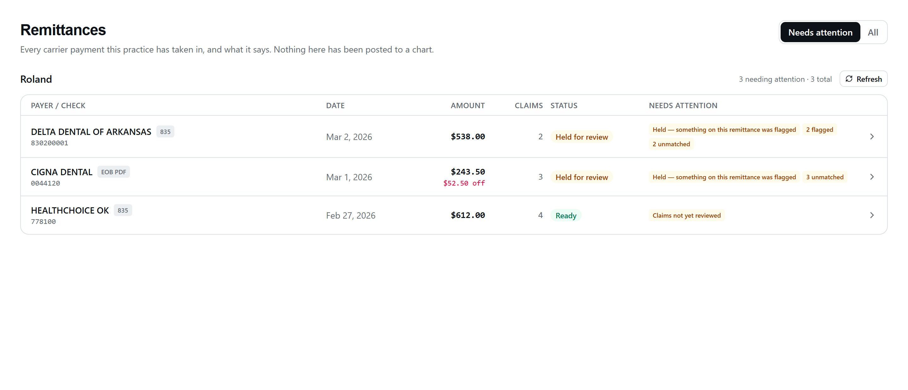
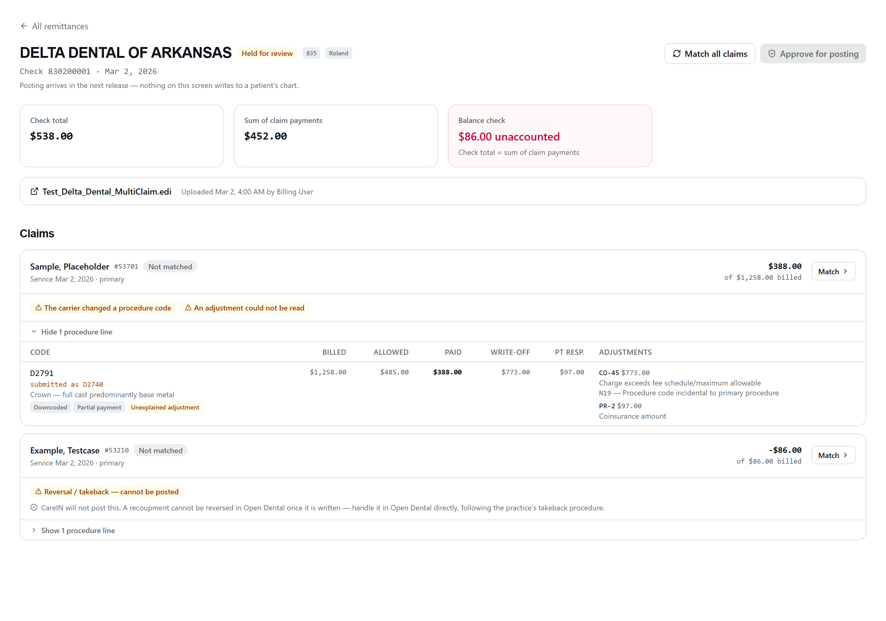
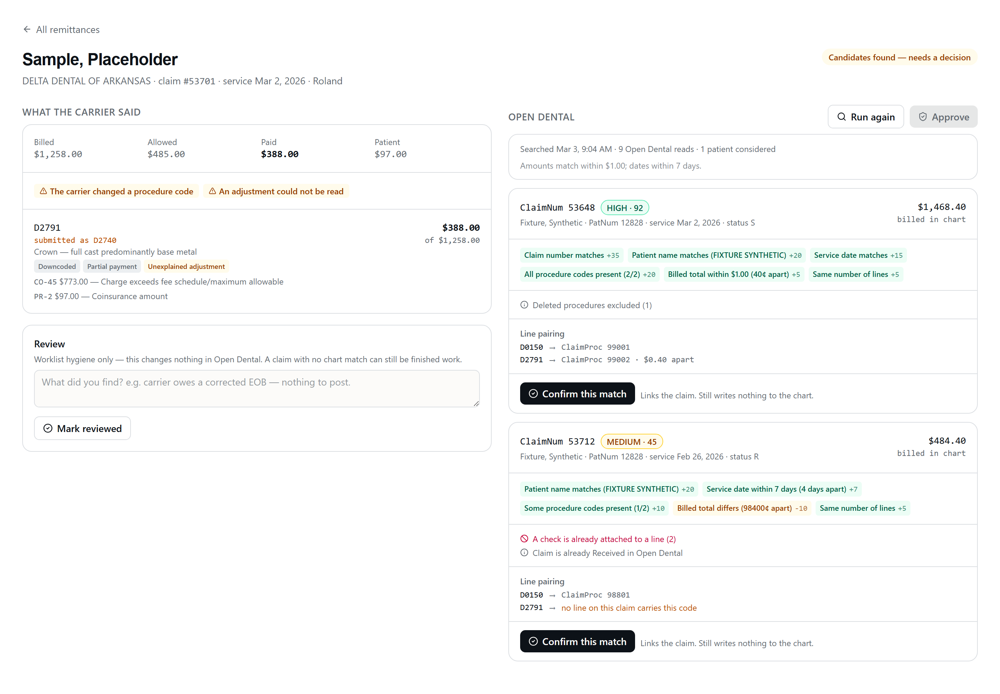
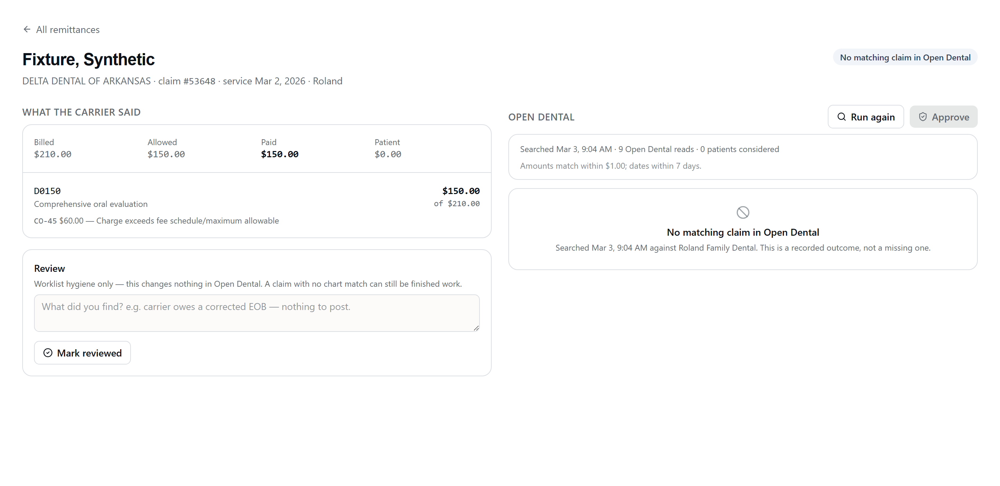

# RCM Slice 6a — the review workbench, and Open Dental matching

The screens a biller opens a carrier payment in, and the matching underneath
them. **Reads only against Open Dental. Zero chart writes.**

| | |
| --- | --- |
| Routes (UI) | `/rcm/remittances`, `/rcm/remittances/:id`, `/rcm/claims/:id` |
| Routes (API) | `GET /api/rcm/remittances[/:id]`, `POST /api/rcm/remittances/:id/match`, `GET /api/rcm/claims/:id`, `POST /api/rcm/claims/:id/{match,confirm-match,review}`, `GET /api/rcm/uploads/:id/document` |
| Entitlement | `requireModule('rcm')` — ships dark; no tenant is entitled yet |
| Permission | `rcm.read` on GET, `rcm.write` on every POST (the mount's `requireReadWrite`) |
| Office | Slice 3's router-wide `requireOffice` — the validated `?office=` query param |
| Migration | `backend/migrations-tenant/1787040000000_rcm_od_match.js` (additive columns only) |
| Code | [`backend/routes/rcm/`](../backend/routes/rcm/), [`backend/services/rcm/`](../backend/services/rcm/), [`new-dashboard/client/src/pages/rcm/`](../new-dashboard/client/src/pages/rcm/) |
| Tests | `claimMatch.test.js` (50), `odClaimReads.test.js` (27), `workbench.test.js` (42), `rcmNoOdWrites.test.js` (8), `adjustmentCodes.test.js` (15), `rcm-workbench.test.tsx` (30) |

---

## 1. Why this slice came before posting

Slices 4 and 5 proved the intake path on staging: an EOB extracts in ~4s, an 835
parses into a batch with claims and lines, duplicates are refused. But the only
visible evidence was **a counter on an office card**. A real 835 was uploaded and
there was nowhere to look at what it contained.

A module whose data can only be inspected with `psql` is not shippable, and
building the posting path on top of an invisible one would put a biller's first
look at a remittance and their first irreversible action on it in the same
release. So the workbench came first, and posting arrives behind a UI that
already exists.

Two consequences worth stating:

- **The Approve button is present and DISABLED**, with copy saying why, so the
  layout is right when 6b lands. There is no endpoint behind it, and
  `rcmNoOdWrites.test.js` asserts there is none to find.
- **`rcm_posting_queue` is untouched.** A test fails if any RCM source writes to
  it: a workbench that could enqueue would ship the approval decision without
  the approval gate.

---

## 2. The screens

### Remittance list — `/rcm/remittances`

Every payment batch this office holds, whether an 835 parsed it or a model read
it out of a PDF.



**The default view is NEEDS ATTENTION**, the same philosophy as the voice
worklist: the default is the work, not the archive. The predicate is computed
**server-side** and arrives on the row, so the list and the detail cannot
disagree about whether something is finished:

| Reason | When |
| --- | --- |
| `batch_<status>` | The batch is anything but `ready` or `posted` — Slice 5 holds a batch `open` when **anything** on it was flagged |
| `claims_flagged` | A claim carries a review reason |
| `claims_unmatched` | A claim has no confirmed Open Dental match |
| `claims_unreviewed` | A claim has not been marked reviewed |

The count of what the filter is hiding is **always visible, on both tabs**. A
filter that does not state its own scope is one people forget is on.

**Source is labelled** (`835` / `EOB PDF`) and is not cosmetic: an 835 is PARSED
and can only be malformed; an EOB PDF was READ by a model and can be WRONG. A
biller deciding how hard to scrutinise a figure needs to know which they are
looking at.

**The balance check is in the row.** Where the batch total and the sum of its
claim payments disagree, the row shows *the difference* — the number a biller
chases — not merely a red flag.

### Remittance detail — `/rcm/remittances/:id`



Header, balance check, a link back to the source document, and the claims.

**This is where the Slice 4 and Slice 5 flags finally get seen.** They have been
written to `needs_review_reasons` since Slice 4 and rendered nowhere. Every one
of them is a chip here:

`reversal_not_postable` · `claim_denied` · `secondary_payer_adjudication` ·
`prior_payer_payment_on_primary_claim` · `unparseable_cas` ·
`unstorable_adjustment_group` · `procedure_downcoded` · `no_service_lines` ·
`line_total_mismatch` · `low_confidence_extraction` · `uncertain_line`

An unmapped reason renders as its own slug rather than disappearing — a new
backend reason should show up as an ugly string that prompts a fix, never as a
silently missing chip.

**Reversal and patient-responsibility items are detect-and-flag ONLY.** The
screen states plainly that CareIN will not post them and points at the manual
route. A negative supplemental is the single **irreversible** Open Dental
operation (RCM_OD_WRITES G10) — it cannot be reverted and cannot be deleted, and
it then pins its claim and that claim's procedure permanently. Inventing an
action for one would be worse than admitting there is none.

**PLB** is surfaced beside the balance check rather than counted as an error:
provider-level money belongs to no single claim, so it is a legitimate reason for
the two totals to differ.

#### CARC / RARC

`ClaimAdjReasonCodes` is returned on GET and **absent from PUT** — denial reason
codes are read-only over the Open Dental API (RCM_OD_WRITES G3), and 0 of 100
sampled Received claimprocs on Roland carried one. **Structured denial reasons
exist only in our schema**, which makes rendering them legibly not a nicety but
the product.

[`backend/services/rcm/adjustmentCodes.js`](../backend/services/rcm/adjustmentCodes.js)
is the one home for the vocabularies — the CARC table moved there from
`eraParser.js` (so the parser and the workbench read **one** table, not two),
joined by a **RARC table that did not exist before**: parser deviation D9 reads
the `LQ*HE` remark code but there was nothing to look it up in, so every
`remark_description` Slice 5 wrote is the empty string. They resolve at render
time now.

Three rules the codes layer follows:

1. **An unknown code renders BARE.** `describeCarc('9999')` returns `null` and the
   screen shows `CO-9999` with no gloss. A fabricated description in front of
   billing staff is exactly the failure the parser's D5 ruling refused to make at
   parse time; it would be no better made at render time.
2. **A payer's own stored wording wins** when it is non-empty, so two uploads of
   the same remittance do not read differently depending on when our table last
   changed. Only the parser's `Adjustment code <n>` placeholder is treated as
   blank.
3. **The group code is spelled out.** `CO` is a write-off the practice absorbs;
   `PR` is money the patient owes. Rendering those as two anonymous letters
   invites reading one as the other.

### Claim match panel — `/rcm/claims/:id`

The carrier's version on the left; Open Dental on the right.



Every candidate shows **the evidence behind its score**, with weights, so a
biller can add it up themselves and disagree. Negative evidence is shown as
evidence — "the amounts disagree" is information, not the absence of it.

**Pre-flight facts are shown before they bite.** Open Dental refuses a claimproc
update when a line is an income transfer, carries a blocked status, or already
has a check attached; a deleted procedure still comes back in list reads as
`ProcStatus "D"`. Slice 6c will refuse on all of those, so they are surfaced here
at match time — the alternative is confirming a match, approving it, and finding
out at drain time that Open Dental will not take it.

**Line pairing** shows which chart line each of our lines would adjudicate. An
unpaired line says so rather than being guessed at.

### The honest negative



`no_candidate` is a **stored, first-class outcome** with a timestamp — not an
empty screen. "Nobody has checked" and "we checked on Tuesday, against this
practice's database, and Open Dental has nothing" are different facts a biller
acts on differently, and a nullable claim number cannot tell them apart.

---

## 3. The four match states

`rcm_claims.od_match_status`, enforced by a CHECK constraint:

| Status | Means |
| --- | --- |
| `not_run` | Nobody has looked. **Not** the same as "we looked and found none". |
| `candidates` | A search ran and returned candidates. **Nobody has chosen.** |
| `no_candidate` | A search ran against this office's Open Dental and found nothing. |
| `confirmed` | A human picked one. `od_claim_num` is meaningful **only** here. |

Three database constraints make those states honest rather than conventional:

```
od_claim_num IS NOT NULL  ⟺  od_match_status = 'confirmed'
od_match_status = 'confirmed'  ⟹  od_matched_by IS NOT NULL AND od_match_confirmed_at IS NOT NULL
reviewed_at IS NULL  ⟺  reviewed_by IS NULL
```

The first is the load-bearing one: without it a failed re-match could leave a
stale ClaimNum on a row whose status says nothing was chosen — and Slice 6c reads
`od_claim_num` to decide which chart to touch.

**Reviewed is not matched.** `reviewed_at` / `reviewed_by` / `review_note` are
worklist hygiene with no Open Dental effect at all. "The carrier owes a corrected
EOB, there is nothing to post" is a real outcome for a claim with no chart
linkage, and forcing a match before it could be recorded would push billers into
confirming matches they do not believe in to clear their queue.

---

## 4. The match algorithm

Two pieces, deliberately separated:

- **A pure core** — [`claimMatch.js`](../backend/services/rcm/claimMatch.js). No
  I/O, no clock, no Open Dental, no database. Scores and explains.
- **A read shell** — [`odClaimReads.js`](../backend/services/rcm/odClaimReads.js).
  Takes `odGet` as its first argument, exactly as `routes/tc/odReads.js` does, so
  it is testable against a recorded-shape fake and *has no write verb in scope to
  reach for*.

### Evidence and weights

| Tag | Weight | When |
| --- | ---: | --- |
| `CLAIM_NUMBER_MATCH` | +35 | The carrier's claim number is this ClaimNum |
| `PATIENT_NAME_MATCH` | +20 | Both names match the chart |
| `PATIENT_NAME_PARTIAL` | +10 | Surname only |
| `PATIENT_NAME_MISMATCH` | −15 | Neither name matches |
| `SERVICE_DATE_MATCH` | +15 | Same day |
| `SERVICE_DATE_NEAR` | +7 | Within 7 days |
| `SERVICE_DATE_MISMATCH` | −10 | More than 7 days apart |
| `CODES_ALL_PRESENT` | +20 | Every remittance line's code is on the claim |
| `CODES_PARTIAL` | +10 | At least half are |
| `CODES_ABSENT` | −15 | None are |
| `BILLED_AMOUNT_MATCH` | +10 | Billed to the cent |
| `BILLED_AMOUNT_NEAR` | +5 | Within $1.00 |
| `BILLED_AMOUNT_MISMATCH` | −10 | Beyond it |
| `LINE_COUNT_MATCH` | +5 | Same number of payable lines |

Sum, clamped to 0–100. Bands: **HIGH ≥ 75 · MEDIUM ≥ 45 · LOW below.**

### Tolerances, and why they are those numbers

| Tunable | Value | Why |
| --- | --- | --- |
| `AMOUNT_EXACT_CENTS` | 0 | A billed total agreeing to the cent is the strongest money evidence there is |
| `AMOUNT_NEAR_CENTS` | 100 ($1.00) | Open Dental's `-1` "not calculated" sentinel produced exactly a **one-dollar** error in the legacy COB calculator (TC_OD_READS trap 1) — a real, documented, one-dollar-shaped disagreement. Wider and a genuinely different claim starts scoring as near |
| `DATE_NEAR_DAYS` | 7 | A carrier's service date and the chart's can differ by days on a multi-visit claim; a week is generous without spanning a recall interval |
| `AMBIGUITY_MARGIN` | 10 | The cost of saying "these two look alike, you decide" is one extra glance. The cost of not saying it is money posted to the wrong patient's chart |

### Nothing auto-decides

There is **no** `autoConfirm`, no threshold above which a candidate is chosen,
and no exported function that returns "the" match — a test asserts those names do
not exist. When the top two are within `AMBIGUITY_MARGIN` the result is marked
`ambiguous`, **both are still shown**, and the panel says the ranking is not a
recommendation. Same stance `callTwins.findTwin` takes on the voice side, where
two matches are a refusal rather than a coin flip.

### Normalisation the codes actually need

- **`AD:D0150` → `D0150`.** SVC01 carries the X12 ADA qualifier; Open Dental
  stores the bare code. Comparing raw strings would find nothing, on every line.
- **A downcode matches on EITHER code.** The payer names one and the chart carries
  the other; looking at only one would make every downcode read as a mismatch.
- **`0001-01-01` is not a date.** OD's null-date convention read literally would
  score as a two-thousand-year mismatch instead of an absent date.
- **Middle initials are dropped.** "SMITH JOHN Q" and "Smith, John" are the same
  person, and letting an initial cost a name match pushes real matches down a band.

### Deleted procedures

`DELETE /procedurelogs` is a **soft delete** (G12): the row comes back as
`ProcStatus "D"` and still appears in list reads. The write spike's own teardown
counted "D" rows as live charges and over-applied a reversal by $2.00.

Every claimproc whose procedure reads "D" is dropped **before any total is
computed**, the count is reported, and the billed comparison runs against the
live lines' `FeeBilled` rather than the claim's `ClaimFee` — which still includes
the deleted ones.

---

## 5. Reading Open Dental

### Proven filters only — and every one re-applied client-side

The shell sends only filters measured live against Roland: `?PatNum=`,
`?ClaimNum=`, `?LName=` / `?FName=` (**prefix** matches), `?Offset=` (100/page).

But **Open Dental silently ignores list filters it does not implement** — the
request succeeds and returns the unfiltered page, so a caller that trusts the
filter cannot tell. Every list read is therefore re-filtered on the same
predicate after it returns. If OD honoured it, the client-side pass is a no-op;
if it ignored it, the set is still correct and a **note says so** rather than the
screen quietly showing another patient's claims.

### The call shape, per claim

```
patient search (1–2 prefix reads)   ── or ── GET /patients/{PatNum} when already linked
  └─ per patient:  GET /claims?PatNum         (paged, re-filtered)
                   GET /procedurelogs?PatNum   (paged, re-filtered)   ← ONE read, not one per line
      └─ per candidate claim: GET /claimprocs?ClaimNum  (re-filtered)
```

The procedure scan is per **patient** rather than per claimproc on purpose:
`GET /procedurelogs/{n}` once per line would be twenty calls on a patient with
four candidate claims of five lines each.

### Bounds, and saying so

| Env var | Default | Bounds |
| --- | --- | --- |
| `RCM_OD_CALL_TIMEOUT_MS` | `30000` | Per-OD-call timeout |
| `RCM_OD_MAX_CANDIDATE_PATIENTS` | `3` | Name-prefix hits searched. `LName=Spark` returned **18 rows** live |
| `RCM_OD_MAX_CANDIDATE_CLAIMS` | `8` | Claims per patient examined in detail (newest first) |
| `RCM_OD_MAX_CLAIM_PAGES` | `3` | Pages of `/claims` and `/claimprocs` |
| `RCM_OD_MAX_PROCEDURE_PAGES` | `3` | Pages of `/procedurelogs` |
| `RCM_OD_BATCH_PACING_MS` | `1200` | Gap between claims in a batch match. **Floored at 1200** — a smaller value is raised, not honoured |
| `RCM_OD_MAX_BATCH_MATCH_CLAIMS` | `25` | Claims per batch-match run |

Hitting any of them sets `truncated` **with a note**. A short candidate list that
does not say it is short is how a biller concludes "there is no such claim".

### Batch matching is sequential

Never a request-scoped fan-out. Each claim costs a handful of calls against an
API that is throttled and ~10 network hops deep; matching a twelve-claim
remittance in parallel would be sixty-odd concurrent calls, and the client's own
429 backoff would serialise them anyway — slower and noisier than doing it
deliberately.

A single claim's failure does not discard the run: each outcome is reported
individually, and a claim someone has already confirmed is reported as
`already_confirmed` rather than as a failure.

### Office law

```js
const handle = odOffices.assertOfficeMatch(office, odOffices.getOdOffice(office));
const odGet = (p, q, o) => handle.client.apiGetRaw(p, q, o);
```

`assertOfficeMatch` is the guard `config/odOffices.js` calls "the safety heart".
PatNum numbering restarts in every Open Dental database — 7115 is Riley's test
patient and **a different, real person** in Roland — so a client bound to the
wrong practice is refused rather than used, and never falls back. Both offices
are live from day one (decision D-7); nothing is roland-hardcoded.

An office with no Open Dental connection refuses with `OFFICE_NOT_CONNECTED`
(409/503), which the UI renders as the honest "not connected for this office"
state rather than as a failed match — different problems, different fixes.

---

## 6. Attribution — decision D-5

Every actor column in the RCM schema is a FK to `rcm_user_map`, which no route
could satisfy before this slice: Slice 5's doc records the workaround plainly —
*"`rcm_payment_batches.created_by` is NULL … the staff crosswalk is deferred to
Slice 6."*

[`rcmUserMap.js`](../backend/services/rcm/rcmUserMap.js) discharges it.
`resolveRcmActor(client, actor)` upserts the SSO identity on a person's **first
RCM action**:

- **Lookup is by EMAIL first.** Slice 2's importer may already hold a row for the
  same human under the source app's key (`u_7f3a`, an openId). Minting a second
  row keyed by email would split one person's attribution across two ids and
  nothing downstream could rejoin them.
- **`platform_email` is lowercased** — the Slice 1 CHECK is
  `platform_email = lower(platform_email)`, so this is correctness, not tidiness.
- **`ON CONFLICT … DO UPDATE`**, because two concurrent first actions race here
  and the loser needs the winner's key back, not a `23505` surfacing as a failed
  confirmation.
- **Called on the transaction's own connection**, since the FK is checked at
  statement time.

This matters more here than anywhere else on the platform: Open Dental's own
audit trail **cannot** say who posted a payment — every API write logs
`UserNum: 0` and "Created by … through API." (RCM_OD_WRITES §9). `rcm_*`
attribution and the platform `audit_log` are the only record a human was involved.

**Both upload routes now stamp it too**, so a remittance can say who brought the
document in. Rows uploaded before this migration keep `NULL`, and the screen
renders that as *"not recorded"* — never as "the system did it".

---

## 7. Audit

One `audit_log` row per PHI read, **whatever the Open Dental fan-out cost** —
the same granularity rule `platform/odAccess` applies to a 25-call treatment plan.

| Endpoint | Action | `resource_type` | `resource_id` |
| --- | --- | --- | --- |
| `GET /remittances`, `GET /remittances/:id` | READ | `rcm_remittance` | null |
| `GET /claims/:id` | READ | `rcm_claim` | null |
| `POST /claims/:id/match` | READ | `rcm_claim_match` | null |
| `POST /remittances/:id/match` | READ | `rcm_claim_match` | null — **one row for the whole run** |
| `POST /claims/:id/confirm-match` | UPDATE | `rcm_claim_match` | the claim id |
| `POST /claims/:id/review` | UPDATE | `rcm_claim_review` | the claim id |
| `GET /uploads/:id/document` | READ | `rcm_source_document` | the upload id |

Every one is **fail-closed**: `audit()` throws `AuditError` and `h()` turns that
into a 500 *before* the response body is written, so PHI is never served without
a recorded trail (hard rule 5). Patient names and search terms never enter the
trail; `resource_id` is null on list reads because "the office's claims" has no
single id, and is stamped on the writes because a claim id is something we minted.

---

## 8. The source-document proxy

`GET /api/rcm/uploads/:id/document?office=…` is the route back to the bytes a
remittance was parsed from. It exists because **a review screen that renders a
parser's output with no way to check it against the original asks people to trust
a parser they cannot see** — and an EOB PDF in particular was read by a model and
can be *wrong*, not merely malformed.

- **Blob keys are never in a response body.** The client addresses a document by
  its `upload_id`; the key is resolved server-side. A key in a response is a key
  in a browser cache.
- **`office_id` is in the WHERE**, so another office's document is *not found*
  rather than found-and-refused.
- **The audit row is written before a byte is served.**
- The container is private, shared-key auth is disabled on the account, and no
  SAS is ever minted — so this proxy is the whole access control, not one layer
  of several.
- The filename **is** sent as `Content-Disposition` (a document that downloads as
  a uuid is one nobody can file) with quotes, backslashes and newlines stripped,
  and `Cache-Control: private, no-store`. It never reaches a log line.

---

## 9. Refusals

| Code | HTTP | When |
| --- | --- | --- |
| `INVALID_OFFICE` | 400 | `?office=` missing or not `roland`/`valley` |
| `INVALID_CLAIM_NUM` | 400 | `odClaimNum` missing or not a positive number |
| `NOTE_TOO_LONG` | 400 | A review note over 2,000 characters |
| `CLAIM_NOT_FOUND` | 404 | No such claim **for this office** |
| `REMITTANCE_NOT_FOUND` | 404 | No such batch for this office |
| `DOCUMENT_NOT_FOUND` | 404 | No such upload for this office |
| `MATCH_ALREADY_CONFIRMED` | 409 | Re-running over a confirmed match without `force` |
| `NO_MATCH_TO_CONFIRM` | 409 | Confirming before any match ran |
| `CANDIDATE_NOT_FOUND` | 409 | The ClaimNum was not among the candidates the match found |
| `OFFICE_NOT_CONNECTED` | 409 / 503 | The office has no usable Open Dental connection (`reason` carries the precise `odOffices` code) |
| `OD_READ_FAILED` | 502 | Open Dental answered badly. The failure is theirs; echoing a 404 would read as "no such claim" |
| `RCM_STORAGE_UNAVAILABLE` | 503 | `RCM_BLOB_ACCOUNT_URL` unset |
| `DOCUMENT_KEY_UNRECOGNISED` | 500 | A stored key matches neither blob store — a data problem, not a missing document |
| `AUDIT_FAILED` | 500 | The trail could not be written, so nothing was served |
| `MODULE_NOT_ENTITLED` | 403 | In `error`, not `code` — the platform's existing denial shape |
| `FORBIDDEN` | 403 | The role lacks `rcm.read` (GET) or `rcm.write` (POST) |

**Why `POST /claims/:id/match` is a POST**: it reads Open Dental and writes
nothing to a chart, so on the face of it a GET. It is a POST because it **writes
to our rows** — the snapshot, the match status, and the instant we looked. That
makes it non-idempotent, unsafe to retry blindly and unsafe to prefetch, three
properties a GET promises the opposite of. It also means `requireReadWrite`
demands `rcm.write` for it, which is right: recording an observation against a
claim changes the practice's record of that claim.

---

## 10. The match snapshot

`rcm_claims.od_match_snapshot` (jsonb, `version: 1`) records **what we saw**:
candidates, evidence, the OD amounts *as read*, per-line ClaimProcNums, the
patients considered, every note and truncation, and `fetchedAt`.

It is a record of a past observation, **never a cache to serve from**. Nothing in
this slice or the next reads a dollar figure out of it and calls it current.

Slice 6c needs it because it posts against a chart that may have moved since the
match was confirmed — a second EOB may have landed, a line may have been zeroed,
a check may have been attached (which makes `InsPayAmt` unwritable). Re-verifying
at drain time means comparing against what we saw.

**Per-line OD facts live in the snapshot, not on the line row.** The Slice 1
schema dropped `bankTransactions.matchedClaimIds` for exactly this reason:
*"Carrying both lets them disagree."* `rcm_procedure_lines.od_claim_proc_num` is
the **confirmed** linkage — one number a human stood behind — and the amounts
that justified it stay in one place on the claim.

A line the pairing could not resolve is set to `NULL` at confirm time rather than
left at whatever a previous match wrote: a stale ClaimProcNum is worse than none,
because 6c would `PUT` against it.

---

## 11. Zero Open Dental writes — how that is enforced

`backend/routes/rcm/rcmNoOdWrites.test.js`, in four layers, because each catches
what the others miss:

1. **Behavioural.** Boots the real router with a client whose every write verb
   throws, drives the whole workbench surface (list, detail, claim, match,
   confirm, review, batch match), and asserts `methodsUsed()` is exactly
   `['apiGetRaw']` — *and* that real reads happened, so the assertion is not
   vacuously true. This is the layer that would catch a write added three files
   deep through a helper nobody grepped for.
2. **Graph.** The ingestion path — the extraction worker and the ERA ingest —
   must still reach **no Open Dental module at all**. A background worker that
   can reach a chart is a different and worse thing than a biller pressing Match.
3. **Imports.** Only the match layer may name the read seam
   (`config/odOffices`), and `services/openDentalSync` (the voice commlog writer)
   and `platform/odAccess` (the tenant-level seam bound to ONE office, which
   would read Roland under a Valley selector) may not be named anywhere.
4. **Static.** No RCM source names an OD write method or endpoint
   (`apiPost(`, `createCommlog(`, `/claimpayments`, `claimprocs/Supplemental`,
   `documents/Upload`, …), and none writes to `rcm_posting_queue`.

> This **replaces** Slice 4's "the RCM module does not touch Open Dental" guard,
> which was written when nothing in the module legitimately could. Slice 6a is
> where matching arrives, so that invariant would have to be either deleted or
> defeated with an allow-list — which is how a guard quietly stops guarding. The
> invariant that actually matters, and that survives every later slice, is
> **reads are allowed, writes are not.**

---

## 12. Staging validation

RCM ships dark, so this needs the `rcm` entitlement flipped for the tenant from
the Platform Console, and `RCM_BLOB_ACCOUNT_URL` set on the staging container app
(both already true on staging as of 2026-08-17).

1. Sign in as an `admin` or `office` user and open **/rcm → Remittances**.
2. The Delta multi-claim batch uploaded in the Slice 5 walk is there, on the
   **needs-attention** default.
3. Open it. Expect **2 claims, 4 lines**, the amounts balancing, and the CARC
   descriptions rendered — including a RARC description, which is new.
4. Open a claim and press **Run match**. Expect an honest **"No matching claim in
   Open Dental"**: the fixture PatNums are synthetic and were never submitted from
   Roland's database, so that is the correct answer.
5. Confirm a PHI-read audit row was created:

```sql
SELECT action, resource_type, resource_id, office, user_id, created_at
  FROM audit_log
 WHERE resource_type LIKE 'rcm_%'
 ORDER BY created_at DESC LIMIT 10;
```

6. Mark the claim reviewed with a note. Back on the list it leaves the
   needs-attention view once every claim on the batch is reviewed.
7. Open the extracted synthetic EOB's remittance and confirm its proposal claim
   renders the same way.
8. Confirm **nothing** was written to Open Dental — no `claimproc`, no
   `claimpayment`, no `claim` status change:

```sql
-- our side should show a match attempt and no linkage
SELECT claim_number, od_match_status, od_claim_num, od_match_at, reviewed_at, reviewed_by
  FROM rcm_claims WHERE office_id = 'roland' ORDER BY created_at DESC;
```

---

## 13. What Slice 6b adds

The Approve button becomes real. Concretely:

- an approval gate that turns a confirmed, reviewed claim into an
  `rcm_posting_queue` row with `approved_by` **NOT NULL** (reusing D-5's
  `resolveRcmActor` unchanged);
- `rcm_posting_queue_line` rows carrying the **intended** `InsPayAmt` /
  `WriteOff` / `DedApplied` per ClaimProcNum, written **before the first Open
  Dental call** — the pre-flight record RCM_OD_WRITES §8 proves is mandatory,
  because the worst failure window is between "claim marked Received" and "check
  created", and recovery works *only if the poster knows exactly which
  claimprocs it had touched*;
- `is_recoupment` gating, so a negative supplemental — the single irreversible
  Open Dental operation — needs a harder gate than everything else.

Nothing in 6a writes any of those rows, and a test fails if it starts to.

Then 6c drains the queue (the first chart writes, behind `assertOfficeMatch`, and
re-verifying against the snapshot above), and 6d adds the recoupment gate.

---

## 14. Out of scope

The approval gate (6b) · any Open Dental write (6c) · the recoupment gate (6d) ·
reconciliation, VCC and metrics (8/9) · Stedi polling · entitlement changes · prod.
