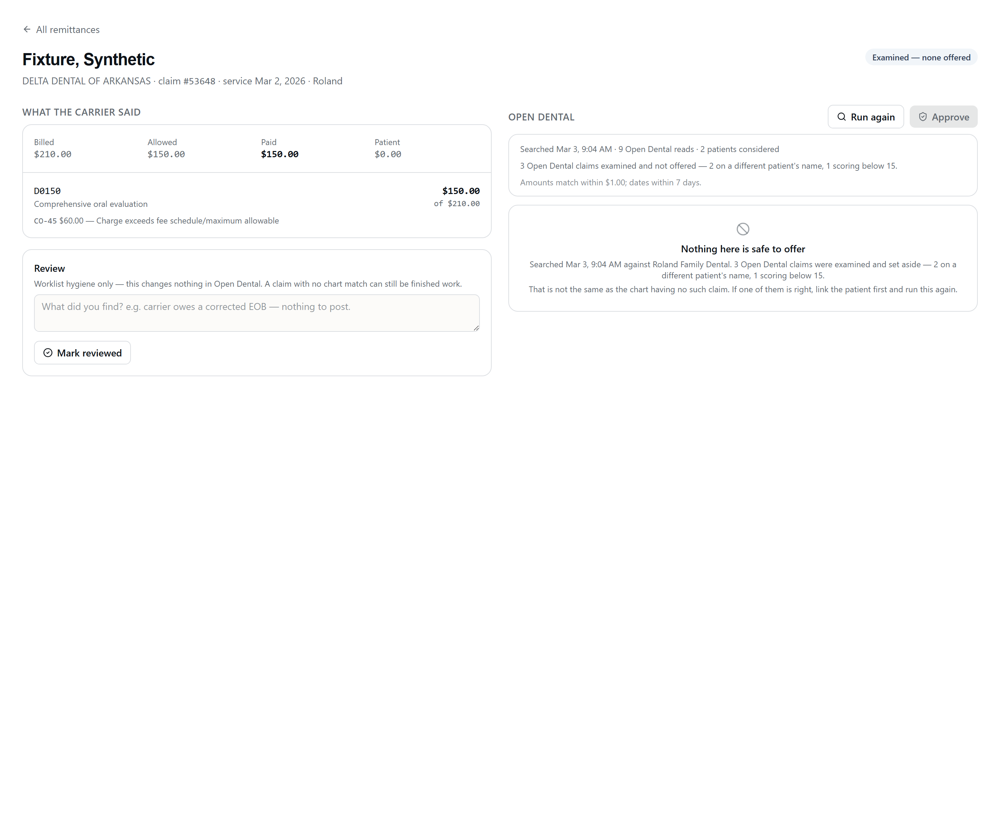

# RCM Slice 6a — the review workbench, and Open Dental matching

The screens a biller opens a carrier payment in, and the matching underneath
them. **Reads only against Open Dental. Zero chart writes.**

| | |
| --- | --- |
| Routes (UI) | `/rcm/remittances`, `/rcm/remittances/:id`, `/rcm/claims/:id` |
| Routes (API) | `GET /api/rcm/remittances[/:id]`, `POST /api/rcm/remittances/:id/match`, `GET /api/rcm/claims/:id`, `POST /api/rcm/claims/:id/{match,confirm-match,review}`, `GET /api/rcm/uploads/:id/document` |
| Entitlement | `requireModule('rcm')` — ships dark; no tenant is entitled yet |
| Permission | `rcm.read` on GET, `rcm.write` on every POST (the mount's `requireReadWrite`) |
| Office | Slice 3's router-wide `requireOffice` — the validated `?office=` query param |
| Migration | `backend/migrations-tenant/1787040000000_rcm_od_match.js` (additive columns only) |
| Code | [`backend/routes/rcm/`](../backend/routes/rcm/), [`backend/services/rcm/`](../backend/services/rcm/), [`new-dashboard/client/src/pages/rcm/`](../new-dashboard/client/src/pages/rcm/) |
| Tests | `claimMatch.test.js` (54), `odClaimReads.test.js` (31), `workbench.test.js` (51), `odPacer.test.js` (10), `rcmNoOdWrites.test.js` (8), `adjustmentCodes.test.js` (31), `rcm-workbench.test.tsx` (30) |

---

## 1. Why this slice came before posting

Slices 4 and 5 proved the intake path on staging: an EOB extracts in ~4s, an 835
parses into a batch with claims and lines, duplicates are refused. But the only
visible evidence was **a counter on an office card**. A real 835 was uploaded and
there was nowhere to look at what it contained.

A module whose data can only be inspected with `psql` is not shippable, and
building the posting path on top of an invisible one would put a biller's first
look at a remittance and their first irreversible action on it in the same
release. So the workbench came first, and posting arrives behind a UI that
already exists.

Two consequences worth stating:

- **The Approve button is present and DISABLED**, with copy saying why, so the
  layout is right when 6b lands. There is no endpoint behind it, and
  `rcmNoOdWrites.test.js` asserts there is none to find.
- **`rcm_posting_queue` is untouched.** A test fails if any RCM source writes to
  it: a workbench that could enqueue would ship the approval decision without
  the approval gate.

---

## 2. The screens

### Remittance list — `/rcm/remittances`

Every payment batch this office holds, whether an 835 parsed it or a model read
it out of a PDF.


**The default view is NEEDS ATTENTION**, the same philosophy as the voice
worklist: the default is the work, not the archive. The predicate is computed
**server-side** and arrives on the row, so the list and the detail cannot
disagree about whether something is finished:

| Reason | When |
| --- | --- |
| `batch_<status>` | The batch is anything but `ready` or `posted` — Slice 5 holds a batch `open` when **anything** on it was flagged |
| `claims_flagged` | A claim carries a review reason |
| `claims_unmatched` | A claim has no confirmed Open Dental match |
| `claims_unreviewed` | A claim has not been marked reviewed |

The count of what the filter is hiding is **always visible, on both tabs**. A
filter that does not state its own scope is one people forget is on.

**Source is labelled** (`835` / `EOB PDF`) and is not cosmetic: an 835 is PARSED
and can only be malformed; an EOB PDF was READ by a model and can be WRONG. A
biller deciding how hard to scrutinise a figure needs to know which they are
looking at.

**The balance check is in the row.** Where the batch total and the sum of its
claim payments disagree, the row shows *the difference* — the number a biller
chases — not merely a red flag.

### Remittance detail — `/rcm/remittances/:id`


Header, balance check, a link back to the source document, and the claims.

**This is where the Slice 4 and Slice 5 flags finally get seen.** They have been
written to `needs_review_reasons` since Slice 4 and rendered nowhere. Every one
of them is a chip here:

`reversal_not_postable` · `claim_denied` · `secondary_payer_adjudication` ·
`prior_payer_payment_on_primary_claim` · `unparseable_cas` ·
`unstorable_adjustment_group` · `procedure_downcoded` · `no_service_lines` ·
`line_total_mismatch` · `low_confidence_extraction` · `uncertain_line`

An unmapped reason renders as its own slug rather than disappearing — a new
backend reason should show up as an ugly string that prompts a fix, never as a
silently missing chip.

**Reversal and patient-responsibility items are detect-and-flag ONLY.** The
screen states plainly that CareIN will not post them and points at the manual
route. A negative supplemental is the single **irreversible** Open Dental
operation (RCM_OD_WRITES G10) — it cannot be reverted and cannot be deleted, and
it then pins its claim and that claim's procedure permanently. Inventing an
action for one would be worse than admitting there is none.

**PLB** is surfaced beside the balance check rather than counted as an error:
provider-level money belongs to no single claim, so it is a legitimate reason for
the two totals to differ.

#### CARC / RARC

`ClaimAdjReasonCodes` is returned on GET and **absent from PUT** — denial reason
codes are read-only over the Open Dental API (RCM_OD_WRITES G3), and 0 of 100
sampled Received claimprocs on Roland carried one. **Structured denial reasons
exist only in our schema**, which makes rendering them legibly not a nicety but
the product.

### The data is INGESTED, never typed

[`backend/services/rcm/x12Codes.generated.js`](../backend/services/rcm/x12Codes.generated.js)
holds the published X12 lists — **407 CARC and 1,216 RARC** — produced by
[`backend/scripts/fetch-x12-codes.mjs`](../backend/scripts/fetch-x12-codes.mjs)
and carrying the source URLs, the retrieval date and a content hash.
[`adjustmentCodes.js`](../backend/services/rcm/adjustmentCodes.js) is the
accessor over it, and `eraParser.js` calls the same accessor, so the parser and
the workbench cannot drift apart.

**This replaced a hand-written table that was wrong.** The first version of this
slice asserted its entries were "the published X12/WPC meaning". They were not,
and the errors clustered on exactly the codes a dental biller acts on:

| Code | The hand-written table said | Published meaning |
| --- | --- | --- |
| **22** | "Reimbursement adjusted – care already paid" | **coordination of benefits** — *bill the other payer* |
| 49 | "Not covered unless emergency" | routine/preventive exam or screening |
| 50 | "Non-covered service" | not deemed a **medical necessity** |
| 51 | "Services delivered in a different location" | a **pre-existing condition** |
| 54 / 234 | swapped with each other | 234 is "not paid separately"; 54 is multiple physicians |
| 151 | "automatic pre-payment review" | the **frequency limit** code |
| B15 | "combined with another procedure" | requires a **qualifying service** — the buildup/crown and SRP sequencing code |

Code 22 is the one that costs money: it means the claim should go to the
secondary carrier, and the table told a biller it had already been paid. A test
even pinned one of the wrong strings as correct, so the suite locked the bug in
rather than catching it.

The fix was not to hand-correct them. `adjustmentCodes.test.js` now pins the
**entry counts and a SHA-256 over the canonical content**, so both silent
upstream drift and a hand edit fail the build; the per-code tests assert the
*substance* that made each old string dangerous (`/coordination of benefits/`,
`/pre-existing condition/`) rather than re-transcribing the new text.

Re-running the generator when X12 publishes an update is expected to turn that
test red. That is the point: a human reads the diff and re-pins deliberately.

### Four rules the codes layer follows

1. **An unknown code renders BARE.** `describeCarc('9999')` returns `null` and the
   screen shows `CO-9999` with no gloss. A fabricated description in front of
   billing staff is exactly the failure the parser's D5 ruling refused to make at
   parse time; it would be no better made at render time.
2. **A payer's own stored wording wins** when it is non-empty, so two uploads of
   the same remittance do not read differently depending on when the list was
   last pulled. Only the parser's `Adjustment code <n>` placeholder is treated as
   blank.
3. **The group code is spelled out.** `CO` is a write-off the practice absorbs;
   `PR` is money the patient owes. Rendering those as two anonymous letters
   invites reading one as the other.
4. **Retired codes are kept, and say they are retired.** An old denial being
   worked today legitimately carries a code X12 has since deactivated; dropping
   it would leave a gap exactly where the work is hardest.

Published entries often append implementer guidance (`… Usage: Refer to the 835
Healthcare Policy Identification Segment …`). That is split off at the literal
`" Usage: "` marker — a mechanical, lossless split of published text — so a chip
shows the meaning and `describeCarcFull()` still returns the untouched string.

### Claim match panel — `/rcm/claims/:id`

The carrier's version on the left; Open Dental on the right.


Every candidate shows **the evidence behind its score**, with weights, so a
biller can add it up themselves and disagree. Negative evidence is shown as
evidence — "the amounts disagree" is information, not the absence of it.

**Pre-flight facts are shown before they bite.** Open Dental refuses a claimproc
update when a line is an income transfer, carries a blocked status, or already
has a check attached; a deleted procedure still comes back in list reads as
`ProcStatus "D"`. Slice 6c will refuse on all of those, so they are surfaced here
at match time — the alternative is confirming a match, approving it, and finding
out at drain time that Open Dental will not take it.

**Line pairing** shows which chart line each of our lines would adjudicate. An
unpaired line says so rather than being guessed at.

### The honest negative — which is actually TWO negatives


`no_candidate` is a **stored, first-class outcome** with a timestamp — not an
empty screen. "Nobody has checked" and "we checked on Tuesday, against this
practice's database, and Open Dental has nothing" are different facts a biller
acts on differently, and a nullable claim number cannot tell them apart.

But so are these two, and they share the same empty candidate list:



A search that **examined three claims and offered none of them** is not a search
that found nothing. The first review round carried the rejection counts as far as
the ranker and dropped them on the way into the snapshot, so the screen told a
biller the chart had no such claim when the chart had claims we chose not to
show — the exact failure the four honest states exist to prevent, reintroduced
one layer up.

The snapshot now carries `rejectedCandidates`, `rejectedReasons`
(`nameMismatch` / `belowScore`) and `minScore`, the panel renders them, and the
status chip reads **"Examined — none offered"** rather than "No matching claim in
Open Dental" — because a chip that asserts one thing above a panel explaining the
other is a screen arguing with itself. The counts also render when candidates
WERE offered: "2 offered" and "2 offered, 1 set aside" are different information.

---

## 3. The four match states

`rcm_claims.od_match_status`, enforced by a CHECK constraint:

| Status | Means |
| --- | --- |
| `not_run` | Nobody has looked. **Not** the same as "we looked and found none". |
| `candidates` | A search ran and returned candidates. **Nobody has chosen.** |
| `no_candidate` | A search ran against this office's Open Dental and offered nothing. Read `rejectedCandidates` before concluding the chart is empty — see [The honest negative](#the-honest-negative--which-is-actually-two-negatives). |
| `confirmed` | A human picked one. `od_claim_num` is meaningful **only** here. |

Three database constraints make those states honest rather than conventional:

```
od_claim_num IS NOT NULL  ⟺  od_match_status = 'confirmed'
od_match_status = 'confirmed'  ⟹  od_matched_by IS NOT NULL AND od_match_confirmed_at IS NOT NULL
reviewed_at IS NULL  ⟺  reviewed_by IS NULL
```

The first is the load-bearing one: without it a failed re-match could leave a
stale ClaimNum on a row whose status says nothing was chosen — and Slice 6c reads
`od_claim_num` to decide which chart to touch.

**Reviewed is not matched.** `reviewed_at` / `reviewed_by` / `review_note` are
worklist hygiene with no Open Dental effect at all. "The carrier owes a corrected
EOB, there is nothing to post" is a real outcome for a claim with no chart
linkage, and forcing a match before it could be recorded would push billers into
confirming matches they do not believe in to clear their queue.

---

## 4. The match algorithm

Two pieces, deliberately separated:

- **A pure core** — [`claimMatch.js`](../backend/services/rcm/claimMatch.js). No
  I/O, no clock, no Open Dental, no database. Scores and explains.
- **A read shell** — [`odClaimReads.js`](../backend/services/rcm/odClaimReads.js).
  Takes `odGet` as its first argument, exactly as `routes/tc/odReads.js` does, so
  it is testable against a recorded-shape fake and *has no write verb in scope to
  reach for*.

### Evidence and weights

| Tag | Weight | When |
| --- | ---: | --- |
| `CLAIM_NUMBER_MATCH` | +35 | The carrier's claim number is this ClaimNum |
| `PATIENT_NAME_MATCH` | +20 | Both names match the chart |
| `PATIENT_NAME_PARTIAL` | +10 | Surname only |
| `PATIENT_NAME_MISMATCH` | −15 | Neither name matches |
| `SERVICE_DATE_MATCH` | +15 | Same day |
| `SERVICE_DATE_NEAR` | +7 | Within 7 days |
| `SERVICE_DATE_MISMATCH` | −10 | More than 7 days apart |
| `CODES_ALL_PRESENT` | +20 | Every remittance line's code is on the claim |
| `CODES_PARTIAL` | +10 | At least half are |
| `CODES_ABSENT` | −15 | None are |
| `BILLED_AMOUNT_MATCH` | +10 | Billed to the cent |
| `BILLED_AMOUNT_NEAR` | +5 | Within $1.00 |
| `BILLED_AMOUNT_MISMATCH` | −10 | Beyond it |
| `LINE_COUNT_MATCH` | +5 | Same number of payable lines |

Sum, clamped to 0–100. Bands: **HIGH ≥ 75 · MEDIUM ≥ 45 · LOW below.**

### Tolerances, and why they are those numbers

| Tunable | Value | Why |
| --- | --- | --- |
| `AMOUNT_EXACT_CENTS` | 0 | A billed total agreeing to the cent is the strongest money evidence there is |
| `AMOUNT_NEAR_CENTS` | 100 ($1.00) | Open Dental's `-1` "not calculated" sentinel produced exactly a **one-dollar** error in the legacy COB calculator (TC_OD_READS trap 1) — a real, documented, one-dollar-shaped disagreement. Wider and a genuinely different claim starts scoring as near |
| `DATE_NEAR_DAYS` | 7 | A carrier's service date and the chart's can differ by days on a multi-visit claim; a week is generous without spanning a recall interval |
| `AMBIGUITY_MARGIN` | 10 | The cost of saying "these two look alike, you decide" is one extra glance. The cost of not saying it is money posted to the wrong patient's chart |

### Two guards keep a stranger out of the candidate list

Ranking without a floor means the worst candidate in a bad list is still
presented as a candidate — beside a Confirm button.

- **`MIN_CANDIDATE_SCORE = 15`.** Cleared by a surname match plus a near date, or
  by matching codes alone. It excludes noise, not weak-but-real candidates; the
  LOW band exists for those.
- **A patient-name MISMATCH disqualifies at any score.** The sharper guard, and
  the one aimed at the actual failure: a stranger with a same-day claim and a
  coincidental fee can clear a numeric floor. Sharing no name token with the
  chart means this is not that patient's claim.

**The name rule applies to the NAME-SEARCH LANE only.** When the biller has
already linked the patient, the candidates came from `?PatNum=` — that patient's
own claims by construction — and the remedy ("link the patient first") has
already been taken. A married-name change is then routine: `SMITH, J` on the
remittance against `JONES, JANE` on a correctly linked chart shares no token
after the ≥2-character filter, and disqualifying on it would report
`no_candidate` for every claim on the right patient. On that lane the
disagreement is shown as evidence and still costs −15; it is not a wall.
`findClaimCandidates` reports which lane ran (`patientResolvedByLink`), the panel
says so, and `nameRuleApplied: false` records it in the snapshot.

Dropped candidates are **counted, explained and rendered** (`rejectedCandidates`,
`rejectedReasons`, `minScore`), never silently vanished.

### Nothing auto-decides

There is **no** `autoConfirm`, no threshold above which a candidate is chosen,
and no exported function that returns "the" match — a test asserts those names do
not exist. When the top two are within `AMBIGUITY_MARGIN` the result is marked
`ambiguous`, **both are still shown**, and the panel says the ranking is not a
recommendation. Same stance `callTwins.findTwin` takes on the voice side, where
two matches are a refusal rather than a coin flip.

### Normalisation the codes actually need

- **`AD:D0150` → `D0150`.** SVC01 carries the X12 ADA qualifier; Open Dental
  stores the bare code. Comparing raw strings would find nothing, on every line.
- **A downcode matches on EITHER code.** The payer names one and the chart carries
  the other; looking at only one would make every downcode read as a mismatch.
- **`0001-01-01` is not a date.** OD's null-date convention read literally would
  score as a two-thousand-year mismatch instead of an absent date.
- **Middle initials are dropped.** "SMITH JOHN Q" and "Smith, John" are the same
  person, and letting an initial cost a name match pushes real matches down a band.

### Deleted procedures

`DELETE /procedurelogs` is a **soft delete** (G12): the row comes back as
`ProcStatus "D"` and still appears in list reads. The write spike's own teardown
counted "D" rows as live charges and over-applied a reversal by $2.00.

Every claimproc whose procedure reads "D" is dropped **before any total is
computed**, the count is reported, and the billed comparison runs against the
live lines' `FeeBilled` rather than the claim's `ClaimFee` — which still includes
the deleted ones.

**`deleted` is TRI-STATE, because the missing case is the dangerous one.** It was
`!!proc && ProcStatus === 'D'`, which reads an ABSENT procedure row as "not
deleted" — and an Open Dental key without the `/procedurelogs` resource returns
no rows at all, silently. That single `!!` inflated the chart's billed and paid
totals, flipped `BILLED_AMOUNT_MATCH` to `MISMATCH` (a 20-point swing that can
drop a true match out of HIGH), hid the exclusion blocker so the screen
affirmatively said nothing was excluded, wrote the inflated figures into
`confirmed.odAmountsAsRead` — **the values 6c re-verifies against** — and let
`pairLines` hand 6c the ClaimProcNum of a possibly-deleted procedure to `PUT`
money against.

| `deleted` | Means | Amounts | Codes | Pairable |
| --- | --- | --- | --- | --- |
| `false` | The procedure row says it is live | ✅ | ✅ | ✅ |
| `true` | `ProcStatus "D"` | ❌ | ❌ | ❌ |
| `'unknown'` | The procedure row could not be read, **or OD never sent a ProcNum** | ❌ | ✅ | ❌ |

**Money and identity fail differently**, which is why those columns differ. A
line we cannot vouch for is out of every total — a wrong total is a wrong answer
with no flag on it — but its CODE still helps answer "is this the same claim?",
and excluding it there would make a claim harder to recognise for a reason that
has nothing to do with recognising it.

When any line is `'unknown'`, **no billed-amount tag is emitted at all**. Neither
MATCH nor MISMATCH is an assertion we can make, so silence is the honest answer
and the `DELETED_STATUS_UNKNOWN` blocker says why.

**An ABSENT `ProcNum` is unknown too**, and that is the second half of the same
defect. The check was `Number(cp.ProcNum) > 0` — but `Number(null)` is `0` and
`Number(undefined)` is `NaN`, so a claimproc whose `ProcNum` Open Dental omits or
nulls was indistinguishable from OD's legitimate claim-level `ProcNum 0` row,
which genuinely has no procedure and is genuinely not deleted. The original
defect, moved from the procedure row to the field. Only an explicit `0` is now
the claim-level row; anything unstated is `'unknown'`.

### Two billed figures, and which one 6c uses

`ClaimFee` is the claim **header** and still counts soft-deleted procedures, so
it cannot be the number a re-verification compares against — but it is what the
chart displays, so a biller comparing screens will see it. Both survive, under
names that say which is which:

| Field | Source | Use |
| --- | --- | --- |
| `od.billedCents` | the LIVE lines' `FeeBilled` | every comparison; persisted into `confirmed.odAmountsAsRead.billedCents` and re-verified by 6c |
| `od.claimHeaderFeeCents` | `claim.ClaimFee`, verbatim | context only, contaminated by design |

The first review round computed `billedCents` inside `scoreCandidate` and threw
it away, so the only billed figure that reached a confirmation — and therefore
6c — was the contaminated one. Renaming rather than silently changing the value
is why `SNAPSHOT_VERSION` is now **2**: a v1 snapshot is refused and re-run
instead of being read with the wrong meaning.

---

## 5. Reading Open Dental

### Proven filters only — and every one re-applied client-side

The shell sends only filters measured live against Roland: `?PatNum=`,
`?ClaimNum=`, `?LName=` / `?FName=` (**prefix** matches), `?Offset=` (100/page).

But **Open Dental silently ignores list filters it does not implement** — the
request succeeds and returns the unfiltered page, so a caller that trusts the
filter cannot tell. Every list read is therefore re-filtered on the same
predicate after it returns. If OD honoured it, the client-side pass is a no-op;
if it ignored it, the set is still correct and a **note says so** rather than the
screen quietly showing another patient's claims.

### The call shape, per claim

```
patient search (1–2 prefix reads)   ── or ── GET /patients/{PatNum} when already linked
  └─ per patient:  GET /claims?PatNum         (paged, re-filtered)
                   GET /procedurelogs?PatNum   (paged, re-filtered)   ← ONE read, not one per line
      └─ per candidate claim: GET /claimprocs?ClaimNum  (re-filtered)
```

The procedure scan is per **patient** rather than per claimproc on purpose:
`GET /procedurelogs/{n}` once per line would be twenty calls on a patient with
four candidate claims of five lines each.

### Bounds, and saying so

| Env var | Default | Bounds |
| --- | --- | --- |
| `RCM_OD_CALL_TIMEOUT_MS` | `30000` | Per-OD-call timeout |
| `RCM_OD_MAX_CANDIDATE_PATIENTS` | `3` | Name-prefix hits searched. `LName=Spark` returned **18 rows** live |
| `RCM_OD_MAX_CANDIDATE_CLAIMS` | `8` | Claims per patient examined in detail (newest first) |
| `RCM_OD_MAX_CLAIM_PAGES` | `3` | Pages of `/claims` and `/claimprocs` |
| `RCM_OD_MAX_PROCEDURE_PAGES` | `3` | Pages of `/procedurelogs` |
| `RCM_OD_BATCH_PACING_MS` | `1200` | Gap between claims in a batch match. **Floored at 1200** — a smaller value is raised, not honoured |
| `RCM_OD_MAX_BATCH_MATCH_CLAIMS` | `25` | Claims per batch-match run |

Hitting any of them sets `truncated` **with a note**. A short candidate list that
does not say it is short is how a biller concludes "there is no such claim".

### Pacing: every CALL, not every claim

[`odPacer.js`](../backend/services/rcm/odPacer.js) is the one gate every RCM
Open Dental read passes through. It guarantees:

1. **No two RCM Open Dental calls are ever in flight at once** — serialization,
   not merely spacing. A fan-out that issued ten calls simultaneously would
   satisfy an interval check and still burst.
2. **≥1200 ms between the start of consecutive calls**, floored so no env var
   can lower it. `RCM_OD_MIN_INTERVAL_MS` may only raise it (a practice on the
   free tier is 1 request / 5 s).
3. **Process-wide for RCM**, not per office, per request or per claim — both
   customer keys sit behind one developer key.

The first version of this slice paced **between claims** and not at all within
one, which left the real burst unaddressed: one unlinked patient with a common
surname is 35–40 sequential GETs, so a 25-claim remittance was ~900 requests
spaced 1.2 s only 24 times. Open Dental's published throttle is **1 request /
1 second** on the paid tier ([RCM_OD_WRITES §Throttle](RCM_OD_WRITES.md)), the
transport's own default spacing is 120 ms, and the credential is shared with the
**voice module and TC in production** — so the modules that would have eaten the
resulting 429s are the phone system and the treatment coordinator, not RCM.

> **A biller pressing "Match all claims" must never be able to degrade the
> phones.**

Two supporting changes:

- **The transport's reserved slot is now shared per credential.** It used to live
  on the client instance, so the two per-office clients and the process-wide
  singleton spaced themselves independently — three instances at 120 ms each is
  ~25 req/s against one rate-limited key. The rate limit belongs to the KEY, so
  the reservation does too (`config/openDental.js`).
- **`apiGetRaw(path, params, { minIntervalMs })`** lets a caller RAISE its share
  of that slot. It can never lower it. RCM passes 1200 so its calls occupy a fair
  share of the shared credential rather than queueing politely in the pacer and
  then bursting at the transport.

`odPacer.test.js` asserts the observed behaviour — real timestamps, real
concurrency — and the floor separately, so neither can be satisfied by weakening
the other. Route suites override the interval to 1 ms; the queue is still real
there, so a route that accidentally fanned out is still caught.

### What this costs the phones — decision D-8

An earlier draft of `odPacer.js` said it *"deliberately does NOT slow the voice
module down"*. **That was not true as written**, and it was the sentence most
likely to mislead the next reader into thinking there was no tradeoff.

`pacedOdGet` passes `minIntervalMs: 1200` down to the transport's shared
**per-credential** slot, and voice runs per-office clients against the same
customer keys. So while a biller runs a batch match, a live phone-path patient
lookup on that office's key queues behind RCM's reservation — bounded and
interleaved, never starved, but up to ~1.2 s of added latency mid-call for as
long as the batch runs.

**Beau ruled on 2026-08-17: keep it (option a).** The alternative — RCM raising
only its own queue and leaving the shared slot at 120 ms — keeps phones fast but
lets combined traffic against one credential exceed the published 1 req/s, and
the 429 backoff that follows degrades *both* modules worse than bounded latency
degrades one. Total traffic against the key never exceeding the documented rate
is the property being bought.

Because the key stays under the published rate **by construction**, there is
nothing for RCM to yield to: contention backoff belongs only to the rejected
option and is deliberately absent.

The cost is **counted, not assumed**. `config/openDental.js` attributes requests
and 429s by `opts.module` (attribution only — it buys no priority) and records
the worst wait a non-RCM caller took behind an RCM reservation. `GET
/api/rcm/eob` surfaces all of it beside the extraction budget:

```json
"odPacing": {
  "rcmFloorMs": 1200, "rcmConfiguredMs": 1200, "rcmObservedMs": 1207, "rcmCalls": 412,
  "requests": { "rcm": 412, "other": 88 },
  "rateLimited": { "other": 0 },
  "worstWaitBehindRcmMs": 1194, "waitsBehindRcm": 31
}
```

The buckets are `rcm` and `other`, and **`other` is not a module** — RCM is
simply the only caller passing the field today, so voice and TC share it.
Tagging their calls is a main-line change, not an RCM one; until then read
`other` as "everything else on this credential".

Process-local and reset on restart — a trend indicator, not an SLA. Beau chose
this on reasoning; he should be able to revisit it on data.

> ⚠️ **Still not fixed here, and still not RCM's to fix:**
> `OD_API_MIN_INTERVAL_MS` defaults to **120 ms** process-wide for voice and TC.
> That predates this slice and raising it would slow live phone-path lookups, so
> it is flagged for a deliberate decision rather than changed in an RCM PR.

### A batch run is bounded by the CLOCK, not only by a claim count

A claim-count cap alone does not bound the request. At ≥1.2 s per Open Dental
*call*, one unlinked patient with a common surname is 35–40 calls, so a 25-claim
remittance is minutes to tens of minutes held open on a single HTTP request — and
the client's timeout then fires as the **normal** outcome, making the result
panel effectively unreachable. The operation did not fit the transport.

Rather than stretch the transport, the run is bounded to fit it:

- `RCM_OD_BATCH_MATCH_BUDGET_MS` (default **90 s**) stops the loop **between**
  claims — never mid-claim, because a claim abandoned halfway has read charts and
  stored nothing, which is the one outcome worse than not starting it.
- The response carries `outOfTime`, `budgetMs` and `skipped`, and the remittance
  screen renders the stopped state **as its own line** rather than relying on
  the note's wording — a boolean the server sends needs a rendering of its own,
  or a later copy edit silently stops saying it. A cap that does not announce
  itself reads as "everything matched".
- **Unmatched claims go first** (`not_run` → `no_candidate` → `candidates` →
  `confirmed`, stable within each). In deposit order every press would redo the
  front of the list and never reach the tail.
- The client's own budget is 150 s, above the server's, so the amber "it may
  still be running" notice is the exception rather than the rule.

The right long-term shape is a **job the page polls** (PR #87's bounded-poll
rules). That needs run state this slice has no table for, so it is 6b's.

A single claim's failure does not discard the run: each outcome is reported
individually, and a claim someone has already confirmed is reported as
`already_confirmed` rather than as a failure.

### Office law

```js
const handle = odOffices.assertOfficeMatch(office, odOffices.getOdOffice(office));
const odGet = (p, q, o) => handle.client.apiGetRaw(p, q, o);
```

`assertOfficeMatch` is the guard `config/odOffices.js` calls "the safety heart".
PatNum numbering restarts in every Open Dental database — 7115 is Riley's test
patient and **a different, real person** in Roland — so a client bound to the
wrong practice is refused rather than used, and never falls back. Both offices
are live from day one (decision D-7); nothing is roland-hardcoded.

An office with no Open Dental connection refuses with `OFFICE_NOT_CONNECTED`
(409/503), which the UI renders as the honest "not connected for this office"
state rather than as a failed match — different problems, different fixes.

---

## 6. Attribution — decision D-5

Every actor column in the RCM schema is a FK to `rcm_user_map`, which no route
could satisfy before this slice: Slice 5's doc records the workaround plainly —
*"`rcm_payment_batches.created_by` is NULL … the staff crosswalk is deferred to
Slice 6."*

[`rcmUserMap.js`](../backend/services/rcm/rcmUserMap.js) discharges it.
`resolveRcmActor(client, actor)` upserts the SSO identity on a person's **first
RCM action**:

- **Lookup is by EMAIL first.** Slice 2's importer may already hold a row for the
  same human under the source app's key (`u_7f3a`, an openId). Minting a second
  row keyed by email would split one person's attribution across two ids and
  nothing downstream could rejoin them.
- **`platform_email` is lowercased** — the Slice 1 CHECK is
  `platform_email = lower(platform_email)`, so this is correctness, not tidiness.
- **`ON CONFLICT … DO UPDATE`**, because two concurrent first actions race here
  and the loser needs the winner's key back, not a `23505` surfacing as a failed
  confirmation.
- **Called on the transaction's own connection**, since the FK is checked at
  statement time.

This matters more here than anywhere else on the platform: Open Dental's own
audit trail **cannot** say who posted a payment — every API write logs
`UserNum: 0` and "Created by … through API." (RCM_OD_WRITES §9). `rcm_*`
attribution and the platform `audit_log` are the only record a human was involved.

**Both upload routes now stamp it too**, so a remittance can say who brought the
document in. Rows uploaded before this migration keep `NULL`, and the screen
renders that as *"not recorded"* — never as "the system did it".

---

## 6b. Who can do what — decision D-9

Three tiers, not two. The workbench asks a person to look at a remittance and
judge it, and **that is a different job from committing the judgement**.

| Action | `rcm.read` | `rcm.queue` | `rcm.write` |
| --- | --- | --- | --- |
| Open the workbench, list and read remittances | ✅ | | |
| Open a claim, read its lines and snapshot | ✅ | | |
| Download the source document | ✅ | | |
| **Run a match** (reads Open Dental, changes no chart) | | ✅ | |
| **Mark a claim reviewed**, with a note | | ✅ | |
| Confirm a match (writes `od_claim_num`) | | | ✅ |
| Upload an EOB or an 835 | | | ✅ |
| Approve / enqueue / post (**6b, 6c**) | | | ✅ |

Roles holding each, from [`config/permissions.js`](../backend/config/permissions.js):

| Role | `rcm.read` | `rcm.queue` | `rcm.write` |
| --- | --- | --- | --- |
| `admin` | ✅ | ✅ | ✅ |
| `office` | ✅ | ✅ | ✅ |
| **`reviewer`** (new) | ✅ | ✅ | ❌ |
| `tc` | ❌ | ❌ | ❌ |
| `hygiene` | ❌ | ❌ | ❌ |

> **The name says what it DOES.** This was `billing` for one review round, which
> was the wrong word for a role that cannot perform the billing act: confirming,
> approving and posting stay with `admin`/`office`. Beau ruled `reviewer` on
> 2026-08-18. No roster row holds it, so it is still free to change.

### Releasing a confirmation is the write tier's act

`POST /claims/:id/match` is a queue-tier route because running a match reads
Open Dental and changes no chart. **The same route with `force: true` over a
CONFIRMED claim is a different act**: it NULLs `od_claim_num`, `od_matched_by`
and `od_match_confirmed_at` — and the UI's "Run again" button sends exactly that
body for exactly that state. Gating the route on `rcm.queue` alone therefore let
a reviewer who cannot confirm a match nonetheless **un-confirm** one, which
inverts the tier at the one column Slice 6c reads to pick a chart.

The route cannot know which act it is until the claim has been read, so the
check lives in `runClaimMatch`, before any Open Dental call and before anything
is written: `force` over a confirmed claim demands `rcm.write` and otherwise
answers **403 `FORCE_REQUIRES_WRITE`**, with a message naming the fix ("ask an
approver") rather than the rule. The refusal is audited `UNAUTHORIZED` — a
refusal of access in the literal sense, unlike the routine 409s, which write
nothing. Forcing an *unconfirmed* claim is still just a re-run and stays open to
the queue tier.

`config/permissions.js` exports `holdsPermission(req, action)` for this: the
predicate behind the middleware, so an in-handler check allows exactly what a
mount-level gate allows — same super_admin and machine-token order, one
implementation.

**How the tier is wired.** The mount stays
`requireReadWrite('rcm.read', 'rcm.write')`, applied by HTTP method — so a new
POST added to this module still inherits the STRONG action by omission, which is
the property that pair was chosen for. The two queue POSTs are enumerated
exceptions: `routes/rcm/index.js` exports `QUEUE_PATHS` and the mount passes it
as **`writeExempt`** — skipping only the WRITE gate, so a `GET` later added at
one of those paths still needs `rcm.read` rather than nothing. Each route
carries its own `requirePermission('rcm.queue')`.

`rcmGuard.test.js` **walks the assembled router** rather than grepping source:
every `QUEUE_PATHS` regex must resolve to at least one real route, every route
it matches must carry an `rcm.queue` gate, no GET may match one at all, and
`confirm-match` must not be in the list. Middleware built by
`requirePermission` carries its own `permissionAction`, which is what makes that
walk able to see *which* tier a route is gated on rather than merely that it is
gated. A runtime negative sits beside it: `tc` → `POST /remittances/:id/match`
→ 403.

Routes name an ACTION, never a role — the role lists live in one file.

A read-tier reviewer who leaves a note is still a **named actor**: mark-reviewed
goes through the same D-5 upsert as everything else.

---

## 7. Audit

One `audit_log` row per PHI read. The granularity rule `platform/odAccess`
applies — a 25-call treatment plan is one row — is about not writing a row per
**call**. A claim is not a call: it is one patient's chart, so **N charts is N
rows**. Anything coarser cannot answer *"whose chart was read on Tuesday"*, which
is the only question this log exists to answer.

| Endpoint | Action | `resource_type` | `resource_id` |
| --- | --- | --- | --- |
| `GET /remittances`, `GET /remittances/:id` | READ | `rcm_remittance` | null |
| `GET /claims/:id` | READ | `rcm_claim` | null |
| `POST /claims/:id/match` | READ | `rcm_claim_match` | the claim id |
| `POST /remittances/:id/match` | READ | `rcm_remittance_match` | the batch id — **the run, written before any claim is touched** |
| ” | READ | `rcm_claim_match` | the claim id — **one per claim actually read** |
| `POST /claims/:id/match?force` over a confirmation | UPDATE | `rcm_claim_match_superseded` | the claim id |
| ” refused for want of `rcm.write` | READ / UNAUTHORIZED | `rcm_claim_match` | the claim id |
| `POST /claims/:id/confirm-match` | UPDATE | `rcm_claim_match` | the claim id |
| `POST /claims/:id/review` | UPDATE | `rcm_claim_review` | the claim id |
| `GET /uploads/:id/document` | READ | `rcm_source_document` | the upload id |

Every one is **fail-closed**: `audit()` throws `AuditError` and `h()` turns that
into a 500 *before* the response body is written, so PHI is never served without
a recorded trail (hard rule 5). Patient names and search terms never enter the
trail; `resource_id` is null only on the list reads, because "the office's
claims" has no single id.

Three corrections from the review round, each of which had made the trail lie in
a different direction:

- **A batch claim whose read failed part way through recorded nothing.**
  `onPhiRead` fires after `findClaimCandidates` returns, so a claim whose
  `/patients` call succeeded and whose `/claims` call then 503'd had names and
  dates of birth off the wire while the batch's `catch` wrote `failed` and moved
  on. The single-claim route had handled this since the previous round; the
  batch now mirrors it with an `ERROR` row per affected chart.
- **The batch run's obligation belonged to claim zero.** `onPhiRead` was handed
  only to the first claim, so if that claim threw before reaching the PHI point —
  a claim somebody had already confirmed, the ordinary outcome of re-running a
  partly-worked remittance — the catch swallowed it, the loop carried on, and
  every later claim read a chart with **no audit row for the entire run**. The
  run is now recorded unconditionally, before the loop, and each claim records
  its own read.
- **A refusal and a failed disclosure are not the same row.**
  `respondToMatchError` wrote `UNAUTHORIZED` unconditionally, before inspecting
  the error. Routine 409s (someone else confirmed first) diluted the one signal
  that means "somebody was refused", and a match that genuinely read PHI and then
  failed downstream filed as a refusal — under-counting real accesses on the
  report the log exists to produce. Now: an `OdReadError` after a partial read is
  `ERROR`, an id that resolved to nothing is `UNAUTHORIZED`, a routine conflict
  writes **nothing**, and a read already audited by `onPhiRead` is not filed
  twice.
- **A forced re-run that destroys a confirmation is its own event.** It was
  byte-identical to an ordinary match, and the new snapshot set `confirmed: null`
  — so who confirmed, when, and against which ClaimNum were unrecoverable. It now
  emits `rcm_claim_match_superseded` (action UPDATE, before the overwrite,
  fail-closed) and the replaced decision is preserved in the new snapshot's
  `supersededConfirmation`.

**The document proxy fetches bytes BEFORE it audits.** The trail still precedes
the bytes — that is hard rule 5 and it is unchanged — but auditing first meant a
blob read that failed left a `SUCCESS` row for a document nobody was ever shown.
Pulling bytes out of our own private container is not a disclosure; serving them
is, and that still cannot happen unrecorded.

---

## 8. The source-document proxy

`GET /api/rcm/uploads/:id/document?office=…` is the route back to the bytes a
remittance was parsed from. It exists because **a review screen that renders a
parser's output with no way to check it against the original asks people to trust
a parser they cannot see** — and an EOB PDF in particular was read by a model and
can be *wrong*, not merely malformed.

- **Blob keys are never in a response body.** The client addresses a document by
  its `upload_id`; the key is resolved server-side. A key in a response is a key
  in a browser cache.
- **`office_id` is in the WHERE**, so another office's document is *not found*
  rather than found-and-refused.
- **The audit row is written before a byte is served.**
- The container is private, shared-key auth is disabled on the account, and no
  SAS is ever minted — so this proxy is the whole access control, not one layer
  of several.
- The filename **is** sent as `Content-Disposition` (a document that downloads as
  a uuid is one nobody can file) with quotes, backslashes and newlines stripped,
  and `Cache-Control: private, no-store`. It never reaches a log line.

---

## 9. Refusals

| Code | HTTP | When |
| --- | --- | --- |
| `INVALID_OFFICE` | 400 | `?office=` missing or not `roland`/`valley` |
| `INVALID_CLAIM_NUM` | 400 | `odClaimNum` missing or not a positive number |
| `NOTE_TOO_LONG` | 400 | A review note over 2,000 characters |
| `CLAIM_NOT_FOUND` | 404 | No such claim **for this office** |
| `REMITTANCE_NOT_FOUND` | 404 | No such batch for this office |
| `DOCUMENT_NOT_FOUND` | 404 | No such upload for this office |
| `MATCH_ALREADY_CONFIRMED` | 409 | Re-running over a confirmed match without `force` |
| `NO_MATCH_TO_CONFIRM` | 409 | Confirming before any match ran |
| `CANDIDATE_NOT_FOUND` | 409 | The ClaimNum was not among the candidates the match found |
| `OFFICE_NOT_CONNECTED` | 409 / 503 | The office has no usable Open Dental connection (`reason` carries the precise `odOffices` code) |
| `OD_READ_FAILED` | 502 | Open Dental answered badly. The failure is theirs; echoing a 404 would read as "no such claim" |
| `RCM_STORAGE_UNAVAILABLE` | 503 | `RCM_BLOB_ACCOUNT_URL` unset |
| `DOCUMENT_KEY_UNRECOGNISED` | 500 | A stored key matches neither blob store — a data problem, not a missing document |
| `AUDIT_FAILED` | 500 | The trail could not be written, so nothing was served |
| `MODULE_NOT_ENTITLED` | 403 | In `error`, not `code` — the platform's existing denial shape |
| `FORBIDDEN` | 403 | The role lacks `rcm.read` (GET) or `rcm.write` (POST) |

**Why `POST /claims/:id/match` is a POST**: it reads Open Dental and writes
nothing to a chart, so on the face of it a GET. It is a POST because it **writes
to our rows** — the snapshot, the match status, and the instant we looked. That
makes it non-idempotent, unsafe to retry blindly and unsafe to prefetch, three
properties a GET promises the opposite of. It also means `requireReadWrite`
demands `rcm.write` for it, which is right: recording an observation against a
claim changes the practice's record of that claim.

---

## 10. The match snapshot

`rcm_claims.od_match_snapshot` (jsonb, **`version: 2`**) records **what we saw**:
candidates, evidence, the OD amounts *as read*, per-line ClaimProcNums, the
patients considered, the candidates examined and NOT offered and why, every note
and truncation, and `fetchedAt`.

`confirmMatch` holds the claim row with **`SELECT … FOR UPDATE`** for the length
of its transaction and re-asserts `od_match_status <> 'confirmed'` in its own
UPDATE. Only match-vs-confirm was closed in the previous round; confirm-vs-
confirm and force-vs-confirm read on one statement and wrote on another with an
`rcm_user_map` upsert in between, so the second write landed on top of the first
with no error — one person's ClaimNum, attribution and per-line ClaimProcNums
replaced by another's. Under the lock, re-confirming the **same** ClaimNum is
idempotent and returns the recorded decision (`alreadyConfirmed: true`); a
**different** one is 409 and the first decision stands.

`confirmMatch` also refuses a snapshot whose `version` is not the current one
and a snapshot stamped with a different office — the latter **unconditionally**, since
a snapshot that cannot say which practice it was read from is not untrustworthy,
it is unreadable. v2 renamed `confirmed.odAmountsAsRead.claimFeeCents` to
`claimHeaderFeeCents` and added `billedCents`; see [Two billed
figures](#two-billed-figures-and-which-one-6c-uses).

**A snapshot of the wrong shape is not SERVED either.** Refusing it at confirm
time while handing it to the screen meant the panel read fields that version
does not have — `nameRuleApplied` came back `undefined`, so every legacy claim
rendered "this patient is already linked…", and the billed total rendered as a
formatted `undefined`. `loadClaimBundle` now returns `matchSnapshot: null` plus
`matchSnapshotStale: true`, and the panel says a match ran under an earlier
version and offers to run it again — which is neither "nobody has looked" nor a
confident wrong number.

It is a record of a past observation, **never a cache to serve from**. Nothing in
this slice or the next reads a dollar figure out of it and calls it current.

Slice 6c needs it because it posts against a chart that may have moved since the
match was confirmed — a second EOB may have landed, a line may have been zeroed,
a check may have been attached (which makes `InsPayAmt` unwritable). Re-verifying
at drain time means comparing against what we saw.

**Per-line OD facts live in the snapshot, not on the line row.** The Slice 1
schema dropped `bankTransactions.matchedClaimIds` for exactly this reason:
*"Carrying both lets them disagree."* `rcm_procedure_lines.od_claim_proc_num` is
the **confirmed** linkage — one number a human stood behind — and the amounts
that justified it stay in one place on the claim.

A line the pairing could not resolve is set to `NULL` at confirm time rather than
left at whatever a previous match wrote: a stale ClaimProcNum is worse than none,
because 6c would `PUT` against it.

---

## 11. Zero Open Dental writes — how that is enforced

`backend/routes/rcm/rcmNoOdWrites.test.js`, in four layers, because each catches
what the others miss:

1. **Behavioural.** Boots the real router with a client whose every write verb
   throws, drives the whole workbench surface (list, detail, claim, match,
   confirm, review, batch match), and asserts `methodsUsed()` is exactly
   `['apiGetRaw']` — *and* that real reads happened, so the assertion is not
   vacuously true. This is the layer that would catch a write added three files
   deep through a helper nobody grepped for.
2. **Graph.** The ingestion path — the extraction worker and the ERA ingest —
   must still reach **no Open Dental module at all**. A background worker that
   can reach a chart is a different and worse thing than a biller pressing Match.
3. **Imports.** Only the match layer may name the read seam
   (`config/odOffices`), and `services/openDentalSync` (the voice commlog writer)
   and `platform/odAccess` (the tenant-level seam bound to ONE office, which
   would read Roland under a Valley selector) may not be named anywhere.
4. **Static.** No RCM source names an OD write method or endpoint
   (`apiPost(`, `createCommlog(`, `/claimpayments`, `claimprocs/Supplemental`,
   `documents/Upload`, …), and none writes to `rcm_posting_queue`.

> This **replaces** Slice 4's "the RCM module does not touch Open Dental" guard,
> which was written when nothing in the module legitimately could. Slice 6a is
> where matching arrives, so that invariant would have to be either deleted or
> defeated with an allow-list — which is how a guard quietly stops guarding. The
> invariant that actually matters, and that survives every later slice, is
> **reads are allowed, writes are not.**

---

## 12. Staging validation

RCM ships dark, so this needs the `rcm` entitlement flipped for the tenant from
the Platform Console, and `RCM_BLOB_ACCOUNT_URL` set on the staging container app
(both already true on staging as of 2026-08-17).

1. Sign in as an `admin` or `office` user and open **/rcm → Remittances**.
2. The Delta multi-claim batch uploaded in the Slice 5 walk is there, on the
   **needs-attention** default.
3. Open it. Expect **2 claims, 4 lines**, the amounts balancing, and the CARC
   descriptions rendered — including a RARC description, which is new.
4. Open a claim and press **Run match**. Expect an honest **"No matching claim in
   Open Dental"**: the fixture PatNums are synthetic and were never submitted from
   Roland's database, so that is the correct answer.
5. Confirm a PHI-read audit row was created:

```sql
SELECT action, resource_type, resource_id, office, user_id, created_at
  FROM audit_log
 WHERE resource_type LIKE 'rcm_%'
 ORDER BY created_at DESC LIMIT 10;
```

6. Mark the claim reviewed with a note. Back on the list it leaves the
   needs-attention view once every claim on the batch is reviewed.
7. Open the extracted synthetic EOB's remittance and confirm its proposal claim
   renders the same way.
8. Confirm **nothing** was written to Open Dental — no `claimproc`, no
   `claimpayment`, no `claim` status change:

```sql
-- our side should show a match attempt and no linkage
SELECT claim_number, od_match_status, od_claim_num, od_match_at, reviewed_at, reviewed_by
  FROM rcm_claims WHERE office_id = 'roland' ORDER BY created_at DESC;
```

---

## 13. Known limits — logged here, fixed in 6b

Found in the Slice 6a review, deliberately **not** expanded into this PR. None
produces a wrong number today; each is a real edge that will bite at scale or on
a decision that has not been made yet.

| | Limit | Why it waits |
| --- | --- | --- |
| **Paging** | `needsAttentionCount` is page-scoped while `total` is global, and the list is capped at 100 with no pagination — so the header can read "12 needing attention · 640 total". A remittance needing attention and older than the 100th newest is invisible *and* uncounted, on a screen whose stated premise is that the default is the work. | Harmless on seed data, wrong the first busy quarter. Needs a server-side count and real paging, which is its own slice of work. |
| **Batch-level flags render nowhere** | `eraParser` emits `negative_total_payment`, `no_payment_made`, `plb_adjustments_present`, `claim_total_mismatch`; `eraIngest` persists them into `notes`; `remittances.js` puts `notes` on the wire; neither page renders it. A whole-check takeback surfaces only as "Held — something on this remittance was flagged". | This is the same sin one level up that the PR fixed at claim level: a UI that announces a flag exists and refuses to say which. |
| **PLB has no breakdown** | A dollar total, no per-adjustment detail, and the "link to the manual SOP" promised in the route comment is prose rather than an anchor in either page. | The SOP does not exist as a document yet. |
| **EOB-path review reasons miss the label map** | `deriveClaimReviewReasons` emits `low_confidence` and `uncertain_line:<N>`; the map has `low_confidence_extraction` and `uncertain_line`. Thirteen more have no entry. | The fallback humanizes them so nothing is dropped — the honesty rule holds — but the two labels written for that path never fire. |
| **`GET /remittances/:id` is unbounded and N+1** | `claimsByBatch` has no LIMIT and `loadClaimBundle` runs three queries per claim. A several-hundred-claim carrier check issues ~1200 concurrent queries and returns every patient name on it in one body behind one audit row. | Real carrier checks in this practice are single digits; the shape is wrong for a large payer. |
| **The claim LIST projects one integer out of the snapshot** | `(od_match_snapshot->>'rejectedCandidates')::int` on every list read, so a remittance's claim rows can tell the two negatives apart. It is a jsonb read per row on a path that is already unbounded (below). | Cheap at real remittance sizes; the shape to fix is the unbounded list, not the projection. |
| **Non-uuid path ids 500 instead of 404** | And `FakeRcmDb`'s string ids (`'b-1'`, `'c-1'`) structurally hide it: every cross-office 404 test runs on values production could never mint. | Needs a uuid guard at the router and fixture ids that look like production. |
| **`rcm_user_map.platform_email` has no unique constraint** | A Slice 2 legacy-import row racing a first RCM action produces two rows for one person — the split attribution D-5 exists to prevent. Step 1 of `resolveRcmActor` also does not filter `active = true`. | A migration plus a de-dupe pass over any rows already imported. |
| **`eob.js` resolves the actor on a different pooled connection** | It calls `resolveRcmActor(pool, …)` and then INSERTs, contradicting `rcmUserMap.js`'s own header ("MUST be called with the same connection/transaction as the write it attributes"). Safe today only because there is no open transaction. | Breaks silently the moment someone wraps that route in a `BEGIN`. |
| **Candidate 2 in screenshot 03 has an enabled Confirm above a red blocker** | Defensible — confirming only links, and 6c is what refuses to post — but it should be a deliberate decision before 6b, not an accident of layout. | Needs a ruling on whether a blocking pre-flight fact should disable Confirm or merely warn. |
| **The batch match is a held HTTP request, time-budgeted rather than a job** | 90 s per press, unmatched-first ordering, and "run it again to continue". Correct and bounded, but a large remittance takes several presses and the page cannot show progress mid-run. | The right shape is a job the page polls (PR #87's rules), which needs run state — a table this slice does not have. 6b owns the queue. |
| **`RCM_OD_MIN_INTERVAL_MS` floors rather than throws** | Every other cap goes through `intEnv` and refuses to start on a garbage value; this one falls back to the 1200 ms floor instead. Safe direction — a typo cannot make RCM faster — so "every cap throws" is simply not literally true. | Deliberate: the failure mode of refusing to boot over a pacing typo is worse than the failure mode of pacing at the floor. Documented rather than changed. |

---

## 14. What Slice 6b adds

The Approve button becomes real. Concretely:

- an approval gate that turns a confirmed, reviewed claim into an
  `rcm_posting_queue` row with `approved_by` **NOT NULL** (reusing D-5's
  `resolveRcmActor` unchanged);
- `rcm_posting_queue_line` rows carrying the **intended** `InsPayAmt` /
  `WriteOff` / `DedApplied` per ClaimProcNum, written **before the first Open
  Dental call** — the pre-flight record RCM_OD_WRITES §8 proves is mandatory,
  because the worst failure window is between "claim marked Received" and "check
  created", and recovery works *only if the poster knows exactly which
  claimprocs it had touched*;
- `is_recoupment` gating, so a negative supplemental — the single irreversible
  Open Dental operation — needs a harder gate than everything else.

Nothing in 6a writes any of those rows, and a test fails if it starts to.

Then 6c drains the queue (the first chart writes, behind `assertOfficeMatch`, and
re-verifying against the snapshot above), and 6d adds the recoupment gate.

---

## 15. Out of scope

The approval gate (6b) · any Open Dental write (6c) · the recoupment gate (6d) ·
reconciliation, VCC and metrics (8/9) · Stedi polling · entitlement changes · prod.
